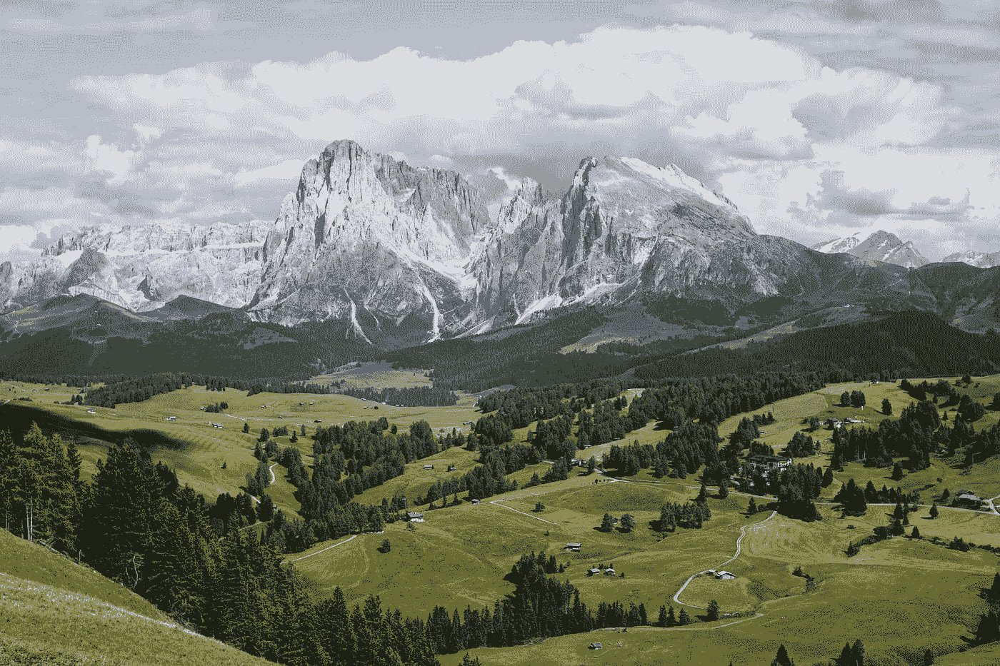
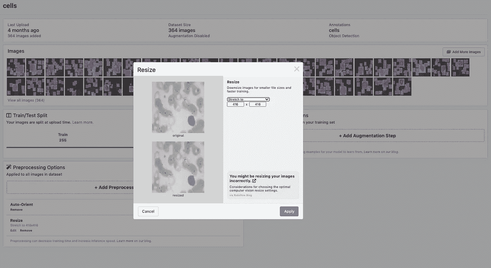
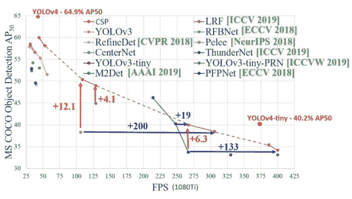

# YOLOv4 —打造更好模型的十大策略

> 原文：<https://towardsdatascience.com/yolov4-ten-tactics-to-build-a-better-model-4c46869626a6?source=collection_archive---------15----------------------->

## 用这些建议改善你的 YOLOv4 训练流程——请注意:我们也在我们的博客上发布了 [YOLOv4 战术](https://blog.roboflow.com/yolov4-tactics/)。



([引用](https://unsplash.com/photos/_rw79d4UgSw)

YOLO v4 模型是目前用于训练定制对象检测器的最佳架构之一，并且暗网库的能力是巨大的。在本帖中，我们讨论并实现了 YOLO v4 中的十个高级策略，这样你就可以从你的自定义数据集构建最佳的对象检测模型。

注意:此讨论假设您已经培训过 YOLO v4。首先，查看我们的[培训指南 YOLOv4](https://blog.roboflow.com/training-yolov4-on-a-custom-dataset/) 。这里的高级战术将建立在基础训练流程的基础上。

YOLO v4 高级战术路线图:

*   收集更多数据
*   图像预处理和增强
*   图像输入分辨率大小
*   何时使用预训练砝码
*   选择模型大小和架构
*   从之前的训练中吸取经验
*   训练后选择最佳模型
*   跟踪您的模型评估
*   导出您的模型
*   优化推理时间

本教程中的资源:

# 1)收集更多数据

改进对象检测模型的最佳方式是收集更多的代表性数据，YOLO v4 也不能逃避这一事实。正如特斯拉的人工智能高级总监 Andrej Karpathy 在解释[特斯拉如何教汽车停止](https://blog.roboflow.com/tesla-stop-signs-computer-vision/)时所说:

> *“你的数据集是活的，你的标注说明一直在变。你需要一直管理和改变你的数据集。”*

# 2) YOLOv4 图像预处理和增强

收集和标注更多数据的成本很高。幸运的是，有一些自动的方法可以通过增强来改善你的训练集的范围和规模。YOLO v4 培训管道会自动进行增强(参见这篇关于 YOLO v4 中[数据增强的文章)，但是您可能需要考虑](https://blog.roboflow.com/yolov4-data-augmentation/)[在 Roboflow](https://blog.roboflow.com/boosting-image-detection-performance-with-data-augmentation/) 中添加额外的增强。

图像预处理也是另一个重要的步骤，以确保您的图像是正确的图像分辨率大小，并且您已经标准化了一些方面，如[类本体](https://blog.roboflow.com/label-management-for-computer-vision/)、[灰度](https://blog.roboflow.com/when-to-use-grayscale-as-a-preprocessing-step/)和[对比度](https://blog.roboflow.com/when-to-use-contrast-as-a-preprocessing-step/)。

要做出的最重要的预处理决定是图像输入分辨率。

# 3) YOLOv4 输入分辨率大小

输入分辨率决定了将传递到模型中进行学习和预测的像素数。大像素分辨率提高了准确性，但代价是训练和推理时间变慢。较大的像素分辨率可以帮助您的模型检测小对象。

*YOLO 模型的像素分辨率必须是 32 的倍数。*可供选择的标准分辨率尺寸为 416x416。

如果在 Roboflow 中管理数据集，可以通过调整大小预处理步骤选择数据集输入分辨率大小。



在[robof flow](https://roboflow.com)中调整图像大小

*重要提示:*为了确保您的输入分辨率大小能够传递到您的 YOLOv4 模型，您必须调整模型配置文件。在`cfg`文件夹中你指定你的型号配置，在这里修改`width`和`height`。

`[net] batch=64 subdivisions=8 # Training #width=512 #height=512 width=608 height=608 channels=3 momentum=0.949 decay=0.0005 angle=0 saturation = 1.5 exposure = 1.5 hue=.1`

在 YOLOv4 模型 cfg 文件中更改宽度和高度

```
[net] 
batch=64 
subdivisions=8 
*# Training* 
*#width=512* 
*#height=512* 
width=608 
height=608 
channels=3 
momentum=0.949 
decay=0.0005 
angle=0 
saturation = 1.5 
exposure = 1.5 
hue=.1
```

# 4)何时使用预训练的 YOLOv4 砝码

要开始在 YOLOv4 上训练，我们通常会下载预训练的重量:

```
!wget [https://github.com/AlexeyAB/darknet/releases/download/darknet_yolo_v3_optimal/yolov4.conv.137](https://github.com/AlexeyAB/darknet/releases/download/darknet_yolo_v3_optimal/yolov4.conv.137)
```

并且在训练期间从这个预先训练的检查点开始:

```
!./darknet detector train data/obj.data cfg/custom-yolov4-detector.cfg yolov4.conv.137 -dont_show -map
```

这些权重已经在 COCO 数据集上进行了预训练，该数据集包括人、自行车和汽车等常见对象。一般来说，从预训练的重量开始是一个好主意，特别是如果你认为你的物体与 COCO 中的物体相似。

但是，如果你的任务明显比 COCO 困难(航拍、文档等。)，你可能会从零开始训练中受益。

```
!./darknet detector train data/obj.data cfg/custom-yolov4-detector.cfg -dont_show -map
```

当然，对两者都进行实验总是有利的，并且根据经验来看哪一个最适合你的模型。

# 5)选择模型大小和架构

YOLOv4 有两种口味 [YOLOv4](https://blog.roboflow.com/training-yolov4-on-a-custom-dataset/) 和 [YOLOv4-tiny](https://blog.roboflow.com/train-yolov4-tiny-on-custom-data-lighting-fast-detection/) 。



*不同型号性能和推理速度对比(*[*yolov 4-tiny*](https://github.com/AlexeyAB/darknet/issues/6067)*发布)*

如果推理速度是你的最终目标，较小的模型可能会感兴趣。通过改进数据集，可能会降低精确度。

从 YOLOv4 转 YOLOv4-tiny 是车型配置的问题。您可以尝试中间配置来构建一个定制的 YOLO 模型。为此，查看`cfg`文件夹，尝试改变网络架构和层。如果你的对象形状与 COCO 数据集有很大不同，你可以考虑实现[自定义锚框](https://blog.roboflow.com/what-is-an-anchor-box/)。这是非常高级的战术！

```
[yolo] 
mask = 0,1,2 
anchors = 12, 16, 19, 36, 40, 28, 36, 75, 76, 55, 72, 146, 142
classes=80 
num=9 
jitter=.3 
ignore_thresh = .7 
truth_thresh = 1 
scale_x_y = 1.2 
iou_thresh=0.213 
cls_normalizer=1.0 
iou_normalizer=0.07 
iou_loss=ciou 
nms_kind=greedynms 
beta_nms=0.6 
max_delta=5
```

# 6)从之前的 YOLOv4 训练中恢复

在 Darknet 框架中训练您的 YOLOv4 模型可能需要一段时间。定期保存模型非常重要。您可以通过调用之前训练跑步重量的训练来恢复训练，如下所示:

```
!./darknet detector train data/obj.data cfg/custom-yolov4-detector.cfg [YOUR WEIGHTS HERE] -dont_show -map
```

确保权重是用相同的配置文件训练的，并且是在相同版本的 Darknet 框架下训练的！

就像预训练的权重一样，您可以从以前的训练中学习，并将您的模型从其他数据集中获得的知识应用到新的数据集中。

# 7)训练后选择最佳的 YOLOv4 模型

暗网模型权重保存在`backup`文件夹中，每 1000 次迭代自动保存。Darknet 会自动为你保存最好的型号，扩展名为 _ `*best.weights*` *。这是基于您的验证集的性能。 Darknet 还会用扩展功能`_last.weights`保存你训练跑步的最后重量。*

# 8)跟踪您的 YOLOv4 型号评估

当您在数据集和 YOLOv4 建模中进行各种调整时，跟踪您的结果会很有用，这样您就可以看到哪种技术组合最适合您的数据集。

Darknet 将输出一个[平均精度](https://blog.roboflow.com/mean-average-precision/)分数，这是在您决定哪个模型最适合您的数据时要跟踪的主要指标。另一个需要考虑的重要指标是推理的速度。

# 9)导出您的 YOLOv4 模型

一旦你有了一个训练好的模型，它将会是暗网`.weights`格式。您可能希望将其转换为新的格式进行部署。

YOLOv4 Darknet 型号转换指南:

*   [用于移动部署的 yolov 4 TF lite](https://blog.roboflow.com/how-to-train-a-custom-mobile-object-detection-model/)
*   [YOLOv4 OpenVino 和 OAK 展开](https://blog.roboflow.com/deploy-luxonis-oak/)
*   [YOLOv4 Tensorflow 回购](https://github.com/hunglc007/tensorflow-yolov4-tflite)

# 10)优化 YOLOv4 推理时间

加快你的模型推断时间的首要方法是使用 YOLOv4-tiny 这样的小一点的模型。通过硬件选择，如 GPU 或使用 VPU 上的 OpenVino 进行推断，可以进一步提高推断时间。对于 GPU 推断，建议用[yolov 4 tensort 框架](https://github.com/CaoWGG/TensorRT-YOLOv4)部署。

# 结论

恭喜你！现在，您有十种新的高级策略来最大限度地利用 YOLO v4 来创建对象检测器，从而为您的自定义数据集建模。

一如既往，快乐训练。

*原载于 2020 年 11 月 13 日 https://blog.roboflow.com*[](https://blog.roboflow.com/yolov4-tactics/)**。**