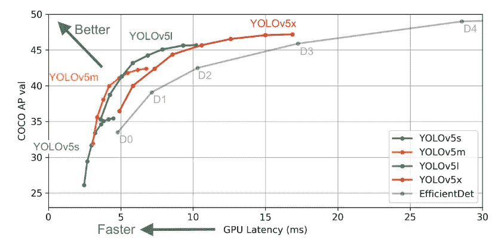
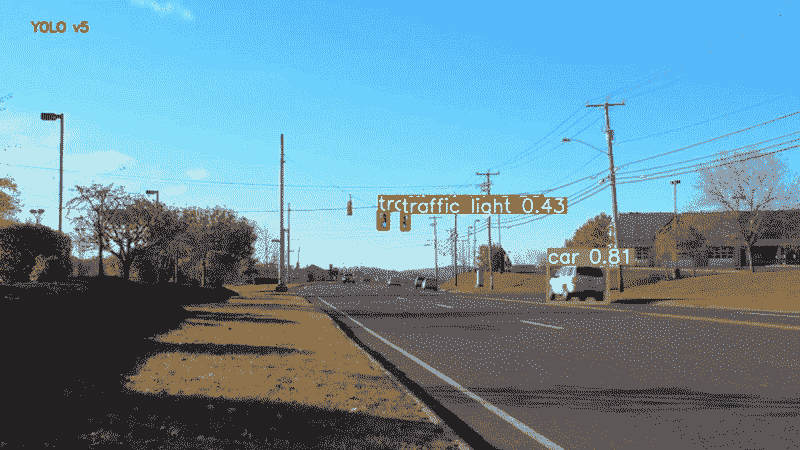
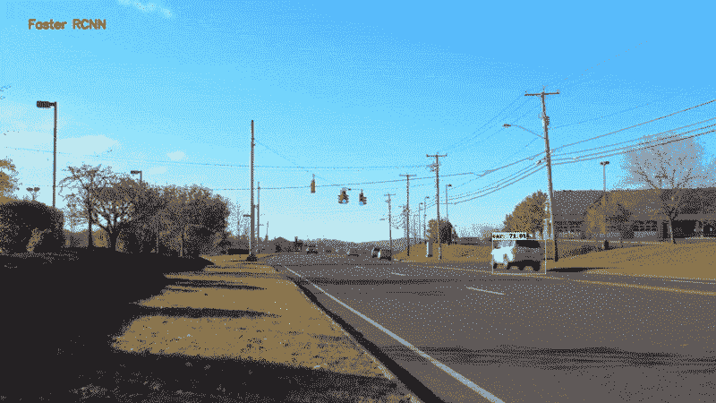
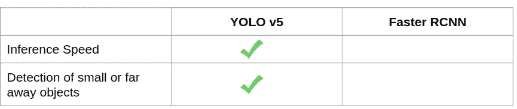
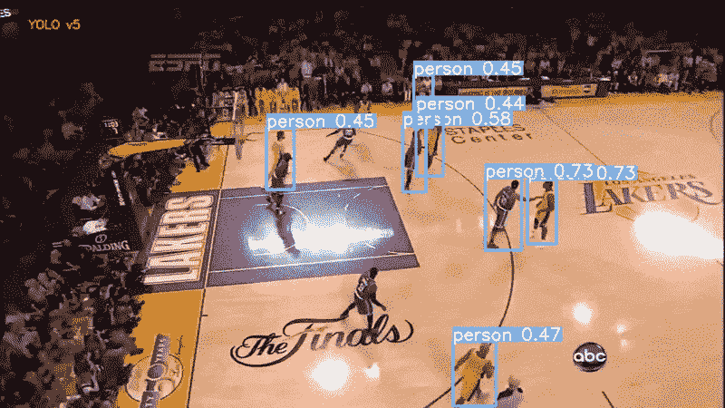
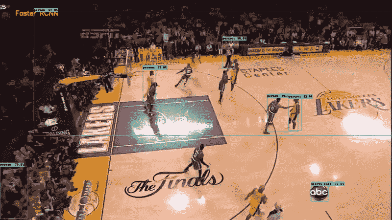
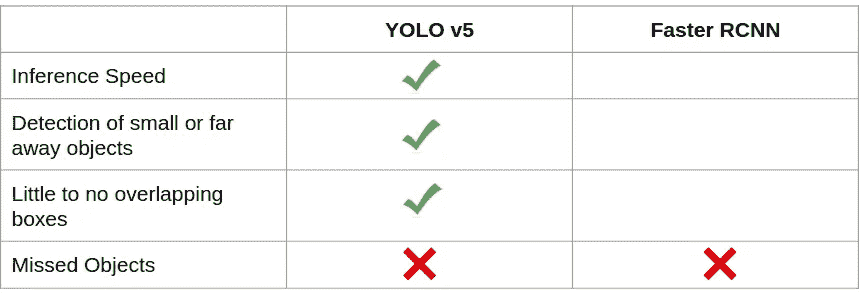
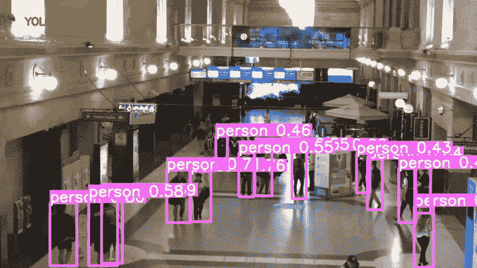
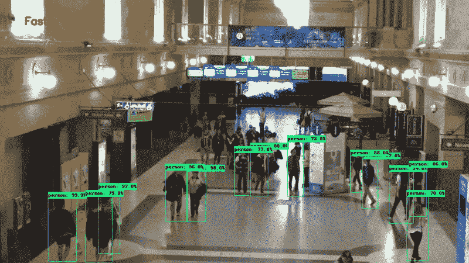
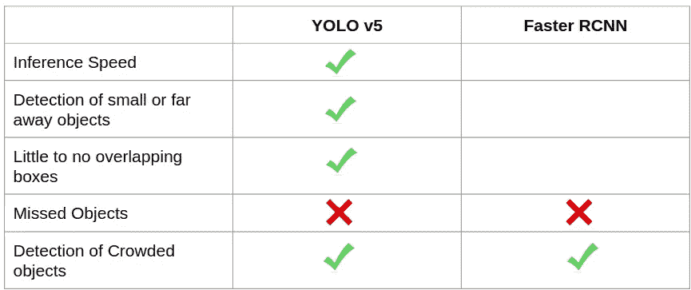

# YOLOv5 与更快的 RCNN 相比。谁赢了？

> 原文：<https://towardsdatascience.com/yolov5-compared-to-faster-rcnn-who-wins-a771cd6c9fb4?source=collection_archive---------2----------------------->

## 用数据做很酷的事情！

# 介绍

深度学习社区正在热烈讨论 YOLO v5。这篇[博客](https://blog.roboflow.ai/yolov5-is-here/)最近介绍了 YOLOv5 以 140 FPS 的速度进行最先进的物体检测。这立即引起了黑客新闻、Reddit 甚至 Github 的广泛讨论，但不是因为它的推理速度。两个突出的问题是——该模型是否应该被称为 YOLO，以及速度基准测试结果是否准确和可重复。如果你对 Roboflow 的回答感兴趣，你可以在这里找到。

抛开所有争议不谈，YOLOv5 看起来是一款很有前途的车型。因此，我将其与最好的两级检测器之一——更快的 RCNN 进行了比较。为了进行这种比较，我从不同的背景下拍摄了 3 个视频，并并排运行了 2 个模型。我的评估包括对结果质量和推理速度的观察。所以让我们开始吧！

# YOLOv5 型号

YOLOv5 的实现是在 Pytorch 中完成的，这与以前使用 DarkNet 框架的开发形成了对比。这使得理解、培训和部署该模型变得更加容易。没有与 YOLO-v5 一起发布的文件。我的理解是，在建筑上它与 [YOLO-v4](https://arxiv.org/abs/2004.10934) 非常相似。一个不同之处可能是使用[跨级局部网络(CSP)](http://openaccess.thecvf.com/content_CVPRW_2020/papers/w28/Wang_CSPNet_A_New_Backbone_That_Can_Enhance_Learning_Capability_of_CVPRW_2020_paper.pdf) 来降低计算成本。目前还不清楚 YOLO-v5 是否比 YOLO-v4 运行得更快，但是我更喜欢 Pytorch 的实现，我很惊讶用这个模型训练是如此的容易。我个人的推理经历也是天衣无缝的。

此次发布的 YOLOv5 包括五种不同型号尺寸:YOLOv5s(最小)、YOLOv5m、YOLOv5l、YOLOv5x(最大)。这些模型的推理速度和平均精度(mAP)如下:



来自 [UltraLytics 回购](https://github.com/ultralytics/yolov5)的 YOLO v5 统计数据

## 使用 YOLO-v5 进行推理

第一步是[克隆 YOLO V5 的回购协议](https://github.com/ultralytics/yolov5.git)。安装所有要求。我使用 Pytorch 1.5，代码运行没有任何问题。

您可以使用以下工具下载不同预训练 COCO 型号的所有重量:

```
bash weights/download_weights.sh
```

要在视频上运行推理，您必须传递视频的路径和您想要使用的模型的权重。如果没有设置 weights 参数，那么默认情况下代码在 YOLO 小型模型上运行。我使用的示例参数如下:

```
python detect.py --source video/MOT20-01-raw-cut1.mp4 --output video_out/ --weights weights/yolov5s.pt --conf-thres 0.4
```

输出视频将保存在输出文件夹中

## 使用 YOLO-v5 进行培训

我个人还没有在自定义数据集上尝试使用 YOLO-v5 进行训练，但 Roboflow 在 Youtube 上分享了一个很好的分步指南[这里](https://www.youtube.com/watch?v=MdF6x6ZmLAY)。

# 快速 RCNN 模型

对于更快的 RCNN 模型，我使用了来自 [Tensorflow 对象检测](https://github.com/tensorflow/models/tree/master/research/object_detection)的预训练模型。tensor flow Object Detection shares COCO 针对各种主干预训练了更快的 RCNN。对于这个博客，我使用了 Fatser RCNN ResNet 50 主干。这个报告分享了一个很好的教程，关于如何使用他们的预训练模型[进行推理。](https://github.com/tensorflow/models/blob/master/research/object_detection/colab_tutorials/object_detection_tutorial.ipynb)

# YOLOv5 模型与快速 RCNN 的比较

考虑到对自动驾驶汽车行业的重要性，我选择的第一个场景是街道驾驶场景。这两个模型的结果分享如下:



基于驾驶视频评估的 YOLOv5 车型



在驾驶视频上评估更快的 RCNN

YOLO 模型似乎更擅长检测较小的物体——在这种情况下是交通灯，并且还能够在汽车距离较远时(即较小时)检测到汽车。

YOLO v5 small 的运行速度(端到端包括读取视频、运行模型和将结果保存到文件)— 52.8 FPS！

运行速度更快的 RCNN ResNet 50(端到端，包括读取视频、运行模型和将结果保存到文件)—21.7 FPS

这些结果是在 NVIDIA 1080 Ti 上评估的。

到目前为止，YOLO v5 似乎比更快的 RCNN 好



YOLO v5 和更快的 RCNN 比较 1

下一个视频是 youtube 上的一个篮球比赛视频。两种模型的结果如下:



篮球视频上的 YOLO v5



篮球视频上更快的 RCNN ResNet 50

更快的 RCNN 模型是在 60%的阈值下运行的，有人可能会说它是在用一个人的标签来吸引人群，但我更喜欢 YOLO 的结果。两种型号在 abc 徽标上都有假阳性。

我还感到失望的是，尽管运动球在 COCO 中是一个类别，但两者都未能检测到篮球。他们现在的记录是:



YOLO v5 和更快的 RCNN 比较 2

对于最终的视频，我从 [MOT 数据集](https://motchallenge.net/)中选择了一个室内拥挤的场景。这是一个具有挑战性的视频，光线较弱，距离较远，人群密集。两个模型的结果如下所示。



YOLO v5 模型在 MOT 数据集的室内拥挤场景上进行测试



基于 MOT 数据集的室内拥挤场景快速 RCNN 模型测试

这很有意思。我想说，这两种模型都很难检测到远处走进走廊的人。这可能是因为光线不足和物体较小。当人群靠近摄像机时，两者都能捕捉到重叠的人群。



YOLO v5 和更快的 RCNN 比较 2

# **结论**

两种车型的最终对比表明，YOLO v5 在运行速度上具有明显的优势。小 YOLO v5 模型运行速度快 2.5 倍，同时在检测更小的物体方面管理更好的性能。结果也更清晰，几乎没有重叠框。 [Ultralytics](https://github.com/ultralytics/yolov5) 在他们的 YOLO v5 开源模型上做得非常出色，该模型易于训练和运行推理。

这篇博客还展示了计算机视觉物体检测向更快更准确的**模型发展的新趋势。**

如果你尝试过 YOLOv5，请在下面的评论中分享你的体验。

在[深度学习分析](https://deeplearninganalytics.org/)，我们非常热衷于使用机器学习来解决现实世界的问题。我们已经帮助许多企业部署了创新的基于人工智能的解决方案。如果您看到合作的机会，请通过我们的网站[这里](https://deeplearninganalytics.org/contact-us/)联系我们。

# 参考

*   YOLO v5
*   更快的 RCNN
*   YOLO v4