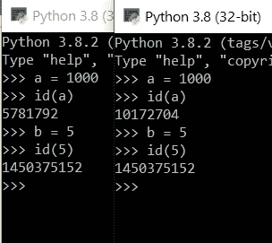

# 如果你问这个问题，你是在告诉别人你是一个 Python 初学者。

> 原文：<https://towardsdatascience.com/you-are-telling-people-that-you-are-a-python-beginner-if-you-ask-this-question-fe35514ca091?source=collection_archive---------1----------------------->

几天前我在 Reddit 上浏览“learnpython”的 sub 时，看到一个 Redditor 又问了这个问题。虽然网上有太多关于这个问题的回答和解释，但是很多初学者还是不了解，犯错误。这是一个问题

> **“= =”和“是”有什么区别？**


由 [Rohit 农民](https://unsplash.com/@rohitfarmer?utm_source=unsplash&utm_medium=referral&utm_content=creditCopyText)在 [Unsplash](https://unsplash.com/s/photos/question?utm_source=unsplash&utm_medium=referral&utm_content=creditCopyText) 上拍摄的照片

“==”和“is”都是 Python 中的操作符([链接到 Python 中的操作符页面](https://docs.python.org/3/library/operator.html))。对于初学者来说，他们可能会把“a == b”解释为“a 等于 b”，“a 是 b”解释为，嗯，“a 是 b”。大概这就是新手在 Python 中混淆“==”和“是”的原因吧。

我想在深入讨论之前先展示一些使用“==”和“是”的例子。

```
>>> a = 5
>>> b = 5
>>> a == b
True
>>> a is b
True
```

简单吧？`a == b`和`a is b`都返回`True`。然后再看下一个例子。

```
>>> a = 1000
>>> b = 1000
>>> a == b
True
>>> a is b
False
```

WTF？！？从第一个例子到第二个例子的唯一变化是 a 和 b 的值从 5 到 1000。但是“==”和“是”之间的结果已经不同了。去下一个。

```
>>> a = []
>>> b = []
>>> a == b
True
>>> a is b
False
```

这里是最后一个例子，如果你仍然没有被击垮的话。

```
>>> a = 1000
>>> b = 1000
>>> a == b
True
>>> a is b
False
>>> a = b 
>>> a == b
True
>>> a is b
True
```

“==”的官方运算是相等，而“是”的运算是相同。您使用“==”来比较两个对象的值。“a == b”应该解释为“a 的值是否等于 b 的值”。在上面的所有例子中，a 的值总是等于 b 的值(即使对于空列表例子)。因此“a == b”总是正确的。

在解释身份之前，我需要先介绍一下`id`函数。你可以用`id`功能得到一个物体的身份。这种身份是唯一的，并且在整个时间内都是不变的。你可以认为这是这个对象的地址。如果两个对象具有相同的标识，它们的值也必须相同。

```
>>> id(a)
2047616
```

运算符“是”是比较两个对象的身份是否相同。“a 是 b”是指“a 的身份与 b 的身份相同”。

一旦你知道了“==”和“是”的实际含义，我们就可以开始深入上面的例子了。

首先是第一个和第二个例子的不同结果。显示不同结果的原因是 Python 存储了一个从-5 到 256 的整数数组列表，每个整数都有一个固定的标识。当你在这个范围内给一个整型变量赋值时，Python 会把这个变量的标识赋值为数组列表中整型变量的标识。结果，对于第一个例子，由于 a 和 b 的身份都是从数组列表中获得的，所以它们的身份当然是相同的，因此`a is b`为真。

```
>>> a = 5
>>> id(a)
1450375152
>>> b = 5
>>> id(b)
1450375152
```

但是一旦这个变量的值落在这个范围之外，由于 Python 内部没有具有该值的对象，因此 Python 将为这个变量创建一个新的标识，并将该值赋给这个变量。如前所述，每个创造物的身份都是独一无二的，因此即使两个变量的值相同，它们的身份也不会相等。这就是为什么第二个例子中的`a is b`是假的

```
>>> a = 1000
>>> id(a)
12728608
>>> b = 1000
>>> id(b)
13620208
```

(额外:如果你打开两个控制台，如果值仍然在范围内，你会得到相同的身份。但是当然，如果该值落在范围之外，情况就不是这样了。)



一旦你理解了第一个和第二个例子之间的区别，就很容易理解第三个例子的结果。因为 Python 不存储“空列表”对象，所以 Python 创建了一个新对象并赋予值“空列表”。无论两个列表是空的还是有相同的元素，结果都是一样的。

```
>>> a = [1,10,100,1000]
>>> b = [1,10,100,1000]
>>> a == b 
True
>>> a is b
False
>>> id(a)
12578024
>>> id(b)
12578056
```

最后，我们来看最后一个例子。第二个和最后一个例子的唯一区别是多了一行代码`a = b`。然而这一行代码改变了变量`a`的命运。下面的结果告诉你为什么。

```
>>> a = 1000
>>> b = 2000
>>> id(a)
2047616
>>> id(b)
5034992
>>> a = b
>>> id(a)
5034992
>>> id(b)
5034992
>>> a
2000
>>> b
2000
```

如你所见，`a = b`之后，`a`的身份变成了`b`的身份。`a = b`将`b`的身份分配给`a`。因此`a`和`b`具有相同的身份，因此`a`的值现在与`b`的值相同，都是 2000。

最后一个例子告诉你一个重要的信息，你可能会不经意地改变一个对象的值，特别是当这个对象是一个列表的时候。

```
>>> a = [1,2,3]
>>> id(a)
5237992
>>> b = a
>>> id(b)
5237992
>>> a.append(4)
>>> a
[1, 2, 3, 4]
>>> b
[1, 2, 3, 4]
```

从上面的例子来看，因为`a`和`b`都有相同的标识，所以它们的值必须相同。因此在将新元素添加到`a`之后，`b`的值也将受到影响。为了防止这种情况，如果您想将值从一个对象复制到另一个对象，而不引用相同的标识，那么一劳永逸的方法是使用模块`copy` ( [链接到 Python 文档)](https://docs.python.org/3/library/copy.html#copy.deepcopy)中的`deepcopy`。对于列表，也可以通过`b = a[:]`来执行。

```
>>> import copy
>>> a = [1,2,3]
>>> b= copy.deepcopy(a)
>>> id(a)
39785256
>>> id(b)
5237992
```

使用`[:]`将元素复制到一个新变量

```
>>> a = [1,2,3]
>>> id(a)
39785256
>>> b = a[:]
>>> id(b)
23850216
>>> a.append(4)
>>> a
[1, 2, 3, 4]
>>> b
[1, 2, 3]
```

我希望现在你能明白这两者之间的区别，你不会因为问这个问题而再次成为初学者。