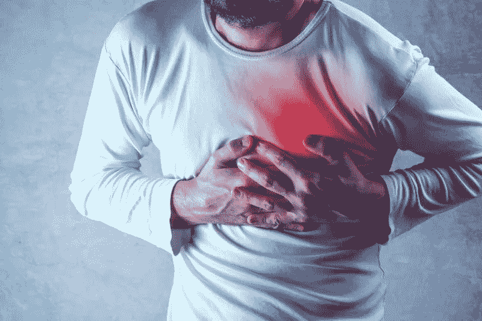
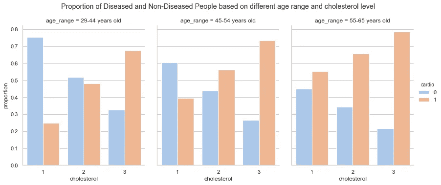
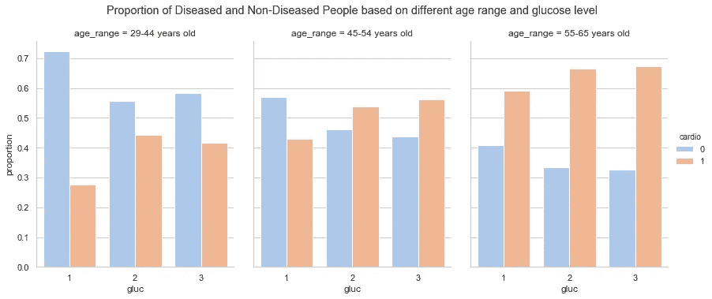

# 你年轻健康:你应该担心心血管疾病吗？

> 原文：<https://towardsdatascience.com/you-are-young-and-healthy-should-you-worry-about-cardiovascular-disease-cd8764382d50?source=collection_archive---------58----------------------->

# **简介**

Y 你可能知道你身边的人死于心脏病。但是这种疾病只发生在老年人和油炸食品爱好者身上——这可能是你的想法。

我直到中年才需要检查胆固醇。我还太年轻，不用担心心脏病。正是我在做这个项目之前所想的。

照片由 [igorstevanovic](https://www.shutterstock.com/g/stevanovic) 在 [Shutterstock](https://www.shutterstock.com/image-photo/severe-heartache-man-suffering-chest-pain-366811373) 拍摄

该项目包括对年龄从 29 岁到 65 岁的 70，000 名患者的病历数据集(来源: [Kaggle](https://www.kaggle.com/sulianova/cardiovascular-disease-dataset) )的分析。所有数据集值都是在体检时收集的。每个记录具有 11 个特征，包括客观特征(如年龄、体重、身高)、检查特征(如胆固醇、血糖、血压)和主观特征(患者是否进行体力活动)。

我进行这个项目的动机是想看看我对自己的心脏健康到底了解多少，并验证通常的假设，尤其是那些关于年轻人和健康人免受疾病风险的假设。

# **1。关于心血管疾病风险，检查特征(如胆固醇和葡萄糖)能告诉我们什么？**

胆固醇水平分为 3 级:1 级—正常，2 级—高于正常，3 级—远高于正常。

我们确实认为血液中胆固醇含量越高，患病风险就越高。

但是这是如何量化的，与心血管疾病的确切关系是什么？

70 000 名患者的记录数据集显示，心血管疾病的风险随着胆固醇水平的升高而显著增加，无论我们的年龄如何，这都是事实。

在下图中，按年龄范围划分的患病人口比例用红色条表示。

图 1:不同胆固醇水平下患病(红色)和非患病(蓝色)的比例

值得注意的是，如果胆固醇水平超过正常阈值，年轻人患这种疾病的风险是正常人的两倍。即使胆固醇水平最低，也有 25%的人受到影响。

此外，同样的胆固醇水平使老年人更容易患心血管疾病。

至于血糖水平，趋势略有不同，如下图所示。葡萄糖分为 3 类:1-正常，2-高于正常，3-远高于正常。

图 2:不同胆固醇水平下患病(红色)和非患病(蓝色)的比例

当血糖水平从正常升至高于正常时，我们观察到**患病风险**显著增加。然而，如果达到最高的葡萄糖水平，这就不再正确，特别是在最年轻的时候，趋势往往是相反的方向——这真的令人惊讶。

在这一部分中，更有趣的是找出具有最小心血管疾病风险的最佳量化胆固醇和葡萄糖水平。遗憾的是，所提供的数据集中没有这些信息。

# **2。血压正常的人没有心血管风险吗？**

高血压是最常见的心血管风险因素。但是，血压正常的人应该被警告有患病的风险吗？

关于血压需要知道的几件事:血压记录在两个数字下，例如:120/80 毫米汞柱。

*   第一个数字是收缩压，它表示心脏跳动时血液对动脉壁施加的压力。
*   第二个数字是舒张压，它表示心脏在两次跳动之间休息时，血液对动脉壁施加的压力。

低于 120/80 毫米汞柱的血压值被认为在正常范围内。

下图显示了正常血压(低于 120/80 毫米汞柱)患者中患病(橙色柱)和非患病(绿色柱)的比例，按不同的年龄范围分类。两个比例之和为 1。

图 3:血压正常的人是否没有风险？

从这个数字中我们可以注意到的第一件事是，在每个年龄段，大多数人都是健康的——这是个好消息。

接下来是坏消息:健康人的比例没有保持不变，而是随着年龄的增长而下降，尽管他们的血压正常。

即使是最年轻的人也不能完全避免心血管疾病的风险，因为他们中有 15%的人被诊断患有疾病。当人们在 55 岁到 65 岁之间时，这种风险会高三倍(45%)。

# **3。患心血管疾病风险最低的身高比的正确体重是多少？**

我们确实听说了很多关于身体质量指数(身体质量指数)，一个将体重与身高联系起来的关键指数，以及如何保持健康的身体质量指数。

我想知道关于避免心血管风险的最佳身体质量指数范围的数据是什么。具体来说，身体质量指数用于根据数值范围将一个人分类为体重不足、正常体重、超重或肥胖。

*   正常体重总是有帮助吗？
*   超重总是不好吗？
*   体重过轻有助于预防心血管疾病吗？

这些是我想回答的问题。

下图显示了不同年龄范围和身体质量指数类别的非患病人群与患病人群的比例差异。

在特定的身体质量指数范围内，每当患病人数少于患病人数时，就会显示绿色条，而红色条则显示相反的情况。

图 4:什么是正确的身体质量指数？

看来**体重不足**真的很突出！它总是位列身体质量指数最佳类别的前 2 名。然而，随着年龄的增长，它的积极影响变得不那么重要。

请注意，虽然健康的体重似乎对年轻人和中年人有帮助，但对最年长的人来说就不再是这样了。

**超重**总是不好吗？不完全是。如果你还年轻，你仍然有机会避免心血管疾病的风险。相反，如果你在 55 岁到 65 岁之间，你应该多注意你的体重。

你可能想知道你的身体质量指数范围是什么？看看这个美国卫生部人类服务部的计算器。

 [## 计算你的身体质量指数标准身体质量指数计算器

### 标准体重指数计算器。

www.nhlbi.nih.gov](https://www.nhlbi.nih.gov/health/educational/lose_wt/BMI/bmicalc.htm) 

# **4。体育活动对超重人群预防心血管疾病风险有帮助吗？**

从上面我们可以看出，超重的人应该比正常和体重不足的人多加小心。如果他们练习体育，事情会改变吗？

在这一部分，我将深入探讨身体活动对超重和肥胖人群心血管风险的影响。

在所提供的数据集中，有 62%的超重和肥胖者，其中 82%进行体育锻炼。

下图显示了非患病人群和患病人群在运动时(绿条)和不运动时(红条)的比例差异，按身体质量指数分类，范围从超重到非常严重的肥胖。

图 5:运动对超重的人有帮助吗？

图表中几乎所有的柱状图都是负数，这意味着超重和肥胖的人更容易患心血管疾病。

请注意，无论如何，如果患者进行体育锻炼，患病的几率会降低，在每个身体质量指数类别中，看到红色和绿色条之间的差异。

在活跃人群中(用绿色条表示)，如果重度肥胖和中度肥胖设法**将他们的身体质量指数降低一个范围**，他们易受攻击的风险就会显著降低。

# 结论

我们快速浏览了心血管疾病风险如何随不同因素而变化，包括检查因素(如胆固醇、葡萄糖、血压)、客观因素(身体质量指数)和主观因素(身体活动)。我们看到:

*   心血管疾病风险**随着年龄增长**，而其他因素保持不变。
*   没有高血压，人们无论如何都应该关心心血管风险，因为没有人能完全避免高血压，即使是最年轻的人。
*   **瘦人**比超重的**有更多机会避免心血管疾病。**
*   运动确实有助于超重的人，尤其是如果他们成功降低了身体质量指数。

你觉得怎么样？

至于我，我认为像我以前那样依赖假设对我的健康是危险的。最好开始锻炼。

照片由 [brucemars](https://unsplash.com/@brucemars) 在 [Unsplash](https://unsplash.com/photos/oLStrTTMz2s) 上拍摄

这篇博文无意让你担心自己的健康。它只是提出了一种数据驱动的方法，以更好地了解这种非常常见的疾病，并与您分享一些有用的见解。

值得注意的是，根据[世界卫生组织(世卫组织)](https://www.who.int/health-topics/cardiovascular-diseases/#tab=tab_1)的数据，心血管疾病是全球头号死亡原因，每年夺走 1790 万条生命。

关于您的医疗保健的任何决定，请咨询您的医生。

这里只介绍关键的发现。要了解更多细节，请查看我的 GitHub [回购](https://github.com/ngthianhphuong/Cardiovascular-Disease)。

***编者注:*** [*迈向数据科学*](http://towardsdatascience.com/) *是一份以数据科学和机器学习研究为主的中型刊物。我们不是健康专家，这篇文章的观点不应被解释为专业建议。*