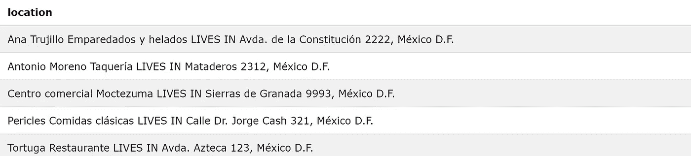
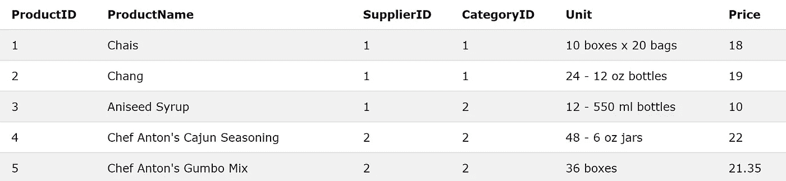
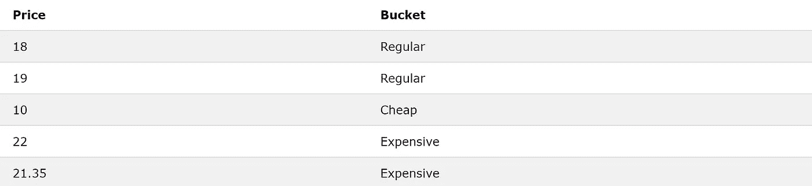

# 你可以用 SQL 在熊猫里做任何事情

> 原文：<https://towardsdatascience.com/you-can-do-everything-in-pandas-with-sql-354adb30fbf9?source=collection_archive---------8----------------------->

来源: [Unsplash](https://unsplash.com/photos/fPkvU7RDmCo)

## 有时候，你应该

Pandas 是数据科学家可以使用的最有用的工具之一。它提供了几个方便的功能来提取信息。不幸的是，使用 Pandas 需要将数据加载到 DataFrames 中，这对于处理大量数据来说不是很好——大量数据在一家需要这种数据操作技能的公司中很常见。

如果您要下载一个完整的大规模数据集(可能将其存储为. csv 文件),您至少需要花几分钟时间等待文件完成下载并被 Pandas 转换为数据帧。最重要的是，您执行的任何操作都将很慢，因为 Pandas 在处理这些海量数据时有困难，需要遍历每一行。

更好的解决方案？首先用 SQL 查询数据库——它可能运行的本地高效处理语言——然后下载一个精简的数据集，如果必要的话，使用 Pandas 来操作它设计用来处理的较小规模的表。虽然 SQL 对大型数据库非常有效，但它不能取代 Panda 与其他库和 Python 语言的绘图集成的价值。

然而，在我们只需要找到数字答案的情况下，比如一件物品的平均成本，或者有多少员工收到佣金，但时薪不超过 40 美元，那么(通常)根本不需要接触熊猫和 Python 环境。

虽然大多数人对 SQL 的了解只停留在`SELECT * FROM table WHERE id = ‘Bob’`阶段，但是人们会对 SQL 提供的功能感到惊讶。

作为一个例子，我们将使用由 [w3schools](https://www.w3schools.com/sql/trysql.asp?filename=trysql_asc) 提供的 SQL Tryit 编辑器数据库。这个网站允许你在一个虚构的数据库上运行 SQL 查询。Customers 表(您可以在右侧面板中看到完整的表列表)包含 7 列数字和文本数据:

假设我们想要以“姓名居住在地址，城市”的形式发送一个准备好的声明。这很简单:双管操作符`||`充当连接。然后，我们可以添加列值和字符串，并使用`AS`将结果保存在别名或结果的列名下。

注意，由于我们额外指定了`Country=’Mexico’`，我们的结果是墨西哥境内的所有地址和城市。这种类型的操作在 Python 中会更加困难，也不太容易实现。

请注意，并非所有数据库都支持相同的语法。本文使用 PostgreSQL 的语法，尽管讨论的每个操作都有 DB2、Oracle、MySQL 和 SQL Server 数据库中的操作，有时使用相同的语法，有时使用不同的语法。StackOverflow 或者 Google 可以帮你找到这些数据库特有的关键词。

假设在`Products`表中，我们想将产品分成三个价格区间:`Cheap`、`Regular`和`Expensive`，分别表示价格低于 12 美元、介于 12 美元和 21 美元之间以及高于 21 美元。

没问题！关键词`CASE`会有所帮助。这个关键字的作用类似于 Python 等其他语言中的 if/else if/else 语句。

`CASE`关键字使用语法`WHEN condition THEN value`。当多个`WHEN`堆叠在一起时，它们会呈现“else-if”关系。最后，如果条件不满足，可以添加一个`ELSE value`。最后，编写`END`来表示`CASE`语句的结束，结果通过`AS Bucket`保存(别名)到一个名为 Bucket 的列。

这也可以用速度慢得多的`.apply()`在熊猫身上实现。

假设我们想从`Products`中随机抽取 5 行。虽然没有直接的方法可以做到这一点，但是我们可以通过使用`ORDER BY`和`LIMIT`关键字来获得创造性。`ORDER BY`按一定格式对数据进行排序；例如，使用`ORDER BY Price ASC`将对数据进行排序，使价格以升序排列。使用`DESC`使用降序，而`ORDER BY`通过按字母顺序排序来处理字符串。

`ORDER BY random()`对数据随机排序，`LIMIT x`返回所选数据子集中的前 *x* 行。这样，从数据中随机选择五行(`*`表示所有列)。

注意:不幸的是，SQL Tryit 编辑器不支持 random()，但是真实的数据库支持(或者使用一个变体，比如`rand()`)。

就像这个随机采样的任务一样，大多数 SQL 都是将几个简单的命令(如`SELECT`等)链接在一起，并将它们与内置函数集成在一起，以产生惊人复杂的结果。

此外，SQL 提供了您可能需要的所有统计函数。从`MIN()`到`MAX()`到`COUNT()`到`SUM()`到`AVG()`到`ASIN()`(反正弦)，一切就绪。您可以使用标准偏差等度量标准的包扩展，或者使用现有的默认函数自己创建它们，这一点也不难做到。

这些都是标准任务——但更令人惊奇的是，SQL 是一种图灵完全语言。简单地说，你可以用 Python 或 C++，用 SQL 来表示一个程序，通过建立你自己的复杂的内存系统和使用 SQL 的元素，比如函数，if/else，递归等等。您可以查看一些有趣的图灵完全 SQL `here`演示。这样做的主要目的不是鼓励您将 SQL 作为一种操作性语言来使用，而是为了证明 SQL 可以做比您想象的更多的事情。

在 SQL 中，我们还可以做很多我们没有讨论过的事情:

*   指定您自己的自定义函数，就像您在 Python 或 C++中声明函数一样。例如，这些可以用于解析 IP 地址。
*   使用递归创建复杂的循环和带有`WITH`关键字的数据生成。
*   按子串*对字符串列进行排序。*
*   在多个表之间执行复杂的连接。
*   使用 SQL 生成 SQL(自动化任务)。
*   使用统计模型生成预测。
*   创建直方图。
*   构建树形结构(包括叶、分支、根节点)。

的确，使用 SQL 可以比使用 Pandas 做更多的事情。也就是说，通常额外的功能是不必要的。您应该使用 SQL 的主要原因是，它是为处理自定义环境中的大量数据而构建的，而数据帧不是。

一般来说，SQL 是一种简单但有时非常混乱的语言，它通常应该用于减少数据的大小，直到它在 Pandas 的较小环境中变得更易于管理。

## 要点

*   熊猫不擅长处理大数据，它的功能都可以用 SQL 来完成。然而，Pandas 的价值来自于它与其他绘图库、机器学习库和 Python 语言的集成。
*   目标通常应该是使用 SQL 将大型数据集缩小到与任务更相关的数据集，然后在 Python 环境中处理它，使用 Pandas 的数据帧作为存储的基础。
*   不要害怕接触 SQL 来处理大数据问题。如上所述，SQL 的语法很简单，几乎就是将简单的命令链接在一起以产生更复杂的结果。如果你对结果有一个清晰的愿景，你可以用 SQL 实现它。
*   SQL 能做的比大多数人意识到的要多得多。

 [## 面向数据科学家的 SQL，在 6 分钟或更短时间内完成

### 任何数据科学简历的必备技能

medium.com](https://medium.com/analytics-vidhya/sql-for-data-scientists-in-6-minutes-or-less-6e11a377751f)