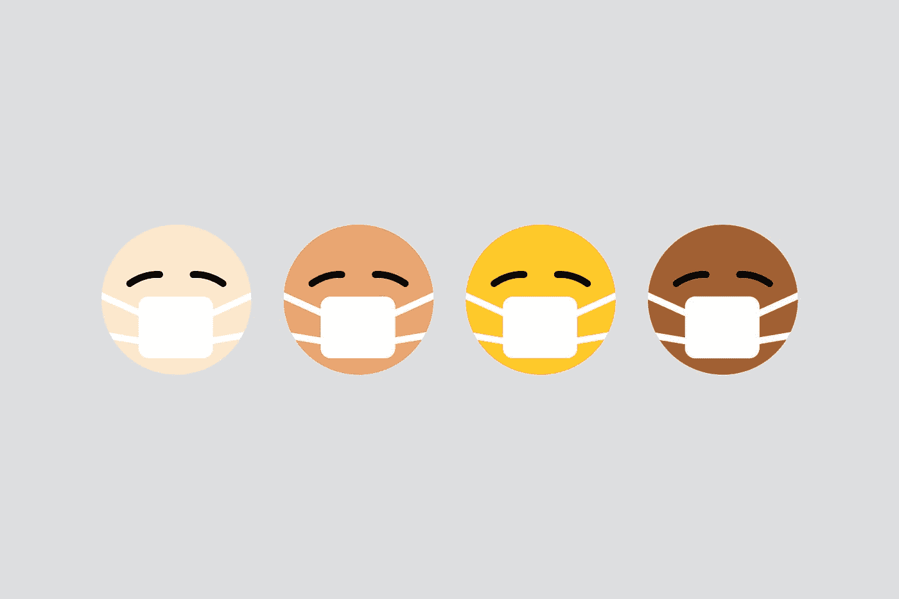
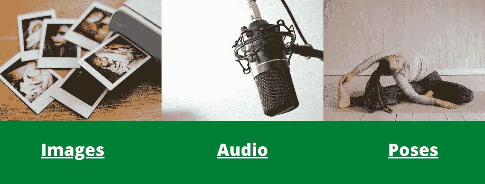
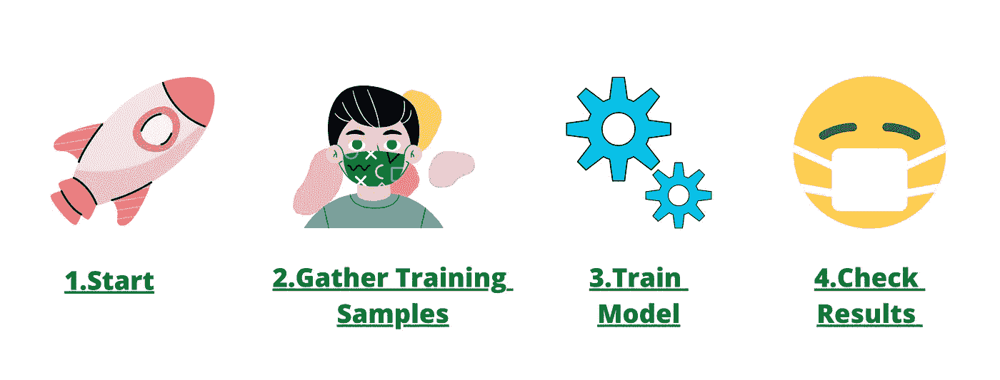
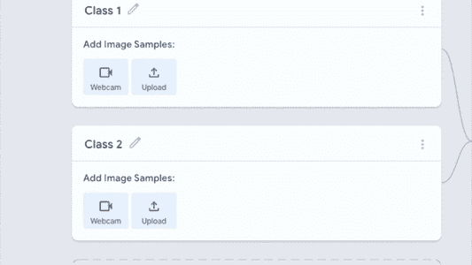
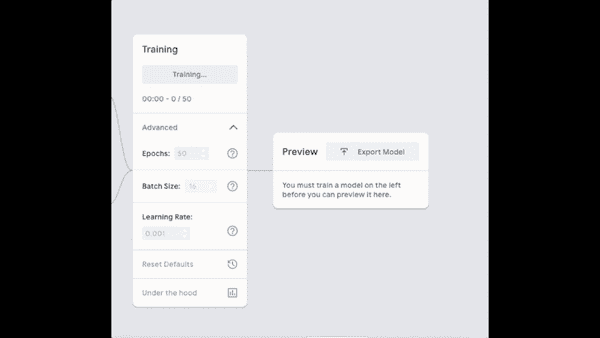
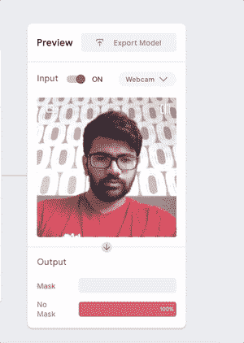

# 在 5 分钟内建立面罩检测模型

> 原文：<https://towardsdatascience.com/you-can-do-it-too-build-face-mask-detection-model-in-5-minutes-727d83497a8c?source=collection_archive---------40----------------------->

## 使用可教机器

[Unsplash](https://unsplash.com?utm_source=medium&utm_medium=referral) 上[视觉](https://unsplash.com/@visuals?utm_source=medium&utm_medium=referral)的照片

A 你难道不厌倦人们告诉你，如果你想成为一名数据科学家，你需要非常擅长数学吗？然后你看到你认识的一个数学/统计不如你的人在 Linkedin 上吹嘘他的机器学习技能。

你可以学习机器学习上的所有初学者项目，但当你想自己做一些事情时，你无法实现它，因为没有训练数据或你没有带 GPU？然后最终你对这个领域失去了兴趣，因为你体内的火因为缺乏动力而失去了它的力量。

我们都经历过。

被困住了太糟糕了。我明白了。你需要燃料来提升你的动力水平。

当你向世界展示你自己抽象想法的最终产品时，没有什么比这更令人兴奋的了。这里的意图不是给你另一个初学者教程“如何制作这个和那个令人敬畏的机器学习模型”，而是让你体验成功的滋味。

我向您保证，您可以在不到 5 分钟的时间内构建面具检测模型，而无需一行代码。归功于谷歌的*可教机器。但是编码不是必须被称为机器学习工程师或者数据科学家吗？*

> 不，更多的是关于你如何使用数据。它被称为“数据科学”而不是“编码科学”是有原因的。

# **究竟什么是可教机器？**

> **Teachable Machine** 是一个基于网络的工具，使得创建 **machine** 学习模型变得快速、简单，并且每个人都可以访问。- [可示教机器](https://teachablemachine.withgoogle.com/)

可教机器允许任何人基于以下内容构建模型:

*   形象
*   声音的
*   姿势

图片由作者在 [Canva](https://www.canva.com/) 制作

## 为什么只有可教的？你就不能用训练前的模型吗？

绝对的！预先训练的模型从一开始就是好的和有效的。这就是为什么 Teachable 使用由谷歌支持的预训练模型来训练你的模型。

但更特别的是训练数据。Teachable 使您能够使用网络摄像头为图像和姿势模型创建自己的数据，并使用外部麦克风为音频模型创建数据。就这样？

绝对不是。它是由 GPU 计算支持的训练，你也可以通过点击一个按钮轻松地看到现场训练的表现。培训结束后，您可以同样顺利地导出模型，这样您就可以用它来做一些事情。

## **建立人脸面具检测模型的先决条件:**

> 占用你 5 分钟时间。

# **循序渐进指南:**

作者在 [Canva](https://www.canva.com/) 制作的图像

## 第 1 步-开始:

请转到[可示教机器](https://teachablemachine.withgoogle.com/train)并点击`get started`

当你试图在人脸上建立面具检测时，很明显模型需要图像作为训练数据。因此，让我们继续操作并**选择图像项目。**

> 满足你的好奇心——你可以尝试使用 pose project，看看模型与 image project 相比表现如何。所涉及的步骤基本相同，所以你可以按照这里的指南。

点击图像项目，为下一步做好准备

## 步骤 2-生成训练样本:

建立模型最重要的是训练数据。如前所述，如果你想用 Teachable 建立一个模型，你不必太担心训练数据。

您可以**从**本地磁盘或 Google Drive** 上传**数据，如果您已经有了本地磁盘或 Google Drive，或者您也可以使用网络摄像头自己创建数据。

我完全推荐在这个项目中使用你的**网络摄像头**，因为你会体验到这样做的便利。

点击*添加类别，您可以创建任意数量的标签。*

对于这个项目，我们需要两个类

1.  面具
2.  没有面具

按作者生成培训数据

点击类名来改变它们。

接下来，点击网络摄像头按钮并按住**录制**生成图像。生成每个类大约 110 个图像，这应该足够这个项目。

> **戴上面具**，左右移动头部，使其能够识别来自不同方向的图像，为**面具**类生成图像。
> 
> **取下**掩膜，对**无掩膜**类进行拍照。

就这样，你得到了带标签的训练数据。

## **第三步——培训模式:**

只需点击`Training`即可开始模型的训练。

你可以在参数 Epochs，批量大小，学习率上做些调整。

Teachable 的一个很酷的功能是你可以通过点击引擎盖下的**来查看你的模型是如何被训练的。**

使用默认设置和每个类别的 110 幅图像，模型通常只需不到一分钟就可以完成训练。

作者的培训模型图像

## 第 4 步—检查结果:

作者的模型输出检查

恭喜你！用于在不到 5 分钟的时间内训练一个令人敬畏的复杂机器学习模型。

是时候享受模型的乐趣并检查结果如何了。

您可以从模型输出 Gif 中看到，这两个类都产生了非常令人满意的结果。

模型能够识别我脸上的面具，当我把面具放在我的额头上时，它像预期的那样识别为无面具。

如果需要，您现在可以导出模型并在教学平台之外使用它。

# **结论:**

如果像人工智能、机器学习、高级统计学这些高保真词汇吓到你了？不要担心，你所要做的就是从小处着手，选择像这样的项目，因为它们有点燃火花的力量，给你肾上腺素，让你继续前进，达到最终目标。

试一试，让我知道你是否用它做了什么有趣的项目。