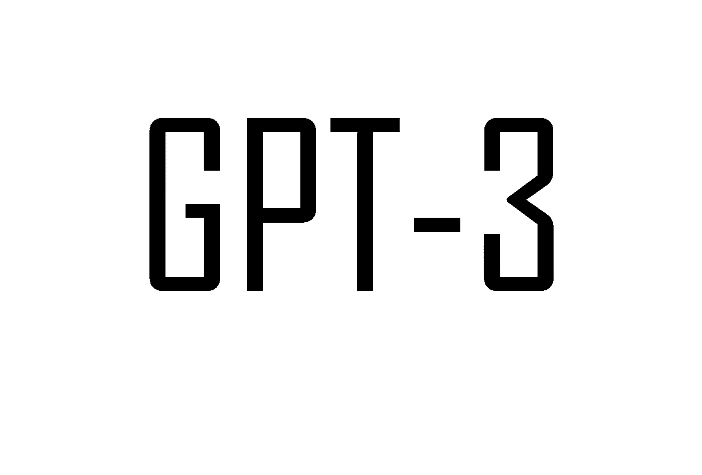

# 你可以通过这些 YouTube 视频了解 GPT 3 号

> 原文：<https://towardsdatascience.com/you-can-understand-gpt-3-with-these-youtube-videos-6a30887c928b?source=collection_archive---------36----------------------->

GPT-3，作者图片

## 回顾

## 通过这些 YouTube 视频，在不到 3 分钟的时间里了解 GPT 3 号

GPT 3 是当前人工智能行业的热门话题。社区对其解决基于文本的任务的潜力和应用感到惊讶；而其他人则认为这只是典型的媒体驱动的人工智能炒作。

无论你支持哪一个阵营，至少对 GPT 协议-3 有一个基本的了解是至关重要的。

为了获得一些信息，我通读了一些总结 GPT-3 主要方面的文章。现在，我浏览了 YouTube 上的几个视频，这些视频很好地展示了 GPT-3，足以在最初的三分钟内理解语言模型。

下面是四个 YouTube 视频，我相信会让你对 GPT 3 有基本到中等程度的了解，并在这个过程中，学习一两件关于语言建模和变形金刚的事情。

# [GPT-3——用通俗的语言解释。](https://www.youtube.com/watch?v=SboKeK6FFHQ)

## 难度:容易

## 时长:4 分 57 秒

## 回顾

主持人提供了 GPT-3 的简要说明，并对 GPT-3 中的参数数量与其他语言模型参数(包括旧版本的 GPT)进行了比较。

我欣赏使用可视化图表来传达关键信息，并补充短片中的要点。

更不用说，视频中还有 GPT-3 生成的文本和应用程序的示例。

该频道主持人避免使用技术术语来解释 GPT-3，这使得这个简短的视频容易为普通观众所理解。

你可能不需要有机器学习的经验或任何技术背景，就可以获得一些关于 GPT-3 及其早期应用的坚实基础知识。

该视频不仅提到了 GPT-3 的优点。有一个关于 GPT-3 语言模型缺点的陈述，并提供了一个例子。

[GPT-3——用通俗的语言解释。](https://www.youtube.com/watch?v=SboKeK6FFHQ)

# OpenAI 的新语言生成器:GPT-3 |这个 AI 从单词中生成代码、网站、歌曲&

## 难度:容易

## 时长:6 分钟

## 回顾

这段视频非常简洁，但演示者确实提供了 GPT 3 号的简要背景。

我之所以包括这个视频，是因为它增加了几个应用程序，显示了如何利用 GPT-3 来完成各种任务。视频的一半只是展示了用 GPT-3 构建的应用程序。

OpenAI 的[新语言生成器:GPT-3 |这个 AI 从单词](https://www.youtube.com/watch?v=gDDnTZchKec)中生成代码、网站、歌曲&

# [GPT3:一个更大的语言模型——计算机爱好者](https://www.youtube.com/watch?v=_8yVOC4ciXc)

## 难度:中等

## 时长:26 分钟

## 回顾

该视频中的主持人详细介绍了新 GPT 协议和语言模型的其他方面，如培训方法、未来潜力、改进等。

我很欣赏演示者后退一步谈论 GPT-2 的事实。这样做是为了让观众了解 GPT-3 给人工智能社区带来的进步和改进的水平。

还有一个关于 OpenAI 构建一个健壮语言模型的策略的一般观点的论述，该策略是利用一个具有大量权重参数的模型架构，并在空前数量的文本上进行训练。

这个视频可能不适合所有人，因为主持人使用了技术术语，这些术语在整个视频中没有解释。这个特定的 GPT 3 视频的观众可能是具有自然语言处理和语言建模基本背景的人。

此外，还包含一些短片，介绍了通过实施和培训新 GPT 协议而实现的潜在改进空间。

主持人的对话确实让观众了解了语言建模研究工作开始采取的总体策略，即“越大越好”。

我发现有用的一个关键点是，它包含了对 GPT-3 研究论文的浏览，对论文中包含的人因准确性评估报告的结果进行了总结和解释。这一点很重要，因为它向观众提供了 GPT 3 号性能的背景。

主持人对观众进行了一项实验，观众必须猜测哪首诗是 GPT 3 号创作的，哪首是人类创作的。视频最后给出了答案。

一般来说，视频的前半部分涵盖了 GPT 3 号所需的基本信息，后半部分探索了其他领域，如应用、计算机资源、创造力、潜力和未来用途。

[GPT3:一个更大的语言模型——计算机爱好者](https://www.youtube.com/watch?v=_8yVOC4ciXc)

# [GPT-3:语言模型是一次性学习者(论文解释)](https://www.youtube.com/watch?v=SY5PvZrJhLE)

## 难度:中等难度

## 时长:1 小时 4 分钟

## 回顾

Yannic Kilcher 的这段精彩视频用一个小时解释了 GPT 3 号研究论文中的内容。

没有多少 YouTuber 花了大量时间来深入解释 GPT-3 和提出迄今为止最大的语言模型的研究论文。

对 GPT-3 的具体技术内容感兴趣的机器学习从业者会发现这个视频很有用。

视频中介绍的论文中使用的技术术语有简要的解释，但这个视频不适合胆小的人。

对于那些不熟悉机器学习方法来解决语言建模的人来说，你可能会发现自己在一些外部资源之间来回穿梭，解释视频和研究论文中使用的技术术语。

Yannic 的 GPT-3 视频详细介绍了与 GPT-3 和语言建模相关的主题，如培训和评估方法、使用的数据集、变压器架构、上下文学习、GPT-3 模型的大小变化、一次性学习、少量学习等。

这个视频信息丰富，在整个视频过程中，你可能需要一支笔和纸。

[GPT-3:语言模型是一次性学习者(论文解释](https://www.youtube.com/watch?v=SY5PvZrJhLE)

 [## 有助于您了解 GPT-3 的文章

### 增强你对最新炒作的人工智能模型:GPT 3 的了解

towardsdatascience.com](/articles-that-will-help-you-understand-gpt-3-610dedc37859)  [## 根据吴恩达的观点，如何在机器学习的职业生涯中导航

### 了解如何在机器学习领域取得成功

towardsdatascience.com](/how-to-navigate-a-career-in-machine-learning-according-to-andrew-ng-stanford-lectures-9e10f09047f0)