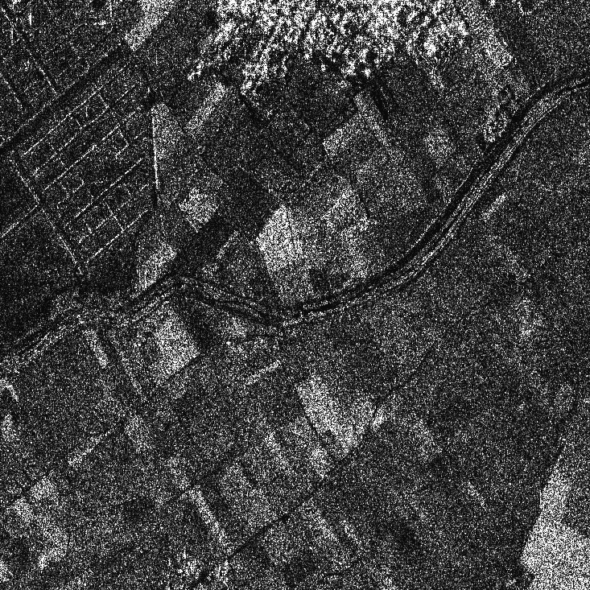

# 深度学习的 SAR 去斑不需要清晰的图像

> 原文：<https://towardsdatascience.com/you-do-not-need-clean-images-for-sar-despeckling-with-deep-learning-fe9c44350b69?source=collection_archive---------47----------------------->

## Speckle2Void 是如何学会停止担忧，爱上噪音的

来自 TerraSAR-X 的噪声 SAR 图像。

当想到卫星图像时，我们大多数人都会想到光学图像，即传感器捕捉地球反射的太阳光线形成的图片。但是光学图像并不是故事的全部！

合成孔径雷达(SAR)是一种基于主动照明的替代成像技术。基本上，卫星发送一束电磁波，并监听它从地面的反射。巧妙的处理技术将发射的波形与接收到的波形进行比较，可以生成一幅图像，显示地面是如何反射波的。合成孔径雷达必须被视为光学仪器的补充，因为它提供了光学仪器所不具备的能力。例如，合成孔径雷达可以看穿云层，因为它工作在电磁波谱的微波范围内，所以它不能被恶劣的天气所阻止。

然而，SAR 图像比它们的光学对应物呈现出更多的噪声，而且这不是普通的噪声。这种特殊的噪声称为 ***散斑*** ，是 SAR 等所有相干成像系统所共有的。一个常用的模型认为散斑是一种*倍增*扰动，与真实地面反射率无关。

由于斑点是一种非常严重的干扰，并且限制了诸如目标检测或土地覆盖分类等任务的性能，因此*去斑点算法已经被研究了将近 40 年。今天，深度学习承诺了新一代算法，可以利用卷积神经网络(CNN)强大的表示能力，以更忠实的方式恢复底层地面反射率。*

# *我的地面真理在哪里？*

*CNN 的监督训练已被证明在解决包括去噪在内的各种问题方面非常强大，但它从根本上受到对地面真实数据的需求的限制。这对于我们的 SAR 去斑目标来说是一个关键问题，因为干净的 SAR 图像根本不存在。*

*早期的方法通过在光学图像或广泛用于图像识别的数据集(例如 ImageNet)上模拟散斑来绕过这个问题。这允许具有图像的噪声版本和相应的地面真相。*

*然而，这不是最佳的，因为 SAR 图像的特征可能与常规图像的特征显著不同。这在训练中使用的数据和将应用该算法的真实数据之间产生了一个*域间隙*，并且它导致了降低去斑点图像质量的伪像。下图显示了一个简单的 CNN 在合成数据上以这种监督方式训练的例子。我们可以看到一些区域过于平滑，而其他区域则呈现出卡通般的特征。*

****

*左:嘈杂的图像，右:监督 CNN 去噪。请注意由于使用合成斑点数据进行训练而产生的伪像。来自 https://arxiv.org/abs/2007.02075[的数字](https://arxiv.org/abs/2007.02075)。*

# *斑点状 2*

*在过去的一年里，深度学习社区在无监督的情况下解决去噪问题方面取得了重大进展。像 [Noise2Noise](https://arxiv.org/abs/1803.04189) 、 [Noise2Void](https://arxiv.org/abs/1811.10980) 、 [Noise2Self](https://arxiv.org/abs/1901.11365) 等方法设计了不需要清晰图像的自我监督方法。一些方法，如 Noise2Noise(及其对 SAR 图像的[扩展](https://arxiv.org/abs/2006.15037))需要同一场景的多种实现，这可能很难获取、注册和适应变化。另一方面 [Laine 等人](https://arxiv.org/abs/1901.10277)设计了一个贝叶斯框架，允许从单个噪声图像进行自我监督训练。 [Speckle2Void](https://arxiv.org/abs/2007.02075) 将该框架引入遥感领域，解决了 SAR 去斑时出现的一些问题。*

## *建筑*

**

*Speckle2Void 架构。图来自[https://arxiv.org/abs/2007.02075](https://arxiv.org/abs/2007.02075)。*

*Speckle2Void 依赖于盲点 CNN，即特殊类型的 CNN，在与我们当前想要去噪的像素相对应的感受野中有一个洞。想法是网络应该从感受野预测干净像素的值。这是因为如果噪声是空间不相关的，就不可能预测像素的噪声分量。感受域中的洞是需要的，以确保像素本身被排除在这一操作之外，否则，它将平凡地复制自己的值。这是通过合适的架构实现的，如图所示，该架构使用标准卷积层，但对图像的旋转版本进行移位，以将感受野的扩展限制在一个方向。*

## *训练和去噪*

**

*训练和去噪程序。图来自[https://arxiv.org/abs/2007.02075](https://arxiv.org/abs/2007.02075)。*

*在解释训练和去噪如何工作之前，我们必须介绍用于描述噪声和给定感受野的干净图像像素的条件分布的贝叶斯模型。实际上，训练的整个目标是让 CNN 学会如何处理感受野，以返回最适合噪声观察的干净像素分布的参数值。*

*噪声是倍增的，并且遵循伽马分布；给定感受野的图像像素遵循逆伽马分布，其参数由 CNN 估计。最后，这意味着观察到的噪声数据遵循称为 G0 的著名分布，该分布被认为是异质 SAR 图像的良好模型。*

**

*在训练期间，p(y)的对数被最小化，以让 CNN 学习如何使用感受野来产生最适合噪声数据的干净图像分布的参数。在测试期间，使用贝叶斯后验分布的平均值计算去噪图像，即:*

**

## *你的斑点真的不相关吗？*

*虽然许多 SAR 图像模型通常假设散斑在空间上不相关，但在现实生活中这通常是不正确的，因为 SAR 聚焦系统的传递函数引入了一些相关性。这对于 Speckle2Void 是不利的，因为 CNN 可以找到一种方法来利用噪声中的相关性来复制它，从而降低去噪性能。这个问题可以用两种方法来解决:
1。通过使用诸如 Argenti 等人的技术去相关散斑；2
。用更大的盲点！盲点的宽度应该被调制以匹配散斑过程的自相关宽度。*

## *结果*

*我们可以看到 Speckle2Void 是如何在保留图像细节的同时强烈抑制斑点噪声的。关键的是，它没有引入监督训练中观察到的那种伪影，因为它学习了如何直接从真实的 SAR 图像中提取相关特征。*

****

*左:有噪声的图像，右:用斑点 2 去噪。数字来自[https://arxiv.org/abs/2007.02075](https://arxiv.org/abs/2007.02075)。*

# *结论*

*对于自监督方法来说，这是一个激动人心的时刻，越来越多的应用开始受益于直接使用真实数据，即使在没有监督信号的情况下。Speckle2Void 证明了即使无法观察到清晰的图像，也可以学习一种有效的 SAR 图像去斑算法。*