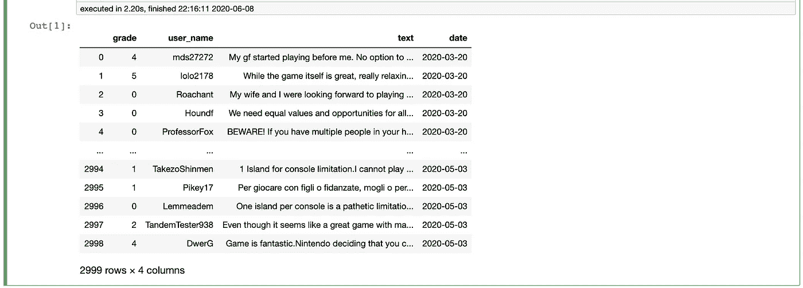
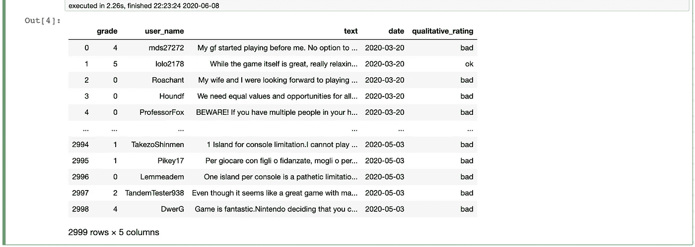
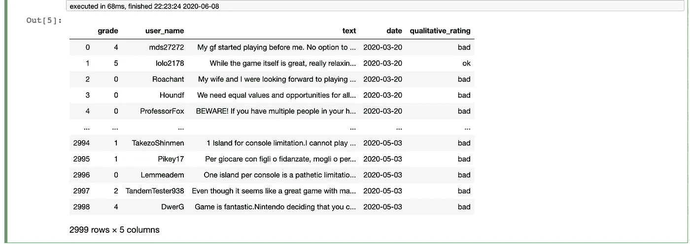
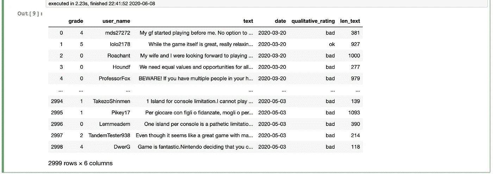
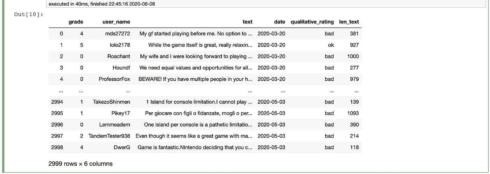
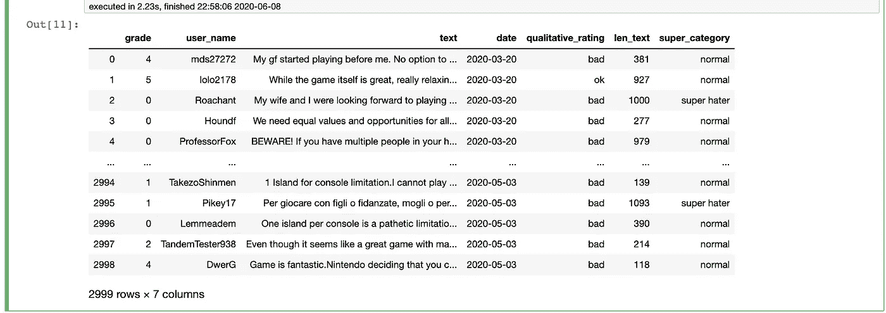
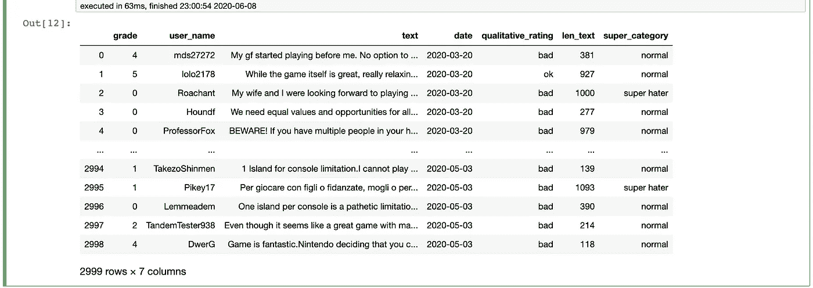

# 你不需要总是在熊猫的行列中循环！

> 原文：<https://towardsdatascience.com/you-dont-always-have-to-loop-through-rows-in-pandas-22a970b347ac?source=collection_archive---------8----------------------->

## 计算机编程语言

## 用向量化解决方案看一下“for 循环”的替代方案。


由@ [siscadraws](https://www.instagram.com/siscadraws/) 创建(Instagram 句柄)

我用熊猫已经有一段时间了，但我并不总是正确地使用它。我执行计算或编辑数据的直观方法倾向于从这个问题开始:

> 我如何循环遍历(迭代)我的数据帧来做 *INSERT_ANY_TASK_HERE* ？

迭代数据帧中的行可能有效。事实上，我写了一整篇关于[如何逐行编辑你在熊猫](/a-really-simple-way-to-edit-row-by-row-in-a-pandas-dataframe-75d339cbd313)中的数据。

我这样做的原因是因为我有一个多层计算，对于我来说，我无法解决如何不循环。我有多个条件，其中一个条件涉及获取一个列值，该列值具有数据帧中另一个列的名称，该列将用于计算。

迭代数据帧是我能想到的解决这个问题的唯一方法。但是这不应该是你在和熊猫一起工作时总是采用的方法。

事实上，Pandas 甚至有一个红色的警告[告诉你不应该迭代数据帧。](https://pandas.pydata.org/pandas-docs/stable/getting_started/basics.html#iteration)

> 遍历 pandas 对象一般都是**慢**。在许多情况下，不需要手动迭代这些行，并且可以通过*矢量化*解决方案来避免:许多操作可以使用内置方法或 NumPy 函数、(布尔)索引来执行。

大多数时候，您可以使用一个**矢量化解决方案**来执行您的熊猫操作。**矢量化**不是使用“for 循环”类型的操作，即一次遍历一组数据中的一个值，而是实现一个解决方案，一次遍历一组值。在 Pandas 中，这意味着不是逐行计算，而是在整个数据帧上执行操作。

**这里的重点不仅仅是代码在非循环解决方案下运行的速度，而是创建可读的代码，最大程度地利用 Pandas。**

现在，让我们通过几个例子来帮助重新构建最初的思考过程，从“我如何循环通过一个数据帧？”真正的问题是“我如何用熊猫的工具进行计算？”。

我们将要使用的数据来自于 [Kaggle](https://www.kaggle.com/jessemostipak/animal-crossing/data) 的一个动物穿越用户回顾数据集。我们将导入数据并创建两个数据帧，一个称为“旧”，另一个称为“新”。然后，为了开始了解 for 循环的替代解决方案的基础，我们将使用 for 循环和矢量化解决方案执行一些操作，并比较代码。(要理解下面 for 循环代码背后的逻辑，请查看[我之前的一篇文章](/a-really-simple-way-to-edit-row-by-row-in-a-pandas-dataframe-75d339cbd313?source=friends_link&sk=29a2f011cc7fa485a019d1f9511cf78a)，因为它已经对这个主题有了深入的解释。)

```
import pandas as pdold = pd.read_csv('user_reviews.csv')
new = pd.read_csv('user_reviews.csv')
```



# 熊猫矢量化解决方案介绍

## 实现“如果-那么-否则”

让我们创建一个名为“qualitative _ rating”的新列。这样，我们可以创建一些宽泛的类别，将每个用户评论标记为“差”、“好”和“好”。“坏”评论是指“等级”低于 5 的评论。一篇好的评论将会是任何“等级”大于 5 的评论。任何“等级”等于 5 的评论都将是“好的”。

要使用 for 循环实现这一点，代码如下所示:

```
# if then elif else (old)# create new column 
old['qualitative_rating'] = ''# assign 'qualitative_rating' based on 'grade' with loop
for index in old.index:
    if old.loc[index, 'grade'] < 5:
        old.loc[index, 'qualitative_rating'] = 'bad'
    elif old.loc[index, 'grade'] == 5:
        old.loc[index, 'qualitative_rating'] = 'ok'
    elif old.loc[index, 'grade'] > 5:
        old.loc[index, 'qualitative_rating'] = 'good'
```



代码很容易阅读，但是花了 7 行 2.26 秒完成了 3000 行。

相反，更好的解决方案应该是这样的:

```
# if then elif else (new)# create new column
new['qualitative_rating'] = ''# assign 'qualitative_rating' based on 'grade' with .loc
new.loc[new.grade < 5, 'qualitative_rating'] = 'bad'
new.loc[new.grade == 5, 'qualitative_rating'] = 'ok'
new.loc[new.grade > 5, 'qualitative_rating'] = 'good'
```



这一次，添加定性评级的代码仅由 3 行代码组成，仅用了 68 毫秒。“我也用过了。loc”data frame 函数，但这一次，我“恰当地”使用了它。我的意思是，我没有使用循环的“如果-否则”解决方案，而是直接从“如果-否则”中分配“坏”、“好”和“好”的定性评级。loc”选择。

## **计算列值的长度**

我们的下一个新列“len_text”将显示每个评论的字符数，因此我们可以比较数据集中不同评论的长度。

要使用 for 循环实现这一点，代码如下所示:

```
# create column based on other column (old)# create new column
old['len_text'] = ''# calculate length of column value with loop
for index in old.index:
    old.loc[index, 'len_text'] = len(old.loc[index, 'text'])
```



同样，2 行 2.23 秒对于这个计算来说并不算长。但是，我们可以使用只需要一行的解决方案，而不是遍历每一行来查找长度:

```
# create column based on other column (new)# create new column
new['len_text'] = ''# calculate length of column value by converting to str
new['len_text'] = new['text'].str.len()
```



这里，我们获取一个现有列的值，将它们转换成字符串，然后使用“.len()"来获取每个字符串中的字符数。这个解决方案只花了 40 毫秒运行。

## **基于多个条件和现有列值创建新列**

现在让我们创建一个名为“super_category”的新列。在这里，我们将确定人们是否有资格成为“超级审阅者”，或者在这种情况下，他们的审阅长度是否大于 1000 个字符。如果评论“等级”大于或等于 9，我们还会将超级评论者标记为“超级粉丝”，如果评论“等级”小于或等于 1，则标记为“超级讨厌者”。其他人都将被归类为“正常”。

用 for 循环实现这一点将如下所示:

```
# new column based on multiple conditions (old)# create new column
old['super_category'] = ''# set multiple conditions and assign reviewer category with loop
for index in old.index:
    if old.loc[index, 'grade'] >= 9 and old.loc[index, 'len_text'] >= 1000:
        old.loc[index, 'super_category'] = 'super fan'
    elif old.loc[index, 'grade'] <= 1 and old.loc[index, 'len_text'] >= 1000:
        old.loc[index, 'super_category'] = 'super hater'
    else:
        old.loc[index, 'super_category'] = 'normal'
```



这是可行的，但是让我们把它分成两半:

```
# new column based on multiple conditions (new)# create new column
new['super_category'] = 'normal'# set multiple conditions and assign reviewer category with .loc
new.loc[(new['grade'] == 10) & (new['len_text'] >= 1000), 'super_category'] = 'super fan'
new.loc[(new['grade'] <= 1) & (new['len_text'] >= 1000), 'super_category'] = 'super hater'
```



这里，我们在我们的内部使用了“&”操作符。loc "函数来同时实现这两个条件。矢量化解决方案在 63 毫秒内完成，这再次明显快于循环方法，后者需要 2.23 秒。

这些是一些基本的操作，用来扩展现有的数据和一些我们自己定制的分析。是的，我们可以用循环做任何事情，你甚至可以看到相同的结构应用于许多不同的操作。但是 Pandas 自带了很多内置方法，专门用于我们经常需要执行的操作。

经历这些帮助我重新训练我的大脑，不要总是将 for 循环作为寻找更好的方法来完成各种操作的解决方案。

我希望它能帮助你做同样的事情！