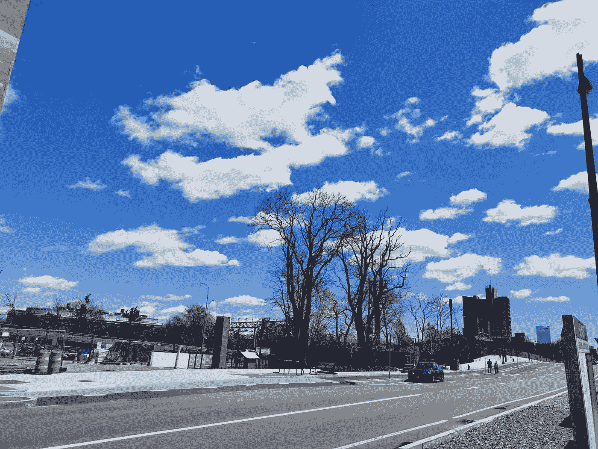
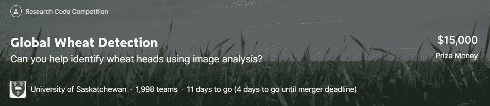

# 你不必赢得一场 Kaggle 比赛来展示你的数据科学能力！

> 原文：<https://towardsdatascience.com/you-dont-have-to-win-a-kaggle-competition-to-showcase-your-data-science-ability-2852a77b6d8c?source=collection_archive---------45----------------------->



(图片由作者提供)

## 我曾经坚持认为只有 Kaggle 比赛的获胜者才能展示他们的背景，现在我发现 Kaggle 的每个新人都可以在没有像样的排行榜的情况下展示他们的努力！

我们可以用我们的作品在 Kaggle 比赛中做什么？获得一个体面的排名，并可能获得大量奖励，这个答案对一些天才来说可能听起来不错。但是你不够聪明怎么办？这场比赛会完全没有意义吗？肯定没有！ [Kaggle](https://www.kaggle.com/) 作为数据科学家和机器学习爱好者的最大社区，不仅是为了排名和金钱，也是一个提高我们数据科学/建模技术的完美平台。

在文章的其余部分，我将介绍一种方法来展示你在 Kaggle 比赛中所做的事情，这是一个非常有用的组合，尤其是当你未能在排行榜上排名第一时，更重要的是给你的面试官留下深刻印象！

# **我要讲的是哪个比赛？**

我最近参加了由萨斯喀彻温大学主办的 [**全球小麦检测**](https://www.kaggle.com/c/global-wheat-detection) ，该项目旨在帮助农民在他们的田地里做出管理决策时评估健康和成熟度。该竞赛鼓励候选人尽可能提高图像中小麦籽粒的检测精度。直到编辑完这篇文章，本次比赛的№1 候选队伍已经取得了 0.7772 的成绩，这是比赛开展前的巨大飞跃，因为首发笔记本的成绩只有 0.66 左右。其截止日期为 2020 年 8 月 4 日。所以，如果你对计算机视觉感兴趣或者想赢得一些钱(一等奖 8000 美元！)，你绝对没有理由错过！



全球小麦检测竞赛主页(图片由作者提供)

# 开始之前

如果你没有耐心通读整页(跟我一样:)，现在就可以通过，直接去我的 GitHub repo:

> [https://github . com/MemphisMeng/global-wheat-detection-we B- app](https://github.com/MemphisMeng/global-wheat-detection-web-app)。

现在让我们来谈谈这个项目所需的依赖关系:

1.  [**细流**](https://docs.streamlit.io/en/stable/)
2.  [**相册**](https://albumentations.readthedocs.io/en/latest/)
3.  [**matplotlib**](https://matplotlib.org/)
4.  [**numpy**](https://numpy.org/doc/stable/)
5.  [**opencv-python**](https://github.com/skvark/opencv-python)
6.  [**熊猫**](https://pandas.pydata.org/docs/)
7.  [**枕头**](https://python-imaging.github.io/)
8.  [**scipy**](https://docs.scipy.org/doc/)

如果您不熟悉以上任何一个，请随意点击超链接并参考它们各自的文档。

最后一件值得注意的事情是，我将要建立的是一个面向 JPG 图像的麦穗检测器。换句话说，我会让模型告诉你一个图像中有多少个麦穗，它们位于哪里，只要你在应用中上传一个。

# 我们来编码吧！

首先，为了利用我在上一节中提到的所有库，需要做的就是简单地导入它们中的每一个:

```
**import** numpy **as** np
**import** pandas **as** pd
**import** re
**from** PIL **import** Image
**import** albumentations **as** A
**from** albumentations.pytorch.transforms **import** ToTensorV2
**import** torch
**import** torchvision
**from** torchvision.models.detection.faster_rcnn **import** FastRCNNPredictor
**import** streamlit **as** st
**from** torch.utils.data **import** DataLoader, Dataset
**from** matplotlib **import** pyplot **as** plt
**import** cv2
```

为了处理每一张上传的图片，我把它看作一个数据集，方便以后涉及 PyTorch 的操作。

```
**class** WheatTestDataset(Dataset):

    **def** __init__(self, image, transforms=**None**):
        super().__init__()
        self.transforms = transforms
        self.image = [image]

    **def** __getitem__(self, index):
        image = cv2.cvtColor(np.asarray(self.image[index]), cv2.COLOR_BGR2RGB).astype(np.float32)
        *# st.write('image', image)
        # image = np.asarray(self.image[index]).astype(np.float32)* image /= 255.0

        **if** self.transforms:
            sample = {
                **'image'**: image,
            }
            sample = self.transforms(**sample)
            image = sample[**'image'**]

        **return** np.asarray(image)

    **def** __len__(self) -> int:
        **return** len(self.image)*# Albumentations* **def** get_test_transform():
    **return** A.Compose([
        *# A.Resize(512, 512),* ToTensorV2(p=1.0)
    ])

**def** collate_fn(batch):
    **return** tuple(zip(*batch))
```

因此，我们可以这样加载图像:

```
test_dataset = WheatTestDataset(image, get_test_transform())
test_data_loader = DataLoader(
    test_dataset,
    batch_size=1,
    shuffle=**False**,
    num_workers=4,
    drop_last=**False**,
    collate_fn=collate_fn
)
```

之后，我还需要加载或配置神经网络模型。为了方便起见，我只是加载了基于 FasterRCNN 的预训练模型，你也可以在这里下载[。因此，建模部分看起来像:](https://www.kaggle.com/pestipeti/pytorch-starter-fasterrcnn-inference/output)

```
WEIGHTS_FILE = **'fasterrcnn_resnet50_fpn_best.pth' # downloaded weights** *# load a model; pre-trained on COCO* model = torchvision.models.detection.fasterrcnn_resnet50_fpn(pretrained=**False**, pretrained_backbone=**False**)
device = torch.device(**'cuda'**) **if** torch.cuda.is_available() **else** torch.device(**'cpu'**)
num_classes = 2  *# 1 class (wheat) + background
# get number of input features for the classifier* in_features = model.roi_heads.box_predictor.cls_score.in_features
*# replace the pre-trained head with a new one* model.roi_heads.box_predictor = FastRCNNPredictor(in_features, num_classes)
*# Load the trained weights* model.load_state_dict(torch.load(WEIGHTS_FILE, map_location=device))
model.eval()
```

接下来，应该在网页上添加一些必要的元素:

```
st.header(**"""
WELCOME TO GLOBAL WHEAT HEAD CHALLENGE!
"""**)
st.subheader(**'Please open this website with Google Chrome.'**)
uploaded_file = st.file_uploader(**"Choose an image... (jpg only)"**, type=**"jpg"**)
confidence_threshold = st.number_input(**'Please specify the confidence of a wheat head'**)
button = st.button(**'Confirm'**)
```

最后，我们可以直接使用我们的模型来检测项目:

```
detection_threshold = confidence_threshold **or** 0.5
results = []
outputs = **None** images = **None

if** button **and** uploaded_file **is not None**:
    image = Image.open(uploaded_file)
    st.image(image, caption=**'Uploaded Image'**, use_column_width=**True**)
    st.write(**""**)
    st.write(**"Detecting..."**)
    test_dataset = WheatTestDataset(image, get_test_transform())
    test_data_loader = DataLoader(
        test_dataset,
        batch_size=1,
        shuffle=**False**,
        num_workers=4,
        drop_last=**False**,
        collate_fn=collate_fn
    )

    **for** images **in** test_data_loader:
        images = torch.Tensor([images[0][0], images[1][0], images[2][0]])
        images = torch.reshape(images, (3, 1024, 1024))
        images = (images,)
        images = list(image.to(device) **for** image **in** images)
        outputs = model(images)

        **for** i, image **in** enumerate(images):
            boxes = outputs[i][**'boxes'**].data.cpu().numpy()
            scores = outputs[i][**'scores'**].data.cpu().numpy()

            boxes = boxes[scores >= detection_threshold].astype(np.int32)
            scores = scores[scores >= detection_threshold]

            boxes[:, 2] = boxes[:, 2] - boxes[:, 0]
            boxes[:, 3] = boxes[:, 3] - boxes[:, 1]

            **for** j **in** zip(boxes, scores):
                result = {
                    **'Detected Boxes'**: **"{} {} {} {}"**.format(j[0][0], j[0][1], j[0][2], j[0][3]),
                    **'Confidence%'**: j[1]
                }
                results.append(result)

**if** len(results) != 0:
    *# print out results* sample = images[0].permute(1, 2, 0).cpu().numpy()
    boxes = outputs[0][**'boxes'**].data.cpu().numpy()
    scores = outputs[0][**'scores'**].data.cpu().numpy()
    boxes = boxes[scores >= detection_threshold].astype(np.int32)
    fig, ax = plt.subplots(1, 1, figsize=(32, 16))
    **for** box **in** boxes:
        x1, y1, x2, y2 = box
        sample = cv2.rectangle(img=sample,
                               pt1=(x1, y1),
                               pt2=(x2, y2),
                               color=(0, 0, 255), thickness=3)
    ax.set_axis_off()
    st.image(cv2.UMat.get(sample), clamp=**True**)
    st.write(**"# Results"**)
    st.dataframe(pd.DataFrame(results))
**else**:
    st.write(**""**)
    st.write(**"""
    No wheat heads detected in the image!
    """**)
```

所以现在这个 web app 是在本地端完成的，所以当你在终端输入`streamlit run app.py`的时候，你就可以在本地主机上访问和测试程序。

# 下一步是什么？

既然我们已经开发了这个检测工具，如果我们能与任何需要它的人分享它，那将是完美的。因此，将其部署为任何人都可以随时查看的 web 应用程序绝对是一个不错的选择。各种企业开发的 web 服务有一堆，现在我就以 Google 云平台为例。谷歌云平台( [GCP](https://cloud.google.com/) )是谷歌提供的一套网络服务，包括一套管理工具和一系列模块化云服务。这一次，我们主要需要使用它的容器化和 GPU 服务。

我实现这一部分的策略与 [Moez Ali](https://medium.com/u/fba05660b60f?source=post_page-----2852a77b6d8c--------------------------------) 发表的这篇[帖子](/deploy-machine-learning-app-built-using-streamlit-and-pycaret-on-google-kubernetes-engine-fd7e393d99cb)中的任务 4 基本相同。需要注意的是，由于我们的项目使用 PyTorch 作为框架来配置神经网络模型，因此从 [docker hub](https://hub.docker.com/r/pytorch/pytorch/) 导入已建立的 docker 映像总是更好，而不是要求主机在 requirements.txt 中安装。该选项的最大好处是它有效地节省了机器的内存空间。因此，完整的 docker 文件如下所示:

```
FROM pytorch/pytorch:1.4-cuda10.1-cudnn7-runtime
RUN pip install virtualenv
ENV VIRTUAL_ENV=/venv
RUN virtualenv venv -p python3
ENV PATH="VIRTUAL_ENV/bin:$PATH"WORKDIR /app
ADD . /app# Install dependencies
RUN apt update
RUN apt-get install -y libglib2.0-0 libsm6 libxrender1 libxext6
RUN pip install -r requirements.txt# copying all files over
COPY . /app# Expose port 
ENV PORT 8501# cmd to launch app when container is run
CMD streamlit run app.py# streamlit-specific commands for config
ENV LC_ALL=C.UTF-8
ENV LANG=C.UTF-8
RUN mkdir -p /root/.streamlit
RUN bash -c 'echo -e "\
[general]\n\
email = \"\"\n\
" > /root/.streamlit/credentials.toml'RUN bash -c 'echo -e "\
[server]\n\
enableCORS = false\n\
" > /root/.streamlit/config.toml'
```

# 干得好！

现在我们已经成功地将该项目部署到 GCP，然后任何对你的工作感兴趣的人都可以从中得到乐趣。


网络应用网址:[http://35.188.98.72/](http://35.188.98.72/)(图片由作者提供)

# 思想

我写这篇文章是因为我最近受到一个人的启发，他问我这个行业可以用我的 Kaggle 项目做什么。我曾经陷入这样一个陷阱:除非你在 Kaggle 上有一个像样的个人资料，否则你将无法找到一份数据科学的工作。这并没有错，虽然没有人可以定义你的体面。而那个人的话让我更多的为行业考虑，这应该是一个有志的数据科学家找工作应该具备的“体面”。

所以我努力发展自己的方式来展示我在 Kaggle 上所做的事情，试图让每个人都理解我的项目，并说服他们我的项目对他们的业务有价值，即使他们没有 IT 背景。把一个项目包装成一个网络应用程序，让每个人都能享受其中的乐趣，这是我现在最好的选择。

这是我的第一篇关于媒介的文章，如果你喜欢，请给我一个掌声，因为这将是你对我最大的鼓励。未来，我将发表更多文章，分享我的数据科学之路。所以有兴趣的请跟我来！

**参考文献:**

[1] [Moez Ali](https://medium.com/u/fba05660b60f?source=post_page-----2852a77b6d8c--------------------------------) ，[在 Google Kubernetes 引擎上部署使用 Streamlit 和 PyCaret 构建的机器学习应用](/deploy-machine-learning-app-built-using-streamlit-and-pycaret-on-google-kubernetes-engine-fd7e393d99cb)

[2][https://www . ka ggle . com/pesti peti/py torch-starter-fasterr CNN-推论](https://www.kaggle.com/pestipeti/pytorch-starter-fasterrcnn-inference)