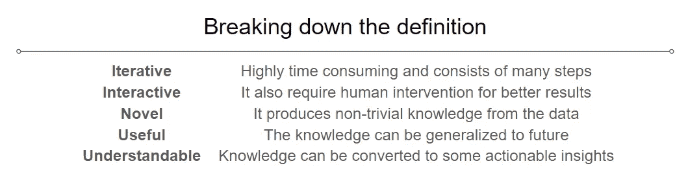
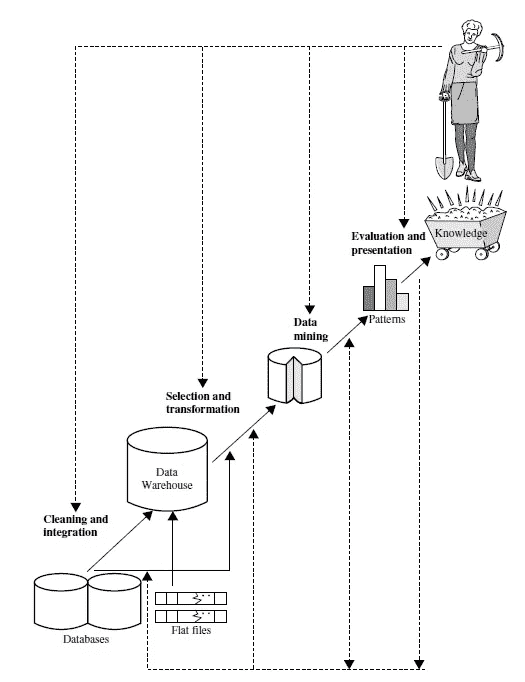
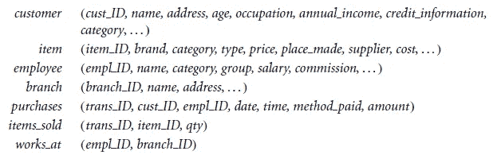
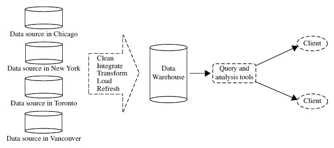
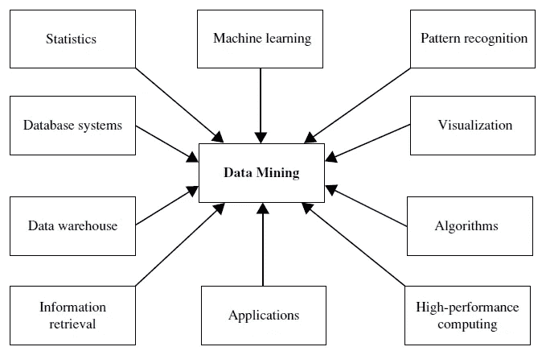

# 你不知道你不知道什么

> 原文：<https://towardsdatascience.com/you-dont-know-what-you-don-t-know-3e20de7dceb8?source=collection_archive---------56----------------------->

## 这是对年轻且快速发展的数据挖掘领域(也称为从数据中发现知识，或简称为 KDD)的介绍。它侧重于从各种应用程序的数据中发现有趣模式的基本数据挖掘概念和技术。

来源: [Pixabay](https://www.pexels.com/@pixabay)

我们今天看到的世界拥有自动化的数据收集工具、数据库系统、万维网和计算机化的社会。这导致了数据的爆炸式增长，从百万兆字节增长到百万兆字节。

> 我们淹没在数据的海洋中，却渴望知识。

我们的新时代为我们提供了巨大的速度、数量和各种各样的数据。我们有更便宜的技术，移动计算，社交网络，云计算引发了这场数据风暴。

这些就是传统方法逐渐消失的原因，我们需要一些像**数据挖掘**这样的新方法来处理新时代的数据。

# 什么是数据挖掘？

数据挖掘是从海量数据源中发现新颖、有效、有用和可理解的模式和模型的迭代和交互过程。

打破数据挖掘的定义。

# 什么是知识发现？

从海量数据库中产生知识的整个过程称为 KD。这是一个比数据挖掘更复杂的过程。数据挖掘是知识发现的一个步骤，它处理数据中模式的识别。

让我们来分解一下 KD 的过程。

## 第一步。学习应用领域

我们应该预先了解我们将要发现知识的应用领域。据观察，具有先验知识有助于从数据中更好地产生洞察力。

## 第二步。数据清理

一旦我们从仓库中获得了数据，我们就需要去除噪声和不一致的数据。在知识发现过程中，可能要花费高达 60%的精力。

## 第三步。数据选择

我们创建一个数据集，从数据库中检索与分析任务相关的数据。

## 第四步。数据简化和转换

在这里，我们通过执行汇总或聚合操作，将数据转换并整合成适合挖掘的形式。我们找到有用的特征，进行维数或变量缩减，并使用不变表示。

## 第五步。数据挖掘技术

这是一个应用智能方法提取数据模式的重要过程。方法可以是总结、分类、回归、关联或聚类。

## 第六步。模式评估

我们基于兴趣度来识别和分离代表知识的真正有趣的模式。

## 第七步。知识展示

可视化和知识表示技术用于向用户或利益相关者呈现挖掘出的知识。

KD 和 DM 中涉及的步骤是 KD 的步骤之一(来源:[elsevier.com](https://www.elsevier.com/books/data-mining-concepts-and-techniques/han/978-0-12-381479-1))

# 可以挖掘哪些类型的数据？

数据挖掘可以应用于任何类型的数据，只要这些数据对目标应用程序有意义。挖掘应用最基本的数据形式是**数据库数据**、**数据仓库数据、**和**事务数据。**

## 数据库数据

数据库系统，也称为数据库管理系统( **DBMS** )，由一组相互关联的数据组成，称为数据库。

关系数据库**是表的集合，每个表都被赋予一个惟一的名称。每个表都由一组包含大型元组集的属性组成。关系表中的每个元组代表一个由唯一键标识并由一组属性值描述的对象。**

一个关于电子技术的关系数据库(来源:[elsevier.com](https://www.elsevier.com/books/data-mining-concepts-and-techniques/han/978-0-12-381479-1)

## 数据仓库

假设一家成功的国际公司在世界各地都有分支机构。每个分支机构都有自己的一套数据库。公司总裁要求您提供一份公司第三季度每个分公司每个产品类型的销售分析。

为了便于决策，数据仓库中的数据是围绕主要主题组织的。

数据仓库的框架(来源:[elsevier.com](https://www.elsevier.com/books/data-mining-concepts-and-techniques/han/978-0-12-381479-1))

## 交易数据

通常，事务数据库中的每个记录都捕获一个事务，例如客户的购买、机票预订或用户对网页的点击。交易通常包括唯一的交易标识号( **trans ID** )和组成交易的物品列表，例如在交易中购买的物品。

# 使用的技术？

作为一个高度应用驱动的领域，数据挖掘结合了许多来自其他领域的技术，例如

KD 流程中使用的技术(来源:[elsevier.com](https://www.elsevier.com/books/data-mining-concepts-and-techniques/han/978-0-12-381479-1))

## 统计数字

统计学研究数据的收集、分析、解释和表达，与数据挖掘有着内在的联系。它包括对描述统计学、推断统计学或预测统计学以及统计假设检验的研究。

## 机器学习

机器学习研究计算机如何基于数据进行学习(或提高性能)。众所周知，它包括有监督学习、无监督学习、强化学习。

# DM 中的重大问题？

数据挖掘是一个动态和快速发展的领域，具有很大的优势。这些问题中的许多在最近的数据挖掘研究和开发中已经得到了一定程度的解决，现在被认为是数据挖掘的需求，其他的仍处于研究阶段。

## 采矿方法

数据挖掘和知识发现涉及在多维空间中挖掘各种新的知识，处理数据的噪声、不确定性和不完整性。这似乎是一个两行的问题，但比我们能想到的更复杂。因此它们仍处于发展阶段。

此外，数据挖掘是一项跨学科的工作，因此我们需要许多领域的先验知识来解决问题。

## 用户交互

用户在数据挖掘过程中扮演着重要的角色。有趣的研究领域包括如何与数据挖掘系统交互，如何在挖掘中结合用户的背景知识，以及如何可视化和理解数据挖掘结果。

这还包括对挖掘数据的生动和灵活的表示，以便发现的知识可以被人类容易地理解和直接使用。

## 效率和可扩展性

在比较数据挖掘算法时，总是要考虑效率和可伸缩性。随着数据量的持续增长，这两个因素变得尤为重要。

# 让我们来欣赏…

数据挖掘和知识发现是理解数据和生成可供人类使用的模式的广泛方式。这也是一个反复的过程。我们需要多次思考、应用、评估，才能知道自己不知道的东西。