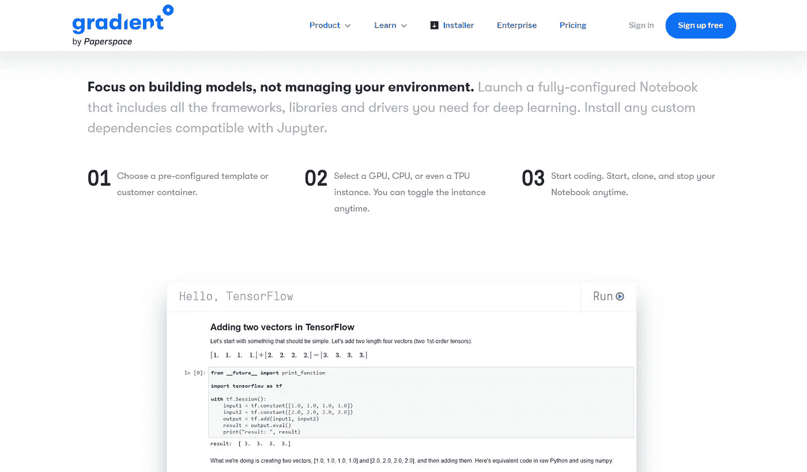
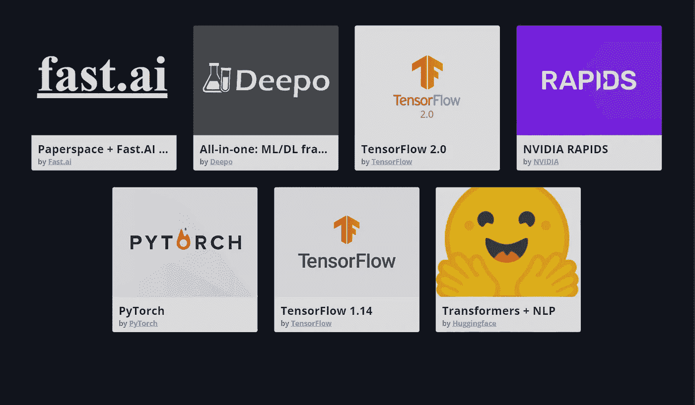
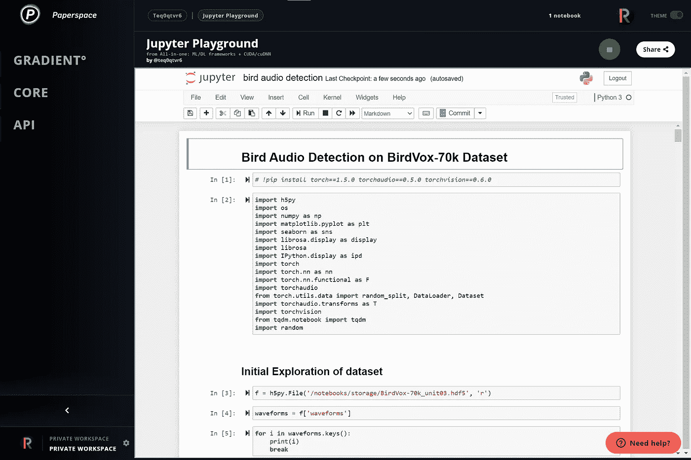
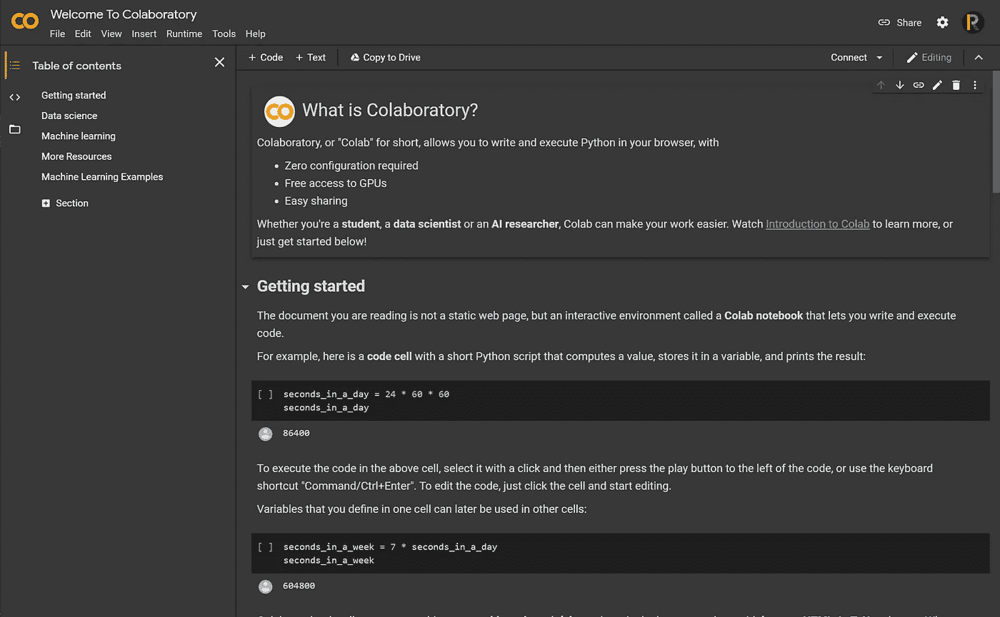
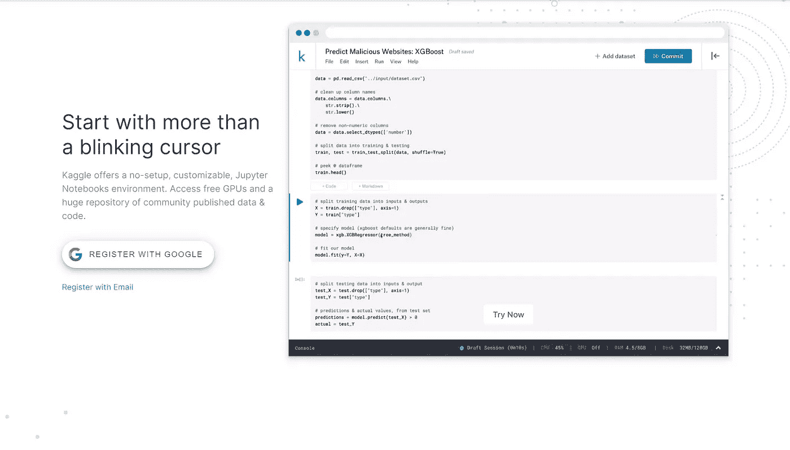
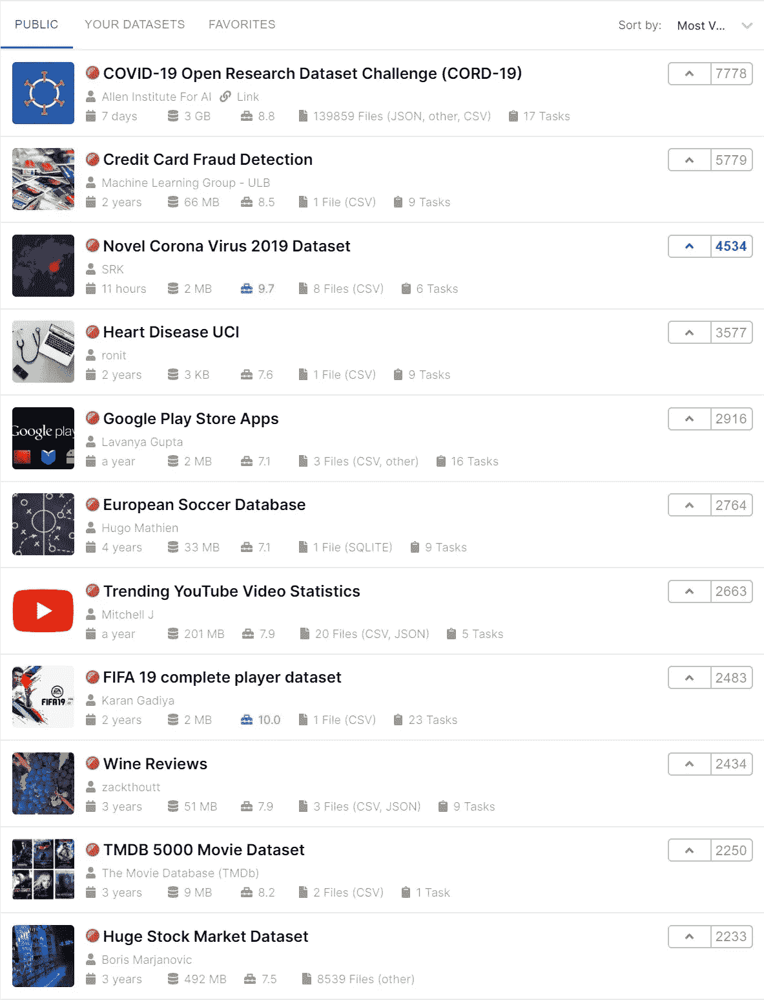
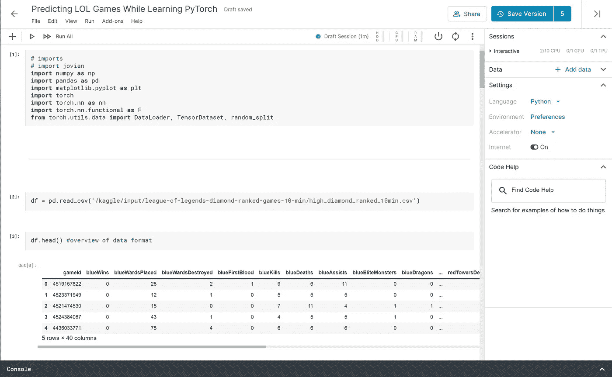

# 你不需要钱来创造一个深度学习环境

> 原文：<https://towardsdatascience.com/you-dont-need-money-to-create-a-deep-learning-environment-2c2d01cee9fb?source=collection_archive---------41----------------------->

## 也不需要任何硬件，这一切都归功于“云”

照片由 [Unsplash](https://unsplash.com?utm_source=medium&utm_medium=referral) 上的 [Jp Valery](https://unsplash.com/@jpvalery?utm_source=medium&utm_medium=referral)

# 介绍

如果你想直接开始训练复杂的模型，并成为一名认真的深度学习实践者，你将需要一件东西: ***硬件*** 。具体来说，**一个强大的 GPU ( *图形处理单元*)就是你想要的** *。相信我，我从未见过头脑简单的人只用一个 CPU 训练一个相当复杂的程序。然而，除非你口袋里有很多现金，否则访问哪怕一个 GPU 都不容易，也不便宜，更不用说有足够计算能力或内存来满足你的需求的 GPU 了。让我们严肃点，*我们都希望拥有世界上所有的钱来生产多台 RTX 2080 Ti 以满足我们自己的需求。**

预算紧张但又想追求深度学习怎么办？见鬼，如果你现在没有现金，你会怎么办？不要担心:**有些地方可以免费开始**，在那里你可以开始模型实验，并获得(尽管有限)一个完全成熟的 GPU。如果你的口袋空空如也，却不知道从哪里开始，这里有一些选项供你选择，所有这些都将为你提供一个 Jupyter(笔记本或实验室)环境来开始创建你的项目。

> 它将如何工作？ *一些提供商会将您的定制环境的副本存储到他们的服务器中(也称为* **云** *)。其他人总是在每次启动时加载一个“通用”的环境，同时非常方便地安装额外的软件包。*

在我们开始之前，这里有一些值得注意的趋势，你一定要记住:

*   你肯定需要一个互联网连接(废话！)
*   大多数(如果不是全部)选项通过每周更新配额和/或在长时间单次运行后自动关闭来限制您的 GPU 使用
*   其中一些将允许您“升级”您的云硬件。

***话不多说，这里有一些 GPU 实例的最佳免费选项，可以启动您的深度学习实验！***

> ***注意*** *:* 由于下面的所有选择都提供了一个相当不错的 GPU 开始，**我将更多地关注每个**提供的功能，而不是 GPU 的性能和统计。

# 图纸空间梯度

**提供的 GPU:**Nvidia Quadro p 5000、Nvidia Quadro M4000

**最大运行时间(每次运行):** 6 小时

**显著特性:**持久存储、基本容器、部署&项目定制/选项、出色的用户体验

在我个人看来， **Gradient 的产品似乎是我尝试过的其他产品中最完美的。事实上， [Gradient 直到 2019 年 10 月才向其用户提供免费层/选项，当时他们宣布了该服务](https://blog.paperspace.com/paperspace-launches-gradient-community-notebooks/)。考虑到这一点，为什么前一点是这样的就不是巧合了。**

Gradient 提供的一些更受欢迎的“基本容器”,每个容器都带有不同的预装物品或配置。

渐变提供了许多独特的功能。首先，它允许用户选择一个预先制作的环境设置(名为“基本容器”)，该环境设置预装了一个特定的深度学习框架。**比手动安装必要的包或者一开始就处理太多要好得多。**

你通过 **Paperspace 控制台**访问你的笔记本( *Paperspace 有除 Gradient* 之外的服务)，它最近获得了 [***40%*** 的性能提升](https://updates.paperspace.com/new-console-launched!-1kLZPa)。因此，**浏览用户界面和笔记本**(一旦加载)**是一种非常愉快的体验**。有了它的自由层，你一次只能运行一个笔记本，你运行的每个笔记本都有它自己的磁盘空间量，在多次运行后*保持不变*(尽管不清楚你被限制了多少空间)。此外，您只能在每台笔记本电脑之间共享最多 5 GB 的数据集、模型参数、输出等数据。，称为**持久存储**。

> *另一个需要注意的细节:* *与其替代品不同，Gradient 的基本容器* ***中的大部分(如果不是全部的话)没有添加 Jupyter*** *笔记本或 lab 的自己的“味道”，这意味着您将有一个可以说是* ***更干净和更快的体验*** *在 Paperspace 控制台上工作。*

以下是在 Paperspace 控制台下运行笔记本的样子。

> Gradient 还允许你上传自己的模型进行训练，以及通过他们的 CLI 或 GitHub repo 打造新的深度学习项目。

**如果你决定升级**，Gradient 提供了大量不同价格的云 GPU 供你选择。此外，您还可以使用其他功能，例如取消 6 小时自动关机限制、增加永久存储空间，或者取消 1 台笔记本电脑的限制。

我对在自由层上运行 Gradient 的唯一不满是启动一个笔记本实例需要**很长时间，尽管 Paperspace 声称性能有所提高。有时候，渐变告诉我，在打开笔记本之前，我必须等待。我相信这些是强加的限制，把免费用户和升级用户区分开来；尽管如此，对于许多开始尝试深度学习的人来说， ***Paperspace Gradient 是最好的免费选项之一。*****

# 谷歌联合实验室

**提供的 GPU:**英伟达特斯拉 K80，英伟达特斯拉 T4**，英伟达特斯拉 P100** *(**:如果你很***)**

***最大运行时间(每次运行):** 12 小时*

***显著特点:** Google Drive & GitHub 集成，易于使用&运行，(优越)摩纳哥编辑/Intellisense*

****在我使用 Paperspace Gradient 之前，Colaboratory 是我在云 GPU 上制作和运行 Jupyter 笔记本的首选。Colab 由谷歌开发，一直是机器/深度学习爱好者和初学者的免费资源。最近他们在今年早些时候发布了 Colab Pro，这给了它的购买者一些便利的额外津贴，我们将在后面讨论。****

*Colab 比其他公司有更多的优势。例如，**在 GPU 上制作笔记本和运行模型非常容易上手**。如果你曾经使用过谷歌的工具套件(比如谷歌文档、工作表和幻灯片)，那么制作和编辑 Colab 笔记本也有类似的感觉。另一个小但令人惊讶的细节是在笔记本单元中整合了摩纳哥编辑器智能感知。基本上，它与 Visual Studio 代码中使用的编辑器/intellisense 是相同的，我也经常使用和喜欢它(这可能是我偏爱 Colab 的原因)😛).*

**

*Colab 和摩纳哥智能感知在行动！*

***Colab 与 Google Drive 的深度集成，在我看来是一把双刃剑**。一方面，你可以把一个数据集放到你的硬盘上，并且可以在你所有的 Colab 笔记本上访问，这很好。然而，这要求**没有任何持久存储**，这意味着每次运行笔记本的新实例时，你都必须用代码片段从驱动器加载数据和/或文件。此外，事实上，Colab 通常依赖硬盘来永久存储数据，这意味着您正在**为您的设置**增加一层复杂性；简单地升级到 Colab Pro 并不意味着你会获得额外的存储空间，反之亦然。*

> *另一个小的，但值得注意的不便是 **Colab 实际上重新映射了几乎所有的标准 Jupyter 键盘布局**，似乎没有任何理由。*😵**

*Colab Pro 声称给用户 ***优先访问*** 更高端的 GPU，如 T4 和 P100。**优先接入不一定是接入。**你可以最终支付价格标签，只获得“普通”K80 GPU，或者你可以成为一名免费用户，幸运地获得一个笔记本电脑实例的更好设备。 ***无论如何，Colab 本身就是一个坚实的选择，可以通过免费的云 GPU 开始实践深度学习。****

# *Kaggle 笔记本*

**

***GPU 提供:**英伟达特斯拉 P100*

***最大运行时间(每次运行/每周):** 9 小时/ 30 小时*

***显著特点:**庞大的数据集目录，轻松导入 Kaggle 数据集，强大的社区支持&*

*Kaggle 字面上无需介绍。Kaggle 本身拥有大量数据集，你可以在那里的笔记本上轻松浏览和使用。Kaggle 成立于 2010 年，目前是谷歌的子公司。与列表中的其他人不同，Kaggle 没有需要付费的更高等级；每个使用 Kaggle 的人都是免费的。*

**

*Kaggle 的数据集目录，有一个投票系统。*

*Kaggle 最引人注目的特征之一是其**庞大的数据集目录**。它们涉及许多主题，从[视频游戏](https://www.kaggle.com/bobbyscience/league-of-legends-diamond-ranked-games-10-min)到[新冠肺炎](https://www.kaggle.com/allen-institute-for-ai/CORD-19-research-challenge)数据。更好的是:将这些数据导入 Kaggle 上的笔记本非常快速简单。此外，Kaggle 非常适合满足您的竞争优势，因为它允许举办正式的数据科学竞赛，以获得疯狂的奖项——这是一种将深度学习应用于现实世界场景的好方法。*

***每个使用 Kaggle 笔记本的人都可以使用特斯拉 P100 作为他们的 GPU** 。笔记本界面是 Jupyter 笔记本的一种高度定制的风格，以适应 Kaggle 的主题。你可以**将你的笔记本分享给 Kaggle 社区**，有趣的是，Kaggle 中的大多数实体都有笔记本投票系统。谈到社区，从我的经验来看，这里的人们即使在比赛期间也非常乐于助人。见鬼，Kaggle 本身也提供编程和**数据科学教程**，称为“课程”。*

**

*Kaggle 笔记本的标准界面。请注意，黑暗模式是可用的。如果你对标题感兴趣，[看这里](/predict-matches-in-league-of-legends-while-learning-pytorch-basics-3dd43cf8d16f?source=friends_link&sk=59dde463c30644c34688f56778164cab)！*

*然而，我发现 Kaggle 最大的问题是笔记本界面。正如我所说的，Kaggle 给他们的笔记本添加了味道(或主题),以适应他们浅蓝色的材料配色方案。这对我来说是一个问题，因为**它导致笔记本变得非常笨重，从长远来看处理起来很痛苦**。且不说它**破坏了 Jupyter** 的一些功能: *Shift+Tab* 键盘快捷键，调出函数参数和文档，**甚至不能正常工作**！Kaggle 笔记本也有一个提交“功能”，这比不提交更令人头疼。如果你重新加载你的页面，有可能你所有的工作都回到起点。最后，根据我使用 Kaggle 笔记本的经验，与 Colab 或 Gradient 相比，让笔记本保持运行是不可靠的。*

*尽管有这些不便，如果你开始修补机器/深度学习模型，并希望有一个好的社区，Kaggle 仍然是一个显而易见的好选择。*

# *结论*

*如果你现金不足，或者不愿意提前支付开始追求深度学习，有一些选项可以让你获得一个像样的 GPU 来增强你的模型训练等等。如果你本能地跳到这里，这里有一些选择:*

*   *图纸空间梯度*
*   *谷歌联合实验室*
*   *Kaggle 笔记本*

*每一种都有各自的优缺点，但**最终，我推荐从 Gradient** 开始，因为它的整体抛光，巨大的部署定制，以及一旦需要更好的 GPU 时平滑的升级过程。从那里，我会推荐 **Colab 的简单性和智能感知**，或者 **Kaggle 的社区和数据集**。无论你选择哪家提供商，*祝你的深度学习&数据科学事业*好运！*