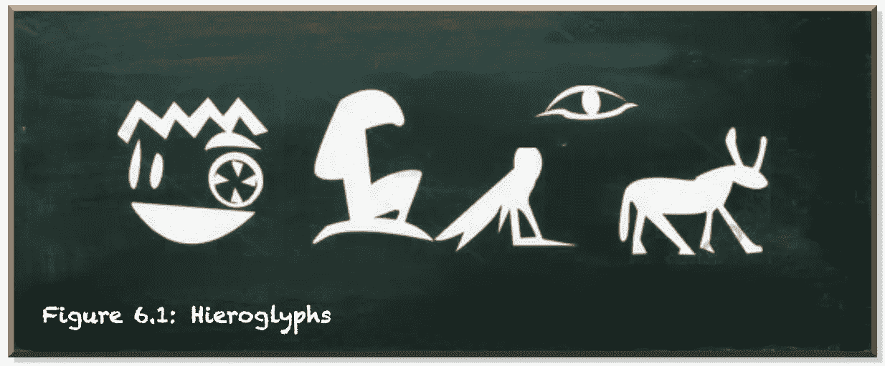
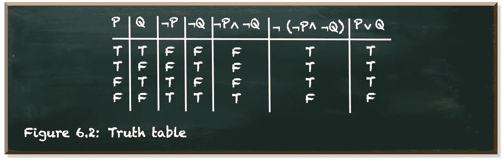
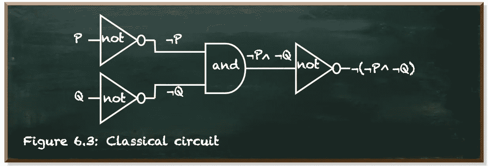
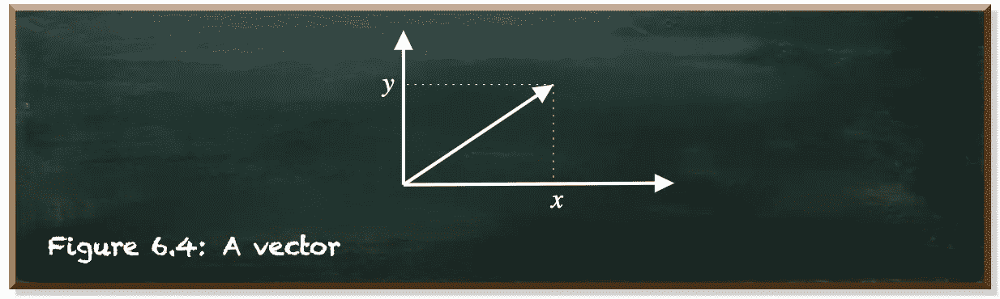
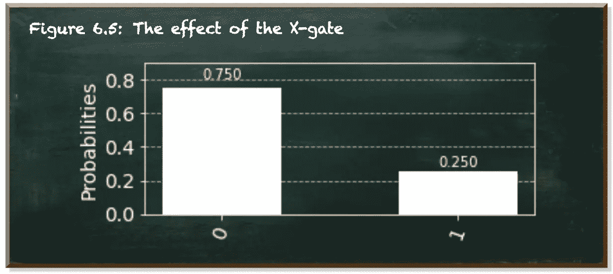
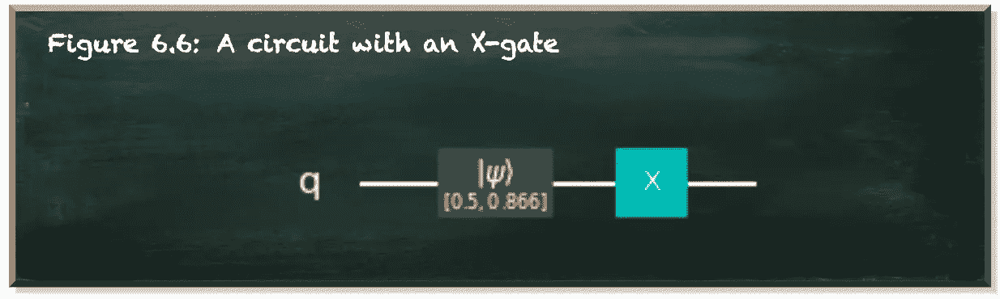
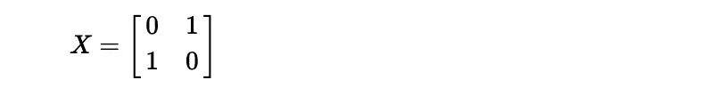
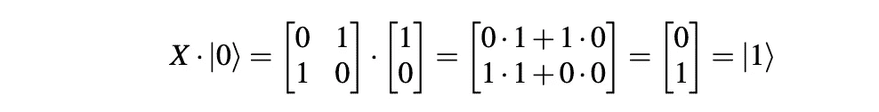
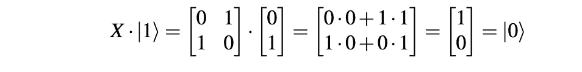
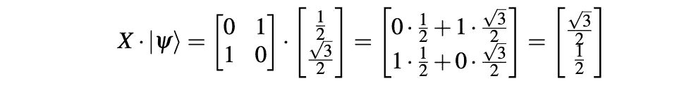

# 掌握量子计算不需要成为数学家

> 原文：<https://towardsdatascience.com/you-dont-need-to-be-a-mathematician-to-master-quantum-computing-161026af8878?source=collection_archive---------10----------------------->

## 作为程序员，你会做得很好

本文是本书的一部分: [**用 Python 实践量子机器学习**](https://www.pyqml.com/page?ref=medium_math&dest=/)

关于量子计算的科学论文和教科书充满了数学公式。甚至关于量子计算的博客帖子也充斥着数学术语。它从你遇到的第一个概念开始。量子叠加:


作为一个非数学家，这个公式可能已经太多了。如果你不熟悉使用的*狄拉克*-符号(|ψ⟩)，或者如果你不习惯使用向量，那么这样一个公式就像埃及象形文字一样好:



作者弗兰克·齐克特的图片

不要误解我。数学是描述技术概念的好方法。数学是一种简洁而精确的语言。相比之下，我们的自然语言，比如英语，既冗长又不精确。解释一小群数学公式需要一整本书的自然语言。

但是我们大多数人理解自然语言的能力远远强于数学。我们从小就学习母语，并且每天都在练习。我们甚至用我们的自然语言做梦。不过，我不知道有些人是否会做数学梦。对我们大多数人来说，数学充其量是一门外语。

当我们要学习新的东西时，如果我们使用母语，会更容易。理解这个新概念的含义已经够难的了。如果我们用外语学习，那就更难了。如果不是不可能的话。

当然，数学是量子力学和量子计算的母语，如果你愿意的话。但是为什么我们要只用量子计算自己的语言来教它呢？难道我们不应该试着用一种学习者更容易理解的方式来解释它吗？我会说“**绝对**”！

用学习者的语言教学并不意味着我们不应该看数学。我们应该！但是，当数学的精确性有助于我们解释事物如何运作时，我们就使用数学。

事实上，数学并不是我们唯一的精确语言。我们有像数学公式一样精确的语言。如今，这些语言对许多人来说几乎是自然而然的了。这些语言是编程语言。

我不是指特定编程语言的语法。相反，我指的是几乎所有编程语言共有的一种思维方式。从 Python 到 Java，从 Javascript 到 Ruby，甚至从 C 到 Cobol。所有这些语言都建立在布尔逻辑的基础上。不管使用什么编程语言，程序员都会大量使用布尔逻辑。

最突出的是布尔逻辑出现在条件语句:`if then else`。

如果在 Python 中是 else

条件语句的`if`部分是纯布尔逻辑。通常，它包含基本的布尔操作符`not`、`and`和`or`。

如果某个陈述是`True`，那么它的否定就是`False`。反之，如果一个语句是`False`，那么它的否定就是`True`。如果一个语句由两部分`P`和`Q`组成，那么如果`P`是`True`而`Q`是`True`，那么`P and Q`只是`True`。但是如果`P`或`Q`是`True`则`P or Q`是`True`。

下面是 Python 中布尔逻辑的三个例子。

Python 中的布尔逻辑

```
not P is False
P and Q is False
P or Q is True
P and not Q is True
```

虽然 Python 使用这些确切的关键字，但在数学中，符号代表这些运算符:

*   是指`not`
*   ∧表示`and`
*   ∨表示`or`

如果你不是数学家，这些符号和你在量子机器学习过程中遇到的所有其他符号可能看起来很神秘。但是，虽然用 Python 或 math 描述概念时，概念的表示可能不同，但概念本身是相同的。

理解布尔逻辑不需要成为数学家。实际上，你也不需要成为一名程序员，因为我们甚至可以通过真值表来描述布尔逻辑。

我们有两个变量，`P`和`Q`。每个变量要么为真(`T`)，要么为假(`F`)。根据它们的值的组合，我们可以推导出任何布尔语句的值。下图描述了`P`、`Q`、`not P`、`not Q`、`not P and not Q`、`not (not P and not Q)`和`P or Q`的真值表。



作者弗兰克·齐克特的图片

这个真值表揭示了`P or Q`等同于`not (not P and not Q)`。这种逻辑等价告诉我们，我们甚至不需要运算符`or`。我们可以用`not (not P and not Q)`来代替它。

但是`P or Q`简明易懂。

*“如果我们的编程语言中没有* `*or*` *运算符会怎样？*

精明的程序员会编写自己的操作符。

或的重新实现

```
P | Q | P or Q
--------------
T | T | True
T | F | True
F | T | True
F | F | False
```

这就是编程的意义所在。程序员编写产生某种行为的函数。他们使用并组合这些函数来创建更多的函数，表现出更复杂的行为。他们编写的整个程序可以归结为一组巧妙组合的函数。程序员用他们的编译器(或解释器)将高级函数翻译成非常基本的布尔逻辑。并且这种基本的布尔逻辑可以使用电气开关来执行。开关和它们的组合被称为门。当我们连接门时，它们形成一个电路。

在不连续的时间间隔内，计算机通过电路发送一个电脉冲。如果我们在适当的时间接收到一个电脉冲，我们将其解释为`1`(真)。如果我们没有接收到脉冲，我们将其解释为`0`(假)。

尽管有这个名字，电路并不是循环的。它们是线性的，从左向右读取。让我们来看一个例子，它对应于我们之前看到的布尔函数

下图描绘了`not (not P and not Q)`的电路图。该电路从左侧接收输入，并将其输出到右侧。



作者弗兰克·齐克特的图片

这种门和电路是任何现代计算机的组成部分。这包括量子计算机。虽然量子力学的世界不同，但量子计算的世界惊人地相似。

不要让你自己被所有的数学公式弄得眼花缭乱。它们是概念的代表。不多也不少。

让我们回到我们的介绍性公式:


这是量子态|ψ⟩(“psi”)的数学符号。虽然经典比特的状态是布尔型的(或者`0`表示假，或者`1`表示真)，但是量子比特(量子比特)的状态是由α和β加权的量子态|0⟩和|1⟩的叠加。

在这种叠加态下，量子系统既不是`0`也不是`1`，除非你去测量。只有当你测量量子位时，状态才会坍缩到`0`或`1`。两个权重(α^2)和(β^2)的平方表示测量`0`或`1`的概率。α越大，测量到`0`的概率越高。相应地，β越大，测量到`1`的概率越高。

这个公式说明了更多的东西。它说量子态是两个重量[α β]的矢量。

矢量是一个有大小和方向的地理对象。如果在坐标系中绘制，向量从中心开始，到向量中数字指定的点结束。



作者弗兰克·齐克特的图片

在 Python 中，向量是一个数组。因此，一个量子位的状态就是数组`[alpha, beta]`。并且，`alpha`和`beta`是数值变量。量子态是两个数的数组。

但是由两个数字组成的数组是比布尔值更复杂的数据类型。布尔值为`True`或`False`。您可以用简单的运算符转换布尔值，例如`not`、`and`和`or`。您可以推理真值表中布尔值的转换。

但是你如何转换两个数字的数组呢？你如何解释这种转变？

显而易见的答案是数学。但这不是唯一可能的答案。让我们用 Python 来做吧。

反转量子位状态

```
----------- Reversed states: ----------
psi: [0.50, 0.87]  result: [0.87, 0.50]
|0>: [1.00, 0.00]  result: [0.00, 1.00]
|1>: [0.00, 1.00]  result: [1.00, 0.00]
```

我们从三个状态的初始化开始。每个状态都是由两个数字组成的数组。状态`psi`的值为 1/2 和√3/2(第 4 行)。在这种状态下测量`0`的概率是(1/2)^2=1/4=0.25.测量的概率`1`是(√3/2)^2=3/4=0.75.

状态`always_0`具有值`1`和`0`。在这种状态下测量`0`的概率是 1^2=1(第 5 行)。测量的概率`1`是 0^2=0.当我们在这种状态下测量一个量子比特时，我们总是测量为`0`。状态`always_1`是各自的对立面。我们一直测量为`1`(第 6 行)。

接下来，我们创建一个便利函数`transform`(第 8-9 行)。我告诉过你编写函数使事情变得简单是编程的全部内容吗？这是一个例子。该函数采用量子态的名称(要显示的任意字符串)、`state`和函数`f`。`transform`将初始状态和应用`f`功能后的状态打印到控制台。

最后，我们创建一个函数`reverse_state`，我们可以将它输入到`transform`(第 11-12 行)。`reverse_state`调用 Python 默认的`reversed`函数，以相反的顺序返回相同长度的数组。

在输出中，我们可以看到状态数组中的数字交换了位置。这样，测量`0`或`1`的概率分别切换。反转的`psi`有`0.75`机会测量`0`和`0.25`机会测量`1`。反转后的`always_0`与原来的`always_1`相似。

这只是三种可能的状态。在一种真值表中列出所有可能的状态是不可能的。但是我认为`reverse_state`函数的行为非常清楚。这是量子计算中 X 门的行为。这是量子态的基本变换之一。

让我们在实践中看看这个门。我们用的是 IBM 的量子计算 SDK *Qiskit* 。

测量的量子位



作者弗兰克·齐克特的图片

*Qiskit* 的基本单元是量子电路。量子电路是量子计算的模型。这个项目，如果你愿意的话。我们的电路由一个量子位组成(第 5 行)。

我们用状态`psi`(第 8 行)初始化我们的量子位，并对其应用 X-gate(第 11 行)。

*Qiskit* 提供了`Aer`包(我们在第 1 行导入的包)。它为模拟量子电路提供了不同的后端。最常见的后端是`statevector_simulator`(第 14 行)。

`execute`-函数(也是我们在第 1 行导入的)以指定的`backend`运行我们的量子电路(`qc`)。它返回一个`job`-对象，该对象有一个有用的方法`job.result()`(第 17 行)。一旦我们的程序完成它，就会返回`result`对象。

Qiskit 使用 Matplotlib 来提供有用的可视化。简单的直方图就可以了。`result`对象提供了`get_counts`方法来获取被执行电路的直方图数据(第 18 行)。

方法`plot_histogram`返回一个 Jupyter 自动绘制的 *Matplotlib* 图形(第 19 行)。

我们看到我们有 75%的机会观察到值`0`，有 25%的机会观察到值`1`。与初始状态完全相反。

你可以用不同的初始状态运行电路来更好的感受这个门。

一般来说，量子电路与经典电路并无不同。我们可以用图表来表示它们。 *Qiskit* 的`QuantumCircuit`类为我们提供了完成这项工作的`draw`方法。

```
qc.draw('mpl')
```



作者弗兰克·齐克特的图片

我们可以看到我们唯一的量子位(`q`)，它与数组`[0.5, 0.866]`的初始化，以及应用的 X 门。

即使不是数学家，你也已经完成了掌握量子计算的第一步。从概念上理解量子门是经典电路门的量子对等物并不依赖于数学。简单英语和一点点 Python 的结合非常合适。对许多人来说，这种结合更容易实现。

但是，数学仍然是量子计算的重中之重。如果你想对概念有更深的理解，你迟早会遇到数学公式。正如我所说，数学是描述技术概念的一个很好的方式。

让我们来看看 X-gate 的底层数学。别担心，我不指望你成为数学家。尽管如此，对代数(即对数学符号和操作它们的规则的研究)的一点喜爱并没有坏处。

到目前为止，我们使用的是 Python 的内置函数`reversed`。虽然这很方便，但我们看不出它在内部是如何工作的。让我们使用另一个函数。一个自制函数。

自制反向功能

```
reversed psi: [0.87, 0.50]
```

我们定义一个函数`adjust_weight`(第 1 行)。它需要一个量子`state`和`weights`。两者都是包含两项的数组。它将位置`0`处的值和位置`1`处的值相乘。它返回这两个乘积的和(第 2 行)。

我们可以用这个功能来反转`psi`。对于返回单个数字的`adjust_weight`,我们调用它两次来获得两个项目的数组(第 5 行和第 6 行)。在本例中，我们没有显式创建数组，而是直接将这些值打印到控制台(第 4 行)。

在这两个调用中，我们提供原始的`psi`作为`state`参数。在第一次调用中，其结果是反向 psi 的第一个数字，我们提供`[0,1]`作为`weights`。这意味着，我们得到了`0`乘以第一个数字`psi`和`1`乘以第二个数字`psi`的和。这个和是原`psi`的第二个数。

在第二个调用中，其结果是反向 psi 的第二个数字，我们提供`[1,0]`作为`weights`。这是第一个数字`psi`的`1`倍和第二个数字`psi`的`0`倍。这等于原`psi`的第一个数字。

有了这些权重，我们有效地交换了`psi`的数字位置。

在数学中，这是一个矩阵乘法。矩阵 *M* 和向量 *υ* 相乘的一般公式为:


*a* 和 *b* 是我们用来计算结果向量第一个数的权重。 *c* 和 *d* 分别是第二个数字的权重。

数学上，X 门量子算符是矩阵:



让我们将该操作符应用于我们的三个示例性状态:

逆转|0⟩在|1⟩:的结果



逆转|1⟩在|0⟩:的结果



并且，在|ψ⟩应用矩阵也会导致它的反转:



在经典计算中，我们有一小组布尔运算符，它们的行为可以很容易地用真值表来表示。但是在量子计算中，矩阵表示称为门的操作符。我们可以应用无数种可能的矩阵。数学是描述这些运算符的简洁而精确的方法。但是你不需要成为数学家来使用这些运算。

当然，在应用时，最好能理解门的基本数学原理。但更重要的是，你需要了解大门是做什么的。如果你知道 X-gate 是做什么的，你就不需要一直应付数学。

本帖是本书的一部分: [**用 Python 动手做量子机器学习**](https://www.pyqml.com/page?ref=medium_math&dest=/) **。**


在这里免费获得前三章。