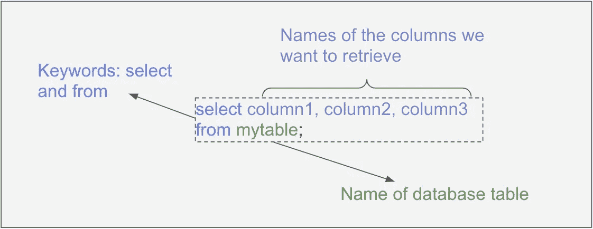

# 你知道 Excel。该学 SQL 了。

> 原文：<https://towardsdatascience.com/you-know-excel-time-to-learn-sql-e77a2b5c8fbb?source=collection_archive---------6----------------------->


奥琳卡·谢尔坚科摄于[佩克斯](https://www.pexels.com/photo/top-view-photo-of-white-keyboard-1772123/?utm_content=attributionCopyText&utm_medium=referral&utm_source=pexels)

## 9 个核心 excel 功能转化为 SQL

随着世界变得越来越由数据驱动，越来越多的专业人士正在更密切地与数据打交道。

在许多情况下，对这个领域的第一次介绍来自 Microsoft Excel 的永恒形式。Vlookups、数据透视表、sumifs 也许给喜欢冒险的人来点 VBA。

但是，就像初露头角的数据分析师、爱好者和探索者开始了解 excel 的神奇和优点一样，他们也开始努力克服它的局限性。

如果你遇到过类似*“正在计算:(4 个处理器))”*的消息，你可能知道我的意思。对于大型数据集，Excel 会变得相当慢。

Excel 还带来了难以避免的再现性问题，即使对于最细心的用户来说也是如此。这个过程听起来可能很熟悉:接收数据→做一些操作(vlookup、filter、pivot 等。)→接收需要相同处理的更新数据。冲洗，重复。多痛苦啊。

数据库技术有助于减轻这些缺点，因为它将数据从查询和操作中分离出来:


作者创建的图像。由[像素完美制作的图标](https://www.flaticon.com/authors/pixel-perfect)来自[www.flaticon.com](http://www.flaticon.com/)

SQL 是用于与数据库通信的主要语言，在熟悉 excel 之后学习它是一项很好的技能。

在这篇文章中，我将把一些主要的 excel 用例及函数翻译成 SQL，以帮助学习过程变得更加容易和有形。

# 1.挑选

**在 excel 中:**如前所述，数据存储和操作发生在 Excel 的同一个地方。因此，选择数据就像突出显示我们想要的单元格一样简单。

**在 SQL 中:**我们编写一个查询来从数据库表中“选择”数据。每个表格就像 excel 中的一个数据块，它包含行、列和数据单元格。

对于一个基本的 select 查询，我们需要指定要查询的表的名称和要从该表返回的列的名称。



在 SQL 中，星号表示“所有列”所以我们也可以运行:

```
select * from mytable;
```

如果我们大声读出来，我们会说“从我的表中选择恒星”。

# 2.过滤器

**在 Excel 中**:我们可以通过选择数据功能区中的过滤器图标，然后使用每列旁边的下拉菜单来过滤数据中的行。

**在 SQL:** 中，我们在查询中添加了一个“where 子句”，并指定了一个我们想要应用的条件:


与 excel 类似，我们有几个过滤条件选项:

**过滤到特定值:**

```
select * from mytable where **column1 = 10**;
```

**用算术运算符过滤:**

```
select * from mytable where **column1 < 10**;
```

**用“in”运算符过滤:**

```
select * from mytable where **column1 in (1,2,3)**;
```

**多条件过滤:**

```
select * from mytable where **column1 > 2 or column2 = "APPROVED";**
```

我们还可以使用“与/或”逻辑将多个条件嵌套在一起。我们只需要确保遵循[操作符优先级](https://docs.microsoft.com/en-us/sql/t-sql/language-elements/operator-precedence-transact-sql?view=sql-server-ver15)并在必要的地方使用括号。

# 3.分类

**在 Excel 中:**我们使用数据功能区中的排序图标来应用排序条件。

**在 SQL 中:**我们在查询中添加了一个“order by”子句，以便按照我们期望的排序顺序返回数据:


请注意，我们可以按照提供的顺序对多个列进行排序。

默认情况下，列按*升序排序(最小值优先)。为了改变这一点，我们可以在想要降序排序的每一列后面添加“desc”关键字。*

# *4.条件句(If 语句)*

***在 Excel 中:**我们使用一个“if 语句”。如果我们需要一组以上的条件，我们使用“嵌套 If 语句”*

*在 SQL 中:我们使用一个“case when”语句。*

*下面是基本语法:*

**

*每个“when/then”对指定一个条件和一个条件为真时返回的值。然后我们添加一个可选的“else”语句来捕捉任何遗漏的条件。最后，我们将结果列命名为。*

*这比 Excel 可读性强得多，Excel 需要大量的嵌套括号来创建复杂的条件。*

# *5.删除重复项*

***在 Excel 中:**我们选择数据功能区下的“删除重复”选项。然后从工作表中删除重复的值。*

***在 SQL 中:**我们在 select 语句中使用“distinct”关键字:*

```
*select distinct column1, column2 from mytable;*
```

*上面的查询将返回 column1 和 column2 的所有唯一组合，而不更改基础数据。*

# *6.Vlookup /索引匹配*

***在 Excel 中:** Vlookup 和 Index + Match 是将一个数据表中的数据合并到另一个数据表中的两种方法。*

***在 SQL 中:**我们利用了所谓的“连接”——一种基于公共数据点将两个表中的数据组合起来的方法。*

*下面是基本语法:*

**

*该连接有三个主要部分。*

***首先**，我们指定要从每个表中返回哪些列。为了表明我们希望每一列来自哪个表，我们使用以下约定:表名+句点+列名。*

***第二个**，我们指定想要使用的两个表和连接类型。我不会详细介绍不同类型的连接，但如果您想了解更多信息，我建议查看我的连接数据指南(如下)。*

***第三，**我们指出我们想要“连接”的列(两个表之间有共性的数据点)。这就像你传递给 Vlookup 的第一个参数。*

*[](/a-beginners-guide-to-joining-data-935c8e579fb7) [## 连接数据的初学者指南

### 左接合。内部联接。外部联接。啊？

towardsdatascience.com](/a-beginners-guide-to-joining-data-935c8e579fb7) 

# 7.聚合(总和、计数、平均值等。)

**在 Excel 中:**我们将函数添加到一个空单元格中，然后传入我们想要聚合的单元格范围。

**在 SQL** 中:我们拥有与 excel 相似的聚合函数。我们将列名传递给这些函数，并在 select 子句中调用它们:

```
select sum(column1), count(column2), avg(column3) from mytable;
```

有多种功能可供我们执行，其中许多功能与 excel 重叠。

# 8.条件聚合(sumif、countif、averageif)

**在 Excel 中:**像“sumif”这样的条件聚合函数允许我们仅对指定条件为真的行执行聚合。

**在 SQL 中:**我们可以在聚合函数中嵌套一个“case when”。

例如:

```
select sum(case when column1 > 10 then column2 else 0 end) 
from mytable1;
```

在这段代码中，首先执行“case when ”,只有当 column1 大于 10 时才返回 column2。然后我们对结果值求和。如果列 1 > 10，这与对列 2 求和是一样的。

也有一些 SQL 版本允许以下语法:

```
select sum(column2) filter (where column1 > 10)
from mytable1;
```

# 9.数据透视表

**在 Excel 中**:我们可以使用透视表进行多维度的聚合。

**在 SQL** 中:我们使用一个“groupby”语句。

“groupby”将我们的数据分成不同的组，然后对每个组进行聚合。

例如:


这与将“列 1”和“列 2”添加到数据透视表的行部分，然后对不包含任何缺失值的列进行计数是一样的。

Excel 数据透视表也有一个“列”部分。为了在 SQL 中复制这一点，我们可以在 groupby 中使用条件聚合:

```
select column1, 
count(case when column2 = “group1” then column2 end) as group1count,
count(case when column2 = “group2” then column2 end) as group2count
from mytable1
group by 1;
```

# 结束语

一开始，从电子表格应用程序过渡到“编写代码”会让人感到畏惧。但是如果你有处理数据的经验，那么 SQL 实际上并不比 excel 难，只是有一点不同。

最好的学习方法是获取一些数据并开始练习。编码快乐！

***P.S. →如果你想了解更多关于 SQL、Python、数据科学的知识，订阅我的*** [***免费邮件列表***](https://subscribe.to/everythingdata) ***！****