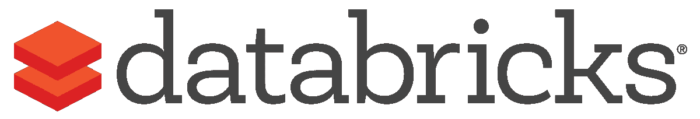
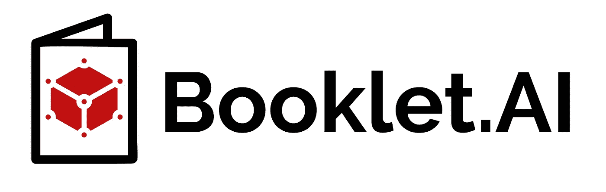

# 你可能不需要气流…然而

> 原文：<https://towardsdatascience.com/you-may-not-need-airflow-yet-a95fec16f07?source=collection_archive---------10----------------------->

TL；DR:气流强劲而灵活，但是很复杂。如果您刚刚开始计划数据任务，您可能希望尝试更定制的解决方案:

*   将数据移入仓库:[缝合](https://www.stitchdata.com/)
*   仓库内的数据转换: [DBT](https://www.getdbt.com/)
*   调度 Python 脚本:[数据块](https://databricks.com/)
*   批量评分 ML 车型: [Booklet.ai](https://booklet.ai/)

使用 4 种不同的服务怎么可能比只使用一种更容易？

[Apache Airflow](https://airflow.apache.org/) 是数据团队最流行的工作流管理工具之一。全世界有数百家公司用它来安排各种工作。这是一个完全免费的开源项目，通过 python 构建的基础设施提供了惊人的灵活性。

[阿帕奇气流](https://airflow.apache.org/)

我使用过(有时设置过)各种规模的 Airflow 实例:从优步定制的[基于 Airflow 的 Piper](/managing-data-science-workflows-the-uber-way-3d265b4c1264) 到侧面项目的[小型实例](/secure-your-data-tool-part-1-2-1585029d59e9)，有一个共同的主题:项目变得复杂、快速！Airflow 需要以一种稳定的和生产就绪的方式部署，所有任务都是在 Python 中[自定义的](https://airflow.apache.org/docs/stable/concepts.html)，并且在构建任务时有许多[注意事项](https://medium.com/datareply/airflow-lesser-known-tips-tricks-and-best-practises-cf4d4a90f8f)要记住。对于一个不太懂技术的用户来说，仅仅是为了安排一些简单的任务，Airflow 就可能是一个压倒性的系统。

尽管使用一个工具来满足所有不同的计划需求可能很诱人，但这并不总是您的最佳选择。每次出现新的用例时，您最终都会构建定制的解决方案。相反，你应该为你要完成的工作使用最好的工具。在每个用例的设置和维护过程中节省的时间非常值得为您的数据堆栈添加一些工具。

[Imgflip](https://imgflip.com/i/3upiyq)

在这篇文章中，我将概述气流的几个用例以及每个用例的替代方案。

*声明:本人是*[*booklet . ai*](https://booklet.ai)*创始人之一。*

# 从源提取原始数据到数据仓库

数据团队需要一些东西来完成他们的工作…数据！很多时候，这些不同来源的数据有多个不同的内部和外部来源。要将所有这些数据集中到一个地方，团队需要从所有这些来源提取这些数据，并将它们插入一个位置。这通常是某种数据仓库。

[缝合](https://www.stitchdata.com/)

**缝合**

对于这一步，全球有许多可靠的工具正在使用。他们定期从一组给定的系统中提取数据，并将结果直接发送到数据仓库。这些系统处理大多数错误，并保持事情顺利运行。管理多个复杂的集成可能会成为维护的噩梦，因此这些工具可以节省大量时间。幸运的是，有一个避免噩梦的选择:

[Stitch](https://www.stitchdata.com/) coins 将自己定位为“一个云优先、开源的快速移动数据平台。”您可以快速连接到数据库和第三方工具，并将数据发送到多个不同的数据仓库。最好的部分:前 500 万行是免费的！Stitch 也可以用几个[开源框架](https://www.stitchdata.com/platform/extensibility/)来扩展。

# 在数据仓库中转换数据

一旦数据被加载到数据仓库中，它通常是一团乱麻！每个数据源都有不同的结构，每个数据集都可能用不同的标识符以不同的方式编制索引。为了理解这种混乱，团队需要将所有这些数据转换和连接成一种更好、更简洁、更易于使用的形式。大多数逻辑将直接发生在数据仓库中。

[DBT](https://www.getdbt.com/)

**DBT**

将所有这些数据集组合成一种企业可以实际使用的形式的过程可能是一项单调乏味的任务。它已经成为一个如此复杂的领域，以至于[分析工程师](https://blog.getdbt.com/what-is-an-analytics-engineer/)的特殊角色已经从中脱颖而出。这些是整个行业中常见的一系列问题，现在已经出现了一种工具来专门解决这些问题:

[DBT](https://www.getdbt.com/) 认为自己是“你的整个分析工程工作流程”,我同意。只需了解 SQL，您就可以快速构建将被完全管理的多个复杂的数据转换作业层。版本控制、测试、文档等等都是为你管理的！[云托管版本](https://www.getdbt.com/pricing/)免费使用。

# 在数据仓库之外转换数据

有时团队还需要在数据仓库之外转换数据。转换逻辑不能完全在 SQL 内操作怎么办？如果团队需要训练一个机器学习模型怎么办？这些任务可能直接从数据仓库中提取数据，但是实际的任务需要在不同的系统中运行，比如 python。

[数据砖块](https://databricks.com/)

**数据块**

大多数基于 python 的定制脚本通常从 Jupyter 笔记本开始。您导入一些包，导入或提取数据，运行一些函数，最后将数据推到其他地方。有时需要更复杂的生产规模的流程，但这种情况很少见。如果您只需要一种简单的方式来运行和安排 python 笔记本，有一个很好的选择:

[Databricks](https://databricks.com/) 由 Spark 最初的创始人创建。它的主要出名之处是非常容易地旋转火花簇，但它也有很好的笔记本功能。他们提供易于使用的 Python 笔记本，你可以像谷歌文档一样在笔记本中进行协作。一旦开发出适合您的脚本，您就可以安排该笔记本完全在平台内运行。这是一个很好的方法，不用担心代码在哪里运行，并且有一个简单的方法来调度这些任务。他们有一个免费的社区版。

# 批量评分机器学习模型

如果团队已经建立了一个机器学习模型，该模型的结果应该被发送到一个可以实际帮助业务的地方。这些任务通常涉及连接到现有的机器学习模型，然后将该模型的结果发送到另一个工具，如销售或营销工具。要让一个系统启动并运行，并在正确的时间推出正确的模型结果，这可能是一项极其乏味的任务。

[Booklet.ai](https://booklet.ai/)

[**Booklet.ai**](https://booklet.ai)

建立一个机器学习模型已经够难的了，不应该再花 2 个月的时间来定制编码，以将该模型连接到企业可以从中发现价值的地方。这项工作通常需要与第三方系统进行痛苦的集成，更不用说所需的生产级基础设施工作了！幸运的是，有一个解决方案可以为您处理这些任务:

[Booklet.ai](https://booklet.ai/) 连接到现有的 ML 模型，然后允许您快速设置一些东西:一个与非技术用户共享模型的演示，一个简单的 API 端点连接，以及一组连接输入和输出的集成。您可以轻松地从数据仓库设置一个输入查询来对模型进行评分，然后将这些结果发送到您的业务伙伴可能会使用的各种工具。**您可以查看将结果发送到对讲机** **的** [**领先评分模型的演示。**](https://app.booklet.ai/model/lead-scoring) [**您可以请求访问 Booklet.ai beta**](https://booklet.ai) **，在那里您的第一个模型将是免费的。**

照片由[迈克·本纳](https://unsplash.com/@mbenna?utm_source=medium&utm_medium=referral)在 [Unsplash](https://unsplash.com?utm_source=medium&utm_medium=referral) 上拍摄