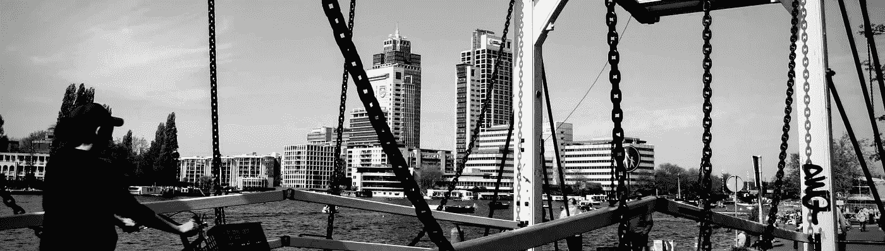
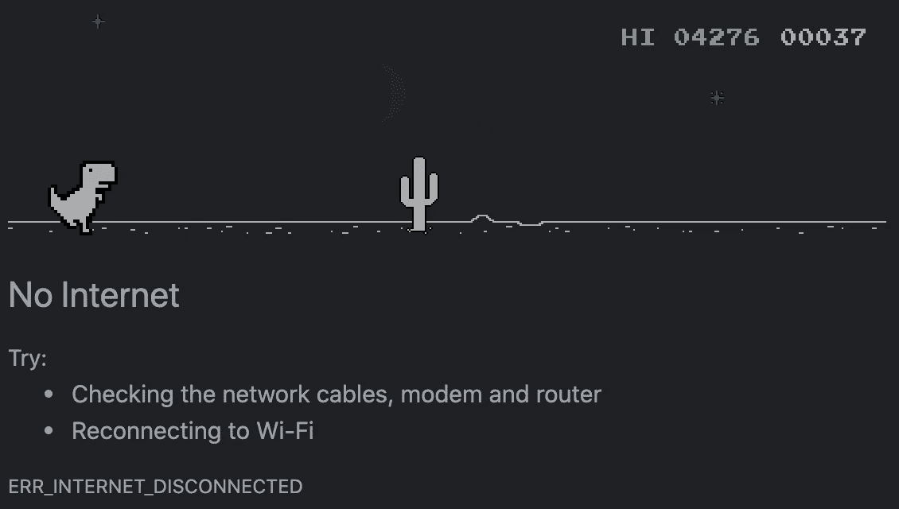
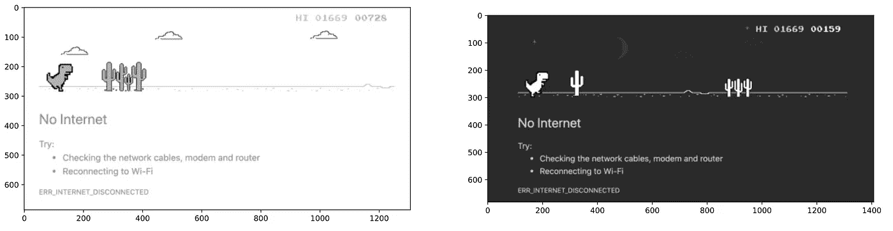
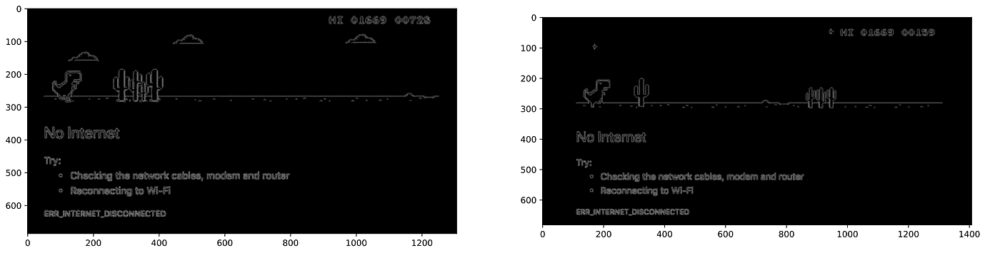
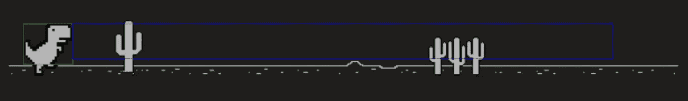
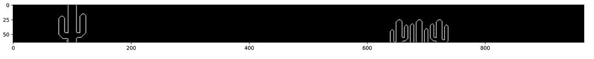
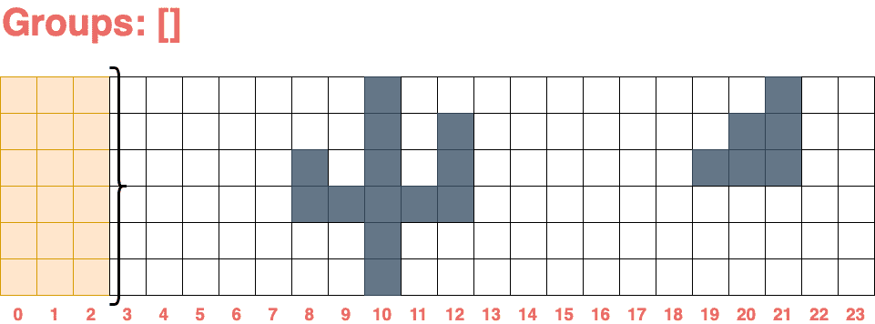

# 玩电脑视觉永远不会无聊

> 原文：<https://towardsdatascience.com/you-never-get-bored-playing-with-computer-vision-cb93cbd3274a?source=collection_archive---------42----------------------->

## *…以及如何让 Dino 独立运行而不考虑平台*

在本文中，您将学习如何使用 Python 和 MSS 以合适的帧速率录制屏幕。如何用 OpenCV 进行模板匹配和边缘检测？如果你愿意，你可以让你的机器玩游戏。



来源:作者

# 介绍

我喜欢自动化，有一次我读了由[马库斯·雷内·Pae](https://medium.com/@markusrenepae)写的关于另一个 python 库 [PyAutoGUI](https://pyautogui.readthedocs.io/en/latest/) 的[评论](https://medium.com/datadriveninvestor/automating-your-job-with-python-f1952b6b640d)。这个库允许你通过操作系统输入来操作，比如发出鼠标或键盘事件。Markus 提出的挑战之一是自动化 Google Dino 游戏。我很好奇 PyAutoGUI 是否允许我实时捕捉监视器，找到恐龙，并在需要时进行跳跃？我决定尝试一下，不要拘泥于浏览器实现，所以 Dino 应该运行，不管它是浏览器还是独立的应用程序。在本文的后面，您将发现 PyAutoGUI 在哪些任务中工作得很好，在哪些任务中最好使用其他技术。

## 我最后用了哪些库来让 Dino 单独运行

*   [PyAutoGUI](https://pyautogui.readthedocs.io/en/latest/)
*   [OpenCV](https://opencv.org)
*   [Python MSS](https://python-mss.readthedocs.io) (多个截图)
*   当然还有 [NumPy](https://numpy.org) 、 [Matplotlib](https://matplotlib.org) 和 [Jupyter](https://jupyter.org)

## 简而言之什么是 CV(计算机视觉)和 OpenCV

如今，计算机视觉是一个非常热门的话题。它被用在许多地方，在这些地方，图像或视频应该被处理以备将来使用。例如 Face ID:在了解这是你之前，首先它试图检测一张脸，然后处理图片并要求 ML(机器学习)模型来分类这是不是你。*可能是其他人正在尝试解锁您的手机。*目前最流行的 CV 库之一是 [OpenCV](https://opencv.org) 。根据官方网站:*该库拥有超过 2500 种优化算法，其中包括一套全面的经典和最先进的计算机视觉和机器学习算法*。OpenCV 是用 C++写的，可以在所有平台上使用，使用 C++、Python 等写的 API。如果你有一个遵循 [CUDA](https://opencv.org/platforms/cuda/) 或 [OpenCL](https://opencv.org/opencl/) 标准的 GPU，它会加速你的 GPU 上的计算。

## 我用 PyAutoGUI 实现游戏自动化的尝试



没有互联网连接的 Chrome 浏览器截图

首先，我实现了一个游戏循环，并试图只使用 PyAutoGUI 来捕捉屏幕，匹配一个模板(在我的情况下，它是一个恐龙),从技术上来说，这是可行的，但是……PyAutoGUI 中的截图并不是为了实时捕捉。所以我得到了两帧之间大约一秒的延迟。因为 Dino 运行速度超过每秒 400 像素，所以太多了。当我的程序按下“跳转”键时，游戏就结束了。我决定指定每次捕获哪个区域来减少延迟，得到的延迟大约是 0.4 秒。更好，但仍然不够。我明白我需要一些别的东西来执行物体检测，所有的计算都应该以至少 30 帧/秒的速度进行。这意味着我需要在 0.03 秒内完成我的计算和所有的副作用。

## MSS 跳入游戏

一、什么是 MSS？
根据 docs MSS 是*一个使用 ctypes 的纯 python 中的超快速跨平台多截图模块。*该 API 易于使用，已经集成了 Numpy 和 OpenCV。我为什么选择 MSS？基本上，如果你想捕捉整个屏幕，MSS 会做得很快，比其他库快得多。如果你需要把你的屏幕投射到某个地方，我会选择这个库。

在尝试了不同的可以提供截图功能的库之后，我了解到它们中的大多数都使用了相同的方法。每次抓取屏幕时，都会重新建立与屏幕资源的“连接”。到目前为止，我没有深入研究这一部分，我只能说我们在重建上花了太多时间。同时，MSS 针对任何操作系统进行了优化。当你抓取一个屏幕时，它使用 XGetImage 方法从已经创建的“连接”到你的屏幕资源*。*这意味着，你可以用`with`语句初始化 MSS 实例，让你的游戏在那里循环，你会得到更好的性能。

```
with mss.mss() as sct:
  while True:
    screen = sct.grab(monitor)
    process_image(screen)
    if trigger_to_leave:
      break
```

是的，就这么简单。这样你抓取一个屏幕的速度可以提高几百倍。在这里，我实现了以 100 帧/秒的速度获取截图，我甚至添加了一个睡眠来减少多余的计算。接下来，我们需要处理图像，分析所有块，并在需要时“跳转”。
我把这个分成两部分:

1.  在屏幕上找到一只恐龙，并探测一个有“障碍物”的区域
2.  使用上一步得到的区域，循环抓取，计算到障碍物的距离，并计算速度。

让我们回顾一下这些步骤。

## 在屏幕上找到一只恐龙，并探测一个有“障碍物”的区域

这一部分在我的 GitHub 上的一个 Jupyter 笔记本中进行了可视化的呈现:[https://GitHub . com/dper Yel/run-dino-run/blob/master/search . ipynb](https://github.com/dperyel/run-dino-run/blob/master/search.ipynb)

此时我广泛使用 OpenCV 进行图像处理、模板匹配、边缘检测。首先，我消除了图像中的颜色通道，并且通过用`cv2.cvtColot(img, cv2.COLOR_BRG2GRAY)`变换图像只使用了一个通道。然后我需要消除白天和黑夜的区别。



白天从左边，夜晚从右边

对此我们能做些什么？事实上，有许多方法可以接近，我决定使用一个 [Canny 算法](https://opencv-python-tutroals.readthedocs.io/en/latest/py_tutorials/py_imgproc/py_canny/py_canny.html)来检测边缘，并使用最大和最小阈值的极值。它让我在白天和晚上都能得到几乎相同的画面。



白天从左边，夜晚从右边

当然，如果一幅图像有很多噪声，我需要先模糊它，但在这种特殊情况下，只需找到边缘就足够了。而且我擅长用[模板匹配](https://opencv-python-tutroals.readthedocs.io/en/latest/py_tutorials/py_imgproc/py_template_matching/py_template_matching.html)来找迪诺。唯一的事情是模板不会在比赛中缩放。我们的恐龙模板应该取自游戏将要运行的屏幕。或者您可以扩展此功能，并使用模板缩放来执行模板匹配。

通过使用`cv2.matchTemplate`我得到了匹配的位置。最初你会得到一堆位置，因为当 OpenCV 在源图像上滑动模板时，它会比较这个区域，然后你会得到一个匹配的值。匹配值表示像素匹配的精确程度。在我的例子中，我只寻找 1 个恐龙，这意味着我可以取最高值，并使用映射到该值的位置。

```
match_res = cv2.matchTemplate(canny_night, dino_bordered_template, cv2.TM_CCOEFF_NORMED)
_, max_val, _, max_loc = cv2.minMaxLoc(match_res)
```

我的 max_val 平均为 0.81，这意味着我的模板在图像上的匹配率为 81%。好到可以继续。

知道了恐龙的位置，我们就可以突出显示障碍物出现的区域。我选择没有其他噪音只有障碍物可见的部分。需要对仙人掌和鸟类等障碍物进行分组。



蓝色矩形代表我需要在每一帧上查看的区域



需要关注的区域。用边缘检测对图像进行后处理。

要进行分组并不太难，因为本质上，我有一个矩阵(图像)，其中每个单元有两个值`0`或`255`，有点不规范的二进制矩阵。我需要从左边找到至少有一个像素值为`255`的组的位置。为此，我通过 X 轴在画布上迭代，步长定义了“障碍物”之间的最小距离。每个组代表一个元组，该元组具有距组左侧的位置和宽度。当我找到所有组时，我从左边修剪结果以知道“障碍”的确切边缘。这是简化光流的未来部分所需要的。还值得一提的是，因为步长值是常数，这种方法的复杂性是线性的`O(n+k)`，其中`n`是画布的宽度，`k`是“障碍”的数量。这还不算太糟糕，因为我需要对每一帧进行计算，并且关心这里的性能。下面你可以看到分组是如何工作的。



“障碍”如何分组的可视化表示。来源:作者

现在我有一切可以切换到下一步。

## 通过速度计算使恐龙奔跑和跳跃

找到恐龙并开始游戏循环的运行脚本位于下一个文件:[https://github.com/dperyel/run-dino-run/blob/master/run.py](https://github.com/dperyel/run-dino-run/blob/master/run.py)

好的，我要说最复杂的部分已经在第一部分完成了。现在我们至少知道了到第一个“障碍”的距离，如果“危险”物体太近，可以使用`pyautogui.press('space')`。问题是游戏改变了速度。迪诺越跑越快。我的第一个想法是使用光流和 [Lucas-Kanade 算法](https://opencv-python-tutroals.readthedocs.io/en/latest/py_tutorials/py_video/py_lucas_kanade/py_lucas_kanade.html#lucas-kanade-optical-flow-in-opencv)来比较前一帧和当前帧。当我得到像素偏差时，我可以计算速度。它会工作，唯一的事情是我已经有我需要的一切。我的“障碍”组代表了我需要注意的特征，我可以存储前一帧的状态以找到我需要的偏差。 ***当我避免使用复杂的算法时，我总是感到轻松，并通过做几个“加和减”*** (-:

通过知道一个速度，找到一个依赖关系是一个数学(或时间)问题，这个依赖关系是你需要从一个“障碍”的距离来触发一个“跳跃”。这是一个结果。

结果，迪诺没日没夜地跑，如果有仙人掌或鸟靠近，它就会跳起来。来源:作者

## 结论

计算机视觉是许多自动化过程的重要组成部分。正如你在这个小例子中看到的，你甚至可以通过让一台机器找到敏感部分来对一个游戏进行完整的端到端测试。

尝试不同的库来比较性能是一个好主意。在我的例子中，当 PyAutoGUI 仍然用于其他副作用时，MSS 在屏幕捕捉方面是绝对的赢家。

**附言:**所有源码都放在我的 GitHub 上[https://github.com/dperyel/run-dino-run](https://github.com/dperyel/run-dino-run)
回购使用 git LFS 存储所有二进制文件。为了让脚本工作，你需要从你的显示器上截取一个`assets/dino_crop.png`的截图，或者做一个模板缩放(-；
代码可能包含 bug，因为它主要是像概念验证一样完成的。
欢迎在下面评论或提问。