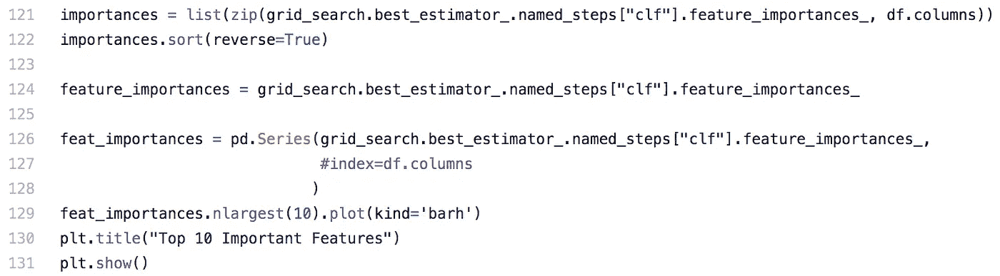

# 你应该成为一名数据科学家。原因如下。

> 原文：<https://towardsdatascience.com/you-should-become-a-data-scientist-heres-why-dbc07c80ebaa?source=collection_archive---------31----------------------->

## 意见

## 在不断变化的市场中成为数据科学家的理由


照片由 [ThisisEngineering RAEng](https://unsplash.com/@thisisengineering?utm_source=unsplash&utm_medium=referral&utm_content=creditCopyText) 在[un splash](https://unsplash.com/s/photos/person-coding?utm_source=unsplash&utm_medium=referral&utm_content=creditCopyText)【1】上拍摄。

# 目录

1.  介绍
2.  数据科学家
3.  论证
4.  摘要
5.  参考

# 介绍

在过去的 10 年里，数据科学已经成为就业市场的领跑者。尽管一些文章旨在将数据科学视为不再投资的职业，但我在这里告诉你相反的情况。数据科学不仅最近采取了许多形式，而且它也被证明是一份满意度很高的工作。此外，这一领域可以相当有利可图，平均基本工资为[107，801 美元](https://www.glassdoor.com/blog/the-best-jobs-in-america-2020/)【2】。这个数字不包括奖金、股票或其他激励措施，这些都会增加本已很高的基本工资。总而言之，数据科学有着很高的基本工资中位数、巨大的工作满意度和无数的工作机会，确实是一个值得投资和追求的职业和领域。下面，我将详细阐述其中的原因，并提供一些有益的见解。

# 数据科学家



作者的随机森林数据科学模型中使用的 Python 代码。作者截图[3]。

在我们进行更详细的推理之前，让我们先定义一下职业。根据经验，数据科学家是用自动化统计和算法解决业务问题的人。典型数据科学家的一般工作流程可以概括为:

*   业务问题陈述制定*(与利益相关者会面)*
*   数据集开发 *(SQL 拉数据和数据清洗)*
*   探索性数据分析*(缺失值、正态性、标记)*
*   基础模型构建*(非监督/监督、回归/分类)*
*   模型创建*(例如带有超参数调整的随机森林)*
*   结果解释*(向利益相关者解释结果)*
*   模型部署*(通常交给机器学习工程师)*

虽然不同公司之间的工作流程和具体步骤可能会有所不同，但数据科学家的工作描述和日常工作通常都遵循这种格式。既然我们知道了数据科学家通常从事的工作类型，我们现在将给出*为什么*要成为数据科学家的理由。

# 论证


蒂姆·莫斯霍尔德在[Unsplash](https://unsplash.com/s/photos/job-satisfication?utm_source=unsplash&utm_medium=referral&utm_content=creditCopyText)【4】上拍摄的照片。

成为数据科学家有很多好处，不成为数据科学家也有一些好处(*将在本文后面*详述)。主要原因可以归纳为工作满意度、职位空缺、薪资以及所学工具和技能:

**工作满意度** —一个著名的来源 Glassdoor 提出了“【2020 年美国最好的工作”[2]，其中数据科学家的排名是第三位。然而，工作分层实际上是这个列表中第二高的职位，仅次于战略经理职位。这一评级范围为 1.0 至 5.0，得分为 4.0，数据科学家可以期待在日常工作中获得快乐。

**职位空缺** —虽然职位空缺并不是列表中最高的，但仍有相当数量的 6542 个[2]。与软件工程师等职位空缺较高的其他职业相比，你可以获得的数据科学学位数量有限，因此你获得数据科学家职位的可能性仍然很高。

**薪资** —在美国十大工作中，只有两个职位的数据科学家底薪最高。有了在线学习，这份高薪完全值得投资。为了更多地了解如何在线成为一名数据科学家，我写了一篇不同的文章，强调在线学习背后的推理[5]:

[](/yes-you-can-become-a-data-scientist-online-heres-how-dc73c7faae0f) [## 是的，你可以在网上成为一名数据科学家。以下是方法。

### 在线学习的专业数据科学家指导您在家开始数据科学生涯

towardsdatascience.com](/yes-you-can-become-a-data-scientist-online-heres-how-dc73c7faae0f) 

> 如果你学习成为一名数据科学家，但没有在数据科学领域找到工作，会发生什么？

**学到的工具和技能**——这就是推理的这个方面变得重要的地方。学习数据科学时，你会精通与其他领域重叠的技能。其中许多还被列入了十大最佳工作名单。那些相似的职位和他们各自的排名包括[2]:

*   *产品经理— 4 名*
*   *DevOps 工程师— 5*
*   *数据工程师— 6*
*   *软件工程师— 7 名*
*   *战略经理— 9*
*   *业务发展经理— 10*

或许成为数据科学家学到的最有价值的技能是解决问题。因此，如果你碰巧很难找到一个适合你的数据科学职位，有大量类似于数据科学的职位可以从你已经学到的技能中获得。重叠技能包括但不限于 *SQL* 、 *Python* 、*产品管理、*和*商业智能*。其他可能被追求的职位有，其中一些，在美国新闻&世界报道【6】的“ [*100 个最好的工作*](https://money.usnews.com/careers/best-jobs/rankings/the-100-best-jobs)*”*中有所概述:

```
- Machine Learning Engineer- Statistician- Mathematician- Data Analyst
```

虽然其中一些立场是相似的，但也有重要的差异，我在另一篇文章[7]中也强调了这一点:

[](/data-science-vs-machine-learning-heres-the-difference-530883d6de3a) [## 数据科学 vs 机器学习。区别就在这里。

### 数据科学家和机器学习工程师的主要区别和相同点是什么？阅读以下内容，了解…

towardsdatascience.com](/data-science-vs-machine-learning-heres-the-difference-530883d6de3a) 

# 摘要

```
It can be scary investing time and money into a career, data science should not be one of them.
```

正如本文所解释的，有很多理由可以说明你为什么应该成为一名数据科学家。无论您是在寻找下一个重大的职业发展，还是想知道数据科学热潮背后的炒作，我希望这篇文章对您来说既有趣又有价值。感谢您的阅读！

# 参考

[1]照片由[this engineering RAEng](https://unsplash.com/@thisisengineering?utm_source=unsplash&utm_medium=referral&utm_content=creditCopyText)在[Unsplash](https://unsplash.com/s/photos/person-coding?utm_source=unsplash&utm_medium=referral&utm_content=creditCopyText)(2020)上拍摄

[2] Glassdoor 团队，[2020 年美国最好的工作](https://www.glassdoor.com/blog/the-best-jobs-in-america-2020/)，(2020)

[3] M.Przybyla，截屏，(2020 年)

[4]蒂姆·莫斯霍尔德在 [Unsplash](https://unsplash.com/s/photos/job-satisfication?utm_source=unsplash&utm_medium=referral&utm_content=creditCopyText) 上拍摄的照片，(2018)

[5] M.Przybyla，[是的，你可以在网上成为一名数据科学家。以下是方法。](/yes-you-can-become-a-data-scientist-online-heres-how-dc73c7faae0f?source=friends_link&sk=8d4794f5552d69b7a014647913c7b38d)(2020 年)

[6]《美国新闻与世界报道》， [100 份最佳工作](https://money.usnews.com/careers/best-jobs/rankings/the-100-best-jobs)，(2020 年)

[7] M.Przybyla，[数据科学 vs 机器学习。区别就在这里。](/data-science-vs-machine-learning-heres-the-difference-530883d6de3a?source=friends_link&sk=5b34606756c7d961485c6ca4439f6882)(2020 年)