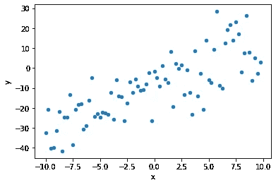
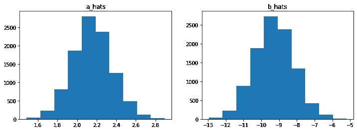
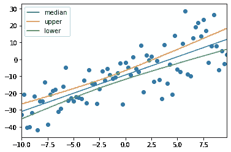
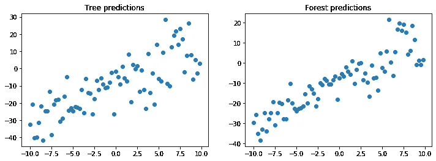

# 引导和打包 101

> 原文：<https://towardsdatascience.com/you-should-care-about-bootstrapping-ced0ffff2434?source=collection_archive---------37----------------------->

## 参数和统计数据应该属于分布，而不是单值！


照片来自[免费 pixabay 上的照片](https://pixabay.com/photos/brown-shoes-lace-up-shoes-1150071/)

Bootstrapping 方法用于了解统计数据的概率分布，而不是从表面上看。自举的基本原理依赖于使用替换对数据集进行重采样。在这里，我们将看看为什么它的数学工作，以及如何可以用来估计模型参数的情况下，一个简单的线性回归模型。

## 一些数学

想象一下，我们有一个数据集，它看起来像是`x`和`y`之间的线性关系，但是当我们观察`y`的值时，我们这样做是添加了噪声。

`y = ax + b + ε`

其中ε 取自随机分布 N(0，σ)。

使用最大似然估计，我们可以解析地找到对`a`和`b`的估计，让我们称这些估计为`â`和`b̂`。我们不仅可以找到数值的形式，还可以计算估计量的方差。

估计量的方差始终是一个重要的问题，因为它提供了点估计的置信度。在像这样的高斯噪声回归模型的情况下，我们发现估计值`â`和`b̂`的分布也是高斯分布。这种分布完全由其均值和方差来定义。

在这个简单的线性回归模型中，`a`的方差是σ /(nσ_x)其中σ_x 是`x`的方差。

## 那么我们为什么需要自举呢？

自举的目的也是为参数或统计数据创建置信区间。这是通过假设观察到的数据是真实的数据分布来创建多个新数据集来实现的。这意味着我们可以用该分布中的替换样本来创建新的数据集。这可用于训练模型或计算统计数据，方式与我们通常所做的相同，但不同之处在于，我们会多次重复这一操作，每次都使用新的重采样数据集。

这样做的好处是不需要分析计算参数或统计数据的分布，您可以使用用于拟合模型的不同采样数据集，根据经验简单地计算出分布。

自举起作用有两个主要原因，首先是[弱大数定律](https://en.wikipedia.org/wiki/Law_of_large_numbers) (WLLN)和[概率收敛](https://en.wikipedia.org/wiki/Convergence_of_random_variables)。

首先，从分布`X`中抽取的随机变量`X_i`的 WLLN 状态，随着`n`趋于无穷大，`X_i`的`n`样本的经验均值将收敛于`X` ( `E(X)`)的例外。更正式地说:

`X̄ = 1/n (X_1 + ... X_n)`

`X̄ → E(X) as n → ∞`

但是，WLLN 假设每个估计都是独立同分布的(iid ),如果使用替换抽样，这一假设将不再成立。如果您有无限量的数据，细分为更小的部分，并使用每个细分来计算参数值，这将是正确的。然而，在极限情况下，随着数据集的大小变大，这两种情况变得等同——根据经验，我们知道它也适用于较小的数据集。

其次，概率的收敛是指样本的经验方差收敛于分布方差(这里很好的展示了)。

## 这在实践中是如何运作的？

让我们来看一个将最佳拟合的线性线拟合到基本数据集的基本示例。

```
import numpy as np
import pandas as pd
from scipy import statsx = np.arange(-10,10,0.25)
y = x*2 - 10 + 10*np.random.randn(len(x))
data = np.concatenate((x[:,np.newaxis],y[:,np.newaxis]), axis=1)
```



不是我们建立我们的引导函数:

```
def bootstrap(data,n_trials=1000):
    index = np.arange(data.shape[0])
    bootstrap_index = np.random.choice(index,
                                       size=data.shape[0]*n_trials,
                                       replace=True)
    bootstrap_data = np.reshape(data[bootstrap_index,:],
                                (n_trials,*data.shape))
    return bootstrap_data
```

这个简单的函数假设第一维是与数据点数量相关的维度，即(M x F ),其中 F 是特征的数量。然后，它随机选择 M x n_trials 索引，并返回原始数据的经过整形的采样版本。现在它的形状是 n_trials x M x F。

现在，让我们将最佳拟合的线性线拟合到数据的每个引导版本:

```
a_hats = []
b_hats = []
sigma_hats = []
for d in bootstrap_data: 
    a_hat, b_hat = stats.linregress(d[:,0],d[:,1])[:2]
    a_hats.append(a_hat)
    b_hats.append(b_hat) sigma_hats.append(np.std(d[:,0]*a_hat + b_hat - d[:,1]))

a_hats = np.array(a_hats)
b_hats = np.array(b_hats)
sigma_hats = np.array(sigma_hats)
```

现在我们有了模型`ŷ = âx + b̂ + N(0,σ_hat)`的α和β参数的分布

本例中`â, b̂, σ_hat`的平均值分别为 2.15、-9.28 和 9.58，相比之下，数据是用值 2、-10 和 10 生成的，因此我们得到了很好的估计，但我们是否在置信区间内呢？每个参数都有 0.20，1.11 和 0.69 的标准偏差，所以我们在平均值的一个标准偏差内！

我们还可以查看参数的分布以及均值和标准差等点统计数据。



`â`和`b̂`的分布

记得在我们计算出`â`的理论方差之前，对于这个数据，与我们估计的方差 0.041 相比，这将产生 0.037 的值，考虑到我们不必做任何分析，这还不错！

我们还可以使用`â`和`b̂`的每个值来进行预测。在预测点中，我们也可以取第 95 和第 5 百分位，并为每个`x`值绘制它们。

```
median = np.percentile(predict, 50, axis=0)
upper = np.percentile(predict, 99, axis=0)
lower = np.percentile(predict, 1, axis=0)
df = pd.DataFrame({"y":y},index=x)
ax = pd.DataFrame({"median": median, 
                   "upper":upper, 
                   "lower":lower}
                  ,index=x).plot()
ax = plt.scatter(x=df.index, y=df.y)
```



所以现在我们可以做出 90%置信区间的预测。如果我们只对`â`和`b̂`进行单一预测，我们就无法做到这一点。

## 制袋材料

Bagging 是一个与 bootstrapping 非常相关的概念，它涉及相同的重采样方法来训练多个模型。

bagging 最常见的应用是应用于决策树分类器/回归器。浅层决策树有一个方差问题，因为它们高度依赖于训练它们所用的数据(特征空间中的分裂是在特征之间进行的，并且您进行 spits 的顺序可以极大地改变分类器)。

那么我们该如何应对呢？如果我们用重新采样的数据集训练大量的树，并进行平均预测，那么得到的分类器的总方差会减少。


来自[维基百科](https://en.wikipedia.org/wiki/Random_forest)的随机森林分类器

为了演示这一点，我们可以用 sklearn 训练一个森林和一棵树，并查看结果。

```
from sklearn.ensemble import RandomForestRegressor
from sklearn.tree import DecisionTreeRegressorforest = RandomForestRegressor(n_estimators=100)
tree = DecisionTreeRegressor()forest.fit(x[:,np.newaxis],y)tree.fit(x[:,np.newaxis],y)x_test = np.arange(-10,10,0.25)
y_test = x*2 - 10 + 10*np.random.randn(len(x))
```

如果我们在测试集上用一棵树和一个森林进行预测，我们会得到:



我们可以看到，预测的方差如我们所预测的那样大大减少了。

关于打包和引导的精彩讲座，我推荐康奈尔大学的这个讲座。

## 我们学到了什么？

我们看一下引导的基本概念，以及为什么它是任何数据科学家必备的有用技能。我们希望了解它是如何工作的，我们如何在 Numpy 中实现它，以及我们如何使用它来建模参数的分布，而不是将它们建模为单个值。我们还介绍了 bagging 的概念，以及如何应用它来提高存在方差问题的分类器的性能。