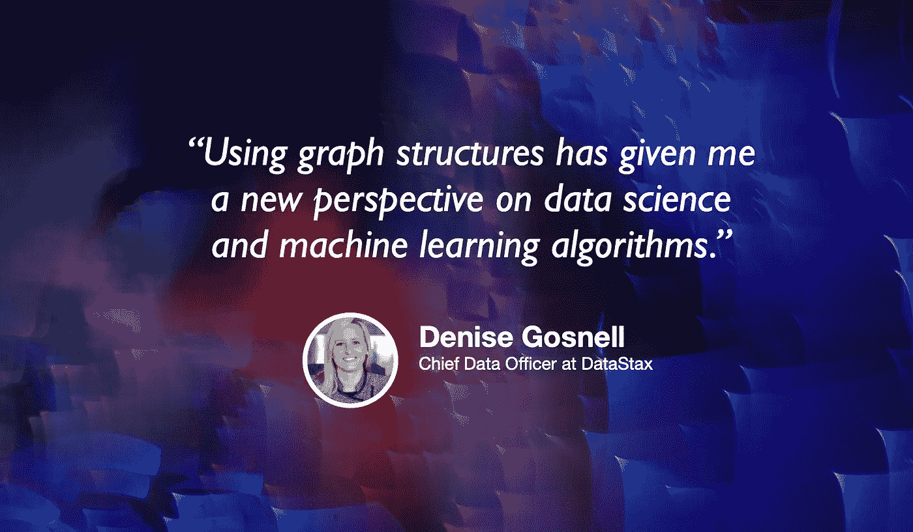

# 你真的应该学习一下图形数据库。原因如下。

> 原文：<https://towardsdatascience.com/you-should-really-learn-about-graph-databases-heres-why-d03c9d706a3?source=collection_archive---------19----------------------->

## [苹果](https://podcasts.apple.com/ca/podcast/towards-data-science/id1470952338?mt=2) | [谷歌](https://www.google.com/podcasts?feed=aHR0cHM6Ly9hbmNob3IuZm0vcy8zNmI0ODQ0L3BvZGNhc3QvcnNz) | [SPOTIFY](https://open.spotify.com/show/63diy2DtpHzQfeNVxAPZgU) | [其他](https://anchor.fm/towardsdatascience)

## 丹尼斯·戈斯内尔和马蒂亚斯·布罗意切勒在 [TDS 播客](https://towardsdatascience.com/podcast/home)

*编者按:迈向数据科学播客的“攀登数据科学阶梯”系列由 Jeremie Harris 主持。Jeremie 帮助运营一家名为*[*sharpes minds*](http://sharpestminds.com)*的数据科学导师初创公司。可以听下面的播客:*

在职业生涯中取得成功的一个很好的方法是，对哪些技术在未来会变得重要下好赌注，并投入时间学习它们。如果这听起来像是您想做的事情，那么您肯定应该关注图形数据库。

图形数据库并不是全新的，但随着图形数据(描述事物的互联网络的数据)变得比以往任何时候都更容易获得，它们变得越来越重要。社交媒体、供应链、移动设备跟踪、经济学和许多其他领域正在产生比以往任何时候都多的图表数据，这些数据集中埋藏着许多最大问题的潜在解决方案。

这就是为什么我如此兴奋地与 Denise Gosnell 和 Matthias Broecheler 交谈，他们分别是 DataStax 的首席数据官和首席技术官，DataStax 是一家专门为企业解决数据工程问题的公司。除了他们在 DataStax 使用图形数据库的丰富经验，Denise 和 Matthias 最近还写了一本名为[图形数据从业者指南](https://www.amazon.com/Practitioners-Guide-Graph-Data-Technologies-ebook-dp-B086BY8YQB/dp/B086BY8YQB/)的书，并在本期“走向数据科学”播客中抽出时间讨论了数据工程和图形数据的基础知识。

以下是我最喜欢的外卖:

*   图形数据的一个奇怪之处在于，在您可以分析它之前，您需要决定您想要使用什么视角来查看它。你是否有兴趣探索单个节点的行为(例如，“我想知道我能否根据给定的人在 LinkedIn 上的联系预测 X”)，或者探索整个网络的行为(例如，“LinkedIn 上的一些联系比其他联系更重要吗？”？答案将改变你询问数据的方式，以及你对数据集的看法。Denis 和 Mattias 在他们的书中确定了图表数据的四种不同观点，并在播客中讨论了它们。
*   您可以对图表数据使用的机器学习算法取决于您对数据集采用的上述四个视角中的哪一个。如果您选择以突出显示特定节点的方式来表示数据，而不是以突出显示节点聚类的方式来表示数据，则不同的预测模型和无监督模型可能适用，也可能不适用。
*   谈到数据工程，不同的工具在不同的规模下变得有用(并且最终是必要的)。不同工具之间的决策面很难解释，但我们在播客中讨论了这一点。何时使用 SQL vs noSQL，何时应用 Spark 或 Cassandra 等工具取决于您正在处理的数据集的复杂性和大小。
*   我向 Denise 和 Matthias 询问了一些资源，像我这样的图形数据库新手可以使用这些资源来了解这个主题，他们推荐了 [NetworkX](https://networkx.github.io/) ，并使用了来自 [Kaggle 的链接预测挑战](https://www.kaggle.com/c/link-prediction-challenge-tm-and-nlp)的数据。

你可以点击这里在 Twitter 上关注[丹尼斯，点击这里](https://twitter.com/DeniseKGosnell)在 Twitter 上关注[马蒂亚斯。另外，你可以在这里找到他们书的 GitHub。](https://twitter.com/MBroecheler)

你可以在 Twitter 上关注我。

**订阅《走向数据科学》的** [**月刊**](https://medium.com/towards-data-science/newsletters/monthly-edition) 直接在你的邮箱✨里接收我们最好的文章、视频和播客