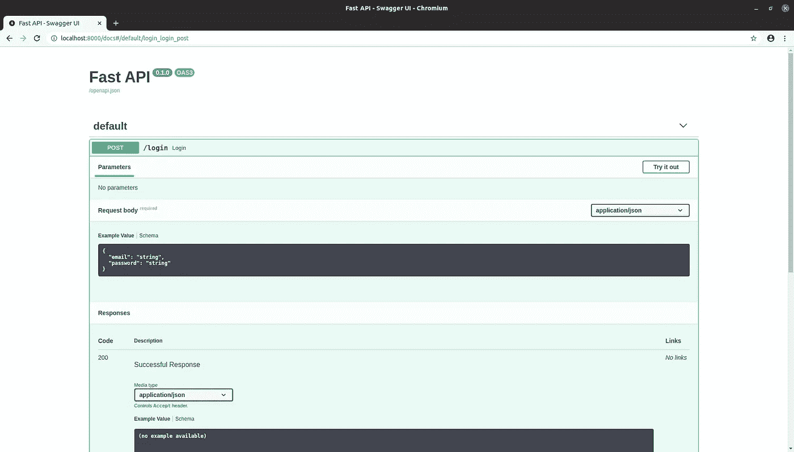

# 您应该现在就开始使用 FastAPI

> 原文：<https://towardsdatascience.com/you-should-start-using-fastapi-now-7efb280fec02?source=collection_archive---------2----------------------->


## 如果您还没有尝试过 FastAPI，现在是时候了

得益于 Flask、Django、Falcon 等优秀的框架，Python 一直是开发轻量级 web 应用程序的热门选择。由于 Python 是机器学习的头号语言，所以它特别方便将模型打包并作为服务公开。

多年来，Flask 一直是这项工作的首选工具，但是如果你还没有听说的话，现在有了一个新的挑战者。 [FastAPI](https://fastapi.tiangolo.com/) 是 Python 的一个相对较新的 web 框架，从它的前辈那里获得灵感，完善它们并修复它们的许多缺陷。它建立在 Starlette 之上，为桌面带来了大量令人敬畏的功能。

最近，它获得了巨大的吸引力，在过去的 8 个月里，我每天都与它一起工作，我可以自信地说，炒作是合理的。如果你还没有尝试过，我想给你五个尝试的理由。

# 简单而出色的界面

所有的 web 框架都需要在功能和给开发者自由之间取得平衡。姜戈很强大，但非常固执己见。另一方面，Flask 级别很低，足以提供很大的自由度，但是还有很多事情留给用户去做。FastAPI 更像是一个瓶子，但它设法达到了更健康的平衡。

为了给你一个例子，让我们看看如何在 FastAPI 中定义端点。

为了定义模式，它使用 Pydantic，这是另一个很棒的 Python 库，用于数据验证。这在这里很容易做到，但是后台发生了很多事情。验证输入的责任委托给了 FastAPI。如果请求不正确，例如`email`字段包含一个 int，将返回一个适当的错误代码，而不是应用程序因可怕的内部服务器错误(500)而崩溃。而且几乎是免费的。

这个简单的示例应用程序可以与 uvicorn 一起提供:

```
uvicorn main:app
```

现在，应用程序可以接受请求了。在这种情况下，请求应该是这样的

```
curl -X POST "[http://localhost:8000/login](http://localhost:8000/login)" -H  "accept: application/json" -H  "Content-Type: application/json" -d "{\"email\":\"string\",\"password\":\"string\"}"
```

锦上添花的是，它使用交互式 Swagger UI 根据 OpenAPI 自动生成文档。



FastAPI 应用程序的 Swagger UI

# 异步ˌ非同步(asynchronous)

与 Node.js 或 Go 中的框架相比，Python WSGI web 框架的最大缺点之一是无法异步处理请求。自从引入 ASGI 以来，这不再是一个问题，FastAPI 正在充分利用这一点。您所要做的只是用关键字`async`声明端点，就像这样:

# 依赖注入

FastAPI 有一个非常酷的方法来管理依赖关系。尽管开发人员没有被强制这样做，但是强烈建议使用内置的注入系统来处理端点中的依赖关系。

举个例子，让我们写一个端点，用户可以在这里对某些文章发表评论。

当端点被调用时，FastAPI 会在运行时自动评估`get_database`函数，因此您可以根据需要使用返回值。这(至少)有两个很好的理由。

1.  您可以通过修改`app.dependency_overrides`字典来全局覆盖依赖关系。这可以使测试变得轻而易举，因为您可以很容易地模仿对象。
2.  依赖关系(在我们的例子中是`get_database`)可以执行更复杂的检查，允许您将它们从业务逻辑中分离出来。这大大简化了事情。例如，[用户认证可以通过这个](https://fastapi.tiangolo.com/tutorial/security/first-steps/)轻松实现。

# 易于与数据库集成

SQL、MongoDB、Redis 或您选择的任何东西，FastAPI 都不会强迫您围绕它们构建应用程序。如果您曾经尝试过使用 Django 处理 MongoDB，您就会知道这有多痛苦。有了 FastAPI，您不需要做额外的工作，将数据库添加到您的堆栈中是尽可能简单的。(或者更准确地说，要完成的工作量将由您选择的数据库决定，而不是由 web 框架增加的复杂性决定。)

但说真的，看看这美景。

瞧啊。我能看见你在打字

```
pip install fastapi
```

已经传到你的终端了。

# GraphQL 支持

当您处理一个复杂的数据模型时，REST 可能是一个严重的障碍。当前端的微小变化需要更新端点的模式时，这绝对不是好玩的。GraphQL 在这些情况下大放异彩。尽管 GraphQL 支持并不是 Python web 框架中唯一的，但 Graphene 和 FastAPI 可以无缝地协同工作。不需要为 Django 安装任何类似`graphene_django`的扩展，它本身就可以工作。

# +1:优秀的文档

当然，如果没有同样优秀的文档，一个优秀的框架不可能真正闪耀光芒。Django，Flask 和所有其他人在这方面都很出色，但 FastAPI 与他们不相上下。当然，由于它年轻得多，目前还没有关于它的书籍，但这只是时间问题。

如果你想看看 FastAPI 的实际应用，我正好有一个完美的指南给你！我写了一个详细的教程，你可以用 Docker，Docker Compose 和 GitHub Actions 来部署你的机器学习模型！

[](/how-to-properly-ship-and-deploy-your-machine-learning-model-8a8664b763c4) [## 如何正确地发布和部署您的机器学习模型

### FastAPI、Docker 和 GitHub 操作实用指南

towardsdatascience.com](/how-to-properly-ship-and-deploy-your-machine-learning-model-8a8664b763c4) 

总而言之，无论你是在寻找一个快速轻量级的框架来服务于你的深度学习模型还是更复杂的东西，FastAPI 都能提供。如果您还没有尝试过，我强烈建议您尝试一下。我很确定你会坚持下去。

[***如果你喜欢把机器学习概念拆开，理解是什么让它们运转，我们有很多共同点。看看我的博客，我经常在那里发表这样的技术文章！***](https://www.tivadardanka.com/blog)