# 你应该试试新的 TensorFlow 的 TextVectorization 图层。

> 原文：<https://towardsdatascience.com/you-should-try-the-new-tensorflows-textvectorization-layer-a80b3c6b00ee?source=collection_archive---------5----------------------->

## 它是如何工作的，以及为什么你应该在你的 ML 管道中实现它。

*本文讨论了一个相当高级的主题，因此如果您仍然是 TensorFlow/NLP 初学者，您可能想要快速浏览一下* [*TensorFlow 2 快速入门教程*](https://www.tensorflow.org/tutorials/quickstart/beginner) *或稍微复习一下*[*wordbembeddings*](https://www.tensorflow.org/tutorials/text/word_embeddings)*。*

随着[最近发布的](https://github.com/tensorflow/tensorflow/releases/tag/v2.1.0) `[**Tensorflow 2.1**](https://github.com/tensorflow/tensorflow/releases/tag/v2.1.0)`，一个新的`[**TextVectorization**](https://www.tensorflow.org/api_docs/python/tf/keras/layers/experimental/preprocessing/TextVectorization?version=stable)` 层被加入到`tf.keras.layers`舰队中。

> 该层具有用于管理 Keras 模型中的文本的基本选项。它将一批字符串(一个样本=一个字符串)转换为记号索引列表(一个样本=整数记号索引的 1D 张量)或密集表示(一个样本=表示关于样本记号的数据的浮点值的 1D 张量)。****

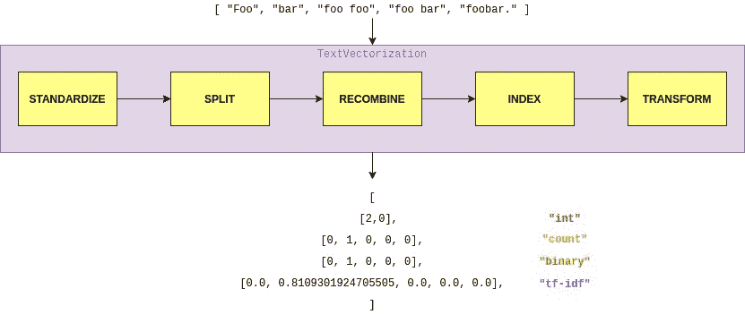

*文本矢量化图层数据流概述*。

> 每个样本的处理包含以下步骤:
> 
> 1.**标准化**每个样本(一般是小写+标点剥离)。
> 
> 2.**将每个样本分割成子串(通常是单词)。**
> 
> 3.**将**子字符串重组为令牌(通常是 ngrams)。
> 
> 4.**索引**令牌(将唯一的 int 值与每个令牌相关联)。
> 
> 5.**使用该索引将每个样本转换为整数向量或密集浮点向量。**

# 1️⃣标准化。

在第一步中，数据将经过*标准化*过程*。*在这一阶段，每个文本样本在进一步处理之前被清理和转换。

你可以用`TextVectorization`层的`**standardize**`参数控制标准化步骤。该参数的可能值为:

*   `None`:这将应用**完全没有标准化**。
*   `lower_and_strip_punctuation` ( **默认**):由于降低和删除标点符号是一种非常常见的技术，你可以传递这个字符串，`TextVectorization`层将应用这个转换作为它的标准化步骤。
*   `Callable`:如果你需要更多关于标准化的控制，你可以通过你自己的`Callable`。

如果您已经选择将自己的`Callable`传递给`standardize`参数，那么您应该注意以下几点:

1.  任何`Callable`都可以传递给这个层，但是如果你想序列化这个对象，你应该只传递注册了 keras serializable 的函数(更多细节见[注册 keras serializable](https://www.tensorflow.org/api_docs/python/tf/keras/utils/register_keras_serializable) )。
2.  当对`standardize`使用自定义可调用函数时，可调用函数接收的数据将完全传递给该层。`Callable`应该返回与输入相同形状的张量。

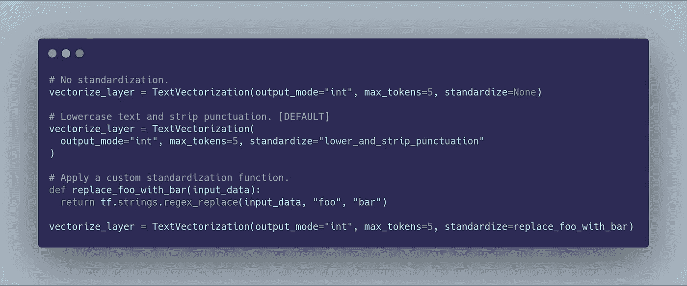

# 2️⃣分裂了。

在第二步中，每个文本样本将被分割成子串标记(通常是*单词*)。

同样，您可以使用`**split**`参数控制*分割*行为，该参数可用于`TextTokenization`层。可能的值有:

*   `[None](https://github.com/tensorflow/tensorflow/issues/36071)`:这应该适用于**根本没有分裂**。
*   `whitespace` ( **default** ):对 ASCII 空格进行分割是很常见的，这就是为什么这是该参数的默认值。
*   `Callable`:如果你喜欢更奇特的分割技术，你可以在这里自由传递你自己的可调用函数，就像`standardize`参数一样。

和以前一样，作为`Callable`通过考试也有一些限制:

1.  任何`Callable`都可以传递给这个层，但是如果你想序列化这个对象，你应该只传递注册了 keras serializable 的函数(更多细节见[注册 keras serializable](https://www.tensorflow.org/api_docs/python/tf/keras/utils/register_keras_serializable) )。
2.  当对`standardize`使用自定义可调用函数时，可调用函数接收的数据将完全传递给该层。`Callable`应该返回一个与输入相同形状的张量。
3.  可调用函数接收的数据将挤出第 1 个*维。这意味着你的`Callable`将看到`["string to split", "another string to split"]`，而不是`[["string to split"], ["another string to split"]]`。`Callable`应该返回一个包含分割记号的第一维张量，所以在这个例子中我们应该返回类似于`[["string", "to", "split"], ["another", "string", "to", "split"]`的东西。这使得`Callable`与`[tf.strings.split()](https://www.tensorflow.org/api_docs/python/tf/strings/split)`天生兼容。*

# 3️⃣重组。

在将我们的文本分割成记号后，我们可以决定如何在创建词汇索引前将它们重新组合(T21)。这基本上意味着我们可以决定是保留我们目前得到的所有令牌，还是使用它们的组合。

我们用`**ngrams**` 参数控制这一步。可能的值有:

*   `None`:在这种情况下，不会创建任何 *ngrams* ，只会使用您现在拥有的令牌。
*   一个`int`:传递一个整数将创建 *ngrams* 直到该整数。
*   一个`(int, int)`元组:传递一个整数元组将为元组中的指定值创建 *ngrams*

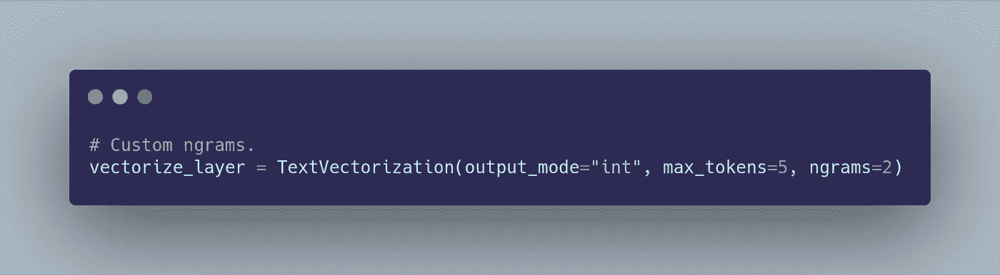

# 4️⃣指数。

这一步允许您根据上一步获得的重组标记创建一个词汇表。因此，您可以指定一个`max_tokens`整数参数来控制该层词汇的最大大小，或者简单地保留默认的**`**None**`**值，不为词汇设置上限。****

****为了实际构建这个索引，您需要调用层的`**adapt**` 方法，这将使预处理层的状态适合数据集。这也覆盖了默认的`adapt`方法，在将输入传递给组合器之前，对输入应用相关的预处理。****

****如果您想设置自己的词汇(和*文档频率，可选*，您可以使用`set_vocabulary`方法。****

> ****该方法直接设置该层的词汇和测向数据，而不是通过“适应”来分析数据集。只要 vocab(以及可选的文档频率)信息已知，就应该使用它。如果词汇数据已经存在于层中，如果“append”设置为 False，此方法将替换它，或者追加到它(如果“append”设置为 True)。****

****`**set_vocabulary**`方法采用以下参数:****

*   ****`vocab`:字符串标记数组。****
*   ****`df_data`:文档频率数组。仅当层`output_mode`为`tf-idf`时才需要。****
*   ****`oov_df_value`:词汇外令牌的文档频率。仅当`output_mode`为`tf-idf`时才有必要。在`tf-idf`模式下追加附加数据时，OOV 数据是可选的；如果提供了 OOV 值，它将覆盖现有的 OOV 值。****
*   ****`append`:是否覆盖或追加任何现有词汇数据。****

****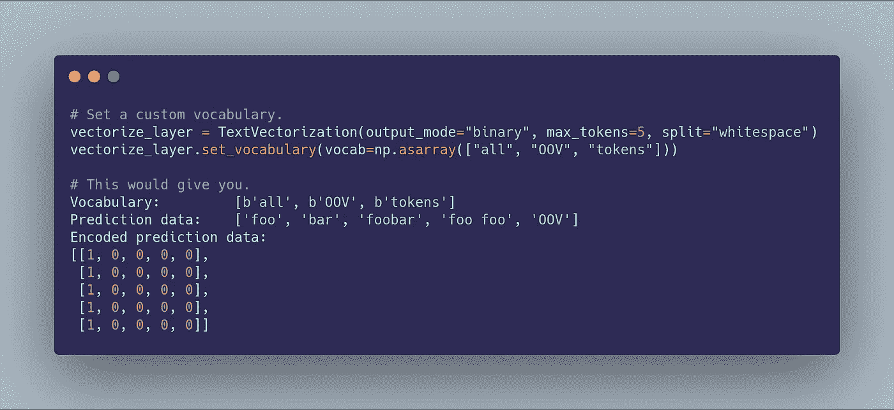****

# ****5️⃣变换。****

****最后一步，预处理后的数据被转换并以期望的方式提供。有四种不同的选项可供选择:****

*   ****`int`:输出整数索引，每个拆分字符串标记一个整数索引。****
*   ****`binary`:每批输出一个整数数组，大小为`vocab_size`或`max_tokens`，在所有元素中包含`1` *s* ，其中映射到该索引的标记在批处理项中至少存在一次。****
*   ****`count`:与`binary`相同，但是 int 数组包含该索引处的令牌在批处理项中出现的次数计数。****
*   ****`tf-idf`:与`binary`相同，但是应用 TF-IDF 算法来寻找每个令牌槽中的值。****

****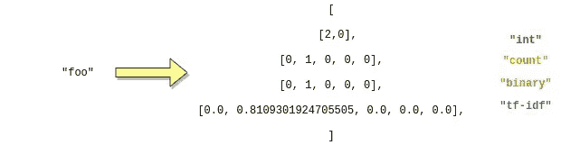****

****此外，还有*两个*其他参数会影响图层的输出形状:****

*   ****`output_sequence_length`:仅在`int`输出模式下有效。如果设置，输出将使其时间维度被填充或截断为精确的`output_sequence_length`值，从而产生形状为`[batch_size, output_sequence_length]`的张量，而不管分裂步骤产生了多少记号。**默认**到`None`。****
*   ****`pad_to_max_tokens`:仅在`binary`、`count`和`tf-idf`模式下有效。如果为`True`，即使词汇表中唯一记号的数量小于 max_tokens，输出也会将其特征轴填充到`max_tokens`，从而产生一个形状为`[batch_size, max_tokens]`的张量，与词汇表大小无关。**默认为**至`True`。****

****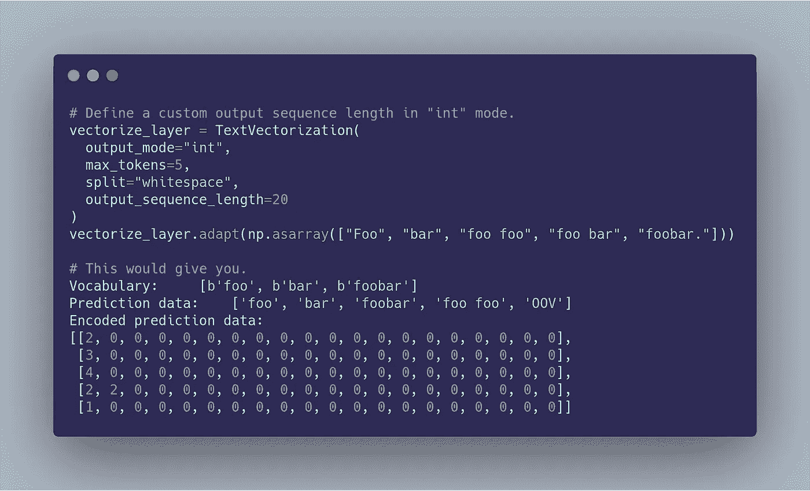****

****设置**输出序列长度**。****

****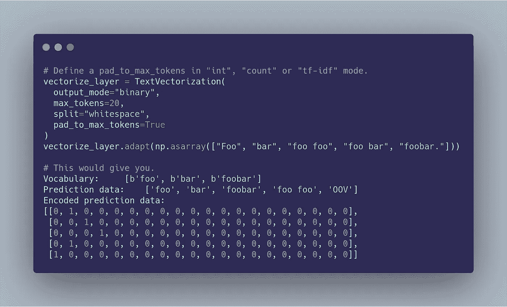****

****设置 **pad_to_max_tokens。******

****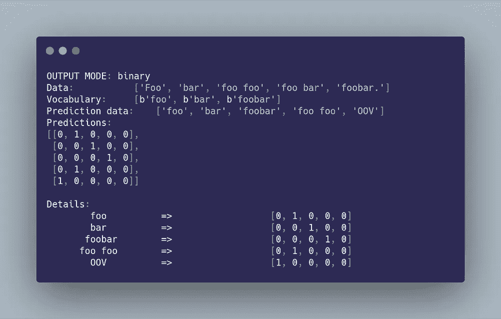********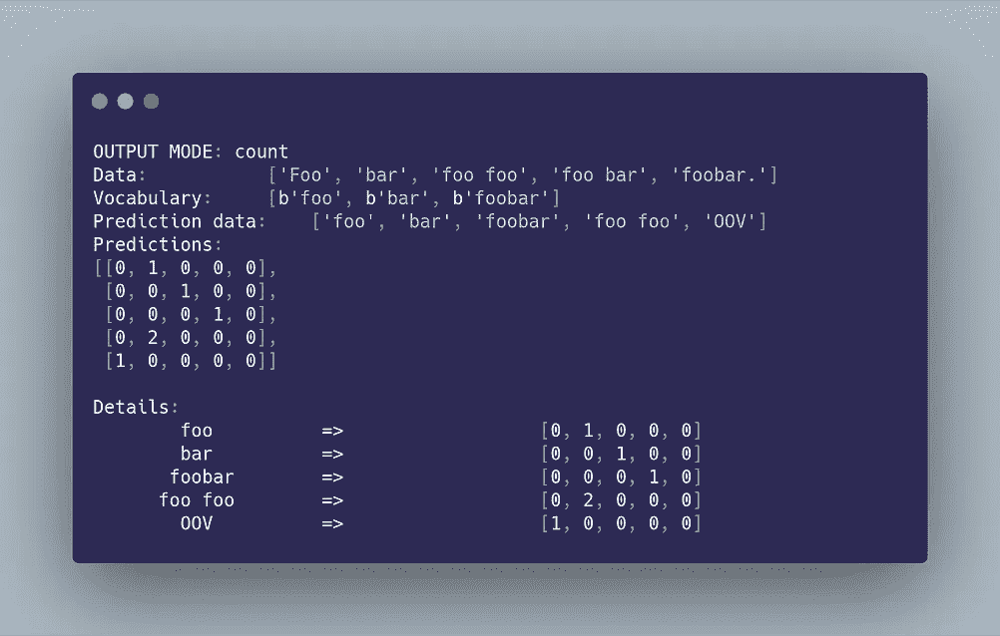********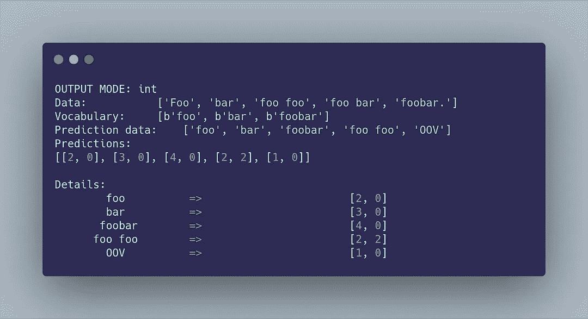********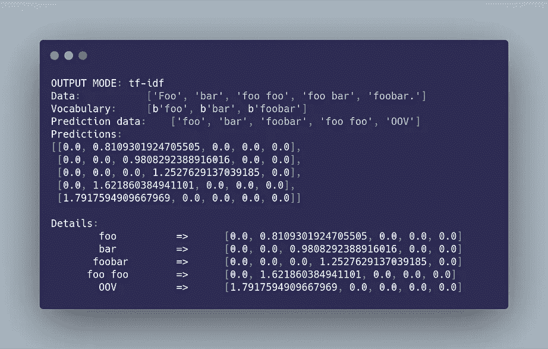****

****不同**输出模式**的总结。****

# ****<< Impressive, how do I use it? 🤔 >>****

****就像任何其他的`tf.keras`层一样，它的使用非常简单。你所需要做的就是实例化这个层，把它放到你的数据中，然后你就可以把它放到你的模型层堆栈中了。****

****还是那句话，你真的应该看看[官方 TensorFlow 的 team Colab 例子](https://colab.research.google.com/drive/1RvCnR7h0_l4Ekn5vINWToI9TNJdpUZB3)，但简单来说:****

****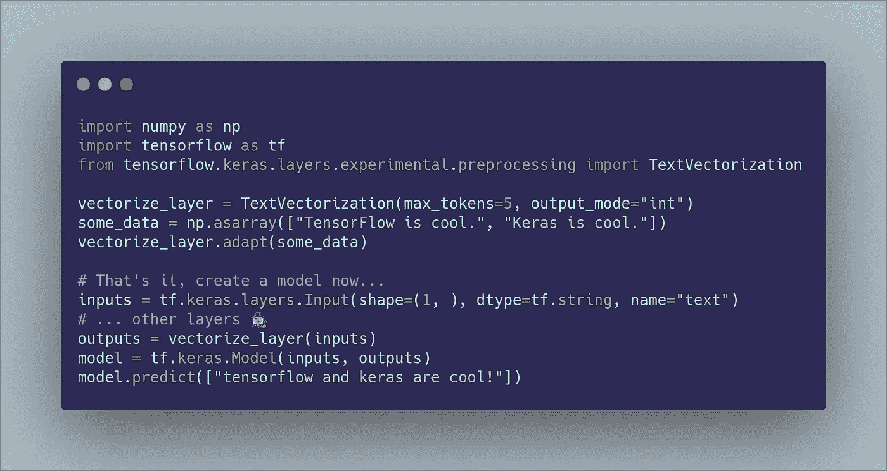****

# ******< <爽！我应该在生产中使用这个吗？**🙄**>>******

****到目前为止，在基于文本的机器学习模型上工作时，您可能必须决定一个输入预处理策略:这基本上意味着您必须独自完成上面为`TextTokenization`层定义的所有步骤，根据预处理的数据拟合您的模型，保存它，然后在推理时以某种方式再现预处理步骤，然后将它们传递给[服务模型](https://github.com/tensorflow/serving)并获得一些预测。****

****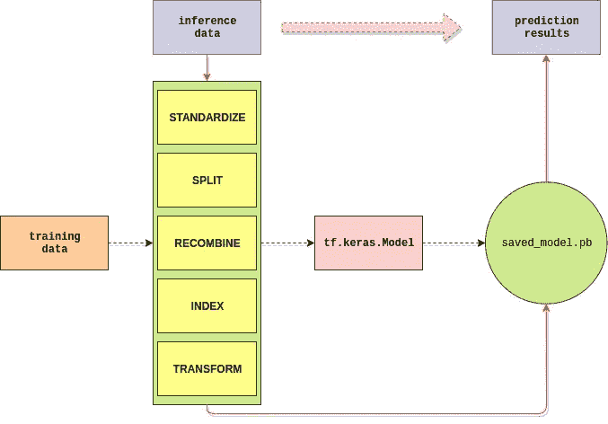****

****这可以通过一系列不同的方式来完成，从完全在 TensorFlow“外部”实现整个预处理管道，到使用强大的`tf.data` api。当然，也有方法将您自己的操作包含到导出的图形中，TensorFlow 足够灵活，可以让您实现自己的预处理层，但是如果您想要摇滚，这是一条很长的路要走。****

****这一层给你的是将任何文本预处理逻辑**包含到**你的模型中的机会。****

> ****[通过这样做，您将一致地使用相同的预处理和分析代码，并避免用于训练的数据和提供给生产中的训练模型的数据之间的差异，并从编写一次代码中受益。](https://www.tensorflow.org/tfx/guide#developing_with_tfx)****

****但是这里是我们梦想开始和结束的地方。****

****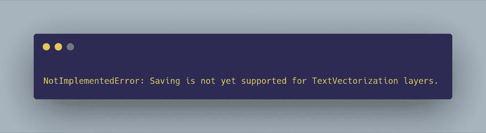****

****遗憾的是，没有实现导出包含该层的模型， ***还没有*** 。****

****这意味着在生产中使用这一层不是一个好主意，因为你不能导出你的模型，也不能用像 [Tensorflow Serving](https://github.com/tensorflow/serving) 这样的解决方案来服务它。然而，这一层仍然被标记为*实验性的*，并且[随着未来 TensorFlow 版本的发布，我们很快将有能力导出这一层](https://github.com/tensorflow/text/issues/210)。****

****⌛ ***来自未来的更新:【***[***tensor flow 博客 2020–07–27***](https://blog.tensorflow.org/2020/07/whats-new-in-tensorflow-2-3.html)***:***⌛****

> ****TensorFlow 2.3 增加了对新的 [Keras 预处理层 API](https://www.tensorflow.org/api_docs/python/tf/keras/layers/experimental/preprocessing?version=nightly) 的[实验性](https://github.com/tensorflow/community/blob/master/governance/api-reviews.md#experimental-apis)支持。这些层允许您将预处理逻辑打包到模型中以便于部署——因此您可以发布一个模型，该模型将原始字符串、图像或表中的行作为输入。****

****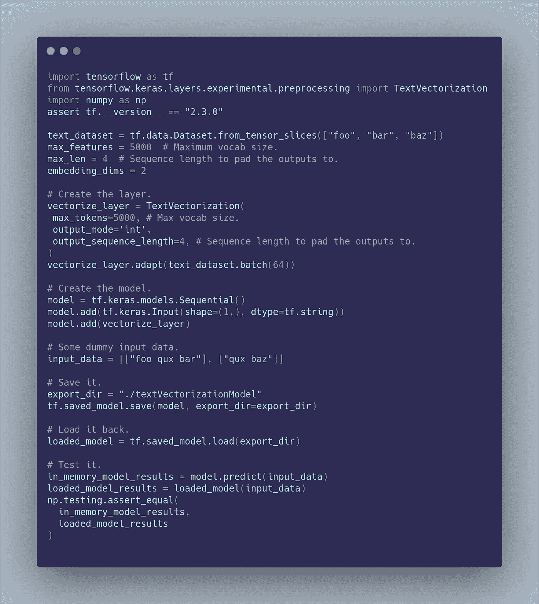****

****更新 2020–07–27:导出文本矢量化图层。****

# ****<< Alright, I’m interested anyway, where should I go next? 🤓 >>****

******你在这篇文章中发现的很多**都摘自官方 [TensorFlow 文档](https://www.tensorflow.org/api_docs/python/tf/keras/layers/experimental/preprocessing/TextVectorization)，里面真的是应有尽有，挖吧。****

****有关一些一般信息，请参见[官方 TensorFlow 2.1 版本](https://github.com/tensorflow/tensorflow/releases/tag/v2.1.0)，其中您将找到一个笔记本，它将指导您使用`TextVectorizationLayer`完成一个[端到端文本分类示例](https://colab.research.google.com/drive/1RvCnR7h0_l4Ekn5vINWToI9TNJdpUZB3)。****

****想要更多吗？看看这个我作为游乐场创造的 Google Colab 笔记本 ！****

# ****参考文献。****

****[ **1** ] [文本矢量化](https://www.tensorflow.org/api_docs/python/tf/keras/layers/experimental/preprocessing/TextVectorization)， *2020.01.20* ，[https://www . tensor flow . org/API _ docs/python/TF/keras/layers/experimental/预处理/文本矢量化](https://www.tensorflow.org/api_docs/python/tf/keras/layers/experimental/preprocessing/TextVectorization)。****

****与 TFX 一起发展的**2**， *2020.01.20* ，[https://www.tensorflow.org/tfx/guide#developing_with_tfx](https://www.tensorflow.org/tfx/guide#developing_with_tfx)。****