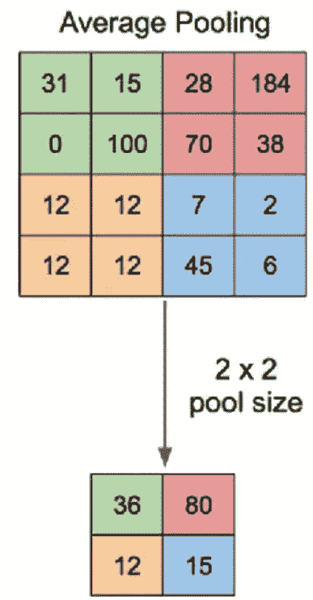
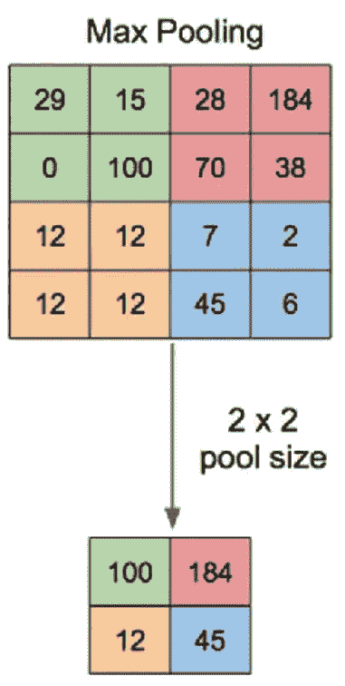
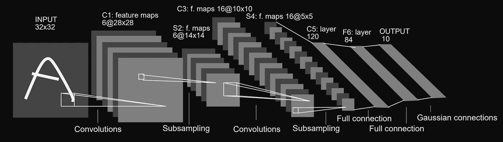

# (你应该)理解深度学习中的子采样层

> 原文：<https://towardsdatascience.com/you-should-understand-sub-sampling-layers-within-deep-learning-b51016acd551?source=collection_archive---------19----------------------->

## 说明

## 平均池，最大池，子采样，下采样，都是你在深度学习中会遇到的短语。本文深入介绍了这些技术的利用和优势。

卷积神经网络(CNN)具有能够对通过网络馈送的图像的仿射变换保持不变的特性。这提供了识别图像中偏移、倾斜或轻微扭曲的图案的能力。

由于 CNN 架构的三个主要属性，引入了仿射不变性的这些特征。

1.  [局部感受野](/understand-local-receptive-fields-in-convolutional-neural-networks-f26d700be16c)
2.  [共享权重(参数共享)](/understanding-parameter-sharing-or-weights-replication-within-convolutional-neural-networks-cc26db7b645a)
3.  **空间子采样**

在本文中，我们将探索**空间子采样**，并了解它们在 CNN 架构中的用途和优势。

> 这篇文章面向所有水平的练习机器学习或更具体地说深度学习的个人。

# 介绍

子采样是一种被设计用来减少对 CNN 内卷积层产生的特征图内精确定位的依赖的技术。

CNN 内部包含固定维度的内核/过滤器，这些被称为特征检测器。一旦检测到来自图像的特征，关于该特征在图像中的位置的信息实际上可以被忽略，这是有好处的。

事实证明，对特定特征定位的依赖对于构建和开发一个网络是不利的，该网络可以对经历了某种形式的仿射变换的输入数据执行相对较好的操作。我们通常不希望网络学习模式中的权重过于特定于训练数据。

因此，就要素定位而言，重要的信息是要素相对于要素地图中其他要素的相对位置，而不是要素在要素地图中的确切位置。

为了减少对网络内要素精确定位的依赖，需要降低空间分辨率。

空间分辨率的降低仅仅是减少特征图中的像素数量，在这种情况下，这是通过子采样实现的。

> 通过添加子采样层将子采样合并到 CNN 中，其中该层中的每个单元具有施加在输入(来自前一层的特征图)上的固定大小的感受野，其中对该单元的感受野范围内的像素执行操作，操作的结果成为来自子采样层的输出的新值。
> 
> 子采样是一种在沿网络移动时对要素地图进行下采样的方法

# 平均池

平均池是子采样的变体，其中落在子采样层内的单元的感受域内的像素的平均值被作为输出。

下面是平均池的描述。



[来自“使用卷积神经网络的迁移学习的应用……”的平均池描述](https://www.researchgate.net/publication/333593451_Application_of_Transfer_Learning_Using_Convolutional_Neural_Network_Method_for_Early_Detection_of_Terry's_Nail)

上面的平均池操作有一个 2x2 的窗口，并滑过输入数据，输出内核感受域内像素的平均值。

下面是一段代码，它利用 [TensorFlow](https://www.tensorflow.org/) 深度学习库来实现一个平均池层。

```
import tensorflow as tfaverage_pooling = tf.keras.layers.AveragePooling2D( pool_size=(2, 2), strides=None, padding='valid')
```

我不会深入研究上面代码片段的太多细节，因为这超出了本文的范围。但以下是一些必要的信息:

*   平均池层是使用“ ***平均池 2D*** ”类的类构造函数创建的。构造函数接受一些参数。
*   **池大小**是在落入其中的像素值内执行平均操作的滑动窗口的尺寸。元组(2，2)随后将输入数据分成两半
*   **步距**表示每次池化操作评估后池化窗口在输入数据上移动的量。分配给它的值“无”意味着跨距值将采用池大小的默认值。

# 最大池化

最大池是子采样的变体，其中落入子采样层内的单元的感受域内的像素的最大像素值被作为输出。

下面的 max-pooling 操作有一个 2x2 的窗口，并滑过输入数据，输出内核感受域内的最大像素。



[来自“使用卷积神经网络的迁移学习的应用……”的最大池描述](https://www.researchgate.net/publication/333593451_Application_of_Transfer_Learning_Using_Convolutional_Neural_Network_Method_for_Early_Detection_of_Terry's_Nail)

```
import tensorflow as tf
tf.keras.layers.MaxPool2D(pool_size=(2, 2), strides=None, padding='valid')
```

# 案例研究:LeNet-5 CNN 架构

通过观察 [LeNet-5](http://yann.lecun.com/exdb/publis/pdf/lecun-01a.pdf) 架构中包含的第一个子采样层，我们可以获得更多关于子采样层内部操作的信息。



[LeNet-5 CNN 架构](http://yann.lecun.com/exdb/publis/pdf/lecun-01a.pdf)

第一个子采样层在上面的图像中由标签' *S2* '标识，它是紧接在第一个 conv 层( *C1* )之后的层。

从图中我们可以观察到，子采样层产生了六个尺寸为 *14x14* 的特征地图输出，每个由*‘S2’*子采样层产生的特征地图对应一个由*‘C1’*层产生的特征地图。

这是我们通过 LeNet-5 的架构观察到的一种模式，因为其他子采样层产生的特征地图的数量与之前的 conv 层产生的特征地图的数量相等。

层' *S2* '使用的子抽样变量是一个平均池。如前所述，在上面给出的实施例中，子采样层内的单元都具有 *2x2* 的感受域，其随后对应于池大小。当值落在 *2x2* 池内核中时，内核中四个数字的平均值被用作输出。

当我们继续通过 LeNet-5 内的层时，我们到达第二子采样层' *S4，并且这个*层比' *S2* '具有更多的特征地图，总共 16 个特征地图由' *S4'* 子采样层输出。

值得注意的是，特征图的尺寸 *(5x5)* 远小于来自先前 conv 层 *(10x10)* 的特征图，这是因为当输入数据通过网络前馈时，子采样层平均 *(2x2)* 池尺寸是其作为输入接收的特征图尺寸的一半。这就是所谓的下采样。

随着我们在网络中移动，特征图尺寸的减小(*下采样*)使得降低特征图的空间分辨率成为可能。您可能会认为这种技术违反直觉，无法确保特征地图中的特征包含足够详细的模式以供学习。

但是从训练集中的图像中学习内在模式可能是有害的。虽然我们加强并促进了从输入图像中学习模式，但实际上，拥有一个在图像通过网络时学习图像的内在模式的网络将降低网络对其训练阶段未见过的数据的泛化能力。

图像具有多种多样的艺术风格。例如，个人可以用几种不同的方式写出数字'*8【T1’；让网络关注训练集中图像的细节模式会对其泛化能力产生负面影响。*

最后，作为二次采样的结果，还有一个额外的好处，就是增加了网络内生成的特征地图。

# 我希望这篇文章对你有用。

要联系我或找到更多类似本文的内容，请执行以下操作:

1.  订阅我的 [**YouTube 频道**](https://www.youtube.com/channel/UCNNYpuGCrihz_YsEpZjo8TA) 视频内容即将上线 [**这里**](https://www.youtube.com/channel/UCNNYpuGCrihz_YsEpZjo8TA)
2.  跟着我上 [**中**](https://medium.com/@richmond.alake)
3.  通过 [**LinkedIn**](https://www.linkedin.com/in/richmondalake/) 联系我