# 所以，你想深入学习，却没有数据？

> 原文：<https://towardsdatascience.com/you-want-to-learn-deep-but-you-dont-have-data-20ef3de8ba4a?source=collection_archive---------37----------------------->

## 给已知运营商一个尝试！

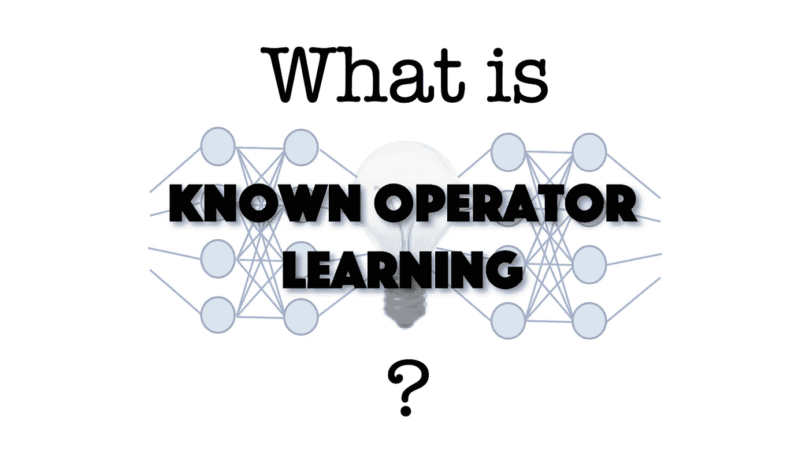

这就是我们今天要回答的问题:“什么是已知算子学习？”。图片由作者在 [CC 4.0 下经许可](https://creativecommons.org/licenses/by/4.0/deed.de)创作。

我相信你们都喜欢深度学习。一个主要问题是，尽管最酷的深度学习解决方案需要大量数据。它很容易进入[数百万的训练样本](http://www.image-net.org/challenges/LSVRC/)。特别是，如果您从事医学图像处理工作，您将无法访问如此大的数据集，即使您可以访问，[良好的注释可能是一个问题](https://www.kaggle.com/nih-chest-xrays/data)。

出于这些原因，我们，当然还有许多其他人，开始寻找不那么渴求数据的方法。特别是，我今天要向你们展示一个新的技巧，我们创造了“[已知操作员学习](https://www.nature.com/articles/s42256-019-0077-5)”。这个想法已经存在了很长一段时间，但是被机器学习社区的许多研究人员所反对。让我们先看看这个想法，然后看看一些评论，最后看看一些理论和实验结果，我希望你会觉得有说服力。

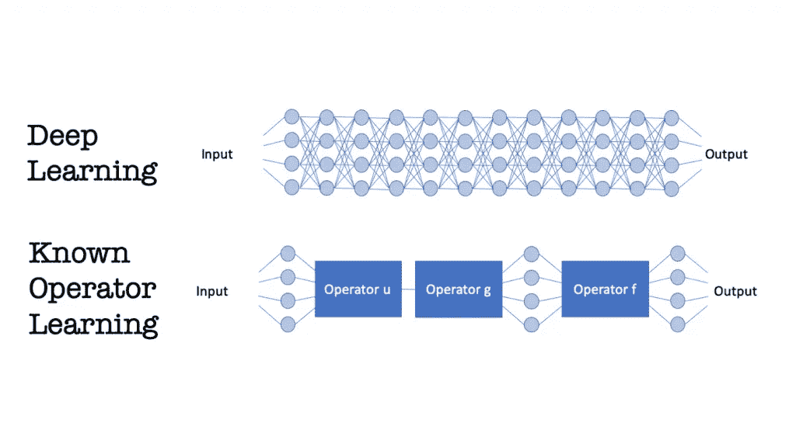

已知算子学习使得深度学习和传统方法兼容。图片由作者在 [CC 4.0 下通过许可](https://creativecommons.org/licenses/by/4.0/deed.de)创建。

已知算子学习的主要思想是我们不想学习我们已经知道的东西。这看起来很直观，但通常会触发机器学习专家。今天的范式是“知识在数据中”。如果你结合了先前的知识，那么你本质上是回到了石器时代。

我们在深度学习中观察到的恰恰相反。我们看到许多不同的体系结构正在被探索，最成功的是那些受传统技术或其他方法启发的体系结构，这些方法以某种方式将关于问题的知识编码到体系结构中。也有非常深入的方法，但这些方法也与已知的解决方案有关。所有这些方法都有一个主要缺点，那就是它们需要数百万个带注释的训练样本。

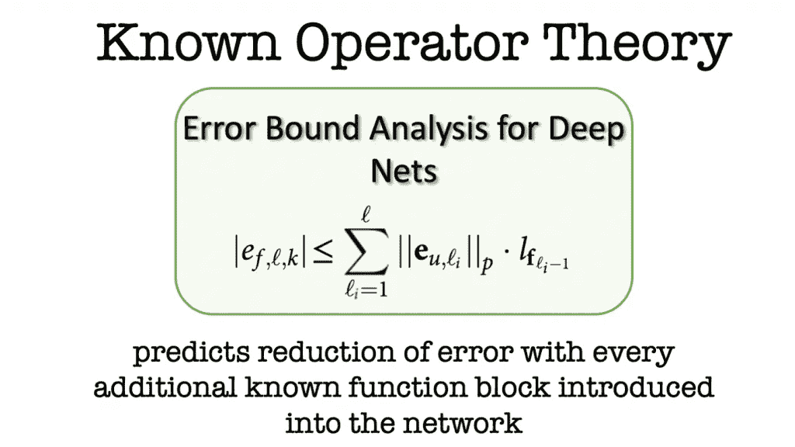

已知算子理论表明，最大误差界限随着网络中包括的每个已知运算而缩小。图片由作者在 [CC 4.0 下经许可](https://creativecommons.org/licenses/by/4.0/deed.de)创作。

最近在[自然机器智能](https://www.nature.com/articles/s42256-019-0077-5)发表的一篇论文证实了直觉，即先验知识有助于深度网络的最大误差分析。作者可以证明，每一个新的已知操作的最大误差界都减小了。在已知所有运算的限度内，误差减小到零。包含已知操作的另一个副作用是减少了网络的参数数量，这对所需训练样本的数量非常有利。虽然这些理论上的观察很有趣，但我们仍然需要一些实际的例子来检验这个结果。

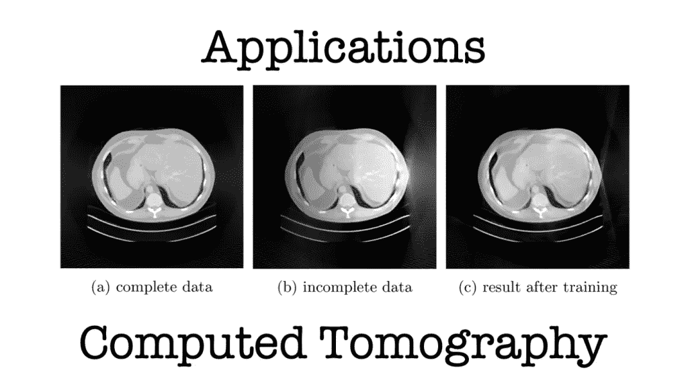

CT 扫描仪的投影几何形状通常是经过校准的，并且是众所周知的。上面例子的在线实验环境可以在[这里](https://doi.org/10.24433/CO.2164960.v1)找到。图片由作者在 [CC 4.0 下经许可](https://creativecommons.org/licenses/by/4.0/deed.de)创作。

作为第一个例子，我想强调计算机断层扫描(CT)。在 CT 中，我们通常设计扫描仪，其几何形状是众所周知的。CT 问题本身相当简单，因为它可以表示为一组线性方程，并且求解层析成像问题本质上与对矩阵求逆有关。不过有一个问题是，考虑中的矩阵相当大。对于具有 512 个体素和 512 个投影(每个投影具有 512 个像素)的常见 3-D 问题大小，待求逆的矩阵将需要 65.000 TB 浮点精度的存储。所以，简单的从零开始学习逆矩阵，即使在深度学习的时代，也不是一个可行的方案。

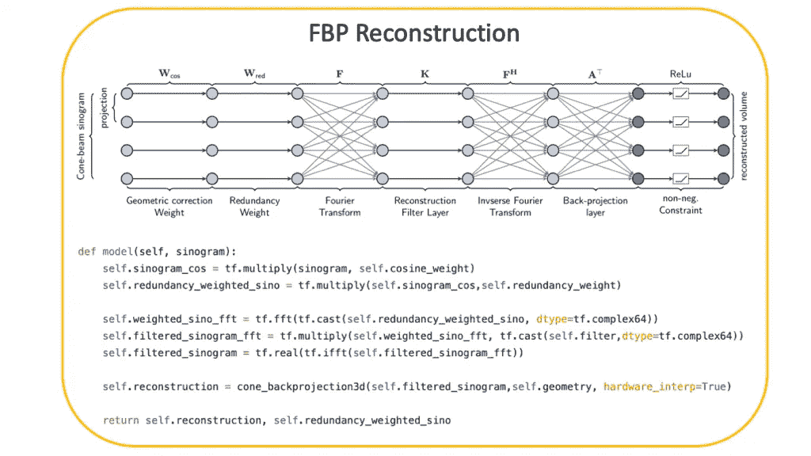

利用已知的算子，我们可以将 CT 重建问题分解成几个步骤，其中许多步骤是由几何定义的。图的下半部分显示了 [PYRO-NN](https://aapm.onlinelibrary.wiley.com/doi/full/10.1002/mp.13753) 中 CT 重建模型的代码。解析和迭代重建的代码示例见[这里](https://github.com/csyben/PYRO-NN/tree/master/examples/ct_reconstruction)。作者在 [CC 4.0 下经许可](https://creativecommons.org/licenses/by/4.0/deed.de)创作的图片。

使用已知的操作符，我们可以有效地解决这个问题。上面的例子表明矩阵求逆可以分解成几个步骤。以上所有步骤都有解析解和稀疏解。然而，这些解决方案仅适用于测量了所有所需数据的情况。结合深度学习和我们对问题的了解，我们现在可以确定第一层中的加权矩阵可能不适合不完整的扫描。因此，我们可以将已知和未知的操作按层排列，甚至可以将经典问题的解决方案用作初始化或预训练。

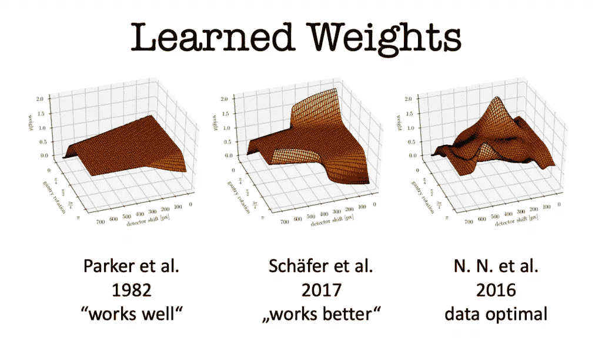

利用已知的算子学习，我们不仅受益于关于网络结构和较少参数的先验知识，而且我们还能够将权重映射回它们的原始域，以便用经典技术解释它们。图片由作者在 [CC 4.0 下经许可](https://creativecommons.org/licenses/by/4.0/deed.de)创作。

有趣的是，我们不仅可以这样解决问题，还可以将训练好的权重映射回它们原来的解释。如果我们这样做，我们可以看到，初始化后的[帕克等人](https://aapm.onlinelibrary.wiley.com/doi/abs/10.1118/1.595078)重新训练，以形成右手边的权重。[神经网络解决方案](https://www5.informatik.uni-erlangen.de/Forschung/Publikationen/2016/Wurfl16-DLC.pdf)显示出与后来由谢弗及其同事提出的一种启发式方法[惊人的相似。我们从砝码的配置中了解到，穿过不充分测量区域的射线被放大，以补偿确定性的质量损失。显然，这种方法也可以扩展到迭代技术，正如 Hammernik 等人所展示的。](http://onlinelibrary.fully3d.org/papers/2017/Fully3D.2017-11-3106003.pdf)

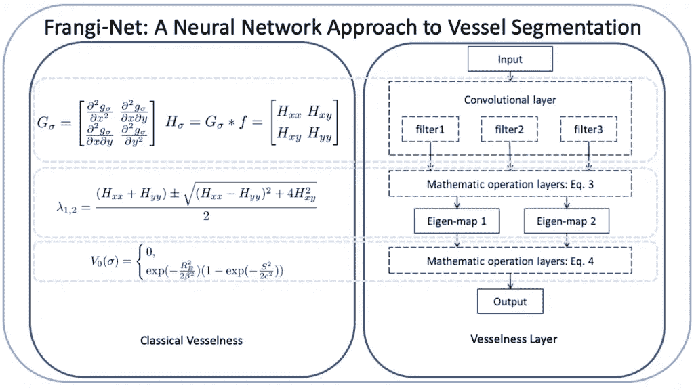

如果我们没有关于这个问题的确切知识，我们仍然可以重用经典方法的思想，如作者在 [CC 4.0 下通过许可](https://creativecommons.org/licenses/by/4.0/deed.de)创建的[傅等人的](https://link.springer.com/chapter/10.1007/978-3-662-56537-7_87)图像所示。

然而，并不是所有的应用程序都允许像 CT 那样获取如此广泛的先验知识。因此，探索我们是否也可以重新使用经典方法是很有趣的。[傅等人](https://link.springer.com/chapter/10.1007/978-3-662-56537-7_87)。在他们的 Frangi-Net 方法中这样做了。这个网络的灵感来自于[弗兰基的血管过滤器](https://link.springer.com/chapter/10.1007/bfb0056195)。他们甚至证明了像特征值计算这样的操作可以用层来表示。因此，Frangi 过滤器的大部分结构可以重复使用。特别地，卷积层适合于针对特定应用的训练。在他们的结果中，他们可以表明，对少数样本的训练确实改进了方法，并允许更好的血管分割，接近 U-net 的性能。

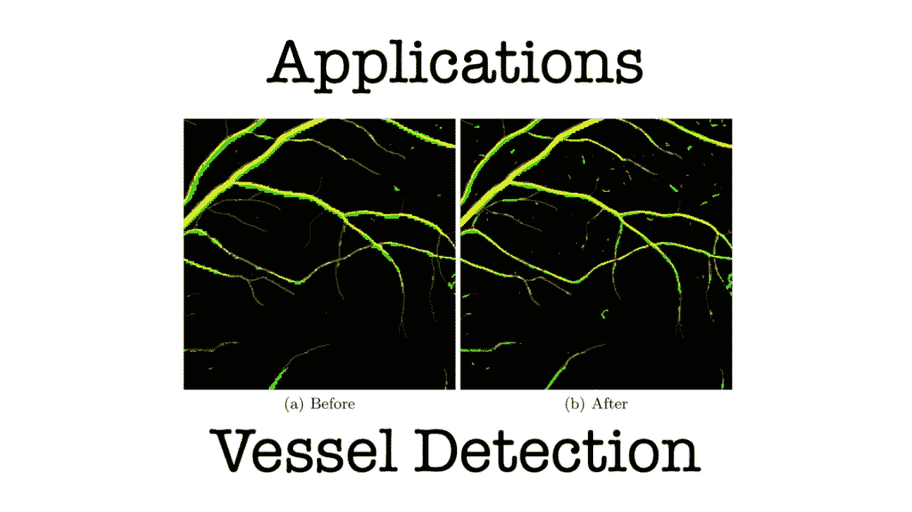

在 Frangi 滤波器中训练卷积核允许改进血管分割。这个例子的代码可以在网上实验环境[这里](https://doi.org/10.24433/CO.5016803.v2)找到。图片由作者在 [CC 4.0 下经许可](https://creativecommons.org/licenses/by/4.0/deed.de)创作。

到目前为止，我们已经看到，已知的操作符有助于产生可解释的结果，并允许我们用很少的例子来训练经典方法。我们在深度学习中通常面临的另一个大问题是结果不能很好地概括。我们将在最后一个例子中研究这个问题。

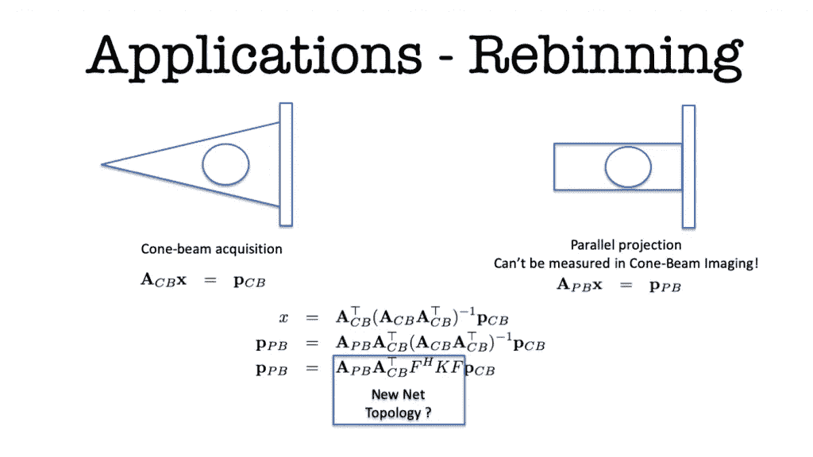

将 X 射线投影几何形状重新形成不同的空间配置通常使用逐射线插值来解决。由于 X 射线变换的线性性质，我们也能够将该问题表达为一组线性方程，无需对被扫描物体进行完全重建即可求解。由此产生的解决方案产生了一种新的网络拓扑，可以仅使用合成数据进行训练，如作者通过许可在 [CC 4.0 下创建的](https://creativecommons.org/licenses/by/4.0/deed.de) [Syben 等人的](https://link.springer.com/chapter/10.1007/978-3-030-12939-2_35)图像所示。

同样，我们来看看医学成像，特别是 X 射线成像。一个典型的问题是 X 射线投影只能在遭受透视失真的投影成像几何结构中获得。特别是在整形外科中，这种位置相关的放大倍数是不理想的，如上图左侧所示。右手侧示出了不受放大影响的平行成像的理想情况。生成的图像以正交投影的形式显示所有内容，其中度量信息得以保留，无需额外的深度校准即可立即测量骨骼和裂缝的大小。

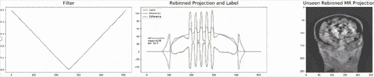

该动画显示了重排过滤器在迭代过程中的变化。左边显示了实际的滤波器配置，中间是一个训练样本和滤波器的当前输出之间的差异，右边是将当前滤波器配置直接应用于拟人幻像图像。这段代码也可以在在线实验环境[这里](https://doi.org/10.24433/CO.8086142.v2)获得。作者在 [CC 4.0 下经](https://creativecommons.org/licenses/by/4.0/deed.de)授权创作的动画。

解决这个问题的现有方法需要对几个投影进行逐射线插值。这样做必然会降低图像的空间分辨率，从而降低其诊断价值。由于两种几何形状都可以表示为矩阵乘法，我们可以求解 x 的锥束投影，并将其代入平行束投影的方程。不幸的是，该解决方案现在有一个大的矩阵求逆，这在正向传递中校准和计算是昂贵的。正如我们在 CT 解决方案中已经观察到的，这个步骤通常可以表示为傅立叶域中的卷积或逐点乘法。因此，我们假设所需的解决方案采用这种形式，并继续为解决问题的新网络定义拓扑。结果令人印象深刻，该滤波器可以仅使用使用噪声和椭圆的合成示例来训练，并直接应用于新数据，例如如上所示的拟人化模型。

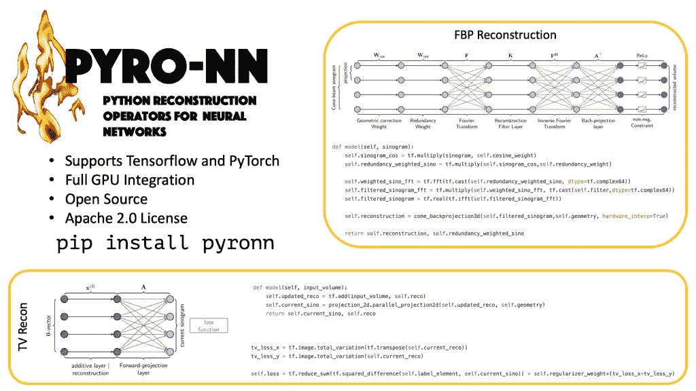

在我们基于 [GitHub](https://github.com/csyben/PYRO-NN/tree/master/examples/ct_reconstruction) 的 PYRO-NN 代码库中找到更多已知的运算符示例代码。图片由作者在 [CC 4.0 下经许可](https://creativecommons.org/licenses/by/4.0/deed.de)创作。

总之，我认为已知算子学习对于所有应用都是一种有趣的技术，在这些应用中，只有很少的训练数据，并且有众所周知的理论可用。为了集成到深层网络中，允许计算次梯度的任何操作都是合适的。这样，甚至可以使用高度非线性的操作，例如[中值滤波器](https://link.springer.com/chapter/10.1007/978-3-658-29267-6_38)。事实上，已知的操作员学习已经在很长一段时间内呈上升趋势，例如在计算机视觉中，将[整个光线跟踪器](https://link.springer.com/chapter/10.1007/978-3-319-10584-0_11)引入深度网络。我个人希望，已知的算子方法也将有助于提供对深度网络的更好理解，并使它们能够被重用，而不需要迁移学习方法。[傅等人](https://link.springer.com/chapter/10.1007/978-3-658-29267-6_61)的一些初步结果表明这是可能的。因此，我认为这种方法很有趣，可能很适合你在工作中想要解决的问题。现在去我们的在线实验环境中编码，给已知的操作者一个尝试！

如果你喜欢这篇文章，你可以在这里找到更多关于深度学习的教育材料[或者看看](https://lme.tf.fau.de/teaching/free-deep-learning-resources/)[我的 YouTube 频道](https://www.youtube.com/channel/UCoiMqX5FHfk_KDow7xSe7pg)。本文在[知识共享 4.0 归属许可](https://creativecommons.org/licenses/by/4.0/deed.de)下发布。