# 你想学 Rust 但是不知道从哪里开始

> 原文：<https://towardsdatascience.com/you-want-to-learn-rust-but-you-dont-know-where-to-start-fc826402d5ba?source=collection_archive---------5----------------------->

## Rust 初学者的完整免费资源


图片作者 [@aznhe21](https://tech-blog.optim.co.jp/entry/2019/11/08/163000)

```
**Table of Contents**[**Introduction**](#e01a)🦀 [Rust Toolchains](#7486)
🦀 [Rust Free Online Books and Resources](#6919)
🦀 [Rust Official Links](#bf5d)
🦀 [Video Tutorials](#8051)
🦀 [Podcast](#6c39)
🦀 [Interactive Learning](#1526)
🦀 [Online Books & Tutorials](#3253)
🦀 [Cheat Sheets](#0a37)
🦀 [Rust Community](#4d09) 
🦀 [Coding Challenge](#7448)
🦀 [Rust IDE Extensions](#06f5)
🦀 [Rust Ecosystem](#eba3)
🦀 [Resource for Intermediate Users](#cedb)[**Conclusion**](#91f4)
```

# 介绍

[最新更新:2020 年 9 月 2 日]

Rust 是一种现代系统编程语言，专注于安全性、速度和并发性。

下图来自基准测试游戏，展示了 Rust 相比其他编程语言的速度。你可以在这里找到与 Go 语言[的对比](https://benchmarksgame-team.pages.debian.net/benchmarksgame/fastest/rust-go.html)。

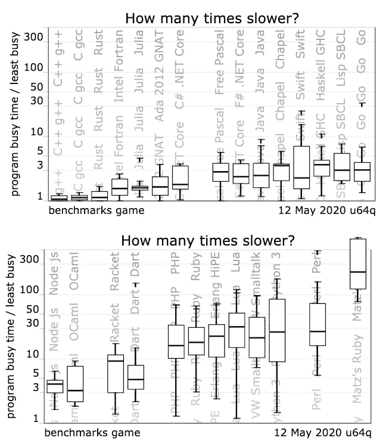

图片来自[基准测试游戏](https://benchmarksgame-team.pages.debian.net/benchmarksgame/which-programs-are-fastest.html)

在本文中，您将找到基本的 Rust 工具、最新文档、教程、视频和在线资源。

读完这篇文章后，你可以自己导航，开始以适合你学习风格的方式有效地学习 Rust 编程语言。

当你安装[锈](https://www.rust-lang.org/tools/install)时，你正在安装`rustc`、`cargo`、`rustup`等标准工具。因此，在找到所有资源之前，让我们先了解一下 Rust 工具链是做什么的。

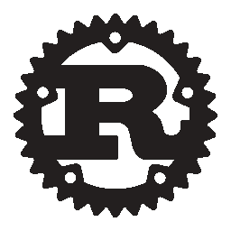

图片来自[锈](https://www.rust-lang.org/)

# 防锈工具链

工具链是一组帮助语言产生功能代码的工具。它们可以从简单的编译器和链接器程序、附加库、ide 或调试器中提供扩展功能。

## rustup

`[rustup](https://github.com/rust-lang/rustup)`安装 Rust 编程语言，使您能够在稳定版、测试版和夜间版编译器之间轻松切换，并保持更新。

您可以更新 Rust:

```
$ rustup update
```

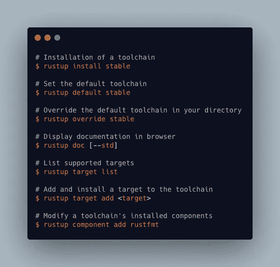

作者快速参考

## rustc

`rustc`是 Rust 编程语言的编译器。编译器获取你的源代码并生成二进制代码，要么是库，要么是可执行文件。您将使用`Cargo`而不是`rustc`运行 Rust 程序。

你可以在关于`rustc`的[参考](https://doc.rust-lang.org/rustc/what-is-rustc.html)中找到更多细节。

## 货物


图片来自[货物册](https://doc.rust-lang.org/cargo/)

[货](https://doc.rust-lang.org/cargo/index.html)是锈包经理。Cargo 下载你的 Rust 包的依赖项，编译你的包，制作可分发的包，并上传到 Rust 社区的包注册表 crates.io。

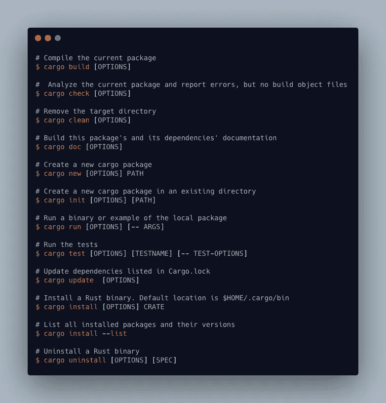

[货](https://doc.rust-lang.org/cargo/index.html)作者快速参考

## 其他官方工具

*   Clippy 是一种铁锈棉绒。
*   [rustfmt](https://github.com/rust-lang/rustfmt) 根据样式指南格式化 Rust 代码。

你可以在这个[链接](https://rust-lang-nursery.github.io/rust-toolstate/)中找到官方的工具状态。

# 免费在线书籍和资源

在尝试其他资源之前，你无法避免使用生锈的编程语言。这是你需要阅读的第一本关于铁锈的完整的书。这本书涵盖了从初学者到高级用户的主题。它用大量的例子和图表解释了所有的细节。

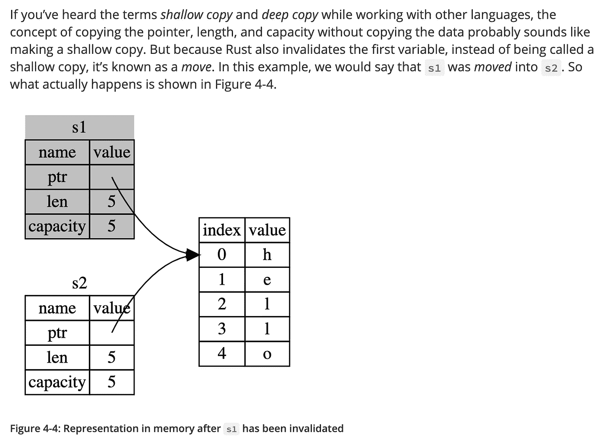

图片来自[Rust 编程语言](https://doc.rust-lang.org/book/ch04-01-what-is-ownership.html)

如果你多从例子中学习 [**举个例子**](https://doc.rust-lang.org/rust-by-example/index.html) 就适合你。这是一个可运行的例子集合，展示了各种 Rust 概念和标准库。你可以找到 20 多个例子。

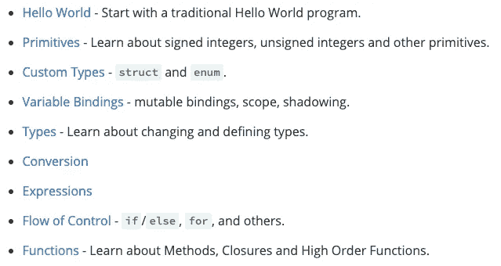

[锈由例](https://doc.rust-lang.org/rust-by-example/index.html)

您可以在浏览器中编辑和运行 Rust 代码。

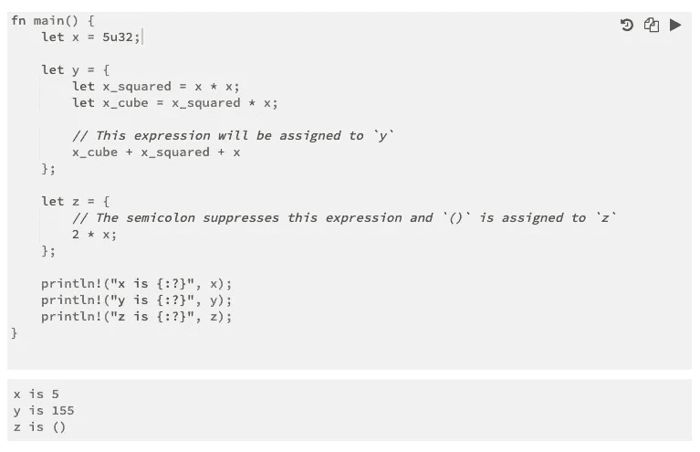

Rust by Example 中的代码示例

最后你会发现中级和高级在线资源。

Rust Cookbook[***Rust Cookbook***](https://rust-lang-nursery.github.io/rust-cookbook/intro.html)是一组简单的例子，展示了使用 Rust 生态系统的板条箱完成常见编程任务的良好实践。

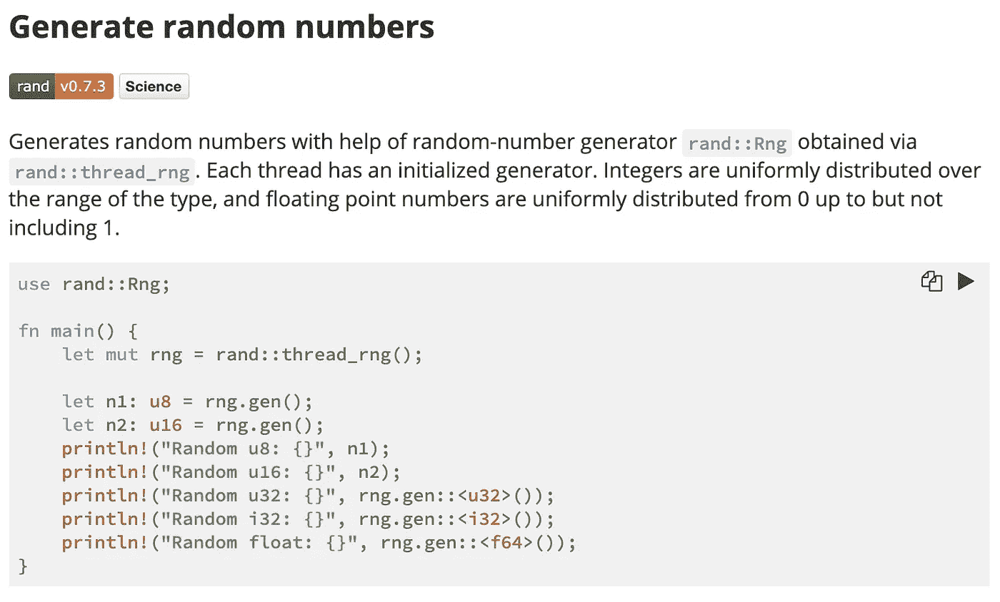

来自[铁锈食谱](https://rust-lang-nursery.github.io/rust-cookbook/algorithms/randomness.html)的样本页面

# 信任官方链接

你可以在 [**锈官网**](https://www.rust-lang.org/) 上找到很多信息。

一个**板条箱**是一个 Rust 二进制或库，你可以在 https://crates.io/[](https://crates.io/)**找到 Rust 社区的板条箱注册表。**

**包装是提供一组功能的一个或多个板条箱。一个包包含一个 Cargo.toml 文件，该文件描述了如何构建这些板条箱。**

**[**铁锈标准库**](https://doc.rust-lang.org/std/) 提供了铁锈标准库文档。**

**[**铁锈操场**](https://play.rust-lang.org) 提供了 [craits.io](https://crates.io/) 下载量最高的 100 个板条箱和[铁锈食谱](https://rust-lang-nursery.github.io/rust-cookbook/)中的板条箱。**

## **其他资源**

**[**学锈**](https://www.rust-lang.org/learn) 提供你需要的指南和文档。**

**你可以在 [**牛逼锈**](https://github.com/rust-unofficial/awesome-rust) 按类别找到项目工具库。**

**[**黑色金属教材**](https://ferrous-systems.github.io/teaching-material/) 通过幻灯片展示涵盖了基础知识到高级主题。它提供了示例代码，解释也很简洁。**

## **生锈错误**

**如果想详细了解 Rust 错误， [**Rust 编译器错误索引**](https://doc.rust-lang.org/error-index.html) 列举了所有 Rust 错误，并附有实例。**

**您的终端出错:**

**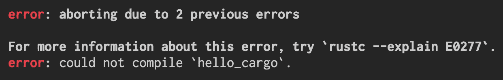**

**Rust 错误消息**

**Rust 编译器错误索引中的错误详细信息:**

**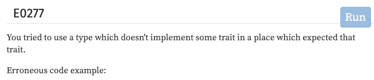**

**[错误指数](https://doc.rust-lang.org/error-index.html)**

# **视频教程**

**如果你喜欢从视频中学习，那么下面的视频将会帮助你。**

*   **[Rust:什么是所有权和借用？](https://www.youtube.com/watch?v=79phqVpE7cU&list=PLxLxbi4e2mYHj_5jpkigBn-qVLofCYnNn)由加里解释道。**
*   **瑞安·莱维克创造了[系列铁锈教程](https://www.youtube.com/watch?v=v1L91-rCiQs&list=PLZMf0YaAr2G7IzkmF_VFYdpfGbWd_lhNJ)。**
*   **[Genus-v 编程](https://www.youtube.com/c/GenusvProgramming/playlists)有 Actix 相关视频教程，包括认证服务、web 开发、GraphQL with Actix。**
*   **[Rust Web development |火箭版免费样板](https://www.youtube.com/watch?v=tjH0Mye8U_A&feature=youtu.be)，2020 年 6 月，22 分钟。**
*   **[Rust 编程:用 WebAssembly 进行浏览器计算](https://www.twitch.tv/videos/643937926)，2020 年 6 月，1 小时 55 分钟。**
*   **Rust 团队策划的视频资料。**
*   **[**Rust 简介| COM209**](https://www.youtube.com/watch?v=Y8isgiHfC0g) 教授 Rust 的一些基础知识，然后构建并运行一个简单的 app。视频拍摄于 2020 年 5 月。**
*   **[**大卫·彼得森**](https://www.youtube.com/channel/UCDmSWx6SK0zCU2NqPJ0VmDQ) 在 Youtube 和 [Twich.tv 上发布了他的现场编码](https://www.twitch.tv/davidpdrsn)它们来自 2020 年 6 月。**
*   **在 [**乔纳森教杰森 Rust！**](https://www.youtube.com/watch?v=EzQ7YIIo1rY&feature=youtu.be) 约纳森试图在几个小时内教简森·特纳铁锈基础知识。这段视频拍摄于 2020 年 5 月，3 小时 36 分钟。**
*   **在 [**帮助你学会生锈的 12 件事**](https://www.youtube.com/watch?v=a8abW3RlOn8) 中，Gary 解释了循环、变量、函数、元组、字符串等等。视频拍摄于 2020 年 4 月。**
*   **[**学习锈蚀:锈蚀**](https://www.youtube.com/watch?v=EuFxEw38aHk) 显示一些锈蚀练习的结对编程。视频拍摄于 2019 年 8 月。**
*   **[瑞安·莱维克的《流播铁锈》](https://www.youtube.com/channel/UCpeX4D-ArTrsqvhLapAHprQ)**
*   **锈壳:2020 年 5 月的迭代器。**
*   **[2020 年 5 月起在 Rust and Substrate](https://www.youtube.com/watch?v=qaykNPHJcyw) 构建类似比特币的区块链。**
*   **[into_rust()](http://intorust.com/) 是 2016 年的，但是解释了所有权、共享借用、可变借用等基本概念。**
*   **[基线。铁锈](https://www.youtube.com/playlist?list=PL7mNAQHLbrTtw-Zw47wMkRVBoTwe12edz)扎伊特作品**
*   **[你好锈！](https://www.youtube.com/c/HelloRust/featured)**
*   **[选择 Rust——Clint Frederickson](https://www.youtube.com/watch?v=DMAnfOlhSpU)Clint 分享了他选择 Rust 的经验，以及为什么它可能是您下一个项目的正确选择。**

# **播客**

**[**Rustacean Station 播客**](https://rustacean-station.org/) 是一个为 Rust 编程语言创建播客内容的社区项目。**

****

**[铁锈的非官方吉祥物](https://rustacean.net/)**

# **互动学习**

**如果你喜欢边做边学，那么这些是给你的。**

**[**Rust 之旅**](https://tourofrust.com/index.html) 是一个逐步引导 Rust 编程语言特性的指南。它涵盖了基础知识、基本控制流、基本数据结构类型和泛型类型。**

**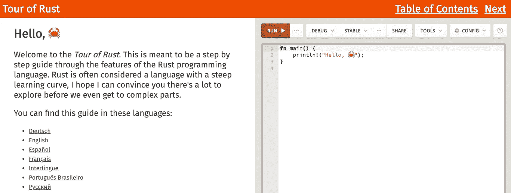**

**[锈之旅](https://tourofrust.com/index.html)**

**[**rustlings**](https://github.com/rust-lang/rustlings) 有小练习让你习惯读写 Rust 代码。你可以把它和 Rust 编程语言一起使用。**

**您可以开始练习:**

```
rultlings watch
```

**当你保存文件时，它会自动检查答案并给你反馈。**

**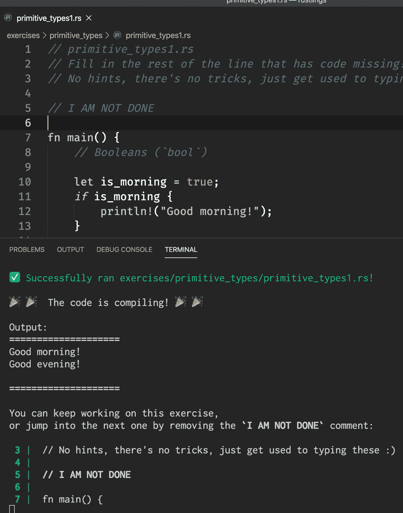**

**作者图片**

**完成一个练习后，您需要删除该行:**

```
// I AM NOT DONE
```

**保存文件后，它将进入下一个练习。**

**`rustlings`提供有用的提示，给出文档链接。**

**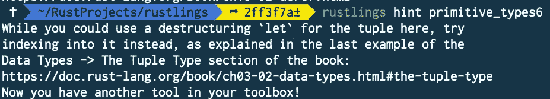**

**作者图片**

**[**exercisem**](https://exercism.io/)是 100%免费的代码练习和指导。它完全是开源的，依赖于成千上万志愿者的贡献。**

**它将指导你如何在你的计算机上安装它。你不仅可以学习 Rust，还可以学习其他 50 种编程语言。**

**当你在你的电脑上完成一个编码挑战时，你上传你的解决方案并和一个导师一起检查它。**

**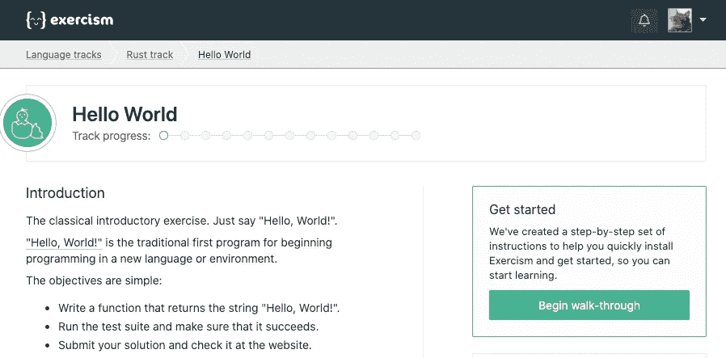**

**[](https://exercism.io/)**

****[](/learning-rust-by-converting-python-to-rust-259e735591c6) [## 通过将 Python 转换成 Rust 来学习 Rust

### Rust 基础入门教程

towardsdatascience.com](/learning-rust-by-converting-python-to-rust-259e735591c6) [](/a-comprehensive-tutorial-to-rust-operators-for-beginners-11554b2c64d4) [## 一个全面的教程，以信任运营商的初学者

### 方法、相关函数、将 Python 转换成 Rust 等等

towardsdatascience.com](/a-comprehensive-tutorial-to-rust-operators-for-beginners-11554b2c64d4) [](/unsinged-signed-integers-and-casting-in-rust-9a847bfc398f) [## 关于无符号、有符号整数和 Rust 中的造型，你应该知道什么

### 理解符号和幅度、一的补码和二的补码

towardsdatascience.com](/unsinged-signed-integers-and-casting-in-rust-9a847bfc398f) 

# 在线书籍和教程

*   尼尔森·艾尔哈格正在用铁锈创造[终极井字游戏](https://www.minimax.dev/docs/ultimate/)。
*   Sheshbabu Chinnakonda 对 Rust 模块系统的清晰解释
*   [DEV](https://dev.to/t/rust)2020 年 6 月有 70 多篇 Rust 相关文章。
*   如果你是一名 JavaScript 开发人员，Shesh 为你准备了[文章](http://www.sheshbabu.com/)。例如 [Rust for JavaScript 开发者——函数和控制流](http://www.sheshbabu.com/posts/rust-for-javascript-developers-functions-and-control-flow/)。
*   [史蒂夫·J·多诺万](https://stevedonovan.github.io/rust-gentle-intro/readme.html#a-gentle-introduction-to-rust)对铁锈的温和介绍
*   用 Rust 和 Rocket 构建一个智能书签工具
*   [极其简单的铁锈火箭框架教程](https://frogtok.com/extremely-simple-rust-rocket-framework-tutorial/)
*   [学锈](https://learning-rust.github.io/)
*   你可以在[24 天铁锈](https://zsiciarz.github.io/24daysofrust/index.html)中找到关于铁锈库/箱子的信息。
*   [Rust+Actix+cosmos db(MongoDB)教程 api](https://dev.to/jbarszczewski/rust-actix-cosmosdb-mongodb-tutorial-api-17i5)
*   [极其简单的铁锈火箭框架教程](https://frogtok.com/extremely-simple-rust-rocket-framework-tutorial/)
*   [用 Rust 和 Rocket 构建智能书签工具](https://developers.facebook.com/blog/post/2020/06/03/build-smart-bookmarking-tool-rust-rocket/)
*   [Rust Sokoban](https://sokoban.iolivia.me/) 是在 Rust 中制作 [Sokoban](https://en.wikipedia.org/wiki/Sokoban) 副本的扩展教程。它使用现有的 2D 游戏引擎，预先制作的资产，到最后，它会有一个完整的工作游戏。你可以找到如何使用它的例子。
*   [用过多的链表学习 Rust】。在线书籍通过实现 6 个链表来教授基本和高级 Rust 编程。](https://rust-unofficial.github.io/too-many-lists/index.html#learn-rust-with-entirely-too-many-linked-lists)
*   [半小时学 Rust](https://fasterthanli.me/articles/a-half-hour-to-learn-rust) 讲解 Rust 关键词和符号。

# 备忘单

*   [锈类周期表](http://cosmic.mearie.org/2014/01/periodic-table-of-rust-types/):该表将锈类组织成正交表格形式，更容易理解和推理。
*   [锈串转换](https://docs.google.com/spreadsheets/d/19vSPL6z2d50JlyzwxariaYD6EU2QQUQqIDOGbiGQC7Y/pubhtml?gid=0&single=true)
*   [Rust 迭代器备忘单](https://danielkeep.github.io/itercheat_baked.html)
*   [铁锈容器 Cheet 表](https://docs.google.com/presentation/d/1q-c7UAyrUlM-eZyTo1pd8SZ0qwA_wYxmPZVOQkoDmH4/edit)

# Rust 社区

## 博客和时事通讯

*   [**铁锈社区**页面](https://www.rust-lang.org/community)。
*   我强烈推荐**[**本周在锈**](https://this-week-in-rust.org/)**。它每周提供关于 Rust 的最新信息。****
*   ****[**“锈博**](https://blog.rust-lang.org/)**是主要的锈博。核心团队利用这个博客宣布 Rust 世界的重大进展。******
*   ******[**“铁锈博客里面的**](https://blog.rust-lang.org/inside-rust/index.html)**”**是针对那些希望跟随铁锈发展的人。******
*   ****布莱恩的**[**Rust 博客文章**](https://github.com/brson/rust-anthology/blob/master/master-list.md)**页面是按类别组织的，有很多博客文章。********
*   ******如果你是一名 C 程序员，克里夫·毕夫勒(Cliff L. Biffle)的**[**学锈的危险方法**](http://cliffle.com/p/dangerust/)**就是为你准备的。**********
*   ******[**Llogiq 上的东西**](https://llogiq.github.io/)******
*   ****[**尼科·马特萨基斯**](http://smallcultfollowing.com/babysteps/)****

## ****我在哪里可以得到帮助？****

****[**Rust Discord**](https://discord.com/invite/rust-lang) 有很多活跃成员，其中一个版块是给初学者的。****

****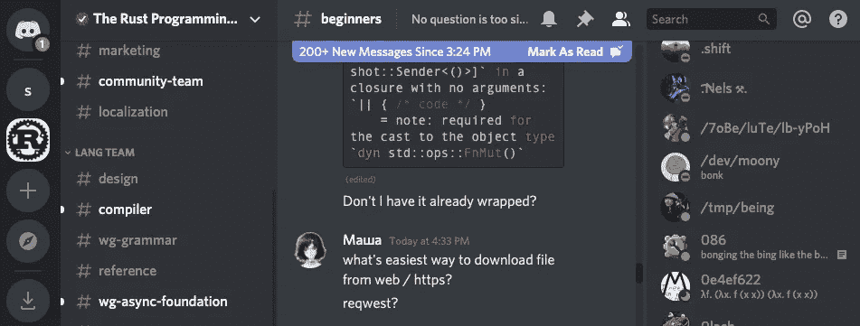****

****Rust Discord 初学者部分****

****[**Rust 用户论坛**](https://users.rust-lang.org/) 是关于 Rust 编程语言的帮助、讨论和公告。****

****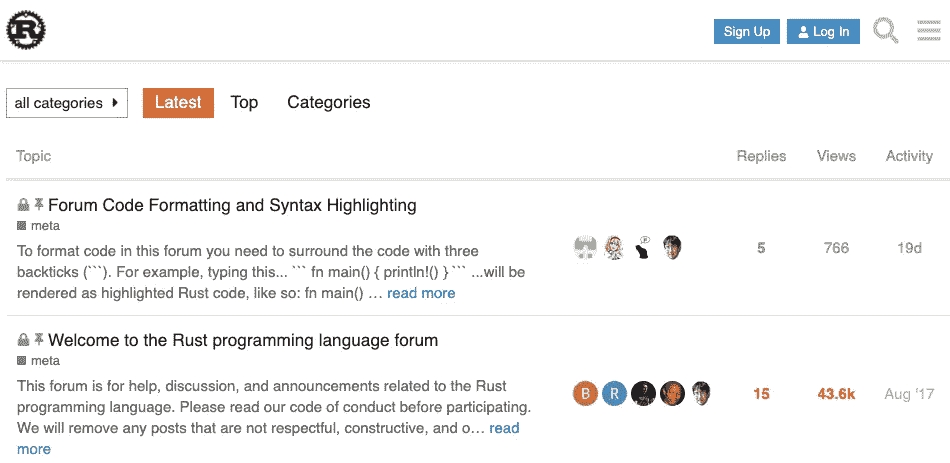****

****Rust 用户论坛****

****[**stack overflow**](https://stackoverflow.com/questions/tagged/rust)有超过 16000 个问题。 [Shepmaster](https://stackoverflow.com/users/155423/shepmaster?tab=profile) 是世界上第一家 Rust 咨询公司的联合创始人，他回答了许多 Rust 的问题。****

****Reddit 的“Rust 编程语言”有 105，000 名成员。****

****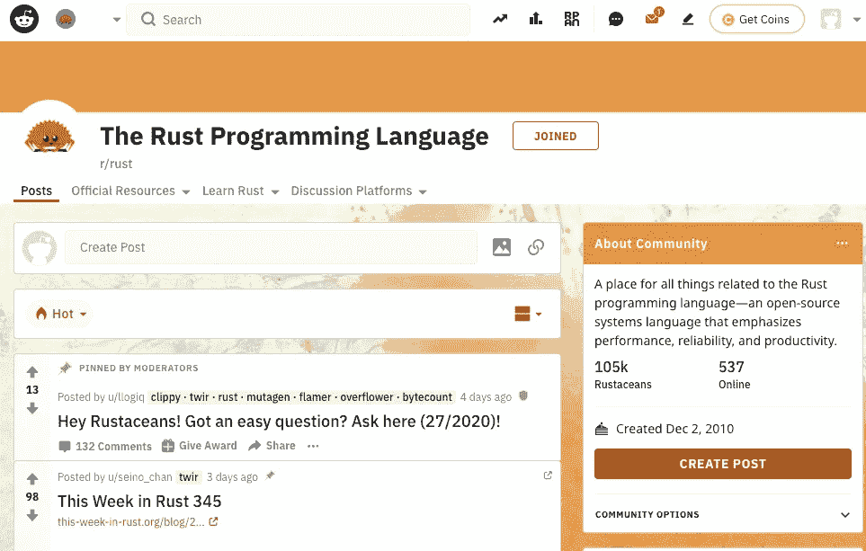****

****[https://www.reddit.com/r/rust/](https://www.reddit.com/r/rust/)****

## ****在 Twitter 上关注的人****

****[#rustlang](https://twitter.com/search?q=rustlang&src=typed_query) 、 [#learnrust](https://twitter.com/hashtag/learnrust) 和[# learningrust](https://twitter.com/hashtag/learningrust)
[Rust lang](https://twitter.com/rustlang)
[史蒂夫·克拉布尼克](https://twitter.com/steveklabnik)
[艾丹·霍布森·塞耶斯](https://twitter.com/aidanhs)
[阿什莉·威廉姆斯](https://twitter.com/ag_dubs)
[卡罗尔·尼科尔斯](https://twitter.com/Carols10cents)
尼科·马萨基斯
[尼克·卡梅隆](https://twitter.com/nick_r_cameron)**** 

## ****Rust 聚会****

****有很多 [**Rust Meetup 群**](https://www.meetup.com/find/?allMeetups=false&keywords=rust&radius=Infinity&userFreeform=New&mcId=c10001&change=yes&sort=recommended&eventFilter=mysugg) 运行在线会议。您也可以在 [**Rust 社区日历**](https://calendar.google.com/calendar/embed?src=apd9vmbc22egenmtu5l6c5jbfc@group.calendar.google.com) 中找到会议。****

# ****编码挑战****

*   ****[**LeetCode**](https://leetcode.com/problemset/all/) 有很多问题你可以用 Rust 在线解决。****
*   ****[**exercisem . io**](https://exercism.io/tracks/rust/exercises)在铁锈赛道上有 92 次练习。****
*   ****[**球体在线判断**](https://www.spoj.com/problems/classical/) 有很多问题你可以挑战。****
*   ****您参与编写您在 [**CodinGame**](https://www.codingame.com/home) 直接在线玩的游戏的代码。你可以用 Rust 写你的代码。****

# ****防锈扩展****

****你可以在这里找到你的编辑器[的 Rust 集成。如果你是 VS 代码用户，可以安装](https://www.rust-lang.org/tools) [**rls-vscode**](https://github.com/rust-lang/rls-vscode) 扩展。****

****Rust 语言服务器，RLS 提供了一个在后台运行的服务器，为 ide、编辑器和其他工具提供有关 Rust 程序的信息。它支持代码完成，跳转到定义，代码格式化，以及[更多的](https://github.com/rust-lang/rls-vscode#rust-support-for-visual-studio-code)。****

****Rust Lang 编译器团队创建了 rls-2.0 工作组。目标是让用户获得更好的 RLS 体验。****

****你可以在[**rust-analyzer**](https://github.com/rust-analyzer/rust-analyzer)中找到它们的实现，rust-analyzer 支持不同的[ide](https://rust-analyzer.github.io/manual.html#installation)。****

****你可以在 [**找到你的编辑有多支持 Rust 我们(我)DE 了吗？**](https://areweideyet.com/)****

# ****铁锈生态系统****

****在 [**crates.io**](https://crates.io/categories) 可以找到很多库。这里有一些你可能感兴趣的类别。****

## ****Web 框架****

****根据 [Web 框架基准测试](https://www.techempower.com/benchmarks/#section=data-r19)，Actix 是最快的框架。有十个活跃的 Rust web 框架。 [**Actix**](https://github.com/actix/actix) **，** [**火箭**](https://rocket.rs/) **，** [**哥谭**](https://gotham.rs/) **，** [**种子**](https://github.com/seed-rs/seed) 等。你可以从 [web 框架对比](https://github.com/flosse/rust-web-framework-comparison)中找到更多信息。****

*   ****[简单火箭 Web 框架教程|帖子请求](https://frogtok.com/simple-rocket-web-framework-tutorial-part-2in/)****

## ****Web 开发****

****最快的铁锈模板引擎，[旗鱼](https://github.com/Kogia-sima/sailfish/)。它声称比车把快 200 倍。****

## ****WebAssembly(最新更新:2020 年 6 月 29 日)****

****如果你对 WebAssembly 感兴趣，那么下面的链接会对你有所帮助。****

*   ****[**锈官网首页**](https://www.rust-lang.org/what/wasm)****
*   ****[WASM 工作组](https://rustwasm.github.io/)和[锈与网组](https://rustwasm.github.io/docs/book/) y 组。****
*   ****[Rust 和 WebAssembly 从零开始:Hello World with Strings](https://depth-first.com/articles/2020/07/07/rust-and-webassembly-from-scratch-hello-world-with-strings/)****
*   ****【WebAssembly 和 Rust 入门****
*   ****[web assembly with Rust and React(使用 create-react-app)](https://dev.to/lokesh007/webassembly-with-rust-and-react-using-create-react-app-67)****
*   ****[使用 Rust 和 WebAssembly 处理视频源中的像素](https://dev.to/fallenstedt/using-rust-and-webassembly-to-process-pixels-from-a-video-feed-4hhg)****
*   ****[了解 WebAssembly 文本格式](https://developer.mozilla.org/en-US/docs/WebAssembly/Understanding_the_text_format)****
*   ****[从 Rust 编译到 WebAssembly](https://developer.mozilla.org/en-US/docs/WebAssembly/Rust_to_wasm)****
*   ****[林·克拉克《与 WASI 一起将 WebAssembly 带到 web 之外》](https://www.youtube.com/watch?v=fh9WXPu0hw8)解释了 WASI 是如何工作的，并探讨了不同的用例如何从中受益。****
*   ****Yew 是一个 Rust/Wasm 框架，用于构建客户端 web 应用程序。****
*   ****亚历山大·海因茨[Rust+web assembly—EdgeXR @ Netlight](https://www.youtube.com/watch?v=dmbqpg5BuBY)****

## ****建立工作关系网****

*   ****锈官方页面上 [**联网**](https://www.rust-lang.org/what/networking) 。****

## ****嵌入式设备****

*   ****[**嵌入式设备**](https://www.rust-lang.org/what/embedded) 上的锈官页面。****
*   ****[**《嵌锈书》**](https://docs.rust-embedded.org/book/intro/index.html) 。****

## ****桌面开发****

****FLTK 图形用户界面库的 Rust 绑定， [fltk-rs](https://github.com/MoAlyousef/fltk-rs) 。视频教程[这里](https://www.youtube.com/watch?v=ygP4egJtmzw)。****

## ****数据科学****

*   ****《数据科学之家》有一系列关于 [Rust 和机器学习](https://datascienceathome.com/tag/rust/)的播客。****
*   ****[**Amadeus**](https://github.com/constellation-rs/amadeus) 在 Rust 中提供了和谐的分布式数据分析。****
*   ****[**ndarray**](https://crates.io/crates/ndarray) 相当于 Python 的 numpy。****

## ****游戏开发(最新更新，2020 年 7 月 13 日)****

*   ****[将 Godot 游戏移植到 Rust(第一部分)](https://paytonrules.com/post/games-in-rust-with-godot-part-one/)****
*   ****Rust 游戏开发工作组每月都有简讯。****
*   ****[**ggez**](https://ggez.rs/) 是一个轻量级的游戏框架，以最小的摩擦制作 2D 游戏。它的目标是实现一个基于[**lve**](https://love2d.org/)游戏框架的 API。它包含可移植的 2D 绘图、声音、资源加载和事件处理。****
*   ****[**规格**](https://github.com/amethyst/specs) 是用 Rust 编写的实体组件系统(ESC)。它是最流行的 [ESC 库](https://specs.amethyst.rs/docs/tutorials/01_intro.html)。****
*   ****[**godot-rust**](https://github.com/godot-rust/godot-rust) 是对 [Godot 游戏引擎](http://godotengine.org/)的 rust 绑定。****
*   ****[锈](https://medium.com/@recallsingularity/gorgeous-godot-games-in-rust-1867c56045e6)中华丽的戈多游戏。****
*   ****[带戈多和铁锈的军团 ECS](https://hagsteel.com/posts/godot-rust-legion/)。****

## ****终端(最新更新，2020 年 7 月 13 日)****

*   ****锈官方页面上的 [**命令行应用**](https://www.rust-lang.org/what/cli) 。****
*   ****[**Rustbox**](https://github.com/gchp/rustbox) 是一个提供 API 的库，允许程序员编写基于文本的用户界面。****
*   ****[**Tui-rs**](https://github.com/fdehau/tui-rs) 是一个构建丰富终端用户界面和仪表盘的 Rust 库。****
*   ****[**termin**](https://github.com/redox-os/termion)是一个纯 Rust、无绑定的库，用于低级处理、操作和读取关于终端的信息。****
*   ****[**Crossterm**](https://github.com/crossterm-rs/crossterm) 是一个纯粹的终端操作库，它使得编写跨平台的基于文本的界面成为可能。****
*   ****Pancurses 是 Rust 的 curses 库，它提供了一个比普通 curses 函数更质朴的界面以方便使用，同时与 curses 保持足够的接近以方便移植。****
*   ****[**StructOpt**](https://crates.io/crates/structopt) 通过定义一个 struct 来解析命令行参数。它结合了`clap`和自定义派生。****
*   ****或者命令行参数解析器是一个简单易用、高效且完全可配置的库，用于解析命令行参数。****
*   ****[**Gtk-rs**](https://gtk-rs.org/) 是 [Rust](https://www.rust-lang.org/) 绑定用于 [GTK+ 3](https://developer.gnome.org/gtk3/stable/) 、 [Cairo](http://cairographics.org/documentation/) 、 [GtkSourceView](https://wiki.gnome.org/Projects/GtkSourceView) 和其他 [GLib](https://developer.gnome.org/glib/stable/) 兼容的库。它提供了许多现成的 UI 小部件。****

## ****操作系统开发****

****[**OSDev，**](https://rust-osdev.com/)Rust 贴子中的操作系统开发给出了 RustOSDev 工具和库最重要变化的常规概述。****

## ****其他语言的 Rust 绑定****

****`[**bindgen**](https://github.com/rust-lang/rust-bindgen)`自动生成到 C(和一些 C++)库的 Rust FFI 绑定。****

****[**PyO3**](https://pyo3.rs/v0.9.2/get_started.html) 包括运行 Rust 二进制中的 Python 代码并与之交互。
[**玛拉的博客**](https://blog.m-ou.se/writing-python-inside-rust-1/) 经历了创建 [inline-python](https://crates.io/crates/inline-python) 的过程。****

****你可以在 [**carates.io**](https://crates.io/keywords/bindings) 找到更多绑定。****

## ****序列化和反序列化****

****[**Serde**](https://serde.rs/) 是一个序列化和反序列化 Rust 数据结构的框架。****

****[序列化](https://medium.com/better-programming/serialization-and-deserialization-ba12fc3fbe23)采用内存中的数据结构，并将其转换为一系列可以存储和传输的字节。反序列化接受一系列字节，并将其转换为可以以编程方式使用的内存中数据结构。****

## ****ORM****

****[**Diesel**](http://diesel.rs/) 是 Rust 的一个安全的、可扩展的 ORM 和查询构建器。****

# ****中间用户的资源****

****如果你喜欢冒险，你可以看看下面这些。****

*   ****Rust 中的 [**命令行应用**](https://rust-cli.github.io/book/index.html) 对于刚接触这种语言并使用简单命令行界面(CLI)编写程序的初学者来说是很好的练习。您将接触到 Rust 的一些核心概念以及 CLI 应用程序的主要方面。****
*   ****[**Rust API 指南**](https://rust-lang.github.io/api-guidelines/) 是一套关于如何为 Rust 编程语言设计和呈现 API 的建议。****
*   ****[**rustc 书**](https://doc.rust-lang.org/rustc/index.html) `rustc`是 Rust 编程语言的编译器。编译器获取你的源代码并生成二进制代码，要么是库，要么是可执行文件。****
*   ****[**货物手册**](https://doc.rust-lang.org/cargo/index.html) 告诉你关于货物的一切。****
*   ****你可以在 [**版本指南**](https://doc.rust-lang.org/edition-guide/introduction.html) 中读到关于 Rust 的新的大变化。****
*   ****[**Rust Language Cheat Sheet**](https://cheats.rs/)面向有经验的程序员和中级 Rust 用户。如果你喜欢可视化的例子驱动的内容，这是给你的。你可以从它的 Github repo 下载 PDF。****
*   ****[**Rust Forge**](https://forge.rust-lang.org/index.html) 作为 Rust 编程语言成员有用的补充文档库。****
*   ****[**Rust 参考**](https://doc.rust-lang.org/reference/introduction.html) 是 Rust 编程语言的主要参考。它提供了语言构造和使用、内存模型、并发模型、运行时服务等等。****
*   ****Philipp Oppermann 写了[用 Rust 写了一个操作系统](https://os.phil-opp.com/)。****
*   ****Michael F Bryan 在[写了关于使用 Const Generics](http://adventures.michaelfbryan.com/posts/const-arrayvec/) 实现 ArrayVec 的文章。****
*   ****[使用 CLI 深入 Rust】展示了如何创建 CLI 应用程序。](https://kbknapp.dev/rust-cli/)****
*   ****dtolnay 写了关于 [Rust 宏开发案例研究](https://github.com/dtolnay/case-studies)。****
*   ****卡尔·弗雷德里克·萨姆森的《异步防锈实用指南》****
*   ****[安全 Rust 指南— ANSSI(法国国家网络安全局)](https://anssi-fr.github.io/rust-guide/)****
*   ****[Rust OpenCV 绑定](https://github.com/twistedfall/opencv-rust/)****
*   ****[嵌入式开发](https://github.com/rust-embedded/wg)****
*   ****[铁锈图案](https://github.com/rust-unofficial/patterns)****
*   ****[加快 Rust 编译速度的技巧](https://endler.dev/2020/rust-compile-times/)****
*   ****[铁锈验证工具](https://alastairreid.github.io/rust-verification-tools/)****

## ****新手教程****

*   ****[**学习 Rust:让我们构建一个解析器**](https://codeandbitters.com/lets-build-a-parser/)****
*   ****[**小琴弦在生锈**](https://fasterthanli.me/articles/small-strings-in-rust)****
*   ****[**伺服**](https://servo.org/) 是一款现代的高性能浏览器引擎，专为应用程序和嵌入式应用而设计。****
*   ****[**迈克尔-F-布莱恩**](http://adventures.michaelfbryan.com/) 正在写[锈文章](http://adventures.michaelfbryan.com/tags/rust/)。****
*   ****[**勉强起作用**](https://blog.mgattozzi.dev/) 正在写[锈文章](https://blog.mgattozzi.dev/author/michael/) **。******
*   ******Niko Matsakis** 写了[他对铁锈的想法](https://smallcultfollowing.com/babysteps/)。****

## ****边做边学****

*   ****[**学习-opengl-rs**](https://github.com/bwasty/learn-opengl-rs)****
*   ****[**【vulkann-教程-rs**](https://github.com/bwasty/vulkan-tutorial-rs#setup)****

## ****嵌入式系统****

*   ****[**黑色金属教材**](https://github.com/ferrous-systems/teaching-material/)****
*   ****[**嵌入式-培训-2020**](https://github.com/ferrous-systems/embedded-trainings-2020)****

# ****结论****

****有数以百万计的网上资源。希望你找到最合适的学习资源，开始学习 Rust 编程语言。****

****如果我错过了什么，请让我知道。****

******通过** [**成为**](https://blog.codewithshin.com/membership) **会员，获得媒体上所有故事的访问权限。******

********

****[请订阅。](https://blog.codewithshin.com/subscribe)****

****[](/rust-powered-command-line-utilities-to-increase-your-productivity-eea03a4cf83a) [## Rust-Powered 命令行实用程序可提高您的工作效率

### 您腰带下的现代快速工具

towardsdatascience.com](/rust-powered-command-line-utilities-to-increase-your-productivity-eea03a4cf83a) [](/awesome-rust-powered-command-line-utilities-b5359c38692) [## 7 个强大的 Rust 驱动的命令行工具

### 适合每个开发人员的现代 Linux 命令

towardsdatascience.com](/awesome-rust-powered-command-line-utilities-b5359c38692)********