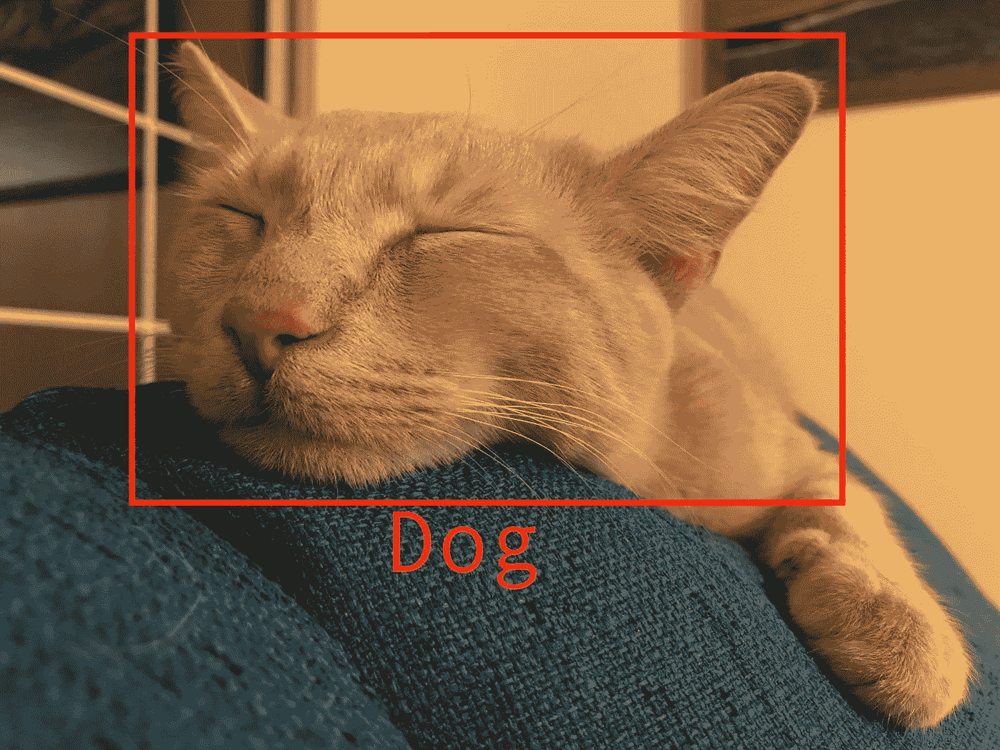

# 你的 AI 会让你尴尬

> 原文：<https://towardsdatascience.com/your-ai-will-embarrass-you-fb17e55a97c2?source=collection_archive---------33----------------------->

去年 1 月的一个周末，两家全球领先的人工智能公司发现自己陷入了令人尴尬的错误。脸书的自动翻译无意中把“习主席”翻译成了“【Shithole 先生”(缅甸语)，而苹果[在 Siri 回复关于以色列的查询时提到“犹太复国主义占领国”后招致了批评](https://www.dailywire.com/news/apples-siri-told-iphone-users-that-israel-is-a-zionist-occupation-state-after-a-wikipedia-hack)

我不羡慕相关的公关团队，显然脸书和苹果犯了错误。但这里真正的教训不是关于硅谷偏见或反犹太主义或文化敏感性。是关于 AI 的。具体来说，不要使用人工智能，除非你能容忍令人震惊的令人尴尬的错误。

只要 AI 犯了任何错误，它就会犯令人尴尬的错误。这并不奇怪。对一个人工智能系统来说，动作要么正确，要么不正确。当 Google 相册将你的朋友标记为“朋友”时，这是正确的。其他都不正确。就人工智能而言，其他一切都是*同样*不正确的。

当然，世界并不完全是这样的。当 Google Photos [错误地将两个黑人标记为“大猩猩”](https://mashable.com/2015/07/01/google-photos-black-people-gorillas/)时，其后果比它将一束芭蕉标记为“香蕉”要严重得多。

人工智能设计师当然可以尝试解决这个问题。他们可以给系统一个正确的标签 1 分，一个不正确的标签 0 分，一个引发地缘政治危机的标签负 1000 分。这也许能解决眼前的问题，但从长远来看，这是徒劳的。引发危机的错误是人工智能程序不太可能捕捉到的环境和社会细微差别的产物。

尽管人工智能倾向于产生令人难堪的错误，但它仍然是一个非常有价值的技术家族。因此，值得回顾一下它成功部署的场景。

一个明显的例子是令人尴尬的错误完全可以接受的领域。广告就是一个很好的例子。只要广告平台继续印刷大量淫秽的钱，令人尴尬的错误可以被忽视。当一个网站向你展示一个你已经购买的产品的广告时，这是一个令人尴尬的错误。也许你会把它截图下来，并在推特上向你所有的关注者讲述在线广告商有多愚蠢。但也就到此为止了。就广告商而言，唯一的坏处是他们给你看了一个你不会买的东西的广告。换句话说，尴尬错误的唯一问题是它是一个错误。

在令人尴尬的错误不可接受的情况下，最好的方法是在模型和用户之间提供一层隔离。这就是谷歌最终在前述案例中所做的:他们[实施了一个黑客](https://www.theverge.com/2018/1/12/16882408/google-racist-gorillas-photo-recognition-algorithm-ai)，当它产生像“大猩猩”、“黑猩猩”或“猿”这样的标签时，它会忽略图像识别模型关键的一点是，他们接受了这个模型将继续产生令人尴尬的错误，无论如何尝试修复它，所以他们设计了一个外部过程来改善这些错误。

如果系统不需要完全自动化，一个有效的方法是使用人工智能进行决策支持，而不是作为独立的决策者。这种模式在医疗保健领域可能尤为重要。IBM 的 Watson Health 报告了一些有希望的准确性指标，但它容易犯令人尴尬的危险错误，这破坏了它在医生中的可信度。在[的一个令人难忘的例子中，它建议给严重出血的病人服用会加剧出血的药物。如果沃森被更明确地框定为一种工具，通过提出治疗方案供考虑来帮助医生，那么错误可能会更容易容忍。](https://www.theverge.com/2018/7/26/17619382/ibms-watson-cancer-ai-healthcare-science)

关于人工智能将如何影响社会，有许多悬而未决的问题。这些问题的答案将取决于系统设计者和消费者如何处理令人尴尬的错误。例如，想象一下，自动驾驶汽车达到了统计上比人类司机更安全的程度，但少数致命事故是由无法解释的故障造成的。乘客会相信一个比人类司机更安全，但也更有可能在人类可以很好处理的情况下坠毁的人工智能吗？时间会证明一切。

人工智能带来了很多好处，毫无疑问，我们将继续看到它在各种各样的环境中使用。但在你决定将人工智能加入你的业务之前，花一点时间考虑一下，你将如何回应你的新工具侮辱中国国家主席。