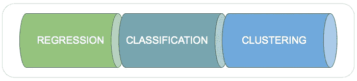
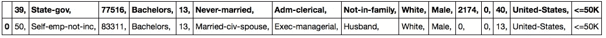
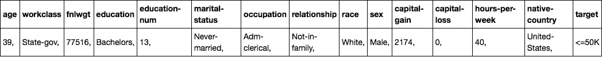
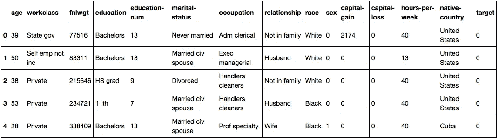
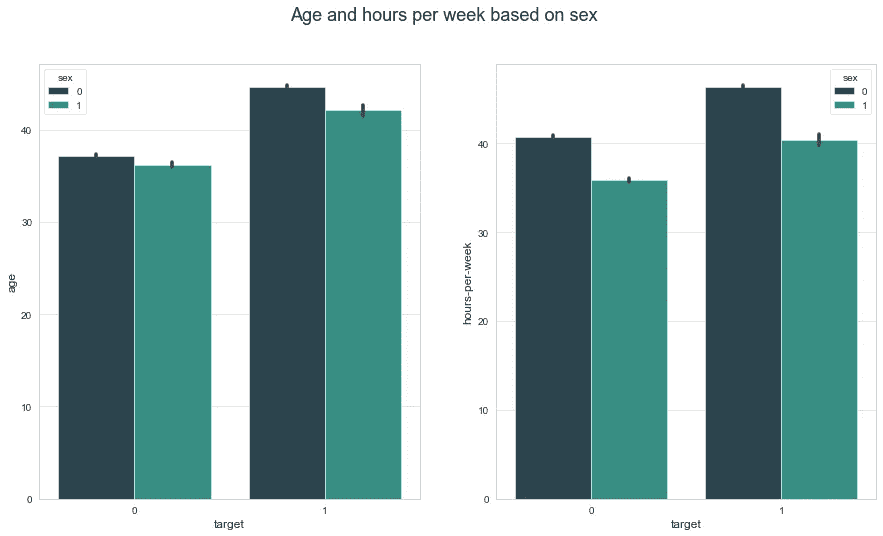
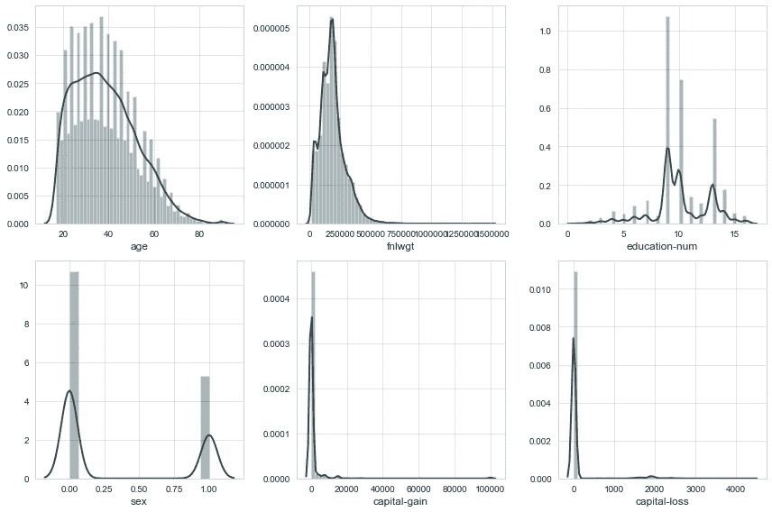
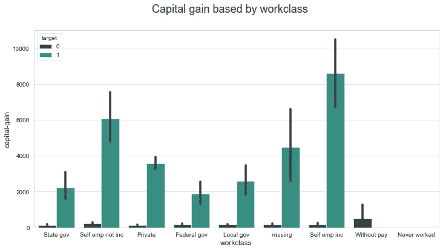
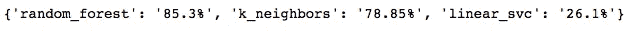
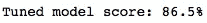
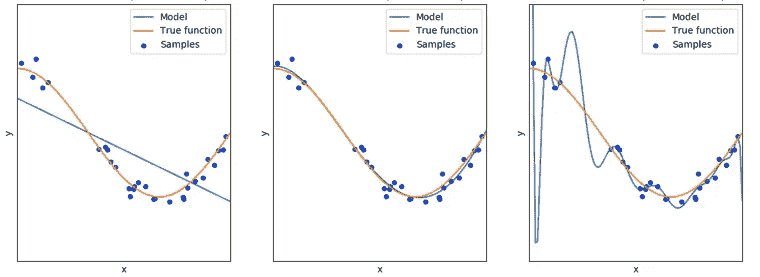

# 你的机器学习模型完全指南

> 原文：<https://towardsdatascience.com/your-complete-guide-to-machine-learning-models-403b4716172c?source=collection_archive---------42----------------------->

## 使用哪种模型，何时使用，为什么？如何调优你的算法？让我们一起投入进去吧！

照片由[张秀坤镰刀](https://unsplash.com/@drscythe?utm_source=medium&utm_medium=referral)在 [Unsplash](https://unsplash.com?utm_source=medium&utm_medium=referral) 上拍摄

# 简介

通常，你通过在互联网上寻找指南来开始你的机器学习研究，这些指南将帮助你——最终——将一个项目带入生活，对吗？

随着时间的推移，你开始意识到有很多东西要学，并开始思考你是否有能力做到。过于困难的教程、不充分的解释、问题；“也许我不够好，”你想。

在故事的结尾，你会准确地认出每一步。我们开始吧！

# 你今天会学到什么？

*   如何选择将提供最佳结果的模型；
*   创建机器学习模型所需的每个过程；
*   如何准备您的数据:将分类转换为数值，填充空值，等等；
*   如何创建功能，帮助您自动化您的工作过程，以及更多！

我们将使用 scikit-learn 库。在极简主义的定义中，每个机器学习过程都围绕这个库旋转。[点击这里](https://scikit-learn.org/)了解更多。

# 我应该使用哪种机器学习算法？

这是第一个问题，也是最重要的问题。如果选择了不正确的估计量(aka 模型)，就会产生错误的推论。这通常取决于您的数据和您想要预测的内容。**输出决定了这里的规则。**

图片由[雷南·洛里科](https://medium.com/@renfelo)拍摄——中号

# 回归

如果你需要预测几个数字输出，比如工资，这就需要一个回归估计器。与分类不同，回归估计量根据特征预测不同范围的未知数值。此外，度量标准也不一样。不要忘记。

## 问题

> 基于这些特性，**会输出多少**？

## 试一试算法

*   [线性回归](https://scikit-learn.org/stable/modules/generated/sklearn.linear_model.LinearRegression.html)(线性 _ 模型包)
*   [LinearSVR](https://scikit-learn.org/stable/modules/generated/sklearn.svm.LinearSVR.html#sklearn.svm.LinearSVR) (svm 包)
*   [KNeighborsRegressor](https://scikit-learn.org/stable/modules/generated/sklearn.neighbors.KNeighborsRegressor.html#sklearn.neighbors.KNeighborsRegressor) (邻居包)
*   [RandomForestRegressor](https://scikit-learn.org/stable/modules/generated/sklearn.ensemble.RandomForestRegressor.html) (集合包)
*   [决策树回归器](https://scikit-learn.org/stable/modules/generated/sklearn.tree.DecisionTreeRegressor.html)(树包)
*   [SGDRegressor](https://scikit-learn.org/stable/modules/generated/sklearn.linear_model.SGDRegressor.html#sklearn.linear_model.SGDRegressor) (线性 _ 模型包)

## 技巧

*   想要快速输出有效结果吗？选择决策树和随机森林，它们永远不会失败。默认参数是一个良好的开端。
*   没有足够的数据，并希望您的模型能够正确概括？尝试线性回归、最近邻或支持向量机算法。
*   没有一个像预期的那样有效？尝试使用 RandomizedSearchCV 或 GridSearchCV 调整您的默认参数。

# 分类

每当你需要预测某样东西是 A 还是 B(直到 Z)时，分类估计器是有用的。像这样的问题:是猫还是浣熊？哪个月更有可能发生？你用一个分类估计器来阐明这些问题。

## 问题

> 根据这些特性，**会输出哪种类型的**？

## 试一试算法

*   [SGD 分类器](https://scikit-learn.org/stable/modules/generated/sklearn.linear_model.SGDClassifier.html#sklearn.linear_model.SGDClassifier)(线性 _ 模型包)
*   [物流回收](https://scikit-learn.org/stable/modules/generated/sklearn.linear_model.LogisticRegression.html)(线性 _ 模型包)
*   [邻居分类器](https://scikit-learn.org/stable/modules/generated/sklearn.neighbors.KNeighborsClassifier.html#sklearn.neighbors.KNeighborsClassifier)(邻居包)
*   [决策树分类器](https://scikit-learn.org/stable/modules/generated/sklearn.tree.DecisionTreeClassifier.html)(树包)
*   [RandomForestClassifier](https://scikit-learn.org/stable/modules/generated/sklearn.ensemble.RandomForestClassifier.html#sklearn.ensemble.RandomForestClassifier) (集合包)
*   [提取器](https://scikit-learn.org/stable/modules/generated/sklearn.ensemble.ExtraTreesClassifier.html#sklearn.ensemble.ExtraTreesClassifier)(套装)
*   [线性 SVC](https://scikit-learn.org/stable/modules/generated/sklearn.svm.LinearSVC.html#sklearn.svm.LinearSVC) 和 [SVC](https://scikit-learn.org/stable/modules/generated/sklearn.svm.SVC.html#sklearn.svm.SVC) (svc 包)

## 技巧

*   如果你的数据小于 100，000 个样本(分类样本)，那么来自[线性模型包](https://scikit-learn.org/stable/modules/classes.html#module-sklearn.linear_model)的算法是一个好的开始；
*   想要快速输出有效结果吗？从决策树和随机森林(系综和树包)开始。
*   没有足够的数据，并希望您的模型能够正确概括？尝试最近邻或支持向量机算法。
*   没有一个像预期的那样有效？尝试使用 RandomizedSearchCV 或 GridSearchCV 调整您的默认参数。

# 使聚集

当您需要根据样本的特征将样本分成不同的组合时，聚类算法非常有用。想根据客户的购买历史对他们进行分组吗？使用这种估计器。

## 问题

> 基于这些资源，**他们如何表现**？

## 试一试算法

*   [k 表示](https://scikit-learn.org/stable/modules/generated/sklearn.cluster.KMeans.html#sklearn.cluster.KMeans)
*   [迷你批处理是指](https://scikit-learn.org/stable/modules/generated/sklearn.cluster.MiniBatchKMeans.html#sklearn.cluster.MiniBatchKMeans)
*   [凝聚聚类](https://scikit-learn.org/stable/modules/generated/sklearn.cluster.AgglomerativeClustering.html#sklearn.cluster.AgglomerativeClustering)
*   [桦树](https://scikit-learn.org/stable/modules/generated/sklearn.cluster.Birch.html#sklearn.cluster.Birch)

它们都来自集群包。

## 技巧

*   每种方法都可以根据你想做的事情而有所不同，寻找合适的方法。
*   不知道从哪里开始？试试 KMean 算法。

# 还有更多

你会注意到有更多的算法用于特殊用途，比如控制和关联等等。如果许多特征根本没有价值，我们使用第一种方法，因此我们清理数据集。其他的都是针对无监督学习和强化学习的，今天就不讨论了。

# 端到端机器学习模型创建

是时候创建我们的模型了。为了深入理解，请阅读我在代码中的所有主题。

# 关于我们的数据

我们将使用 UCI 提供的成人人口普查数据集，[点击此处](https://archive.ics.uci.edu/ml/datasets/Adult)在网站上直接查看。背后的原因如下:

*   有空条目，所以我们需要填充它。
*   有分类值，所以我们需要将其转换成数字。

这是一个分类问题，我们想预测一个人的年收入是否超过 5 万英镑。我们期望一个布尔输出，如果大于 50K 将触发 true，如果小于 50K 将触发 false。让我们看看我们的数据集是什么样子的。

图片由雷南·洛里科拍摄——中号

## 1)数据清理

任何机器学习项目的第一步都是准备好你的数据。填充空值，删除未使用的列，等等。这里我想做的第一件事是为列输入正确的名称。

图片由[雷南·洛里科](https://medium.com/@renfelo)拍摄——中号

## 2)数据争论

现在是时候对我们的数据进行必要的修改了。删除不正确的符号，并将少于两个唯一值的列转换为数字。

图片由[雷南·罗利科](https://medium.com/@renfelo)拍摄——中号

## 3)探索性数据分析(EDA)

好了，现在我们的数据看起来更友好了。在这个阶段，你需要回答当前出现的疑问。在开始管理您的模型之前，您需要完全了解引擎盖下是什么，所以不要害羞。

图片由[雷南·洛里科](https://medium.com/@renfelo)拍摄——中号

**问题 1:** 根据性别，年收入高于和低于 5 万英镑的员工的年龄和每周工作时间有什么区别？

图片由[雷南·洛里科](https://medium.com/@renfelo)拍摄——中号

**问题 2:** 我们的数据分布如何？有离群值？

图片由[雷南·洛里科](https://medium.com/@renfelo)拍摄——中号

**问题 3:** 工作类型如何影响目标？

图片由[雷南·洛里科](https://medium.com/@renfelo)拍摄——中号

## 4)数据拆分

是时候了，让我们开始处理数据吧。首先，我们需要创建拆分。更准确地说，是训练和测试。

如果你在做一个复杂的项目，也许需要将你的数据分成训练、验证和测试。这里的不同之处在于，您只是从测试数据中得到推论，并通过使用验证来调整您的模型。我准备了一个函数来帮助你。

## 5)预处理

在这一阶段，您可以对数据进行任何类型的修改，如规范化、标准化、编码、输入等等。在进入代码之前，让我们看看我将在这里做什么:

*   首先，我们将创建管道来估算缺失值并对我们的分类特征进行编码；
*   最后，我将把这些管道放在 ColumnTransformer 中来修改我们的数据；

我已经添加了 LabelEncoder，但是这里没有**需要**，我们的目标(y)已经被编码了。好，让我们看看它在代码上是什么样子。

别担心，上面的代码什么都不做，我们以后会用到它。

## 6)基本分数

我们使用基本分数来大致了解我们的模型预测的好坏。在进行下一步之前，我们将删除得分最低的型号。我将使用三种不同的算法来创建模型:

*   随机森林分类器
*   近邻分类器
*   线性 SVC

这是我们的产出。LinearSVC 确实是故意做的不好。图片由[雷南·洛里科](https://medium.com/@renfelo)拍摄——中号

## 7)指标

每种模型类型都有自己的一套度量标准。它用于输出模型的精度。下面我们来看看最知名的。

*   **回归:**回归指标基于平均值，即所有值的总和除以值的个数。最常用的是平均绝对误差(MAE)、均方误差(MSE)、均方根误差(RMSE)和均方根对数误差(RMSLE)。
*   **分类:**根据分数，你可以检查你的推论有多少不一致性。一些指标是准确度、精确度、F1 分数、召回率、日志损失和二进制交叉熵。
*   **聚类**:肘法大家都知道，但更多的有:剪影系数、高斯混合、贝叶斯信息准则(BIC)比如；

请记住，任何项目都需要它们，但一点也不复杂。如果有疑问，就谷歌一下。

## 8)超参数调谐

了解了初始模型在基本参数集下的表现后，现在是时候尝试改进您的设置了。我们将使用交叉验证方法，在数据的不同部分测试我们的参数。

## a)随机搜索

这里没有什么玄机！你只需调整每个模型参数。最初，我们从 RandomizedSearchCV 开始，它将为每个参数随机选择一个值，并尝试寻找能够提供最佳结果的包。

图片由[雷南·洛里科](https://medium.com/@renfelo)拍摄——中号

请注意，我已经创建了一个字典(第 4 行),它包含参数名，后跟一个可能值的列表。该字典放在 RandomizedSearchCV 的 param_distributions 参数中(第 19 行)。

## b) GridSearchCV

根据项目的复杂程度，您需要强制搜索以进行改进。与为每个参数随机选择一个值的随机搜索不同，GridSearchCV 将尝试所有的值。

> 记住你传入随机搜索的参数多少并不重要，但是这里不能夸大，要注意。

你花在寻找改进上的时间越多，你的模型就变得越好。

在调整和评估您的模型之后，您将获得针对您的问题的最佳参数集。低于预期？试试别的型号。做得很好吗？可能是过拟合问题，下面来看看。

## 9)欠拟合和过拟合

这是一个额外的部分。你需要知道你的模型会面临什么问题，如何度过。

图片由 [scikit-learn](https://scikit-learn.org/stable/auto_examples/model_selection/plot_underfitting_overfitting.html)

1.  **欠拟合**(图 1)意味着你的算法不能很好地处理你的数据。第一个原因是没有足够的数据。此外，如果您的参数相关性不够，也会发生这种情况。来解决？**尝试获取更多数据，应用更好的数据辩论，以及特性工程**。如果你的模型一直输出不好的结果，也许你的数据不适合你的问题。
2.  **过拟合**(图 3) 与上述刚好相反。你的估计值非常符合数据，相信我，这并不好。如果你的模型很好地学习了如何从训练数据中进行推断，你就会对新数据有问题。这通常是因为**您已经用相同的数据**训练和评估了您的模型，这就是为什么我们将数据集分为训练、验证和测试。
3.  图 2 是你需要瞄准的目标。非常适合，但也有一些偏差。

## 10)最终模型

您已经为您的问题选择了最佳算法，学会了如何调整您的参数，并最终学会了如何防止一些问题。我们还讨论了评估模型的指标。很快，到目前为止你学到了很多。现在您可以创建最终的模型，即将投入生产的模型。

# 就这样，伙计们！

希望你已经喜欢上了这个内容，能够融会贯通的应用你的新知识！如果你想每天坚持学一些有趣的东西，如果你跟着我，我真的会很开心！

另外，你可以查看我的 Github 个人资料。我从事一些数据科学项目已经有一段时间了。所有的关键概念都可以学习和重用！

 [## 雷南·洛利科——GitHub

### 在 GitHub 上注册你自己的个人资料，这是托管代码、管理项目和构建软件的最佳地方…

github.com](https://github.com/renfelo)