# 你的冠状病毒远程医疗健康应用程序可能被高估了:如何辨别

> 原文：<https://towardsdatascience.com/your-coronavirus-telemedicine-health-app-might-be-overrated-29989a9f7343?source=collection_archive---------62----------------------->

## 使用合成数据的因果推理教程(第 2 部分)

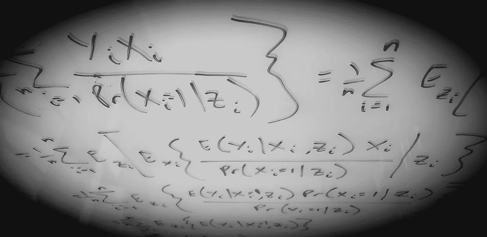

作者的玻璃板照片。

> 我们会夸大我们的健康应用程序的有效性，声称它将新型冠状病毒感染的风险降低了 16.9%——而事实上它只会将这种风险降低 3.1%。
> 
> **但是我们可以重新加权我们现实世界的证据结果，以提供更准确的风险降低估计值 2.3%或 2.2%。**

使用合成数据回顾本两部分教程的[第 1 部分](/coronavirus-telemedicine-and-race-part-1-simulated-real-world-evidence-9971f553194d?source=email-8430d9f1992d-1586971057342-layerCake.autoLayerCakeWriterNotification-------------------------90bb4612_8a36_4b93_81dd_1656d841e715&sk=32bfb03e1ca157e423ecf8cb69835ef3):

> *我们的分析目标将是帮助我们模拟世界中的公共卫生当局减少新型冠状病毒(“冠状病毒”)感染。我们相信我们的* ***数字健康或远程医疗应用*** *可以帮助预防新的感染；例如，通过促进健康的生活方式选择——特别是在社交距离和就地庇护时——来降低冠状病毒感染的风险。但是要做到这一点，我们需要一个无偏的或统计上一致的(即，更大样本的无偏性)估计，来估计我们将要进行的干预的真实效果。*
> 
> **教程目标:**理解因果假设如何改变我们对预测的解释，将它们推向解释。在量化我们的技术解决方案的影响之前，理解为什么需要这样做。
> 
> **我们将学习:**如何识别建模关联和因果效应之间的区别。如何通过 g 公式进行因果推理( [Robins，1986](https://www.sciencedirect.com/science/article/pii/0270025586900886)； [Hernán 和 Robins，2006](https://jech.bmj.com/content/60/7/578.short) )和倾向得分加权( [Rosenbaum 和 Rubin，1983](https://academic.oup.com/biomet/article/70/1/41/240879)；[平野和伊本，2001](https://link.springer.com/article/10.1023/A:1020371312283)；伦瑟福德和大卫安，2004 年。
> 
> *我们将了解混杂因素如何使我们对假设的健康应用干预的潜在效果的估计产生偏差。从我们的合成数据中出现的偏差如下所示。*

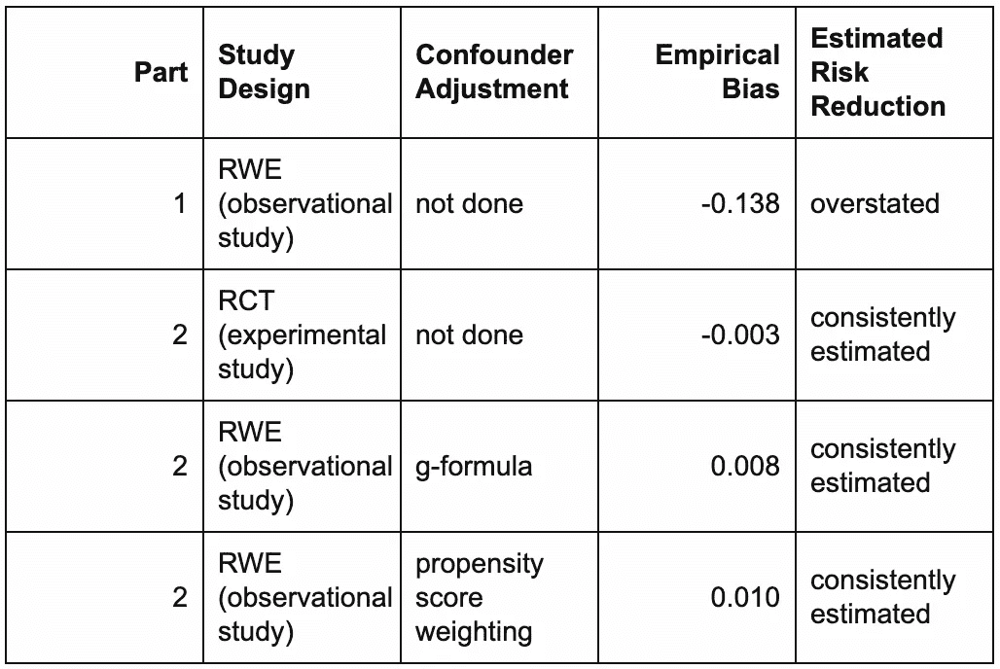

在[第一部分](/coronavirus-telemedicine-and-race-part-1-simulated-real-world-evidence-9971f553194d?source=email-8430d9f1992d-1586971057342-layerCake.autoLayerCakeWriterNotification-------------------------90bb4612_8a36_4b93_81dd_1656d841e715&sk=32bfb03e1ca157e423ecf8cb69835ef3)中，我们调查了一个合成的真实世界证据(RWE)数据集，该数据集受到最近一个涉及新冠肺炎种族差异的医疗保健案例的启发([加格等人，2020](https://www.cdc.gov/mmwr/volumes/69/wr/mm6915e3.htm)；[奥布里，2020 年](https://www.npr.org/sections/coronavirus-live-updates/2020/04/08/830030932/cdc-hospital-data-point-to-racial-disparity-in-covid-19-cases)。(合成数据是模拟的，而不是真实的，通常是为了教授或学习分析工具而创建的数据。)

我们学会了如何识别统计对比(如风险差异)和因果效应之间的差异。我们还看到了为什么在我们的分析中，一般来说，陈述因果机制(例如，有向无环图)和控制所有混杂因素(假设我们在我们的数据集中观察到了所有混杂因素)是不够的——正如在解释或预测模型中所做的那样( [Shmueli，2010](https://projecteuclid.org/euclid.ss/1294167961) )。

我们从[第 1 部分](/coronavirus-telemedicine-and-race-part-1-simulated-real-world-evidence-9971f553194d?source=email-8430d9f1992d-1586971057342-layerCake.autoLayerCakeWriterNotification-------------------------90bb4612_8a36_4b93_81dd_1656d841e715&sk=32bfb03e1ca157e423ecf8cb69835ef3)中了解到，我们需要一种更好的方法来估计真实的总体或*平均治疗效果* (ATE)。为了做到这一点，我们运行了一个较小的(n = 9600)随机对照试验(RCT ),其统计功效和证据要求与我们的 RWE 解释模型相同。我们随机将该应用分配给 50%的试验参与者。所有参与者都遵守了他们的治疗任务，该应用程序对感染风险的评估与 RWE 数据集相同。

在第 2 部分中，我们将使用与之前相同的三个个人级别变量来分析这个合成的 RCT 数据集:`infection`状态、`app`使用情况和`race`(为了简单起见，仅使用黑色或白色)。我们还将看到，如果种族真的是应用程序使用对感染风险的唯一混杂因素(即，如果我们观察了所有可能的混杂因素)，那么我们可以仅使用我们的 RWE 数据集来估计 ate。这需要理解总期望的[定律——一个我们实际上一直在使用的简单直观的概念——我们将在下面回顾。](https://en.wikipedia.org/wiki/Law_of_total_expectation)

*   **第 2 部分目标**:考虑到种族是影响感染风险的唯一其他因素(即唯一的混杂因素)，仅使用观察性 RWE 数据来正确估计应用程序在感染中的使用率。和以前一样，我们将 ATE 指定为用户之间的风险减去非用户之间的风险，或 [*风险差*](https://en.wikipedia.org/wiki/Risk_difference) (RD)。
*   **我们将学到什么**:如何通过分别使用 g 公式(也称为 [*标准化*](https://jech.bmj.com/content/60/7/578.short) )和倾向得分加权来重新加权我们的 RWE 预测和结果，从而估计 ate。g 公式与[明珠(2009)](http://bayes.cs.ucla.edu/BOOK-2K/) 的*后门调整公式*密切相关。

我们将用一个使用 RWE 数据报告 ATE 估计值的高级行动计划来结束第 2 部分。

# 数据集特征

实验(即随机化)RCT 数据在表`experimental_rct`中。(用附录中的 R 代码生成这个。)

```
glimpse(experimental_rct)## Observations: 9,600
## Variables: 3
## $ race      <chr> "White", "White", "White", "White", "White", "White", "Whit…
## $ app       <chr> "didn't use app", "didn't use app", "didn't use app", "didn…
## $ infection <chr> "0\. uninfected", "1\. infected", "0\. uninfected", "0\. uninfe…
```

每个观察值(即行)代表最初易感和未感染的独特个体。变量及其唯一值与第一部分中的[相同:](/coronavirus-telemedicine-and-race-part-1-simulated-real-world-evidence-9971f553194d?source=email-8430d9f1992d-1586971057342-layerCake.autoLayerCakeWriterNotification-------------------------90bb4612_8a36_4b93_81dd_1656d841e715&sk=32bfb03e1ca157e423ecf8cb69835ef3)

```
knitr::kable(apply(experimental_rct, 2, unique))
```

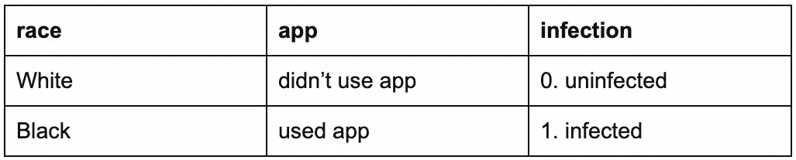

我们的 RCT 数据集有 9600 个观测值。

# 解释性建模

## 单变量关联

**相关矩阵**

```
dummy_rct <- experimental_rct %>%
  dplyr::mutate(
    race = (race == "White"),
    app = (app == "used app"),
    infection = (infection == "1\. infected")
  )
knitr::kable(round(cor(dummy_rct), 4))
```

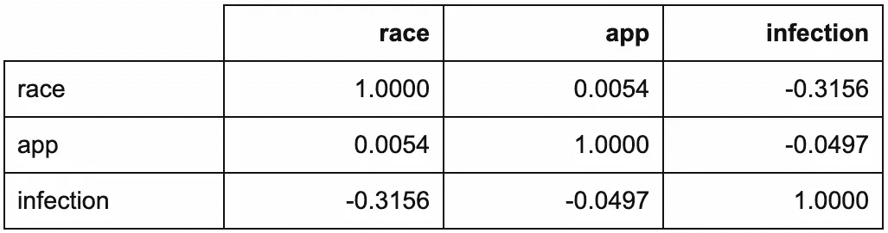

```
corrplot::corrplot.mixed(cor(dummy_rct))
```

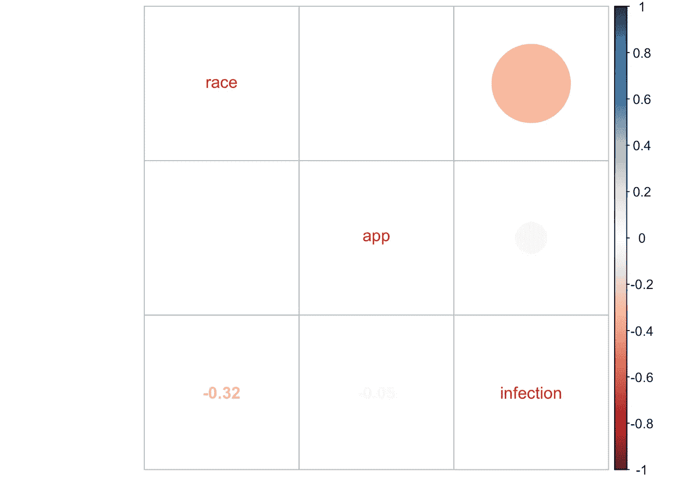

与[第一部分](/coronavirus-telemedicine-and-race-part-1-simulated-real-world-evidence-9971f553194d?source=email-8430d9f1992d-1586971057342-layerCake.autoLayerCakeWriterNotification-------------------------90bb4612_8a36_4b93_81dd_1656d841e715&sk=32bfb03e1ca157e423ecf8cb69835ef3)中的 RWE 相关矩阵不同，`race`不再与`app`相关。这是因为我们随机分配了应用程序的使用。

**按应用使用分类的感染(边际模型)**

让我们首先检查我们的主要利益关系，就像我们对训练数据所做的那样。

```
experimental_rct %>%
  ggplot2::ggplot(ggplot2::aes(x = app, fill = infection)) +
  ggplot2::theme_classic() +
  ggplot2::geom_bar(position = "dodge") +
  ggplot2::ggtitle("Infections by App Usage")
```

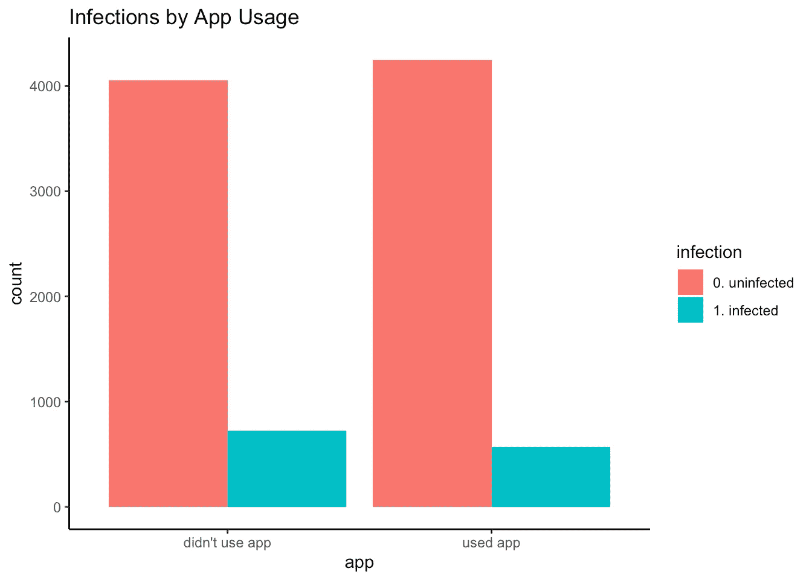

```
df_rct <- with(
  experimental_rct,
  cbind(
    table(app, infection),
    prop.table(table(app, infection), margin = 1) # row proportions
  )
)
rct_rd <- df_rct[2,4] - df_rct[1,4]rct_rd # empirical RD
## [1] -0.03392808knitr::kable(df_rct) # row proportions
```

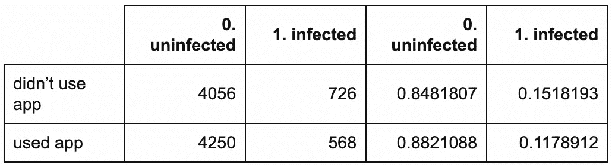

与第一部分一样，应用程序用户的感染率较低:只有 11.8%的用户受到感染，相比之下，非用户的感染率为 15.2%。然而，经验 RD 是-0.034，非常接近真实 ATE 的-0.031。这明显小于-0.169 的“错误 ATE 估计值”(即 RWE 抵制经验 RD)，该值会误导公共卫生当局对我们的应用程序在减少冠状病毒感染方面的真实有效性的认识。

```
out_fisher_rct <- with(
  experimental_rct,
  fisher.test(app, infection)
)
out_fisher_rct## 
##  Fisher's Exact Test for Count Data
## 
## data:  app and infection
## p-value = 1.254e-06
## alternative hypothesis: true odds ratio is not equal to 1
## 95 percent confidence interval:
##  0.6623291 0.8415144
## sample estimates:
## odds ratio 
##  0.7466837
```

此外，有强有力的统计证据(即，统计显著性)表明，感染因应用使用情况而异(p << 0.001). (Note that this corresponds to a two-sided hypothesis test; our RCT hypothesis is one-sided.) Here, the estimated odds of infection for app users were 0.747 (i.e., roughly three quarters) that of non-users, with a 95% confidence interval (CI) of (0.662, 0.842).

```
out_epi.2by2 <- epiR::epi.2by2(
  with(
    experimental_rct,
    table(app == "didn't use app", infection == "0\. uninfected")
  )
)
out_epi.2by2$res$ARisk.crude.wald / 100##           est       lower       upper
## 1 -0.03392808 -0.04757939 -0.02027677 
```

The corresponding estimated RD with 95% CI is -0.034 (95% CI: -0.048, -0.02). (Note that this corresponds to a two-sided hypothesis test; our RCT hypothesis is one-sided.) That is, we’re 95% confident that using the app lowered the risk of infection by somewhere between 0.02 and 0.048\. Note that this is now a statement about a causal effect, not a statistical association.

We *可能*到此为止，因为我们设计了 RCT，以便正确估计 ate。回顾第 1 部分的[，ATE 在统计学上是一个*边际*量，因为它没有考虑(即“被边缘化”)任何其他变量。除了潜在的干预(这里是应用程序使用)之外，还考虑了其他变量(这里是种族)的模型被称为*条件*模型。](/coronavirus-telemedicine-and-race-part-1-simulated-real-world-evidence-9971f553194d?source=email-8430d9f1992d-1586971057342-layerCake.autoLayerCakeWriterNotification-------------------------90bb4612_8a36_4b93_81dd_1656d841e715&sk=32bfb03e1ca157e423ecf8cb69835ef3)

但是在**解释模型**部分，我们将继续拟合[第 1 部分](/coronavirus-telemedicine-and-race-part-1-simulated-real-world-evidence-9971f553194d?source=email-8430d9f1992d-1586971057342-layerCake.autoLayerCakeWriterNotification-------------------------90bb4612_8a36_4b93_81dd_1656d841e715&sk=32bfb03e1ca157e423ecf8cb69835ef3)条件模型，该模型包括作为混杂因素的`race`。在下一部分(**因果推断:这是定律**)，我们将看到如何“汇总”来自该模型的预测，使其等于我们估计的 RD。然后，我们将学习如何使用相同的程序，使用我们的原始 RWE 数据，以统计一致的方式估计 ate。

**按种族分列的感染情况**

正如在第一部分中，种族似乎与感染联系在一起。

```
experimental_rct %>%
  ggplot2::ggplot(ggplot2::aes(x = race, fill = infection)) +
  ggplot2::theme_classic() +
  ggplot2::geom_bar(position = "dodge") +
  ggplot2::ggtitle("Infections by Race")
```

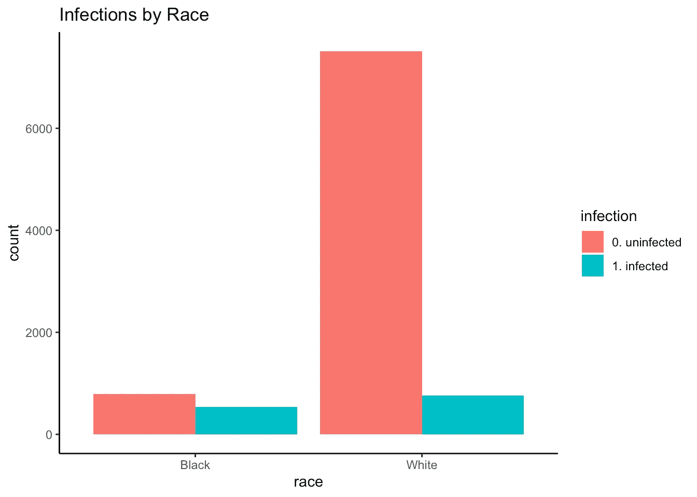

```
df_rct_race_infection <- with(
  experimental_rct,
  cbind(
    table(race, infection),
    prop.table(table(race, infection), margin = 1) # row proportions
  )
)
knitr::kable(df_rct_race_infection) # row proportions
```

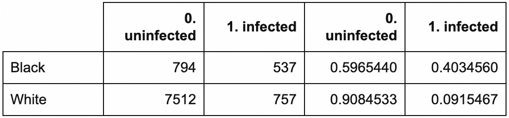

```
out_fisher_rct_race_infection <- with(
  experimental_rct,
  fisher.test(race, infection)
)
out_fisher_rct_race_infection## 
##  Fisher's Exact Test for Count Data
## 
## data:  race and infection
## p-value < 2.2e-16
## alternative hypothesis: true odds ratio is not equal to 1
## 95 percent confidence interval:
##  0.1302266 0.1705730
## sample estimates:
## odds ratio 
##  0.1490586
```

和以前一样，非裔美国人比白人更有可能被感染(按种族划分的应用使用情况)

与我们在第一部分的[中的 RWE 发现不同，`race`不再与`app`相关。同样，这是因为我们随机化了应用程序的使用。](/coronavirus-telemedicine-and-race-part-1-simulated-real-world-evidence-9971f553194d?source=email-8430d9f1992d-1586971057342-layerCake.autoLayerCakeWriterNotification-------------------------90bb4612_8a36_4b93_81dd_1656d841e715&sk=32bfb03e1ca157e423ecf8cb69835ef3)

解释性模型

```
experimental_rct %>%
  ggplot2::ggplot(ggplot2::aes(x = race, fill = app)) +
  ggplot2::theme_classic() +
  ggplot2::geom_bar(position = "dodge") +
  ggplot2::ggtitle("App Usage by Race")
```

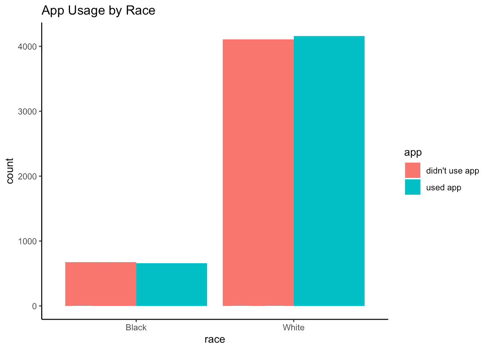

```
df_rct_race_app <- with(
  experimental_rct,
  cbind(
    table(race, app),
    prop.table(table(race, app), margin = 1) # row proportions
  )
)
knitr::kable(df_rct_race_app) # row proportions
```


```
out_fisher_rct_race_app <- with(
  experimental_rct,
  fisher.test(race, app)
)
out_fisher_rct_race_app## 
##  Fisher's Exact Test for Count Data
## 
## data:  race and app
## p-value = 0.6156
## alternative hypothesis: true odds ratio is not equal to 1
## 95 percent confidence interval:
##  0.917487 1.160591
## sample estimates:
## odds ratio 
##    1.03189 
```

## **因果模型**

从[第 1 部分](/coronavirus-telemedicine-and-race-part-1-simulated-real-world-evidence-9971f553194d?source=email-8430d9f1992d-1586971057342-layerCake.autoLayerCakeWriterNotification-------------------------90bb4612_8a36_4b93_81dd_1656d841e715&sk=32bfb03e1ca157e423ecf8cb69835ef3)中，回想一下解释模型由因果模型和统计模型组成。因果模型通常被指定为有向无环图(DAG) ( [珀尔，2009](http://bayes.cs.ucla.edu/BOOK-2K/) )。我们假设真正的 DAG 是:

应用使用→感染

1.  种族→感染
2.  比赛→应用程序使用
3.  在这里，种族混淆了应用程序使用对感染的影响。

```
DiagrammeR::grViz("
digraph causal {

  # Nodes
  node [shape = plaintext]
  Z [label = 'Race']
  X [label = 'App \n Usage']
  Y [label = 'Infection']

  # Edges
  edge [color = black,
        arrowhead = vee]
  rankdir = LR
  X -> Y
  Z -> X
  Z -> Y

  # Graph
  graph [overlap = true]
}")
```

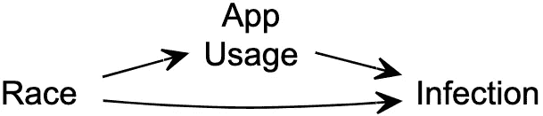

**检查样本量**

对于每个应用程序的使用和种族组合，我们有足够大的样本来满足我们的[第一部分](/coronavirus-telemedicine-and-race-part-1-simulated-real-world-evidence-9971f553194d?source=email-8430d9f1992d-1586971057342-layerCake.autoLayerCakeWriterNotification-------------------------90bb4612_8a36_4b93_81dd_1656d841e715&sk=32bfb03e1ca157e423ecf8cb69835ef3)统计功效和证据要求吗？

是的:每个应用程序使用群体中至少有 556 名非裔美国人，同样至少有 1617 名白人。

```
experimental_rct %>%
  ggplot2::ggplot(ggplot2::aes(x = race, fill = app)) +
  ggplot2::theme_classic() +
  ggplot2::geom_bar(position = "dodge") +
  ggplot2::ggtitle("App Usage by Race")
```


```
df_rct_race_app <- with(
  experimental_rct,
  cbind(
    table(race, app),
    prop.table(table(race, app), margin = 1) # row proportions
  )
)
knitr::kable(df_rct_race_app) # row proportions
```

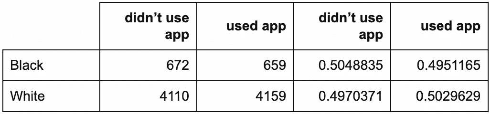

**拟合统计模型**

我们拟合我们的 RCT 逻辑模型如下。

在控制种族后，有强有力的统计证据(p << 0.001) for the estimated effect of app usage on infection risk. There is also very strong statistical evidence (p <<< 0.001) for race’s association with infection risk. Specifically, the estimated odds of infection for Whites were exp(-1.909) = 0.148 (95% CI: 0.13, 0.169) times that of African Americans (regardless of app usage).

```
glm_rct <- glm(
  data = experimental_rct,
  formula = as.factor(infection) ~ app + race,
  family = "binomial"
)
knitr::kable(summary(glm_rct)$coefficients)
```

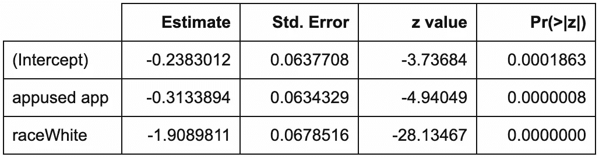

The estimated odds of infection for app users were exp(-0.313) = 0.731 (95% CI: 0.645, 0.828) times that of non-users (regardless of race). The corresponding estimated infection risks for app usage by race are:

0.441 for African Americans not using the app

```
risk_didnt_use_app_black_rct <- plogis(coef(glm_rct) %*% c(1, 0, 0)) risk_used_app_black_rct <- plogis(coef(glm_rct) %*% c(1, 1, 0)) risk_didnt_use_app_white_rct <- plogis(coef(glm_rct) %*% c(1, 0, 1)) risk_used_app_white_rct <- plogis(coef(glm_rct) %*% c(1, 1, 1))
```

*   0.365 for African Americans using the app
*   0.105 for Whites not using the app
*   0.079 for Whites using the app
*   The estimated RDs by race are:

-0.075 (95% CI: -0.1, -0.047) for African Americans

```
rct_rd_black <- risk_used_app_black_rct - risk_didnt_use_app_black_rct
rct_rd_white <- risk_used_app_white_rct - risk_didnt_use_app_white_rct
confint_glm_rct <- confint(glm_rct) # 95% CIs: odds ratios of infection
rct_rd_ci_black <- c(
  plogis(confint_glm_rct[, 1] %*% c(1, 1, 0)) - plogis(confint_glm_rct[, 1] %*% c(1, 0, 0)),
  plogis(confint_glm_rct[, 2] %*% c(1, 1, 0)) - plogis(confint_glm_rct[, 2] %*% c(1, 0, 0))
)
rct_rd_ci_white <- c(
  plogis(confint_glm_rct[, 1] %*% c(1, 1, 1)) - plogis(confint_glm_rct[, 1] %*% c(1, 0, 1)),
  plogis(confint_glm_rct[, 2] %*% c(1, 1, 1)) - plogis(confint_glm_rct[, 2] %*% c(1, 0, 1))
) 
```

*   -0.026 (95% CI: -0.028, -0.02) for Whites
*   Causal Inference: It’s the Law

# Rolling Up the Conditional Estimated Risks

## **随机对照试验**

我们可以使用解释模型的估计系数来预测每个人的感染风险。

每个`race`和`app`组合的预测风险为:

```
experimental_rct_preds <- experimental_rct %>%
  dplyr::mutate(predicted_risk = predict(object = glm_rct, type = "response"))
tbl_estimated_risks_rct <- experimental_rct_preds %>%
  dplyr::select(race, app, predicted_risk) %>%
  dplyr::distinct() %>%
  dplyr::arrange(race, app)
```

这些预测的风险只是我们之前计算的按种族划分的应用程序使用的估计感染风险。(请注意，虽然在分类中使用了诸如此类的预测概率，但它们不是分类意义上的“预测”。后者只能取“用过的 app”或“没用过的 app”的值，而不是连续概率。预测的风险是通过标准统计的“预测”，而不是机器学习的定义。)

```
knitr::kable(tbl_estimated_risks_rct)
```

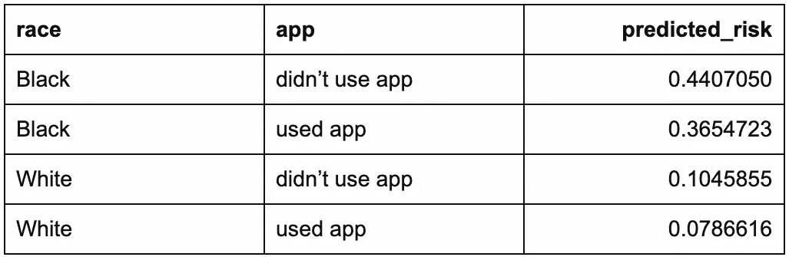

我们通过对应用程序用户和非用户的种族类别取平均值，将这些估计风险“累积”到应用程序使用水平。

但是我们从这些平均估计风险中计算出的估计研发与我们之前计算出的经验研发完全相同！

```
tbl_aac_rct <- experimental_rct_preds %>%
  dplyr::group_by(app) %>%
  dplyr::summarize(mean_preds = mean(predicted_risk))
estimated_AAC_rct <- tbl_aac_rct$mean_preds[2] - tbl_aac_rct$mean_preds[1]knitr::kable(tbl_aac_rct)
```

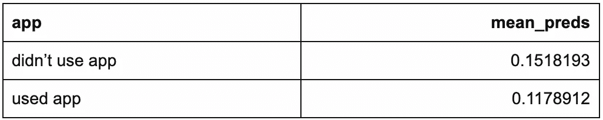

**现实世界的证据**

```
rct_rd # RCT: empirical RD## [1] -0.03392808estimated_AAC_rct # RCT: RD from average estimated risks## [1] -0.03392808
```

所以我们不能用我们的 RWE 估计风险来做类似的估计吗？

显然不是！发生了什么事？

```
# RWE: empirical RD
df_rwe_holdout <- with(
  observational_rwe_holdout, # see Part 1 to generate this:
    # https://towardsdatascience.com/coronavirus-telemedicine-and-race-part-1-simulated-real-world-evidence-9971f553194d
  cbind(
    table(app, infection),
    prop.table(table(app, infection), margin = 1) # row proportions
  )
)
rwe_holdout_rd <- df_rwe_holdout[2,4] - df_rwe_holdout[1,4]

# RWE: RD from average estimated risks
observational_rwe_preds <- observational_rwe_holdout %>%
  dplyr::mutate(predicted_risk = predict(object = glm_rwe_holdout, type = "response"))
tbl_estimated_risks_rwe <- observational_rwe_preds %>%
  dplyr::select(race, app, predicted_risk) %>%
  dplyr::distinct() %>%
  dplyr::arrange(race, app)
tbl_aac_rwe <- observational_rwe_preds %>%
  dplyr::group_by(app) %>%
  dplyr::summarize(mean_preds = mean(predicted_risk))
estimated_AAC_rwe <- tbl_aac_rwe$mean_preds[2] - tbl_aac_rwe$mean_preds[1] knitr::kable(tbl_estimated_risks_rwe)
```

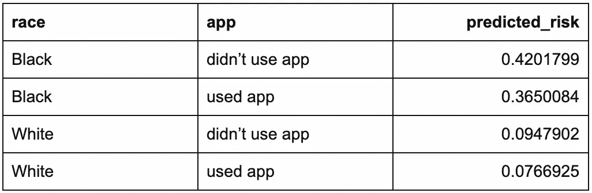

```
knitr::kable(tbl_aac_rwe)
```

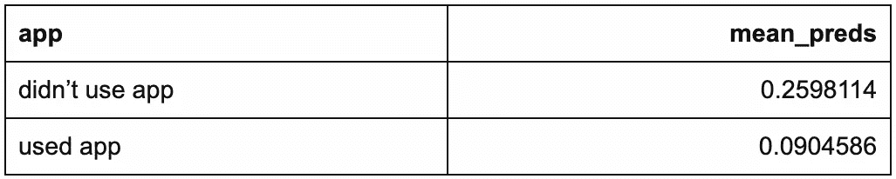

```
rwe_holdout_rd # RWE: empirical RD## [1] -0.1693528estimated_AAC_rwe # RWE: RD from average estimated risks## [1] -0.1693528
```

总期望定律

## 假设我们测量了两个女人和六个男人的身高:

**总体平均值**

```
knitr::kable(tbl_lte_example)
```

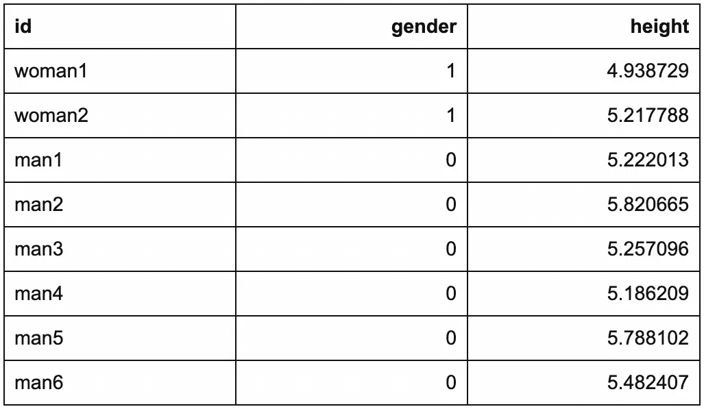

整体平均身高只有 5.364。设 *y_i* 代表个人的身高 *i* = 1，…， *n* ，其中 *n* = 8。该总平均高度明确计算如下

或者:

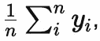

**总体平均值作为各组成部分的加权平均值**

```
(woman1 + woman2 + man1 + man2 + man3 + man4 + man5 + man6) / 8## [1] 5.364126
```

但是整体平均身高也是:

换句话说，使用类似于我们之前使用的代码:

```
((woman1 + woman2) / 2) * (2/8) + ((man1 + man2 + man3 + man4 + man5 + man6) / 6) * (6/8)## [1] 5.364126
```

**总体平均值与分量加权平均值的关系**

```
tbl_lte_example_components <- tbl_lte_example %>%
  dplyr::group_by(gender) %>%
  dplyr::summarize(mean_height = mean(height))
knitr::kable(tbl_lte_example_components)
```

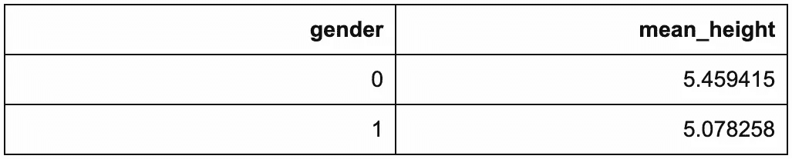

```
tbl_lte_example_components[2, 2] * prop.table(table(tbl_lte_example$gender))[2] +
  tbl_lte_example_components[1, 2] * prop.table(table(tbl_lte_example$gender))[1]## mean_height ## 1 5.364126 
```

女性设 *z_i* = 1，男性设 *z_i* = 0。平均身高是:

每种性别的比例是:

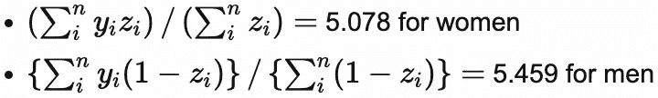

上面的计算将这两个成分的平均值相加，但它按各自的成分比例对每个成分的平均值进行加权。因此，这个加权平均值等于总平均高度:

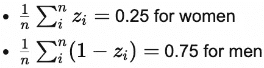

*这种等价的说法是* [*总期望定律*](https://en.wikipedia.org/wiki/Law_of_total_expectation) *(LTE)的一种表述:*总平均值是按各成分比例加权的成分平均值之和。

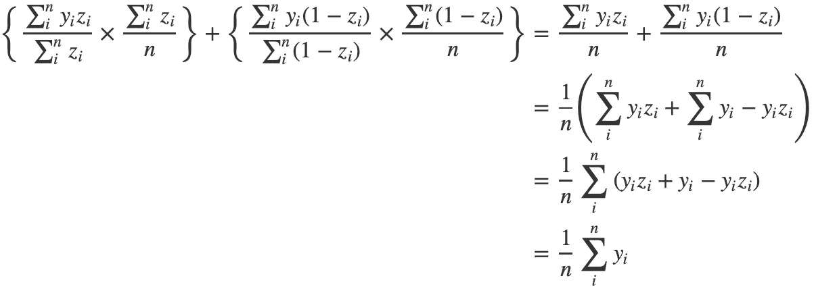

```
## [1] "(5.078 * 0.25) + (5.459 * 0.75) = 5.364"## [1] "((woman1 + woman2) / 2) * (2/8) + ((man1 + man2 + man3 + man4 + man5 + man6) / 6) * (6/8) = 5.364"
```

> 有关 LTE 的定义，请参见附录。

将 LTE 应用于我们的数据

## **现实世界的证据:应用程序用户**

现在，让我们将 LTE 应用于我们的 RWE 维持数据。为简单起见，我们只看应用程序用户；类似的推理也适用于 app 非用户。

在应用程序用户中，总体估计风险为:

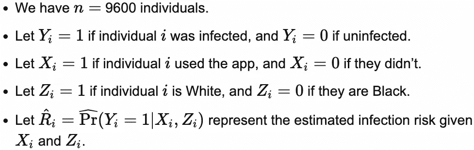

平均估计风险为:

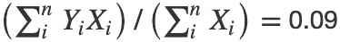

每个种族的比例是:

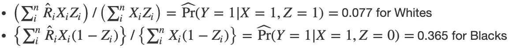

两个种族类别的平均估计风险的加权平均值等于总估计风险:

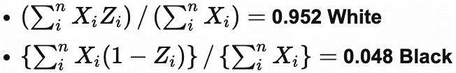

最后一个等价关系来自逻辑回归的定义。下面是一些明确做到这一点的代码:

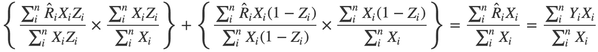

```
## [1] "(0.077 * 0.952) + (0.365 * 0.048) = 0.09 = 0.09"
```

与我们以前用来计算经验 RD 的代码相比，我们以前的代码没有明确地对特定种族的平均估计风险进行平均:

```
observational_rwe_preds %>%
  dplyr::filter(app == "used app") %>%
  dplyr::mutate(
    weight_Black = (race == "Black") * mean(observational_rwe_holdout$race[observational_rwe_holdout$app == "used app"] == "Black"),
    weight_White = (race == "White") * mean(observational_rwe_holdout$race[observational_rwe_holdout$app == "used app"] == "White"),
    predicted_risk_weighted = predicted_risk * (race == "Black") * weight_Black +
      predicted_risk * (race == "White") * weight_White
  ) %>%
  dplyr::group_by(race) %>%
  dplyr::summarize(mean_preds_weighted_rwe = mean(predicted_risk_weighted)) %>%
  dplyr::summarize(sum_mean_preds_weighted_rwe = sum(mean_preds_weighted_rwe))## # A tibble: 1 x 1
##   sum_mean_preds_weighted_rwe
##                         <dbl>
## 1                      0.0905
```

**随机对照试验:应用程序用户**

```
observational_rwe_preds %>%
  dplyr::filter(app == "used app") %>%
  dplyr::summarize(mean_preds = mean(predicted_risk))## # A tibble: 1 x 1
##   mean_preds
##        <dbl>
## 1     0.0905 
```

现在，让我们将 LTE 应用于 RCT 数据。同样，我们只看应用程序用户。我们将使用完全相同的公式。

在应用程序用户中，总体估计风险为 0.118。平均估计风险为:

白人 0.079

*   非裔美国人 0.365
*   每个种族的比例是:

**0.863 白色**

*   **0.137 非裔美国人**
*   两个种族类别的平均估计风险的加权平均值等于总估计风险:

下面是一些明确做到这一点的代码:

```
## [1] "(0.079 * 0.863) + (0.365 * 0.137) = 0.118 = 0.118"
```

你能找出 RWE 和 RCT 的四个相应组件之间的主要区别吗？这种差异开启了 g 公式的关键洞见。

```
experimental_rct_preds %>%
  dplyr::filter(app == "used app") %>%
  dplyr::mutate(
    weight_Black = (race == "Black") * mean(experimental_rct$race[experimental_rct$app == "used app"] == "Black"),
    weight_White = (race == "White") * mean(experimental_rct$race[experimental_rct$app == "used app"] == "White"),
    predicted_risk_weighted = predicted_risk * (race == "Black") * weight_Black +
      predicted_risk * (race == "White") * weight_White
  ) %>%
  dplyr::group_by(race) %>%
  dplyr::summarize(mean_preds_weighted_rct = mean(predicted_risk_weighted)) %>%
  dplyr::summarize(sum_mean_preds_weighted_rct = sum(mean_preds_weighted_rct))## # A tibble: 1 x 1
##   sum_mean_preds_weighted_rct
##                         <dbl>
## 1                       0.118
```

G 公式

# 结果模型

## 我们假设种族和应用程序使用都会影响感染风险。我们之前 DAG 的相关部分是:

应用使用(X) →感染(Y)

1.  种族(Z) →感染(Y)
2.  到目前为止，我们一直在研究这个 DAG 对应的统计模型。在因果推理文献中，这通常被称为*结果模型*，因为它模拟了结果如何与其输入变量(输入)统计相关。我们的结果模型是作为`app`使用和`race`函数的`infection`风险的逻辑模型。

```
DiagrammeR::grViz("
digraph causal {

  # Nodes
  node [shape = plaintext]
  X [label = 'App \n Usage \n (X)']
  Z [label = 'Race \n (Z)']
  Y [label = 'Infection \n (Y)']

  # Edges
  edge [color = black,
        arrowhead = vee]
  rankdir = LR
  X -> Y
  Z -> Y

  # Graph
  graph [overlap = true]
}")
```

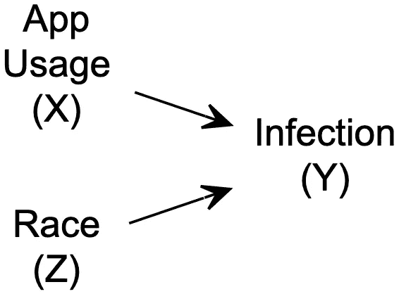

g 公式:标准化 RWE 估计

## **RCT 换人**

在 RWE 的数据中，种族影响了应用程序的使用倾向。因此，应用程序用户比非用户更有可能是白人:

然而，在 RCT 的数据中，每个种族在应用程序用户和非用户中的比例非常相似:

```
knitr::kable(df_rwe_holdout_race_app_colprop) # column proportions
```

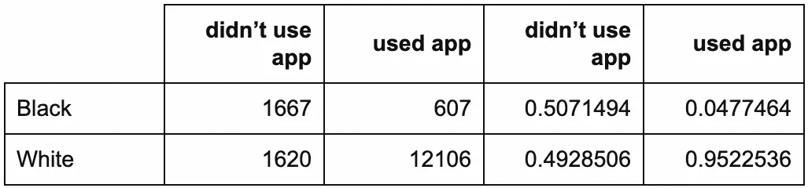

这是因为随机应用程序的使用使得它在统计上独立于种族。因此，特定于应用程序使用的比例接近总体种族比例，即:

```
knitr::kable(df_rct_race_app_colprop) # column proportions
```

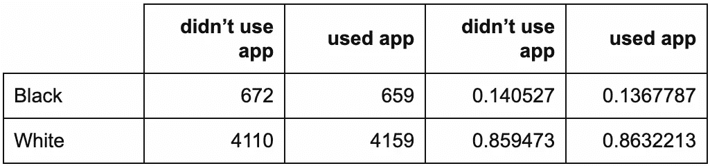

也就是说，应用程序用户:

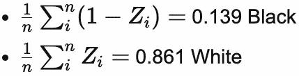

所以我们可以为所有的 *i* 设置 *X_i* =1，这样我们使用的比赛比例是:

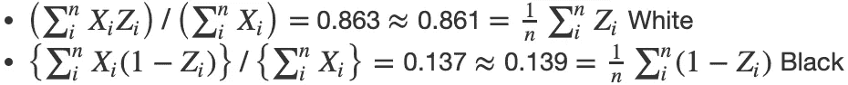

这与从我们之前的代码中删除`[experimental_rct$app == "used app"]`是一样的，如下所示:

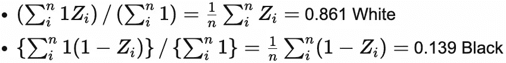

从统计学上来说，这种替代是可以接受的:我们只是用一个统计上一致的真实种族比例估计来替代另一个。但是如果我们用 RWE 的数据做这个会发生什么呢？

```
(
  experimental_rct_preds %>%
    dplyr::filter(app == "used app") %>%
    dplyr::mutate(
      weight_Black = (race == "Black") * mean(experimental_rct$race == "Black"),
      weight_White = (race == "White") * mean(experimental_rct$race == "White"),
      predicted_risk_weighted = predicted_risk * (race == "Black") * weight_Black +
        predicted_risk * (race == "White") * weight_White
    ) %>%
    dplyr::group_by(race) %>%
    dplyr::summarize(mean_preds_weighted_rct = mean(predicted_risk_weighted)) %>%
    dplyr::summarize(sum_mean_preds_weighted_rct = sum(mean_preds_weighted_rct))
)$sum_mean_preds_weighted_rct## [1] 0.1184267 
```

**RWE 重新加权**

使用我们的 RWE 数据集，让我们通过从我们之前的代码中删除`[observational_rwe_holdout$app == "used app"]`,使用总体种族比例而不是特定应用使用比例来重新加权应用用户的平均估计风险，如下所示:

这个数量非常接近我们的 RCT 估计。我们使用以下代码对非用户应用同样的重新加权:

```
(
  observational_rwe_preds %>%
    dplyr::filter(app == "used app") %>%
    dplyr::mutate(
      weight_Black = (race == "Black") * mean(observational_rwe_holdout$race == "Black"),
      weight_White = (race == "White") * mean(observational_rwe_holdout$race == "White"),
      predicted_risk_weighted = predicted_risk * (race == "Black") * weight_Black +
        predicted_risk * (race == "White") * weight_White
    ) %>%
    dplyr::group_by(race) %>%
    dplyr::summarize(mean_preds_weighted_rwe = mean(predicted_risk_weighted)) %>%
    dplyr::summarize(sum_mean_preds_weighted_rwe = sum(mean_preds_weighted_rwe))
)$sum_mean_preds_weighted_rwe## [1] 0.1176694
```

我们计算出估计的 RD 为-0.023。相比之下，我们的 RCT 估计研发成本为-0.034。这两个估计值都比我们最初的 RWE 估计值-0.169 更接近真实值-0.031。

```
tbl_ate_gf <- observational_rwe_preds %>%
  dplyr::mutate(
    predicted_risk = predict(object = glm_rwe_holdout, type = "response"),
    predicted_risk_X1 = predict(
      object = glm_rwe_holdout,
      newdata = observational_rwe_holdout %>%
        dplyr::mutate(app = "used app"),
      type = "response"
    ),
    predicted_risk_X0 = predict(
      object = glm_rwe_holdout,
      newdata = observational_rwe_holdout %>%
        dplyr::mutate(app = "didn't use app"),
      type = "response"
    ),
    gformula_weight = (race == "Black") * mean(observational_rwe_holdout$race == "Black") +
      (race == "White") * mean(observational_rwe_holdout$race == "White"),
    predicted_risk_weighted = predicted_risk * gformula_weight
  ) %>%
  dplyr::group_by(app, race) %>%
  dplyr::summarize(mean_preds_weighted_rwe = mean(predicted_risk_weighted))
estimated_ATE_gf <- (tbl_ate_gf$mean_preds_weighted_rwe[3] + tbl_ate_gf$mean_preds_weighted_rwe[4]) -
  (tbl_ate_gf$mean_preds_weighted_rwe[1] + tbl_ate_gf$mean_preds_weighted_rwe[2])
```

重新加权过程可以更一般地表述为:

计算每个混杂值组合的比例(即混杂值的经验联合分布)。

1.  根据步骤 1 中相应的混杂因素比例对估计的平均结果(取决于所有混杂因素)进行加权。
2.  对于每个潜在的干预组，将这些加权估计值相加。
3.  ***这个通用程序被称为* g 公式。** *这些标准化总和的对比(如差异、比率)是 ate 的统计一致性估计。*

> 直觉:标准化

## 这种重新加权的方法为什么有效？这个想法是，我们可以使用 RCT 以统计一致或无偏的方式估计 ate。但是，当我们只有 RWE 的数据时，我们仍然可以复制 RCT 打破混杂因素对潜在干预的影响的方式，从而打破统计关联。

对于每个潜在的干预组，g 公式通过*将*(流行病学术语)RWE 的混杂因素分布标准化为相应 RCT 的混杂因素分布来实现这一点。由于随机化，后者与混杂因素的总体分布相同(即不考虑干预组)。

倾向得分加权

# 回想一下，在我们的 RWE 数据中，非裔美国人使用该应用程序的可能性低于白人:只有 27.2%的非裔美国人使用该应用程序，而白人的比例为 88.2%。也就是说，非裔美国人使用该应用的*倾向*为 0.272，而白人为 0.882。

倾向模型

```
observational_rwe_training %>%
  ggplot2::ggplot(ggplot2::aes(x = race, fill = app)) +
  ggplot2::theme_classic() +
  ggplot2::geom_bar(position = "dodge") +
  ggplot2::ggtitle("App Usage by Race")
```


```
knitr::kable(df_rwe_training_race_app) # row proportions
```

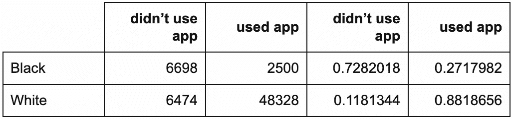

## **因果和统计模型**

我们假设种族会影响应用程序的使用。我们之前 DAG 的相关部分是:

比赛(Z) →应用程序使用(X)

1.  据说种族会影响应用程序的使用倾向。因此，在因果推理文献中，这种关系的统计模型通常被称为*倾向模型*。也就是说，它模拟了潜在的干预如何与其输入在统计上相关联。

```
DiagrammeR::grViz("
digraph causal {

  # Nodes
  node [shape = plaintext]
  Z [label = 'Race \n (Z)']
  X [label = 'App \n Usage \n (X)']

  # Edges
  edge [color = black,
        arrowhead = vee]
  rankdir = LR
  Z -> X

  # Graph
  graph [overlap = true]
}")
```

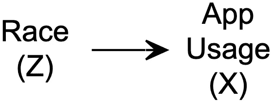

作为`race`函数的`app`使用的真实模型是在[第 1 部分](/coronavirus-telemedicine-and-race-part-1-simulated-real-world-evidence-9971f553194d?source=email-8430d9f1992d-1586971057342-layerCake.autoLayerCakeWriterNotification-------------------------90bb4612_8a36_4b93_81dd_1656d841e715&sk=32bfb03e1ca157e423ecf8cb69835ef3)的附录中列出的逻辑模型。使用该应用程序的倾向以使用该应用程序的概率来衡量。在这种因果模型的背景下，这种概率因此被称为*倾向得分* ( [Rosenbaum 和 Rubin，1983](https://academic.oup.com/biomet/article/70/1/41/240879) )。

实际上，我们不会知道这个真实的模型。但是，假设我们已经正确地对其建模，并估计其参数如下:

现在怎么办？

```
glm_rwe_holdout_ps <- glm(
  data = observational_rwe_holdout,
  formula = as.factor(app) ~ race,
  family = "binomial"
)
knitr::kable(summary(glm_rwe_holdout_ps)$coefficients)
```

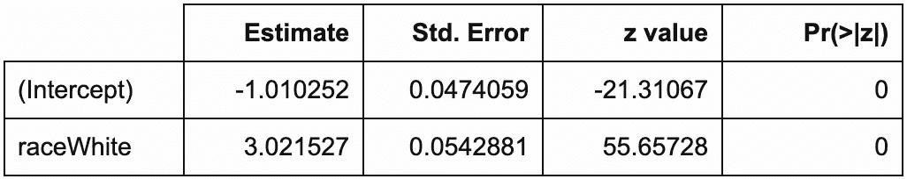

直觉:调查抽样(霍维茨-汤普森权重)

## 使用我们应用的倾向就像一个*选择过程*:在这里，“被选择”使用应用取决于种族。

在 [*调查抽样*](https://en.wikipedia.org/wiki/Survey_sampling) 中，这种*选择概率*被用于概率抽样，以确保调查参与者代表他们被抽样的目标人群。这些概率是在调查设计中指定的，因此是预先完全知道的。

然后，这些选择概率可用于通过其相应选择概率的倒数或倒数对调查应答者的结果进行加权。这种被称为*逆概率加权*的通用技术提供了对平均结果(即整个目标人群的平均结果)的统计一致性估计。在调查抽样中，总体均值的回归估计量称为[霍维茨-汤普森](https://en.wikipedia.org/wiki/Horvitz%E2%80%93Thompson_estimator) (HT)估计量([霍维茨和汤普森，1952](https://www.jstor.org/stable/pdf/2280784.pdf) )。

直觉上，每个回答者被加权，以代表在决定他们选择概率的因素中相似的个体。为了说明这一点，让我们回顾一下之前关于身高和性别的例子:

假设这八个人是从更大的目标人群(n = 10000)中抽取的小概率样本(n = 514)的一部分。生成目标群体和样本的代码是:

```
knitr::kable(tbl_lte_example)
```


在目标人群中(数字来自[ourworldindata.org/human-height](https://ourworldindata.org/human-height)):

```
# generate target population
mean_height_women <- 5.21654 # from https://ourworldindata.org/human-height
mean_height_men <- 5.61024 # from https://ourworldindata.org/human-height
n_pop_htw_example <- 10000
sel_prob_women <- 0.01
sel_prob_men <- 0.09
set.seed(2004201426)
tbl_htw_example <- dplyr::tibble(
  gender = rbinom(n = n_pop_htw_example, size = 1, prob = 0.5),
  height = gender * rnorm(n = n_pop_htw_example, mean = mean_height_women, sd = 0.3) +
    (1 - gender) * rnorm(n = n_pop_htw_example, mean = mean_height_men, sd = 0.3),
  selected = gender * rbinom(n = n_pop_htw_example, size = 1, prob = sel_prob_women) +
    (1 - gender) * rbinom(n = n_pop_htw_example, size = 1, prob = sel_prob_men)
)

# select sample
tbl_htw_example_sample <- tbl_htw_example %>%
  dplyr::filter(selected == 1)
```

女性的平均身高是 5.217 英尺。

*   男性的平均身高是 5.61 英尺。
*   女性和男性的分布相当平均:51%是女性。
*   真实人口平均身高为 5.406。
*   女性以 0.01 的概率入选我们的样本，男性以 0.09 的概率入选。也就是说，男性被选入样本的可能性是女性的九倍；我们的样本中 90%是男性(n = 464)。因此，样本总体平均身高 5.555 高于真实人口平均身高 5.406。

然而，如果我们按照每个个体各自选择概率的倒数对其进行加权，将这些值相加，然后除以总人口规模，我们会得到加权平均值:

这更接近真实的人口平均身高 5.406。

```
with(
  tbl_htw_example_sample,
  sum(
    c(
      height[gender == 1] / sel_prob_women,
      height[gender == 0] / sel_prob_men
    )
  )/nrow(tbl_htw_example)
) ## [1] 5.498455
```

倾向得分:加权 RWE 结果

## 我们可以应用这样的 HT 估计器来估计 ate。在我们的案例中，在我们的 RWE 数据中有两种类型的“目标人群”:

[*潜在结果*](https://en.wikipedia.org/wiki/Rubin_causal_model) 如果每个人都使用过这个应用程序

*   如果每个人都没有使用应用程序，潜在结果的人口
*   每个潜在的结果([尼曼，1923](https://www.jstor.org/stable/pdf/2245382.pdf)；[鲁宾，1974](https://psycnet.apa.org/fulltext/1975-06502-001.pdf)； [Holland，1986](https://www.jstor.org/stable/pdf/2289064.pdf) )根据个人的实际 app 使用情况进行观察。另一种未被观察到的潜在结果被称为反事实结果，或简称为*反事实*。

我们根据每个人各自倾向得分的倒数对他们进行加权，将这些值相加，然后除以数据集中的总人数，得到每个应用使用组的加权平均值:

我们计算出估计的 RD 为-0.022。相比之下，我们的 RCT 估计研发成本为-0.034。这两个估计值都比我们最初的 RWE 估计值-0.169 更接近真实值-0.031。

```
tbl_ate_ps <- observational_rwe_holdout %>%
  dplyr::mutate(
    infection01 = (infection == "1\. infected"),
    app01 = (app == "used app"),
    propensityscore_used_app = predict(object = glm_rwe_holdout_ps, type = "response"),
    propensityscore_didnt_use_app = 1 - propensityscore_used_app
  )
estimated_risk_used_app <- with(
  tbl_ate_ps,
  sum(infection01[app01 == 1] / propensityscore_used_app[app01 == 1]) / nrow(tbl_ate_ps)
)
estimated_risk_didnt_use_app <- with(
  tbl_ate_ps,
  sum(infection01[app01 == 0] / propensityscore_didnt_use_app[app01 == 0]) / nrow(tbl_ate_ps)
)
estimated_ATE_ps <- estimated_risk_used_app - estimated_risk_didnt_use_app
```

结论和公共卫生影响

# 没有免费的午餐

## 我们已经成功应用了两种因果推断方法来估计应用程序使用对感染风险的真实影响。这些方法对于 ATE 来说在统计上是一致的，但是它们依赖于一些关键的假设为真:

没有无法测量的混杂因素:我们已经观察到了所有可能的混杂因素。

*   *正确的模型规范*:我们已经正确地指定了因果模型和统计模型。(两者的区别和联系见[第 1 部分](/coronavirus-telemedicine-and-race-part-1-simulated-real-world-evidence-9971f553194d?source=email-8430d9f1992d-1586971057342-layerCake.autoLayerCakeWriterNotification-------------------------90bb4612_8a36_4b93_81dd_1656d841e715&sk=32bfb03e1ca157e423ecf8cb69835ef3)。)也就是说，它们都正确地形式化了现实中发生的事情。当使用 g 公式时，这种假设适用于结果模型，当使用倾向得分加权时，这种假设适用于倾向模型。
*   *阳性*:对于所有观察到的混杂值的每个独特组合(或至少对于所述值的每个粗略但大小合理的独特聚类)，每个干预组中至少有一个人。
*   你可以在 [Hernán 和 Robins (2006)](https://jech.bmj.com/content/60/7/578.short) 和 [Hernán 和 Robins (2020)](https://www.hsph.harvard.edu/miguel-hernan/causal-inference-book/) 以及在 [Adam Kelleher 的媒体页](https://medium.com/@akelleh)了解更多关于这些和其他重要假设的信息。

是什么阻止我们将尽可能多的变量视为潜在的混杂因素(可能在交叉验证模型和变量选择之后)？为什么不应该把他们都纳入统计模型？对此，一个有趣的警告是*“M 偏差”* ( [丁和米拉特里克斯，2015](https://www.degruyter.com/view/journals/jci/3/1/article-p41.xml) )。这是一种特殊类型的*对撞机偏差* ( [Pearl，2009](http://bayes.cs.ucla.edu/BOOK-2K/) )产生于包含一个不是混杂因素的模型输入。争论的焦点是，由于诱导碰撞偏倚，包括这样的非混杂因素会使 ATE 估计有偏倚。

选择，选择

## 我们决定采用 RWE 解释模型。但是我们应该符合哪种统计模型呢？结果模型，还是倾向模型？我们的选择将在一定程度上取决于我们对拟合任一模型的信心。这个选择将决定我们是使用 g 公式还是倾向得分加权。

如果只有模棱两可的证据支持其中一个而不是另一个呢？或许我们不知道适合哪种模型。在这种情况下，有所谓的*“双重稳健”估计器*，它们利用了两种模型( [Bang 和 Robins，2005](https://onlinelibrary.wiley.com/doi/full/10.1111/j.1541-0420.2005.00377.x) )。之所以这么称呼它们，是因为只有一个模型需要被正确地指定，以便估计器产生 ATE 的统计上一致的估计。

其他方法

## 至少有三种其他流行的方法能够使用 RWE 数据进行 ATE 估计和推断。

*匹配*:在这种方法中，一个干预组中的每个个体与另一个干预组中的至少一个其他个体匹配。匹配被指定为两个个体的混杂因素观察值之间的某种程度的相似性。这个想法是，任何留下的变异必须是由于潜在的干预——因此是一个可能的治疗效果。

*   *倾向分数匹配*:如果有太多的混杂因素而无法找到好的匹配怎么办？一个得到广泛支持的解决方案是使用个人的倾向分数来匹配相反干预组中的个人，而不是( [Hirano and Imbens，2001](https://link.springer.com/article/10.1023/A:1020371312283)；[伦瑟福德和大卫安 M，2004](https://onlinelibrary.wiley.com/doi/abs/10.1002/sim.1903) 。
*   *工具变量*:g 公式和倾向得分加权都要求我们已经测量了所有的混杂因素，并且已经将它们包含在我们的统计模型中。如果这不可能呢？假设我们仍然观察到另一个 RWE 变量，它有效地随机化了潜在的干预，没有受到任何混杂因素的影响，否则对我们的结果没有影响。这个变量是一个*工具*，我们可以用它来计算 ate 的统计一致性估计值([安格里斯特和伊本斯，1995](https://www.nber.org/papers/t0118) )。
*   公共卫生影响

# ***假设我们把【现实世界的证据】经验 RD 误认为是对 ate 的估计。我们不知道的是，在我们的模拟世界中，我们会夸大我们的远程医疗应用程序的有效性，声称它将新型冠状病毒感染的风险降低了 16.9%，而事实上它只会将这种风险降低 3.1%。***

> **但是，我们可以对现实世界的证据结果进行重新加权，以提供 2.3%或 2.2%的更准确的风险降低估计值。**
> 
> 我们以以下高级行动计划结束第 2 部分:

为你的客户报告和解释你的 DAG，以及你的未调整的 ATE 估计。

1.  调整混杂因素(例如，通过重新加权)。向客户报告并解释调整后的 ATE 评估。
2.  参考

# Angrist JD，Imbens GW。局部平均治疗效果的识别和估计。国家经济研究局；1995 年 2 月 1 日。[https://www.nber.org/papers/t0118](https://www.nber.org/papers/t0118)

*   Aubrey A. CDC 医院的数据指出了新冠肺炎案例中的种族差异。NPR。美国东部时间 2020 年 4 月 8 日下午 2:43。[NPR . org/sections/coronavirus-live-updates/2020/04/08/830030932/CDC-hospital-data-point-to-racial-disparity-in-新冠肺炎-cases](https://www.npr.org/sections/coronavirus-live-updates/2020/04/08/830030932/cdc-hospital-data-point-to-racial-disparity-in-covid-19-cases)
*   嗨，罗宾斯·JM。缺失数据和因果推断模型中的双重稳健估计。生物识别。2005 年 12 月；61(4):962–73.[https://online library . Wiley . com/doi/full/10.1111/j . 1541-0420 . 2005 . 00377 . x](https://onlinelibrary.wiley.com/doi/full/10.1111/j.1541-0420.2005.00377.x)
*   丁 P，米拉特里克斯 LW。调整还是不调整？M 偏差和蝶形偏差的敏感性分析。因果推理杂志。2015 年 3 月 1 日；3(1):41–57.[https://www . degryter . com/view/journals/JCI/3/1/article-p41 . XML](https://www.degruyter.com/view/journals/jci/3/1/article-p41.xml)
*   Garg S .因实验室确认的冠状病毒疾病住院的患者的住院率和特征 2019-COVID-NET，14 个州，2020 年 3 月 1 日至 30 日。MMWR。发病率和死亡率周报。2020;69.[cdc.gov/mmwr/volumes/69/wr/mm6915e3.htm](https://www.cdc.gov/mmwr/volumes/69/wr/mm6915e3.htm)
*   埃尔南·马，罗宾斯·JM。根据流行病学数据估计因果效应。流行病学与社区健康杂志。2006 年 7 月 1 日；60(7):578–86.【jech.bmj.com/content/60/7/578.short 号
*   赫南·马，罗宾斯·JM(2020)。因果推理:如果。博卡拉顿:查普曼&霍尔/CRC。[https://www . hsph . Harvard . edu/Miguel-hernan/causal-inference-book/](https://www.hsph.harvard.edu/miguel-hernan/causal-inference-book/)
*   平野 K，Imbens GW。使用倾向评分加权估计因果效应:对右心导管插入术数据的应用。健康服务和结果研究方法。2001 年 12 月 1 日；2(3–4):259–78.[https://link.springer.com/article/10.1023/A:1020371312283](https://link.springer.com/article/10.1023/A:1020371312283)
*   荷兰 PW。统计学和因果推断。美国统计协会杂志。1986 年 12 月 1 日；81(396):945–60.[https://www.jstor.org/stable/pdf/2289064.pdf](https://www.jstor.org/stable/pdf/2289064.pdf)
*   霍维茨 DG，汤普森 DJ。有限论域中无替换抽样的推广。美国统计协会杂志。1952 年 12 月 1 日；47(260):663–85.[https://www.jstor.org/stable/pdf/2280784.pdf](https://www.jstor.org/stable/pdf/2280784.pdf)
*   通过倾向评分评估因果治疗效果的分层和加权:一项比较研究。医学统计学。2004 年 10 月 15 日；23(19):2937–60.[https://onlinelibrary.wiley.com/doi/abs/10.1002/sim.1903](https://onlinelibrary.wiley.com/doi/abs/10.1002/sim.1903)
*   概率论在农业实验中的应用。原理随笔。第九节。统计科学。1923，tr 19905(4):465–480.由 D.M. Dabrowska 和 T.P. Speed 从波兰原文翻译并编辑，该原文发表在 Roczniki Nauk Rolniczych Tom X(1923)1–51(农业科学年鉴)上。[https://www.jstor.org/stable/pdf/2245382.pdf](https://www.jstor.org/stable/pdf/2245382.pdf)
*   珀尔 j .因果关系。剑桥大学出版社；2009 年 9 月 14 日。[bayes.cs.ucla.edu/BOOK-2K/](http://bayes.cs.ucla.edu/BOOK-2K/)
*   持续暴露期死亡率研究中因果推断的新方法——健康工人幸存者效应控制的应用。数学建模。1986 年 1 月 1 日；7(9–12):1393–512.sciencedirect.com/science/article/pii/0270025586900886
*   罗森鲍姆公关，鲁宾 DB。倾向评分在因果效应观察研究中的核心作用。Biometrika。1983 年 4 月 1 日；70(1):41–55.【academic.oup.com/biomet/article/70/1/41/240879 
*   鲁宾数据库。评估随机和非随机研究中治疗的因果效应。教育心理学杂志。1974 年 10 月；66(5):688.[https://psycnet.apa.org/fulltext/1975-06502-001.pdf](https://psycnet.apa.org/fulltext/1975-06502-001.pdf)
*   解释还是预测？。统计科学。2010;25(3):289–310.[projecteuclid.org/euclid.ss/1294167961](https://projecteuclid.org/euclid.ss/1294167961)
*   附录

# 总期望定律(续)

## 我们前面的性别身高例子中的陈述的更一般(抽象)的表达是

其中 *E* (。)是[期望运算符](https://en.wikipedia.org/wiki/Expected_value)。请注意，变量现在都是大写的，表明它们是随机变量(例如，由于[随机抽样](https://en.wikipedia.org/wiki/Sampling_error))——不像我们的身高性别示例中的小写固定变量。

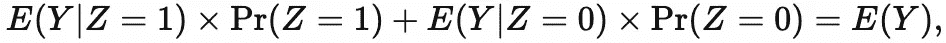

期望算子取括号内随机变量的*期望*(即*期望值*或*均值*)如下:

它将每个可能的值与其对应的概率相乘。

1.  然后对所有这些进行求和。
2.  不严格地说，期望运算符计算加权平均值——以概率作为权重。

表达式*E*(*Y*|*Z*)表示条件期望，其中 *Y* 的期望在给定值 *Z* 处接管所有 *Y* 。上面的一般表达式可以简洁地表述为

其中 *E_Z* (。)指定将括号内的表达式的期望值作为 *Z* 的所有值。

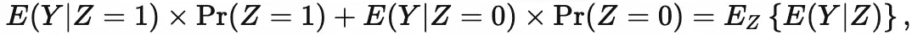

总期望的[定律表示:](https://en.wikipedia.org/wiki/Law_of_total_expectation)

也就是说，随机变量 *Y* 的期望值等于在不同随机变量 *Z* 条件下 *Y* 的期望值的期望值，涵盖了 *Z* 的所有值。

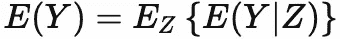

RCT 模拟 R 代码

## 关于作者

```
*##### Set simulation parameters**### Preliminaries*
random_seed <- 2004101447
sample_size_observational <- 80000
holdout_proportion <- 0.2
sample_size_experimental <- sample_size_observational * holdout_proportion * 0.6*### Feature distribution*
piZ <- 0.755 / (0.755 + 0.127) *# race (based on U.S. Census)**### Outcome model**# beta0 and betaZ are derived from:*
*#   https://www.cdc.gov/mmwr/volumes/69/wr/mm6915e3.htm*
*#   https://www.npr.org/sections/coronavirus-live-updates/2020/04/08/830030932/cdc-hospital-data-point-to-racial-disparity-in-covid-19-cases*
*#   https://www.washingtonpost.com/news/powerpost/paloma/the-health-202/2020/04/09/the-health-202-los-angeles-is-racing-to-discover-the-true-coronavirus-infection-rate/5e8de70588e0fa101a75e13d/*prInfection <- 0.15
prBlack <- 1 - piZ
prWhite <- piZ
prBlackGivenInfection <- 33 / (33 + 45)
prWhiteGivenInfection <- 1 - prBlackGivenInfection
prInfectionGivenBlack <- prBlackGivenInfection * prInfection / prBlack
prInfectionGivenWhite <- prWhiteGivenInfection * prInfection / prWhitebeta0 <- log(prInfectionGivenBlack / (1 - prInfectionGivenBlack)) *# baseline: infection risk for* *African American**s who don't use app*
betaX <- -0.3
betaZ <- log(prInfectionGivenWhite / (1 - prInfectionGivenWhite)) - beta0 *# average influence of being White on infection risk**### Propensity model: app usage*
alpha0_experimental <- 0 *# randomized controlled trial: 0.5 randomization probability*
alphaZ_experimental <- 0 *# randomized controlled trial: 0.5 randomization probability**##### Generate data.*
set.seed(random_seed + 3)
experimental_rct <- dplyr::tibble(
  race = rbinom(n = sample_size_experimental, size = 1, prob = piZ),
  app = rbinom(n = sample_size_experimental, size = 1, prob = plogis(alpha0_experimental + alphaZ_experimental * race)),
  infection = rbinom(n = sample_size_experimental, size = 1, prob = plogis(beta0 + betaX * app + betaZ * race))
) %>%
  dplyr::mutate(
    race = ifelse(race == 1, "White", ifelse(race == 0, "Black", NA)),
    app = ifelse(app == 1, "used app", ifelse(app == 0, "didn't use app", NA)),
    infection = ifelse(infection == 1, "1\. infected", ifelse(infection == 0, "0\. uninfected", NA))
  ) 
```

# Daza 博士是一名生物统计学家和健康数据科学家，而不是流行病学家，他为个性化(n-of-1)数字健康开发因果推断方法。| ericjdaza.com[🇵🇭🇺🇸](https://www.ericjdaza.com/)@埃里克森 t14】linkedin.com/in/ericjdaza|[statsof1.org](https://statsof1.org/)[@ stats of](https://twitter.com/statsof1)[@ fsbiostats](https://twitter.com/fsbiostats)

版权 2020 埃里克·j·达扎和 Stats-1。保留所有权利。

*岗位也可在*[*https://rpubs.com/ericjdaza/602430*](https://rpubs.com/ericjdaza/602430)*任职。*

***编者注:*** [*走向数据科学*](http://towardsdatascience.com/) *是一份以数据科学和机器学习研究为主的中型刊物。我们不是健康专家或流行病学家，本文的观点不应被解释为专业建议。想了解更多关于疫情冠状病毒的信息，可以点击* [*这里*](https://www.who.int/emergencies/diseases/novel-coronavirus-2019/situation-reports) *。*

***Note from the editors:***[*Towards Data Science*](http://towardsdatascience.com/) *is a Medium publication primarily based on the study of data science and machine learning. We are not health professionals or epidemiologists, and the opinions of this article should not be interpreted as professional advice. To learn more about the coronavirus pandemic, you can click* [*here*](https://www.who.int/emergencies/diseases/novel-coronavirus-2019/situation-reports)*.*