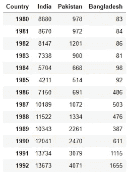
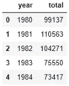

# Python Matplotlib 的日常备忘单

> 原文：<https://towardsdatascience.com/your-everyday-cheatsheet-for-pythons-matplotlib-c03345ca390d?source=collection_archive---------13----------------------->


照片由 [Unsplash](https://unsplash.com?utm_source=medium&utm_medium=referral) 上的 [Jalitha Hewage](https://unsplash.com/@_llucifer_?utm_source=medium&utm_medium=referral) 拍摄

## 完整的可视化课程

Matplotlib 是 python 中使用最广泛的可视化工具。它在广泛的环境中得到很好的支持，如 web 应用服务器、图形用户界面工具包、Jupiter notebook 和 iPython notebook、iPython shell。

# Matplolib 架构

Matplotlib 有三个主要层:后端层、艺术家层和脚本层。**后端层**有三个接口类:定义绘图区域的图形画布，知道如何在图形画布上绘制的渲染器，以及处理用户输入(如点击)的事件。**美工图层**知道如何使用渲染器，在画布上绘制。Matplotlib 图中的所有内容都是艺术家图层的实例。这些记号、标题、标签、情节本身、一切都是艺术家的个人作品。**脚本层**是一个更轻便的界面，对于日常用途非常有用。**在本文中，我将使用脚本层来演示所有的例子，并且我使用了一个 Jupyter 笔记本环境。**

如果你阅读这篇文章是为了学习，我建议你自己运行每一段代码。

# 数据准备

数据准备是任何数据可视化或数据分析项目之前的一项常见任务。因为数据从来不会以你想要的方式出现。我正在使用一个包含加拿大移民信息的数据集。首先导入必要的包和数据集。

```
import numpy as np  
import pandas as pd
df = pd.read_excel('[https://s3-api.us-geo.objectstorage.softlayer.net/cf-courses-data/CognitiveClass/DV0101EN/labs/Data_Files/Canada.xlsx'](https://s3-api.us-geo.objectstorage.softlayer.net/cf-courses-data/CognitiveClass/DV0101EN/labs/Data_Files/Canada.xlsx'),
                       sheet_name='Canada by Citizenship',
                       skiprows=range(20),
                       skipfooter=2)
df.head()
```

我跳过了前 20 行和后 2 行，因为它们只是文本而不是表格数据。数据集太大。所以我不能显示数据的截图。但是要了解数据集的概念，请参见列名:

```
df.columns#Output:
Index([    'Type', 'Coverage',   'OdName',     'AREA', 'AreaName',      'REG',
        'RegName',      'DEV',  'DevName',       1980,       1981,       1982,
             1983,       1984,       1985,       1986,       1987,       1988,
             1989,       1990,       1991,       1992,       1993,       1994,
             1995,       1996,       1997,       1998,       1999,       2000,
             2001,       2002,       2003,       2004,       2005,       2006,
             2007,       2008,       2009,       2010,       2011,       2012,
             2013],
      dtype='object')
```

我们不打算在本文中使用所有的列。因此，让我们去掉不使用的列，使数据集更小，更易于管理。

```
df.drop(['AREA','REG','DEV','Type','Coverage'], axis=1, inplace=True)
df.head()
```


看看这些柱子。列“OdName”实际上是国家名称，“AreaName”是洲，而“RegName”是洲的区域。将列名改为更容易理解的名称。

```
df.rename(columns={'OdName':'Country', 'AreaName':'Continent', 'RegName':'Region'}, inplace=True)
df.columns#Output:
Index([  'Country', 'Continent',    'Region',   'DevName',        1980,
              1981,        1982,        1983,        1984,        1985,
              1986,        1987,        1988,        1989,        1990,
              1991,        1992,        1993,        1994,        1995,
              1996,        1997,        1998,        1999,        2000,
              2001,        2002,        2003,        2004,        2005,
              2006,        2007,        2008,        2009,        2010,
              2011,        2012,        2013],
      dtype='object')
```

现在，数据集变得更容易理解了。我们有国家，大洲，地区，设备名称来表示这个国家是发展中国家，还是发达国家。所有年份列都包含该年的移民人数。现在，添加一个“总数”列，显示从 1980 年到 2013 年从每个国家进入加拿大的移民总数。

```
df['Total'] = df.sum(axis=1)
```


看，末尾增加了一个新的栏目“总计”。

**检查任何列中是否有空值**

```
df.isnull().sum()
```

它在所有列中显示零 null 值。我总是喜欢设置一个有意义的列作为索引，而不仅仅是一些数字。

**将“国家”列设置为索引**

```
df = df.set_index('Country')
```


这个数据集从一开始就很好很干净。所以这是足够的清洁了。如果我们需要别的东西，我们会边走边做。

# 绘图练习

在本文中，我们将练习几种不同类型的绘图，如折线图、面积图、饼图、散点图、直方图、条形图。

首先，导入必要的包

```
%matplotlib inline
import matplotlib.pyplot as plt
import matplotlib as mpl
```

选择一种风格，这样你就不用太费力去设计情节了。以下是可用的样式类型:

```
plt.style.available#Output:
['bmh',
 'classic',
 'dark_background',
 'fast',
 'fivethirtyeight',
 'ggplot',
 'grayscale',
 'seaborn-bright',
 'seaborn-colorblind',
 'seaborn-dark-palette',
 'seaborn-dark',
 'seaborn-darkgrid',
 'seaborn-deep',
 'seaborn-muted',
 'seaborn-notebook',
 'seaborn-paper',
 'seaborn-pastel',
 'seaborn-poster',
 'seaborn-talk',
 'seaborn-ticks',
 'seaborn-white',
 'seaborn-whitegrid',
 'seaborn',
 'Solarize_Light2',
 'tableau-colorblind10',
 '_classic_test']
```

我走的是‘gg plot’风格。你可以随意尝试其他风格。

```
mpl.style.use(['ggplot'])
```

**线剧情**

逐年观察一个国家移民加拿大的趋势是很有用的。列出 1980 年至 2013 年的清单。

```
years = list(map(int, range(1980, 2014)))
```

我选择了瑞士来做这个示范。准备瑞士的移民数据和年份。

```
df.loc['Switzerland', years]
```


下面是瑞士的部分数据。该出图了。这很简单。在我们准备的数据上调用 plot 函数就可以了。然后添加标题以及 x 轴和 y 轴的标签。

```
df.loc['Switzerland', years].plot()
plt.title('Immigration from Switzerland')
plt.ylabel('Number of immigrants')
plt.xlabel('Years')
plt.show()
```


如果要观察几个国家历年的移民趋势来对比那些国家对加拿大的移民趋势呢？这和前面的例子差不多。绘制三个南亚国家印度、巴基斯坦和孟加拉国的移民数量与年份的关系图。

```
ind_pak_ban = df.loc[['India', 'Pakistan', 'Bangladesh'], years]
ind_pak_ban.head()
```


看数据的格式。这与上面瑞士的数据不同。如果我们在这个数据帧上调用 plot 函数(ind_pak_ban)，它将在 x 轴上绘制每个国家的移民数量，在 y 轴上绘制年份。我们需要改变数据集的格式:

```
ind_pak_ban.T
```



这不是整个数据集。只是一部分。看，数据集的格式是如何变化的。现在，它将在 x 轴上绘制年份，在 y 轴上绘制每个国家的移民数量。

```
ind_pak_ban.T.plot()
```


我们不必在这里提到这种图，因为默认情况下它绘制的是线图。

# 饼图

为了演示饼图，我们将绘制每个大陆的移民总数。我们有每个国家的数据。所以，把移民的数量分组，总结一下，每个大洲的移民总数。

```
cont = df.groupby('Continent', axis=0).sum()
```

现在，我们有数据显示每个大陆的移民数量。请随意打印此数据帧以查看结果。我没有展示它，因为它在水平方向上太大了，无法在这里展示。我们来画一下。

```
cont['Total'].plot(kind='pie', figsize=(7,7),
                  autopct='%1.1f%%',
                  shadow=True)
#plt.title('Immigration By Continenets')
plt.axis('equal')
plt.show()
```


注意，我必须使用' kind '参数。除了线图，所有其他图都需要在 plot 函数中明确提及。我引入了一个新的参数‘figsize ’,它将决定图的大小。

这个饼状图可以理解。但是我们可以通过一点努力来改善它。这次我想选择我自己的颜色和一个开始的角度。

```
colors = ['lightgreen', 'lightblue', 'pink', 'purple', 'grey', 'gold']
explode=[0.1, 0, 0, 0, 0.1, 0.1]
cont['Total'].plot(kind='pie', figsize=(17, 10),
                  autopct = '%1.1f%%', startangle=90,
                  shadow=True, labels=None, pctdistance=1.12, colors=colors, explode = explode)
plt.axis('equal')plt.legend(labels=cont.index, loc='upper right', fontsize=14)
plt.show()
```


这个饼状图更好吗？我喜欢它。

# 箱形图

我们先做一个中国移民人数的方框图。

```
china = df.loc[['China'], years].T
```

这是我们的数据。这是方框图。

```
china.plot(kind='box', figsize=(8, 6))
plt.title('Box plot of Chinese Immigratns')
plt.ylabel('Number of Immigrnts')
plt.show()
```


如果您需要复习箱线图，请查看这篇文章:

[](/understanding-the-data-using-histogram-and-boxplot-with-example-425a52b5b8a6) [## 使用直方图和箱线图理解数据，并举例说明

### 了解如何从直方图和箱线图中提取最多的信息。

towardsdatascience.com](/understanding-the-data-using-histogram-and-boxplot-with-example-425a52b5b8a6) 

我们可以在同一块地上画几个箱线图。使用“ind_pak_ban”数据框，绘制印度、巴基斯坦和孟加拉国移民数量的方框图。

```
ind_pak_ban.T.plot(kind='box', figsize=(8, 7))
plt.title('Box plots of Inian, Pakistan and Bangladesh Immigrants')
plt.ylabel('Number of Immigrants')
```


# 散点图

散点图是理解变量之间关系的最佳方式。做一个散点图，看看这些年移民加拿大人数的趋势。

在这个练习中，我将制作一个新的数据框架，其中包含作为索引的年份和每年的移民总数。

```
totalPerYear = pd.DataFrame(df[years].sum(axis=0))
totalPerYear.head()
```


我们需要将年份转换成整数。我想稍微润色一下数据框，让它看起来更像样。

```
totalPerYear.index = map(int, totalPerYear.index)
totalPerYear.reset_index(inplace=True)
totalPerYear.head()
```



对于散点图，我们需要指定散点图的 x 轴和 y 轴。

```
totalPerYear.plot(kind='scatter', x = 'year', y='total', figsize=(10, 6), color='darkred')
plt.title('Total Immigration from 1980 - 2013')
plt.xlabel('Year')
plt.ylabel('Number of Immigrants')plt.show()
```


看起来年份和移民数量之间有线性关系。这些年来，移民的数量呈上升趋势。

# 面积图

面积图显示了线状图覆盖的面积。对于这个图，我想制作一个包括印度、中国、巴基斯坦和法国信息的数据框架。

```
top = df.loc[['India', 'China', 'Pakistan', 'France'], years]
top = top.T
```


数据集准备好了。现在绘图。

```
colors = ['black', 'green', 'blue', 'red']
top.plot(kind='area', stacked=False,
        figsize=(20, 10), colors=colors)plt.title('Immigration trend from Europe')
plt.ylabel('Number of Immigrants')
plt.xlabel('Years')
plt.show()
```


**如果您想查看各个国家的面积图，记得使用**上方的“堆叠”参数。如果未将堆叠参数设置为 False，则该图将如下所示:


**未堆叠时，不显示单个变量的面积**。它会叠加到前一个上。

# 柱状图

直方图显示了变量的分布。这里有一个例子:

```
df[2005].plot(kind='hist', figsize=(8,5))
plt.title('Histogram of Immigration from 195 Countries in 2010') # add a title to the histogram
plt.ylabel('Number of Countries') # add y-label
plt.xlabel('Number of Immigrants') # add x-label
plt.show()
```


我们做了一个直方图来显示 2005 年数据的分布。该图显示，加拿大大约有 0 到 5000 名来自大多数国家的移民。只有几个国家贡献了 20000 人，还有几个国家送出了 40000 名移民。

让我们使用散点图示例中的“顶部”数据框架，在同一张图中绘制每个国家的移民数量分布。

```
top.plot.hist()
plt.title('Histogram of Immigration from Some Populous Countries')
plt.ylabel('Number of Years')
plt.xlabel('Number of Immigrants')
plt.show()
```


在前面的柱状图中，我们看到加拿大有来自几个国家的 20000 和 40000 移民。看起来中国和印度是少数几个国家之一。在该图中，我们看不清楚容器的边缘。让我们改进这个情节。

**指定箱数，找出箱边**

我将使用 15 个箱子。我在这里引入了一个新的参数，叫做“alpha”。alpha 值决定了颜色的透明度。对于这些类型的重叠图，透明度对于查看每个分布的形状非常重要。

```
count, bin_edges = np.histogram(top, 15)
top.plot(kind = 'hist', figsize=(14, 6), bins=15, alpha=0.6, 
        xticks=bin_edges, color=colors)
```


我没有指定颜色。所以，这次出来的颜色不一样。但是看透明度。现在，你可以看到每个分布的形状。

像面积图一样，您也可以制作直方图的堆积图。

```
top.plot(kind='hist',
          figsize=(12, 6), 
          bins=15,
          xticks=bin_edges,
          color=colors,
          stacked=True,
         )
plt.title('Histogram of Immigration from Some Populous Countries')
plt.ylabel('Number of Years')
plt.xlabel('Number of Immigrants')
plt.show()
```


# 条形图

对于柱状图，我将使用每年来自法国的移民数量。

```
france = df.loc['France', years]
france.plot(kind='bar', figsize = (10, 6))
plt.xlabel('Year') 
plt.ylabel('Number of immigrants') 
plt.title('Immigrants From France')
plt.show()
```


您可以向条形图添加额外的信息。该图显示了自 1997 年以来十多年的增长趋势。值得一提的是。这可以使用注释功能来完成。

```
france.plot(kind='bar', figsize = (10, 6))
plt.xlabel('Year') 
plt.ylabel('Number of immigrants') 
plt.title('Immigrants From France')
plt.annotate('Increasing Trend',
            xy = (19, 4500),
            rotation= 23,
            va = 'bottom',
            ha = 'left')
plt.annotate('',
            xy=(29, 5500),
            xytext=(17, 3800),
            xycoords='data',
            arrowprops=dict(arrowstyle='->', connectionstyle='arc3', color='black', lw=1.5))
plt.show()
```


有时，水平显示条形会更容易理解。在酒吧展示一个标签会更好。让我们开始吧。

```
france.plot(kind='barh', figsize=(12, 16), color='steelblue')
plt.xlabel('Year') # add to x-label to the plot
plt.ylabel('Number of immigrants') # add y-label to the plot
plt.title('Immigrants From France') # add title to the plot
for index, value in enumerate(france):
    label = format(int(value), ',')
    plt.annotate(label, xy=(value-300, index-0.1), color='white')

plt.show()
```


不是比上一部好吗？

在本文中，我们学习了 Matplotlib 的基础知识。这将为您提供足够的知识，让您今天就开始使用 Matplotlib 库。

## 这里的高级可视化技术:

[](/a-step-by-step-guide-to-interactive-choropleth-map-in-python-681f6bd853ce) [## Python 中的交互式 Choropleth 地图

### 学习使用 Python 的叶库轻松开发 Choropleth 地图

towardsdatascience.com](/a-step-by-step-guide-to-interactive-choropleth-map-in-python-681f6bd853ce) [](/generate-word-clouds-of-any-shape-in-python-e87f265f6352) [## 在 Python 中生成任意形状的单词云

### 学习生成一个单词云，设计它的样式并使用自定义形状

towardsdatascience.com](/generate-word-clouds-of-any-shape-in-python-e87f265f6352) [](/interactive-geospatial-data-visualization-in-python-490fb41acc00) [## Python 中的交互式地理空间数据可视化

### 绘制世界特定地区的地图，在地图上展示活动，并四处导航

towardsdatascience.com](/interactive-geospatial-data-visualization-in-python-490fb41acc00) [](/waffle-charts-using-pythons-matplotlib-94252689a701) [## 使用 Python 的 Matplotlib 的华夫饼图表

### 如何使用 Matplotlib 库在 Python 中绘制华夫饼图表

towardsdatascience.com](/waffle-charts-using-pythons-matplotlib-94252689a701) [](/bubble-plots-in-matplotlib-3f0b3927d8f9) [## Matplotlib 中的气泡图

### 通过使用 Python 的 Matplotlib 库的例子学习绘制气泡图

towardsdatascience.com](/bubble-plots-in-matplotlib-3f0b3927d8f9) [](/exploratory-data-analysis-intro-for-data-modeling-8ff019362371) [## 用于数据建模的探索性数据分析

### 如何了解数据集，定义因变量和自变量，计算相关系数…

towardsdatascience.com](/exploratory-data-analysis-intro-for-data-modeling-8ff019362371) [](/sort-and-segment-your-data-into-bins-to-get-sorted-ranges-pandas-cut-and-qcut-7785931bbfde) [## 使用 Pandas Cut 或 Qcut 方法对数据进行分类和分段

### 当你在寻找一个范围而不是一个确切的数值，一个等级而不是一个分数

towardsdatascience.com](/sort-and-segment-your-data-into-bins-to-get-sorted-ranges-pandas-cut-and-qcut-7785931bbfde)