# 从不同的角度看你最喜欢的游戏

> 原文：<https://towardsdatascience.com/your-favorite-game-from-a-different-point-of-view-93732173adf7?source=collection_archive---------24----------------------->

## 使用数据找出赢得神奇宝贝战斗的最可取的特点和特征——并通过这些见解建立最好的团队

> 完整的 python 代码和探索性数据分析笔记本可以在我的 [github 个人资料](https://github.com/rpdieego/IndigoTortoise-pkmn-notebooks/blob/master/IndigoTortoise_pkmn.ipynb)中找到；

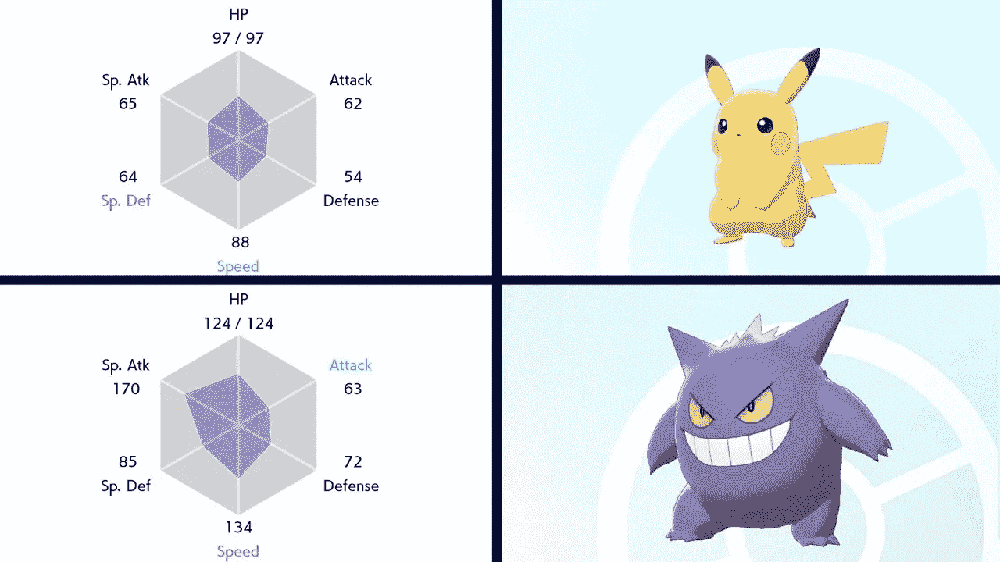

图片来源:【https://i.ytimg.com/vi/QWGGtKgalDo/maxresdefault.jpg 

> 《神奇宝贝》是日本媒体的一个特许经营权，最初名为*神奇宝贝红色*和*神奇宝贝绿色*，是任天堂最初的*游戏男孩*的一对视频游戏，由 Game Freak 开发，由任天堂于 1996 年 2 月发布。神奇宝贝自此成为有史以来票房最高的媒体特许经营，特许经营总收入达到 900 亿美元。

[神奇宝贝——维基百科文章](https://en.wikipedia.org/wiki/Pok%C3%A9mon)

神奇宝贝游戏，特别是第一代和第二代的游戏:*神奇宝贝红色、蓝色、黄色、金色、银色和水晶*对于出生于 90 年代的整代人来说，真的很了不起——包括我自己。这些天，我在 [*Kaggle*](https://www.kaggle.com/) 网站上寻找一些数据集，最后我发现了这个[帖子](https://www.kaggle.com/terminus7/pokemon-challenge)，作者给出了包含神奇宝贝和游戏中神奇宝贝战斗数据的数据集，并提出了一个挑战:建立一个模型，能够根据给定的数据预测两个神奇宝贝之间的战斗结果。

把我童年的爱好和现在的爱好融合在一起？听起来不错，所以我同意！

# 数据集

Kaggle 的 Weedle 洞穴哨所提供了以下数据集:

**神奇宝贝数据集** | 800 个输入，12 个特征
该数据集包含了所有发布到第 6 代的神奇宝贝的数据；

> **#** —口袋妖怪指数(*与最初的特许经营列表中使用的不同，因为大型进化列在普通形态的口袋妖怪之后)；*
> 
> **名字** —口袋妖怪的名字；
> 
> **类型 1** —口袋妖怪的初级类型；
> 
> **类型 2** —口袋妖怪的副类型*(所有口袋妖怪都有主类型，但不一定有副类型)；*
> 
> **HP** —生命值基础统计；
> 
> **攻击** —物理攻击基础统计；
> 
> **防御** —物理防御基础统计；
> 
> **Sp。Atk** —特攻基础统计；
> 
> **Sp。Def** —特殊防御基础统计；
> 
> **速度** —速度基础统计；
> 
> **一代** —这款神奇宝贝属于哪一代的特许经营游戏；
> 
> **传奇** —表示神奇宝贝是否属于传奇团体；

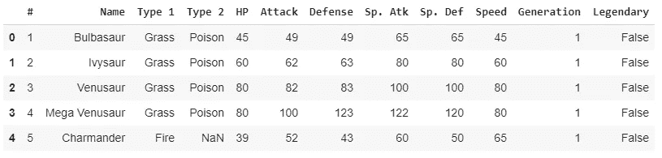

神奇宝贝数据集的头部

**战斗数据集** | 50000 个输入，3 个输入
该数据集包含神奇宝贝战斗的数据，列出了它们的索引( **#** )所涉及的两个神奇宝贝，以及哪一个以胜利者的身份结束了战斗:

> **First_Pokemon** —训练师 A 的神奇宝贝 **#** (索引)——(先攻击过的神奇宝贝会一直列为“First _ Pokemon”)；
> 
> **秒 _ 神奇宝贝** —训练师 B 的神奇宝贝 **#** (索引)；
> 
> **赢得战斗的神奇宝贝的** — **#** (指数)；

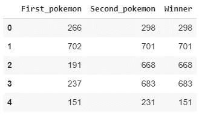

战斗数据集的头部

# 神奇宝贝的战斗是如何进行的？

在进入探索性数据分析(EDA)之前，理解单个神奇宝贝战斗是如何工作的很重要(也有双重战斗，但数据集上记录的战斗不是这种情况)。

神奇宝贝战斗遵循通常的 RPG 游戏模式:战斗轮流进行，每个参与者每回合可以采取一次行动(不是同时进行)，第一个将对手的**生命值**减少到零的人就是赢家。在特许经营游戏中，行动由*神奇宝贝训练师*采取，他们可以选择攻击敌人的神奇宝贝，使用一件物品，甚至将自己的神奇宝贝换成团队中的另一个(训练师最多可以携带 6 个神奇宝贝)。

如上所述，衡量谁是赢家的标准是生命值，简称为 **HP** 。每个神奇宝贝拥有的 **HP** 的数量由以下等式给出:

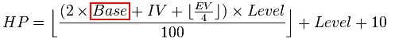

来源:[https://bulbapedia.bulbagarden.net/wiki/Statistic](https://bulbapedia.bulbagarden.net/wiki/Statistic)

给定的数据集仅提供了 **HP 基本统计数据**(在等式中突出显示)。所有其他变量(个人值: *IV* ，努力值: *EV* 和*等级*)都是游戏中开发的机制和引擎，不会在分析中考虑，因为没有办法找到数据集中记录的战斗的这些值。然而，如等式所示，总的 **HP 与基础统计 HP 成正比。换句话说，基础属性越高，一只神奇宝贝在完全训练后获得的生命值就越高。**

为了将对手的生命降至零并赢得战斗，神奇宝贝能够使用*战斗招式、*这是一种特殊的移动，用于造成伤害、增强属性或对对手甚至环境造成一些影响。在攻击性*战斗移动的情况下，*会造成一些伤害并降低敌人的生命值，所造成的伤害使用以下等式计算:

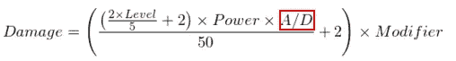

资料来源:https://bulbapedia.bulbagarden.net/wiki/Damage

其中:

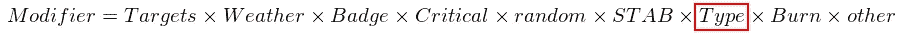

来源:[https://bulbapedia.bulbagarden.net/wiki/Damage](https://bulbapedia.bulbagarden.net/wiki/Damage)

***A/D****是攻击方神奇宝贝的*有效攻击属性*与目标神奇宝贝的*有效防御属性*的比值。“有效”来源于这样一个事实，即有两种类型的伤害:物理的和特殊的(用一个简单的比喻，让我们说它会是类似“魔法”的东西)。对于其中的每一个，特定的统计数据被用于**模数因子**的计算:
*物理移动*使用攻击神奇宝贝的**攻击**统计数据，以及目标的**防御**统计数据。另一方面，*特殊招式*考虑攻击 **Sp。攻击**状态，目标 **Sp。防御**属性。*

*与**血量类似，**这些统计数据由一个等式给出，最终值与各自的基础统计值成正比，这是*神奇宝贝数据集中所有神奇宝贝的唯一信息。**

*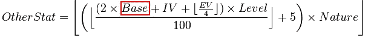*

*来源:[https://bulbapedia.bulbagarden.net/wiki/Statistic](https://bulbapedia.bulbagarden.net/wiki/Statistic)*

*我们用来构建分析的另一条信息是*类型*因素。长话短说:所有的神奇宝贝都有一个*类型，*，这是它身体组成的一个基本元素。事实上，每只神奇宝贝都至少有一种*类型*，但它们也可能有多达两种*类型*:初级和次级。*

*每一种*类型*都与他人有特定的互动，有强的、弱的、中性的或免疫的。同样，每一个*战斗招式*都关联一个类型，所以这个**类型因子**显示在伤害等式上就是*攻击招式类型* x *目标类型*伤害乘数。(不要慌，我们马上就到了)。*

*因此，在本次分析中，我们将考虑**损伤与模数因子和类型损伤乘数因子的乘积成正比，而模数因子和类型损伤乘数因子是数据集中可用的信息。***

*听起来不错，对吧？尽管事实上没有所有必要的信息来计算一个完整和完全准确的计算，知道如何计算**类型的伤害乘数**，至少有足够的信息来建立一些关于神奇宝贝战斗背后的数学好主意。然后，这是下一步！*

# *如何计算类型伤害乘数因子？*

*现在我们知道了什么是神奇宝贝类型，并且它们对伤害计算非常重要，是时候知道在神奇宝贝世界里有哪些类型了:*

*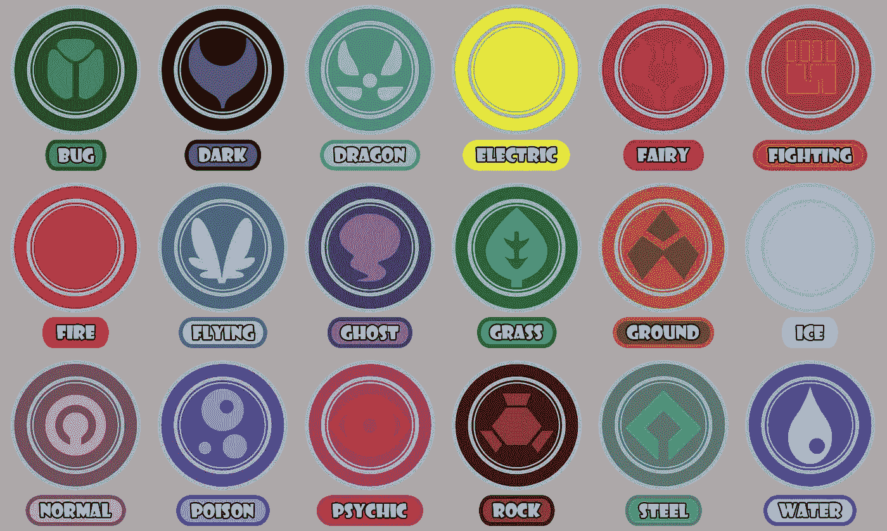*

*图片来源:[https://pokemon.fandom.com/wiki/Types](https://pokemon.fandom.com/wiki/Types)*

*这些类型中的每一种都与所有其他类型有着进攻和防守的关系，这一信息是由 Game Freak 在每一个新一代发布后提供的。我已经在[球形图](https://bulbapedia.bulbagarden.net/wiki/Type/Type_chart)上取了最新的类型图，并创建了一个新的数据框，包含与下图所示完全相同的信息:*

*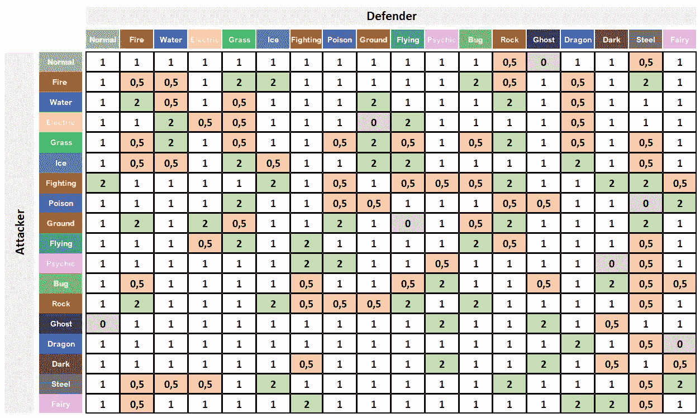*

*神奇宝贝的类型图*

*这张图表给出了所有类型之间的直接关系，包括进攻型(横向参考)和防守型(纵向参考)。*

***举个例子:** *电型*在攻击一个*水型*时有一个伤害乘数等于 2，攻击一个*草型*时有 0.5，攻击一个*火型*时等于 1，最后，攻击一个*地型*敌人时等于 0。那么，我们可以说，电运动:*

*   ***对抗*水*类型是否超有效**；*
*   ***对**对抗*草*种类不是很有效；*
*   *都是**中立**对抗*火力*类型；*
*   ***不影响**地面类型；*

*给定这四种可能的类型之间的相互作用，以及类型图表，现在可以计算所有神奇宝贝战斗的**类型伤害乘数**因子，对吗？*

## *还没有！*

*正如我之前提到的，神奇宝贝有可能有第二类型。事实上，直到日本特许发行的第六代游戏，这是神奇宝贝数据集中包含的数据，只有 48.25%的神奇宝贝只有初级类型。*

*由于大多数神奇宝贝有两种类型，并且交互因素是累积的，我们需要一种方法来计算多种类型的交互结果。由于*战斗数据集*没有提供任何关于战斗中采取了哪些行动的信息，我采用一些假设来简化分析:我们将考虑:*

*   *神奇宝贝在战斗中只能使用自己类型的战斗招式——例如，一个*火* / *飞*如 Charizard 只能使用火招或飞招(战斗招式只有一种类型与之相关)；*
*   *神奇宝贝训练师总是会为他们的神奇宝贝选择最好的战斗移动选项(如果适用的话),以便对敌人的神奇宝贝造成尽可能多的伤害。*

> ***作者注:**神奇宝贝从其他类型而不是自己的类型中了解战斗招式是完全可能和正常的，更有经验的玩家总是选择从可能为他们的弱点提供一些覆盖的类型中教授他们的神奇宝贝招式(神奇宝贝可以同时了解多达 4 个招式)。然而，由于缺乏战斗数据集的信息，该分析不会考虑这一事实；*

*为了理解如何计算**型伤害乘数**因子，一个简单的例子可能会有用。*

*想象一下，两个神奇宝贝训练师相遇并决定通过一场战斗来测试谁是最好的。1 号教练有一把**小火龙、**，2 号教练有一把**舒克尔。**假设**小火龙**有更高的速度统计，训练师#1 将首先采取行动。*

> ***注:速度统计**用于决定战斗中哪个神奇宝贝先移动。标准规则很简单:最快的先走。除了 **HP，**之外的其他属性的速度属性由之前显示的相同等式给出，但是使用速度基础属性代替。为了记录在案，在游戏机制中有超越标准速度规则来选择先移动哪些神奇宝贝的规则，例如优先移动或持有物品——然而，这再次不包括在这个分析范围内，因为没有关于这些战斗细节的数据。*

*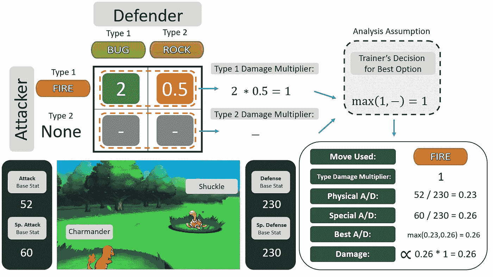*

*计算小火龙对舒克尔攻击的**型伤害乘数因子、最佳 A/D 因子**和**比例伤害因子***

*   *由于**小火龙**只有一种招式*火，*这里没有关于使用哪种招式的选项。它肯定会使用火招；*
*   *另一方面， **Shuckle** 有两种类型: *Bug* 和 *Rock* 。所以有必要考虑*火*招式如何与这两种类型相互作用，并将这些相互作用融合在一起成为一个最终的数字；*
*   *使用特殊移动是最好的选择，因为它最终会成为一个更好的**模数转换因子；***
*   *已知**型损伤乘数**和**最佳模数因子**，从本文前面给出的完整损伤方程可知**输出损伤与这两个数**的乘积成正比。*

*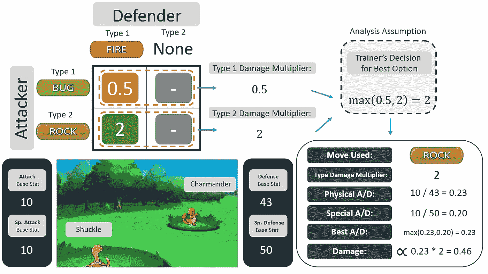*

*计算舒克尔对小火龙攻击的**型伤害乘数因子、最佳 A/D 因子**和**比例伤害因子***

*   *从攻击者的角度来看**舒克尔**，有一个本质的区别:**舒克尔**有两种类型**、**，所以它的训练者必须决定哪种移动类型是对敌人的**小火龙造成尽可能多伤害的最佳选择；***
*   *对于**舒克，**物理攻击是最好的选择——因为**物理模数因子**高于**特殊模数因子**；*

*考虑到两种魔法的相互作用，**型伤害乘数因子有六个可能的值:***

***类型优势***

*   ***4** :两种目标类型对攻击类型都很弱；*
*   *2:一个目标的类型是弱的，另一个是中性的攻击；*

***中性交互***

*   ***1** :要么两个目标类型对进攻方都是中性，要么一个目标类型对进攻方是强一个弱；*

***类型缺点***

*   ***0.5** :一个目标的类型是强，另一个对攻击的类型是中性；*
*   ***0.25** :两种目标类型对进攻的都很强；*
*   *至少有一个目标的类型是攻击性的；*

*尽管如此，我们现在有了一个好主意，可以分析哪些特征，以便更好地了解哪些是神奇宝贝在战斗中获胜的最重要因素。*

*然而，没有一个关于战斗的有价值的信息被直接给出，因为神奇宝贝数据集只有个别神奇宝贝的特征，而战斗数据集只告知哪个神奇宝贝在哪里战斗以及哪个是赢家。然后，有必要建立一个 **ETL 管道——从所有三个数据集中提取**所有必要的信息，**通过计算所有有价值的特征来转换**数据，以了解战斗胜利者的特征(基于建立在神奇宝贝战斗如何工作的基础上的知识),以及**将所有东西加载**到一个新的数据集中，我将其命名为*神奇宝贝战斗数据集。**

*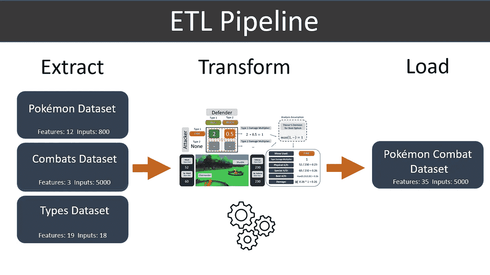*

*应用于原始数据的 ETL 管道*

*除了 ETL 管道的完整代码和完整的数据分析，生成的*神奇宝贝战斗数据集*可在我的 [github 个人资料](https://github.com/rpdieego/IndigoTortoise-pkmn-notebooks)的项目回购中获得。*

*该新数据集由 **35 个特征**组成:*

> ***First_Pokemon** —训练师 A 的神奇宝贝 **#** (索引)——(先攻击过的神奇宝贝会一直列为“First _ Pokemon”)；*
> 
> ***秒 _ 神奇宝贝** —训练师 B 的神奇宝贝 **#** (索引)；*
> 
> ***赢得战斗的神奇宝贝的赢家** — **#** (指数)；*
> 
> ***基础统计差异** —两个神奇宝贝基础统计的差异( **6 个特性**，每个特性一个:HP，攻击，防御，Sp。攻击，Sp。防守，速度)；*
> 
> ***有效属性差异** —两个神奇宝贝( **8 特性** s)用于伤害计算的有效属性差异，差异:攻击与 HP，攻击与防御，Sp。攻击和 HP，Sp。攻击和 Sp。防守，针对进攻者/目标的两种组合)；*
> 
> ***A/D 因子** —毁伤方程中使用的有效 A/D 因子( **4 特征**)，针对攻击者/目标的两种可能性的两种可能的 A/D 因子(物理的和特殊的)；*
> 
> ***类型伤害乘数** —类型伤害乘数因子( **2 特性**，每种攻击方/目标的可能性一个)；*
> 
> ***比例伤害因子** —最高 A/D 因子和类型伤害乘数因子的乘积( **2 个特性**，每个攻击方/目标的可能性一个)；*
> 
> ***伤害/生命值系数** —比例伤害系数与目标生命值基础值的比率( **2 个特性**，攻击者/目标的每种可能性一个)；*
> 
> ***神奇宝贝类型** —每个神奇宝贝的初级和次级(如果有的话)类型( **4 特性**)；*
> 
> ***传奇神奇宝贝** —表示战斗中任何一只神奇宝贝都是传奇的旗帜( **2 特征**)；*
> 
> ***优先级** —表示基础状态速度最低的神奇宝贝先移动的标志；*
> 
> ***神奇宝贝 1 赢了**——表示首先出击的神奇宝贝最终赢得战斗的标志(这将用作预测模型的目标变量)；*

*现在，基于这个新数据集，结合来自*神奇宝贝数据集的单个神奇宝贝数据，*可以执行探索性数据分析，以便更好地了解导致赢得神奇宝贝战斗的最相关因素。*

# *探索性数据分析*

## *这里快速回顾一下:*

> *-我们知道，通过对敌人的**生命值**造成**伤害**直到生命值减为零，战斗就胜利了；
> - **伤害**是许多变量的函数，然而与两个因子的乘积成正比: **A/D 因子**和**型伤害乘数**；
> - **模数因子**由神奇宝贝有效统计的划分给出，另一方面，它与各自的**基础统计**直接成比例，这在数据集上对我们是可用的；
> - **型伤害乘数**可以用本文前面所示的程序计算；*

*因此，给定神奇宝贝的战斗动态和可用的数据，为了赢得战斗，分析了解神奇宝贝最有价值的特征将基于构成伤害的两个因素:**基础统计**(以及所有可能从中得出的比例因素)和**类型互动**。*

## *基本统计*

> *赢得战斗最重要的属性是什么？一般来说，在你的旅程中使用具有防御特性的神奇宝贝是值得的，还是进攻更有效？*

*回答这些问题的最好方法，是看看在战斗中获胜的神奇宝贝和被击败的神奇宝贝之间基础统计数据的差异:*

*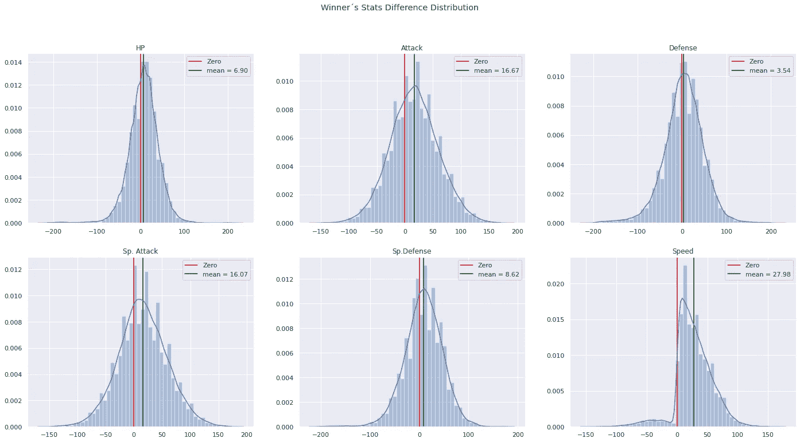*

*赢家和输家之间的基础统计差异分布*

*这些分布图给了我们一些有价值的信息:*

*   *一般来说，这可能是一般的直觉，与对手相比，基础属性更高的神奇宝贝最终会赢得战斗；*
*   *更高的进攻基础统计(*攻击*和 *Sp。攻击*似乎比更高的防御属性( *HP* 、*防御*和 *Sp)更相关。防御*)；*
*   *虽然所有其他属性的分布几乎是对称的，只是稍微偏移和向右倾斜，但是**速度基础属性**是严重向右倾斜的——显示它自己是迄今为止**与赢得战斗**最相关的基础属性；*

*这个结果真的很有趣，因为**速度**统计基本上只用于定义哪个神奇宝贝在回合中先移动。从本文开头的数据解释中，我们可能还记得*战斗数据集*将最先攻击的放在**神奇宝贝#1** 中。*

*然而，**神奇宝贝#1** 总是比**神奇宝贝#2** 有更高的速度基础属性是不真实的——这有很多原因:
——我们看的是基础属性，而不是属性本身；
-游戏中有*机制可能会覆盖先发制人的标准速度规则(如*优先移动*、*持有物品、物品使用、神奇宝贝开关*和*环境效果)——*但在数据集*中没有关于这些机制使用的细节；***

*然后，在 **ETL 管道**期间，一个名为 *Prio* 的功能被创建，以指示速度较低的神奇宝贝首先出击的战斗。*

*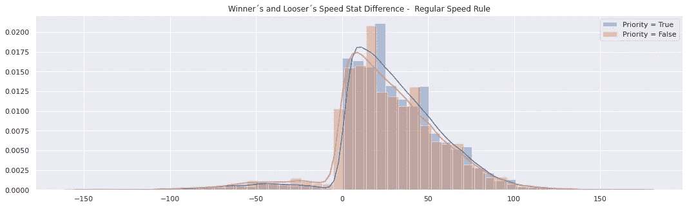*

*赢家和松散神奇宝贝之间的速度基础统计差异——常规速度规则覆盖分析*

*再次查看胜利者和失败者神奇宝贝之间的基础属性减法，人们能够看到，除了微小的差异，更高的速度属性仍然更有价值，即使是在基础属性较低的神奇宝贝先移动的战斗中*(优先级=真)。**

*请注意，在战斗的第一个回合首先出击，并不意味着**神奇宝贝#1** 已经在所有其他回合首先出击。事实上，数据显示**在标准速度规则** **下拥有每回合先动的优势是神奇宝贝赢得战斗的最有价值的特征。***

*因此，数据显示**快速**和**进攻**神奇宝贝是你在真实的神奇宝贝游戏中进行冒险时团队组成的最佳选择。*

*这涵盖了我们之前看到的损害等式的一个方面。另一个比例因子**型相互作用**怎么样？它们如何影响战斗结果？*

## *比例损伤因子和类型相互作用*

> *从基础数据本身来看，进攻特征通常比防守特征更有影响力。但它总是正确的吗？类型交互如何影响它？*

*正如我们在《神奇宝贝战斗动态》介绍中看到的，无论是从进攻角度还是防守角度来看，共有三种类型的*型互动*类别:
- **型优势**-进攻乘数: *4x* 或 *2x* |防守乘数: *0x* 、 *0.25x* 或*0.5 x*；
- **中立互动**-攻防倍增:*1x*；
- **型劣势**-(进攻乘数:0 *x，0.25x* 或 *0.5x* |防守乘数: *2x* ，*4x*；*

*这些互动对战斗的影响有多大？此外，最有价值的统计特征在不同类型的互动场景中会发生变化吗，或者进攻永远是最好的选择？*

*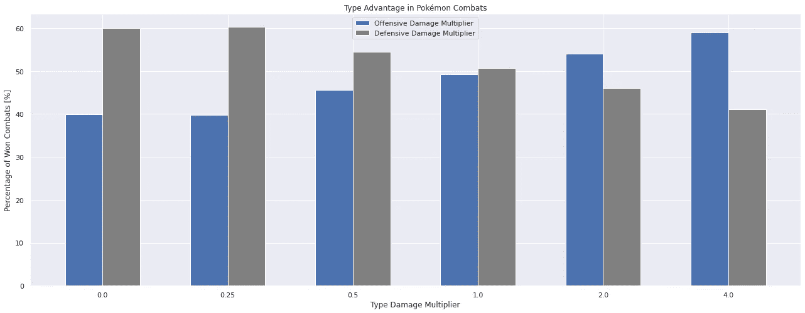*

*成功率 x 类型互动*

*上图显示，类型优势，无论是进攻还是防守，都与更高的胜率直接相关，因为**进攻伤害乘数**越高，**胜率越高，**防御胜率越高，反之亦然。*

*它证实了直觉的想法，即类型交互对战斗的胜利有很强的相关性，因为它们与伤害成正比。然而，在不同类型的互动场景中，它没有说太多关于最有价值的神奇宝贝的特征。*

*为了更好地理解有利或不利类型比赛中神奇宝贝特征之间的关系，下面的方框图可能更有用。分别代表胜者神奇宝贝的 **A/D 因子**、**比例伤害因子** ( *A/D *型伤害乘数*)、**比例伤害因子与敌人的 HP 基础统计值之比** ( *乘以 50，更贴合剧情*)；*

*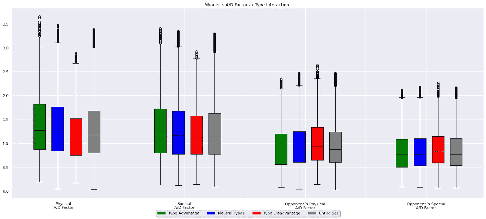*

*不同类型匹配时的模数系数*

*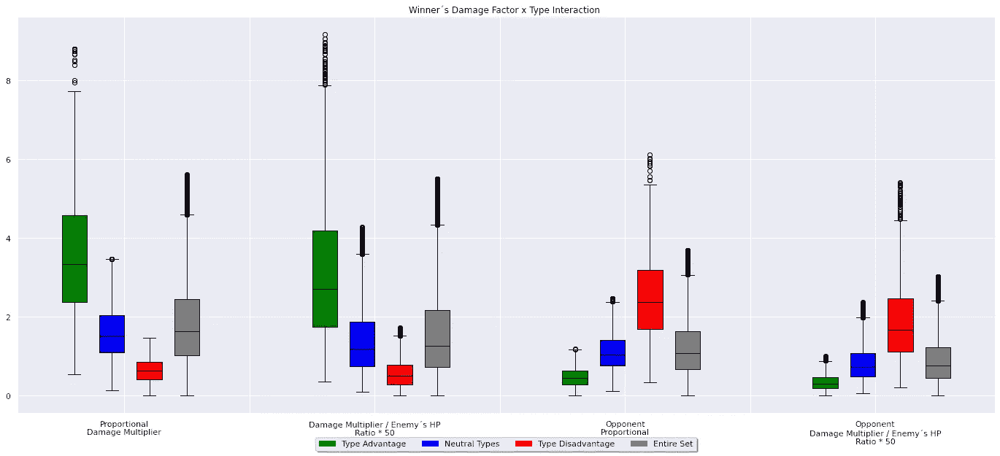*

*不同类型匹配时的伤害系数和伤害/血量比*

> *这些特征中的大多数都有巨大的异常值，因此有必要应用**IQR**(**I**enter**Q**uartile**R**安歌】**方法**来消除它们并进行分析。完整的代码和数据预处理方法可在原始项目笔记本上找到。*

*这些方框图揭示了一些非常有趣的事情:*

*   ***进攻特点** **对于一个神奇宝贝在**类型优势** **场景**(无论是进攻还是防守)上赢得战斗的**来说，相对于一般情况(整套分析)；*
*   *然而，对于**型劣势**的情况，这是不成立的。事实上，恰恰相反的情况发生了:**在这种类型的比赛中，防守特性成为最受欢迎的特性**；*
*   ***另一方面，中性相互作用**与一般情况**非常相似**；*

*综合我们目前掌握的所有信息，我们有:
-型优势显著提高了赢得战斗的概率；
-进攻特点在中性和有利型比赛中最有价值；*

*将这些信息与来自基本统计分析的信息相结合，可以得出以下结论:*

> *最佳的团队组合必须不仅基于**快速**和**进攻**魔法，还基于具有**更高有利数量的魔法类型，或者至少是中立的配对**。*

*但是，在这个指标上，哪些类型是最好的呢？*

## *类型匹配*

> *哪种类型提供更多的有利匹配？*

*开始研究这个问题的最好方法是直接从*类型数据集*中统计有利和不利类型匹配的数量。*

**

*每种类型的类型匹配计数—按进攻和防守交互进行划分*

*上面的柱状图表明，对所有 18 种神奇宝贝来说，**有利的和不利的配对数量甚至都没有接近平衡**。*

*如果每种类型的魔法数量平均分布的话，这可能是这个分析需要的唯一的图。但是，这是真的吗？*

*这是要检查的下一点:*

*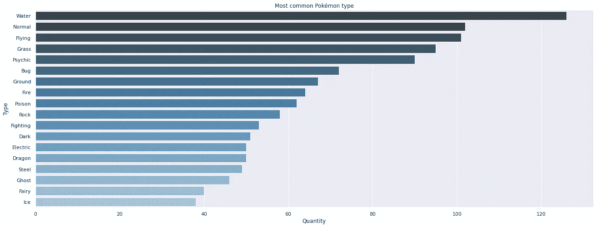*

*每种类型的神奇宝贝数量*

*很明显，人们不能直接使用类型匹配计数图作为参考来了解哪些类型可以提供更高的覆盖率，因为每种类型的神奇宝贝数量**严重不平衡**。*

*因此，与其直接使用有利或不利类型配对的计数，不如使用这些配对所代表的神奇宝贝百分比:*

*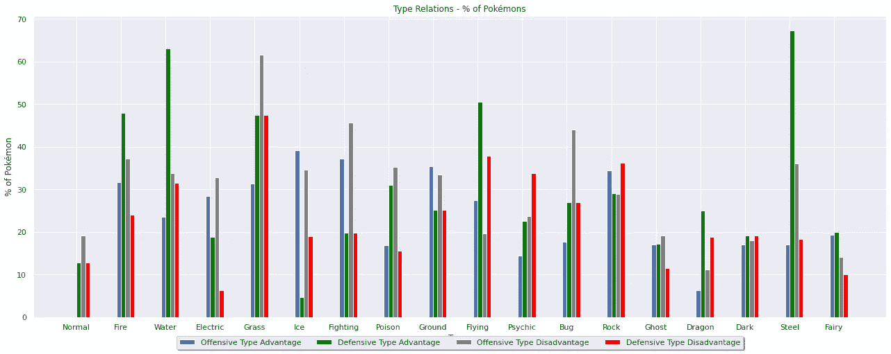*

*每种比赛类型覆盖的神奇宝贝的百分比——按进攻和防守互动划分*

***进攻型优势***

> ***格斗**和**地面**，是进攻优势配对数最好的类型，各有 **5 个**有利配对。然而，看看神奇宝贝在有利的进攻比赛中的最高百分比， **Ice** 是最好的一个，对这个数据集的神奇宝贝的 **39.2%** 超级有效；*
> 
> *由于**普通**类型没有优势，覆盖率也为零( **0%** )，是两个度量中最差的类型；*

***防守型优势***

> ***钢铁**在两个指标上都是最好的类型，从神奇宝贝的百分比来看 **11** 防守有利匹配类型匹配 ups 和**67.38%**；*
> 
> ***寒冰**和**普通**类型只对 **1** 类型有抗性，然而**寒冰**就百分比而言单独在列表中垫底，onlt **4.75%** ，因为它只对自己有抗性，而且它是神奇宝贝世界中最稀有的类型(考虑到这些数据集)；*

***进攻型劣势***

> ***草**在这两个指标上都是最差的类型， **7** 不利进攻配合，对神奇宝贝 **61.62%** 进攻乏力；*
> 
> ***龙、**鬼、**仙**配合数最好，分别对 **2 种**、**、**进攻较弱，而**龙**在百分比上独占鳌头，对魔人**只有 11.85%** 进攻较弱；*

***防御型劣势***

> ***摇滚**只是不利防守配合计数最差的类型，有 **5** 的弱点。在看神奇宝贝防御弱点百分比时最底层的类型是**草**:**47.5%**；*
> 
> ***电动**和**普通**型各只有 **1** 个弱点。然而，**电动**在百分比指标上保持最佳位置，仅弱于所有神奇宝贝的**6.25%**；*

*正如我们已经看到的那样，**有利的类型匹配增强了赢得神奇宝贝战斗**的概率，当查看每种类型的胜率时，人们期望看到具有最佳匹配百分比的**类型作为具有最高胜率的类型**，只要**战斗数据集是真正随机的**，并且在记录的战斗中神奇宝贝类型的**频率遵循每种类型神奇宝贝的相同分布**。*

*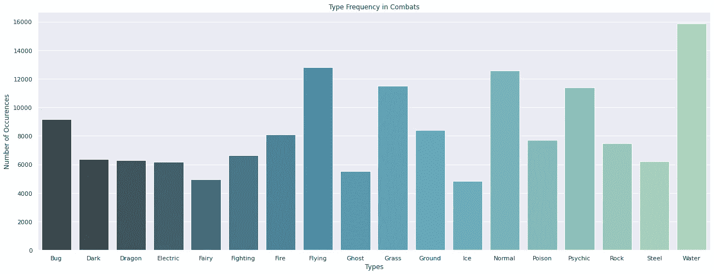*

*在战斗数据集中输入频率*

*上面的柱状图表明，在 50.000 次记录的战斗中涉及的神奇宝贝类型遵循每种类型的神奇宝贝的相同分布，这证实了战斗确实是随机选择的，因此人们可能确实直觉地认为上面提到的类型是胜率最高的类型。*

## *每种类型的成功率*

> *在比赛中表现最好的类型，真的是胜率最高的类型吗？*

*为了验证这一点，我们来看一个柱状图，显示每种类型的成功率。*

*由于神奇宝贝有初级和次级类型，观察这些特征如何影响胜率也是很有趣的。此外，了解是否有一些类型本身更强大，而其他类型作为补充可能会更好，这可能是有用的。*

*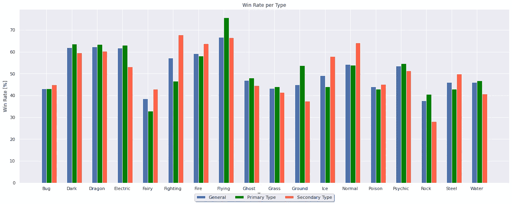*

*每种类型的胜率—常规、主要类型和次要类型*

*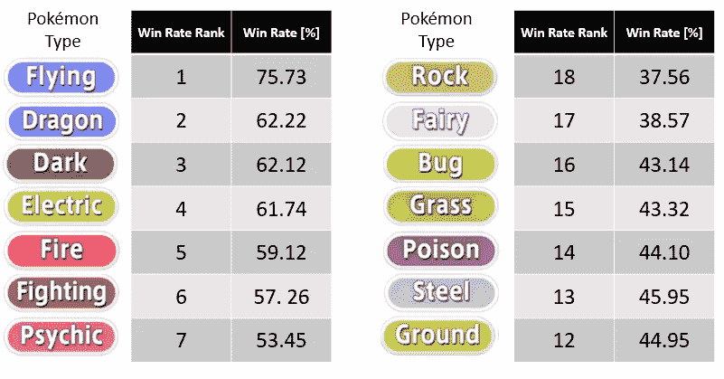*

*每种类型的最佳和最差一般胜率*

*结果相当令人惊讶:更高的胜率与更高的有利类型匹配百分比并没有很强的相关性。那么，对于一个类型来说，哪一个因素与更高的胜率最相关？*

*根据此分析的初始想法，如果**类型交互**不是胜率的影响因素，则应检查**基本统计数据**。因此，下一步是调查每种类型的平均基础统计，并找出类型是否有一些嵌入的统计特征。*

## *每种类型的平均基础状态*

> *神奇宝贝的类型有一些特定的基础统计特征吗？是否有一些类型更侧重于进攻，而其他类型更侧重于防守？*

*我们将开始调查每种类型的统计特征，找出每个统计中最好的类型(就平均基础统计而言)，并通过柱状图直观地比较它们:*

*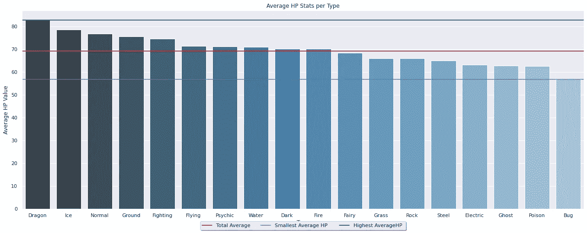*

*每种类型的平均 HP 基础统计*

*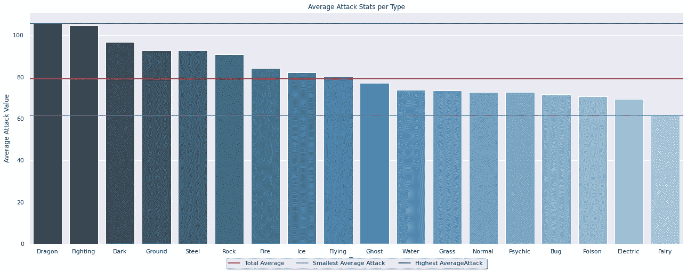*

*每种类型的平均攻击基础统计*

*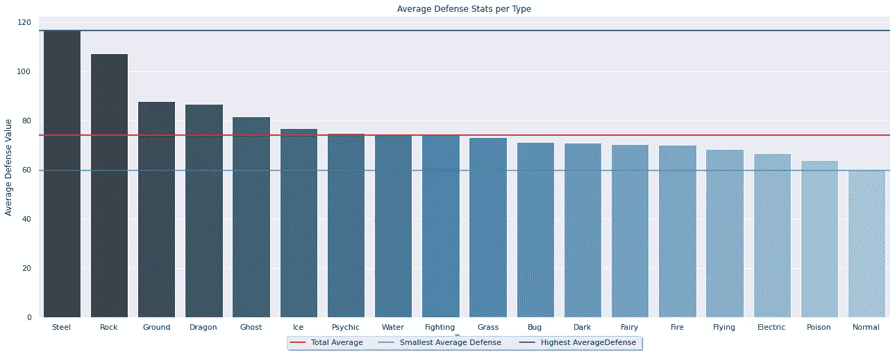*

*每种类型的平均防御基础统计*

*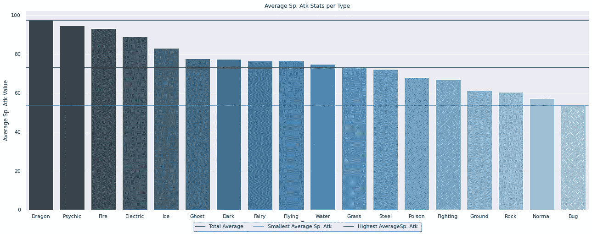*

*平均 Sp。每种类型的攻击基础统计*

*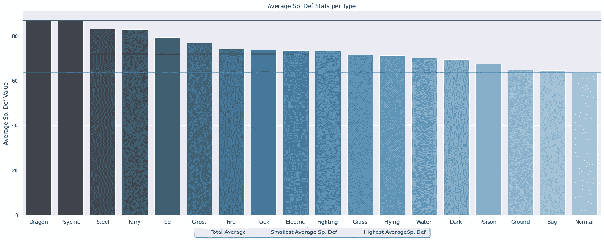*

*平均 Sp。每种防御基础统计*

**

*每种类型的平均速度基础统计*

*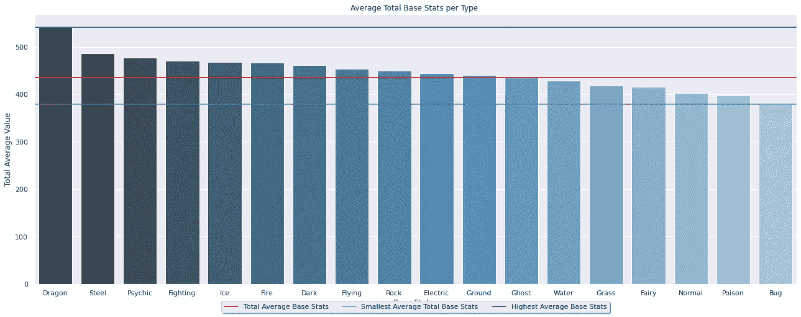*

*每种类型的总平均基础统计*

*上面这七个柱状图显示了每种类型的平均基础统计值，包括所有的**六种统计值** ( *生命值、攻击值、防御值、Sp 值。攻击，Sp。防御和速度*，以及**总基础统计**，这是所有基础统计的总和。*

*通过视觉检查这些图，找出每种类型的一些基础统计特征或模式并不容易，但是有可能注意到一些真正有趣的事情:具有最高胜率的**类型** **是具有最高平均速度基础统计的类型，**和就胜率而言最差的**是平均最慢的类型**。它们并不遵循完全相同的顺序，但这是一条重要的线索，有助于确定某个类型具有更高胜率的最重要因素。*

*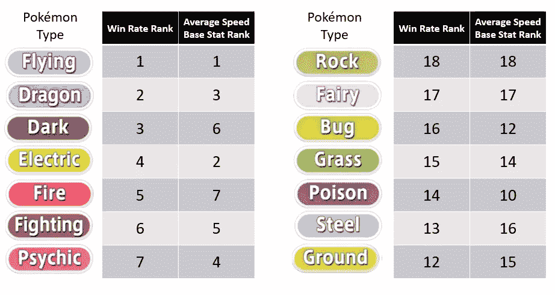*

*胜率 x 每种类型的平均速度基础统计*

*为了弄清楚每种类型的平均基础统计数据的一些模式，人们可能想要查看不同类型的图，其中可以同时可视化所有六种统计数据的数值。**雷达图**可能非常适合这个角色。*

*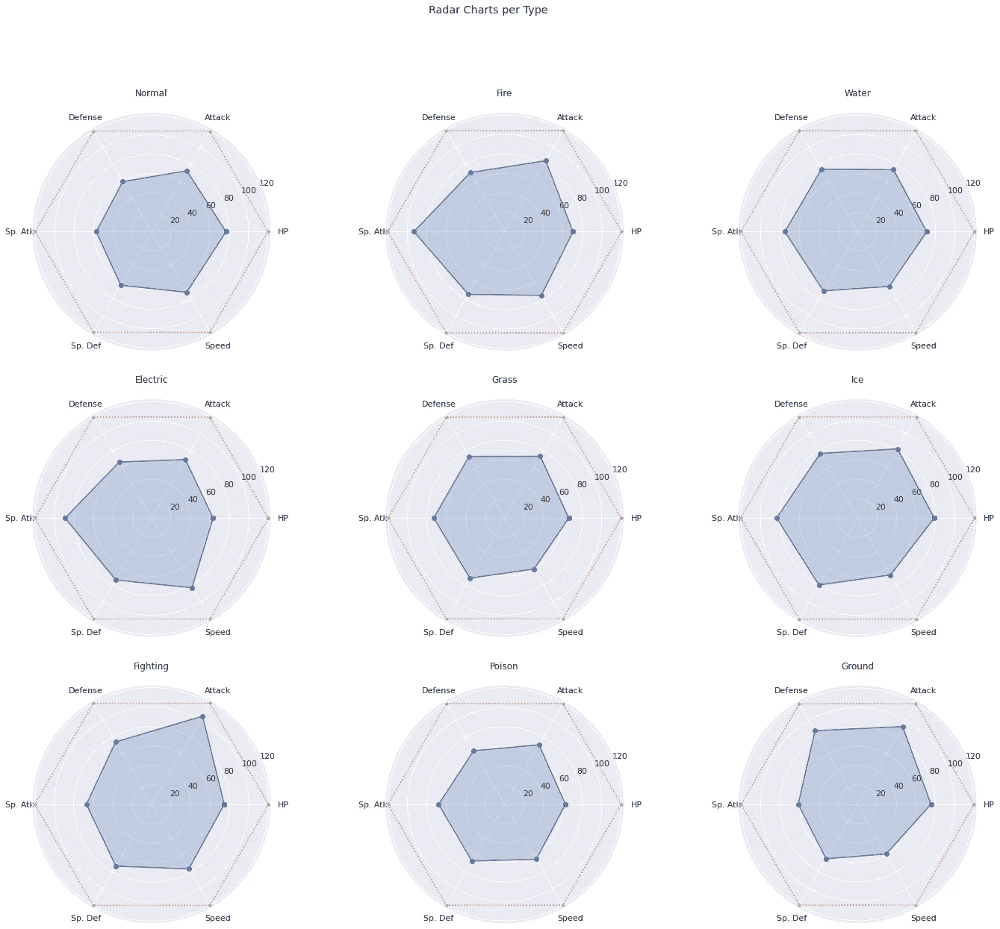*

*每种类型的平均基础统计数据—图 1/2*

*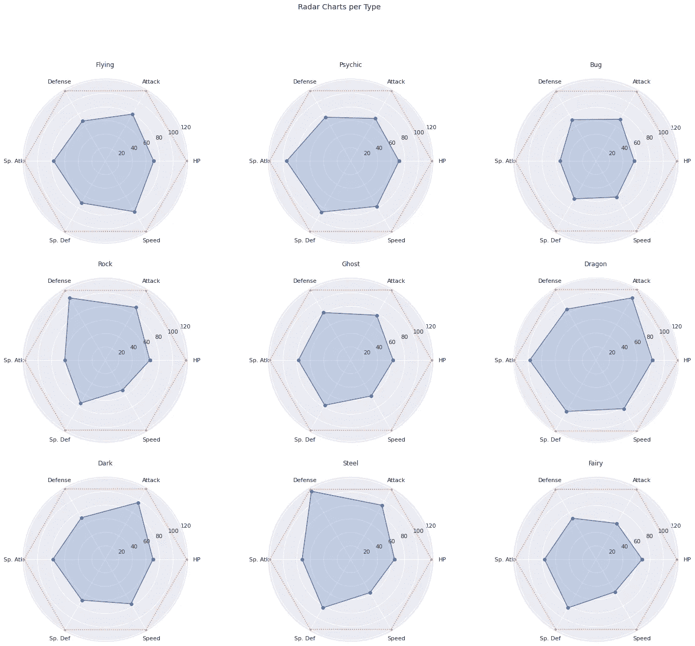*

*每种类型的平均基础统计数据—图 2/2*

*上面的雷达图清楚地表明，每种神奇宝贝都有一些统计特征:*

*   ***例如战斗**类型倾向于专注于物理攻击(高平均*攻击*基础属性，而其他属性较低)；*
*   ***通灵**型另一方面有平均高 *Sp。攻击*和 *Sp。防御*基础属性，而其他人则没有那么高；*

*这些图也更好地说明了一些类型的平均基础统计数据之间的差异。*给出的例子*:通过比较**虫**和**龙**的雷达图，可以注意到龙的魔法在每一个属性上都比虫的魔法有巨大的优势。*

*如上所述，很容易注意到**更高的平均速度基础统计**与**更高的胜率**高度相关，然而，除了这两个等级的顶端和底端由相同的神奇宝贝类型填充这一事实之外，它们出现的顺序也不相同——因此，对于一个类型来说，在战斗中具有高胜率还有一些其他相关因素。*

*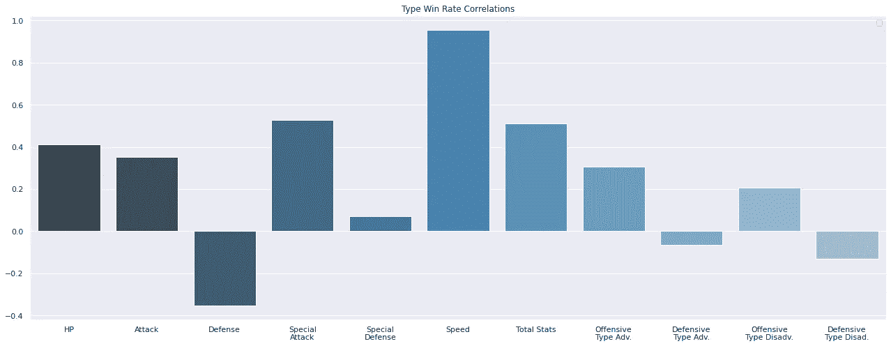*

*基本数据和类型匹配百分比与胜率的相关性*

*与战斗胜率最相关的类型特征是:*

*   ***平均速度基础统计** —相关性:0.96；*
*   *平均速度。攻击基础统计 —相关度:0.53；*
*   ***平均总统计数据** —相关度:0.51；*
*   ***平均 HP 基础统计** —相关性:0.41；*
*   ***平均攻击基础统计** —关联度:0.35；*
*   ***进攻型优势(百分比)** —相关性:0.30；*

*如前所述，最佳团队组合必须不仅基于**快速**和**进攻**魔法，还必须拥有**更高有利数量的魔法类型，或者至少是中立的配对**。*

*不过现在已经知道有利的基础统计(特别是**速度**， **Sp。攻击**、 **HP** 和**攻击**)和**高总基础属性**比类型优势更有价值，如果你想在战斗中建立一个高效的神奇宝贝团队。虽然**进攻有利型配合**也通过数据显示了它的重要性，所以在组队的时候也要注重**进攻有利型覆盖**。*

# *利用从数据中获得的知识建立一个神奇宝贝团队*

*现在，我们将使用数据分析过程中收集的所有信息来建立一个神奇宝贝团队，寻找赢得战斗的最高效率。*

*作为第一代神奇宝贝(它带来了****Charizard******Blastoise****和****venus aur***)可能是大多数人，特别是 90 年代出生的人最值得注意的一个，我将范围仅限于神奇宝贝传说中的神奇宝贝和*超级进化*都不会被包括在内，因为它们通常比“普通”的神奇宝贝有更高的基础属性。**

**基于使用本文提及的所有数据集的**探索性数据分析**，选择团队成员的**标准**按优先顺序列出如下:**

*   ****#1** —高速基础统计的神奇宝贝；**
*   ****#2** —具有攻击性特征的神奇宝贝(要么攻击，要么 Sp。攻击)；**
*   ****# 3**—团队中所有神奇宝贝的类型组合应具有广泛的有利进攻类型搭配(应尽量避免重复类型)；**

**和所有神奇宝贝游戏一样，我们的团队将由六只神奇宝贝组成。**

**在*神奇宝贝数据集*上运行一个简单的查询，我们得到:**

**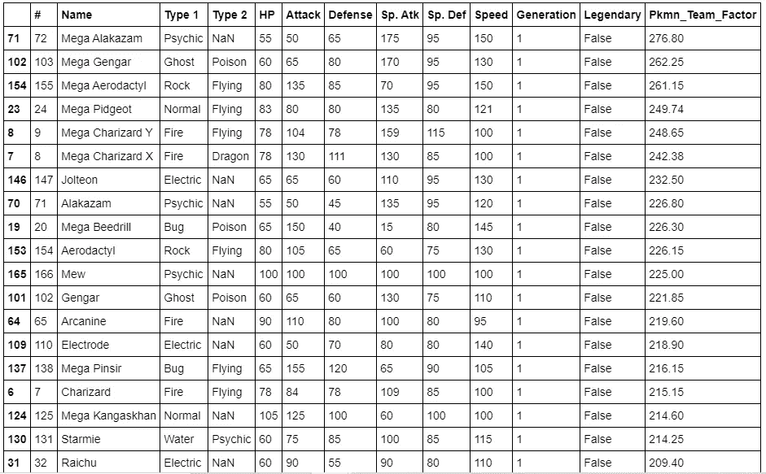**

**我们神奇宝贝团队的最佳候选人**

**严格遵循既定的标准，一个人最终拥有以下神奇宝贝团队:**

**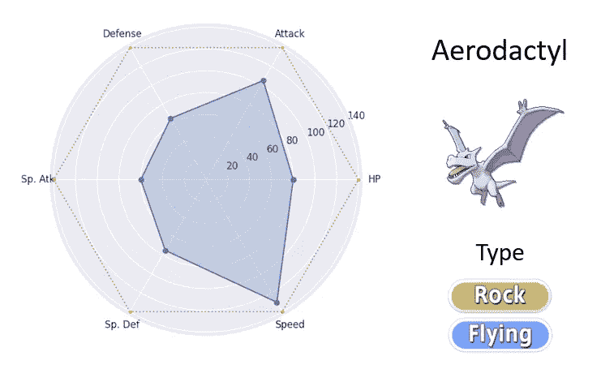**

**化石翼龙-基本统计和类型**

**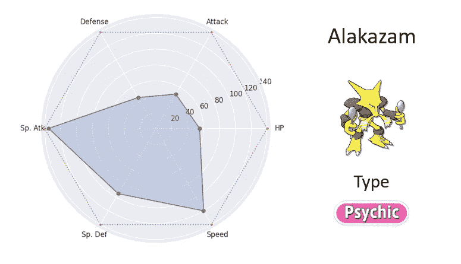**

**胡地-基本统计和类型**

**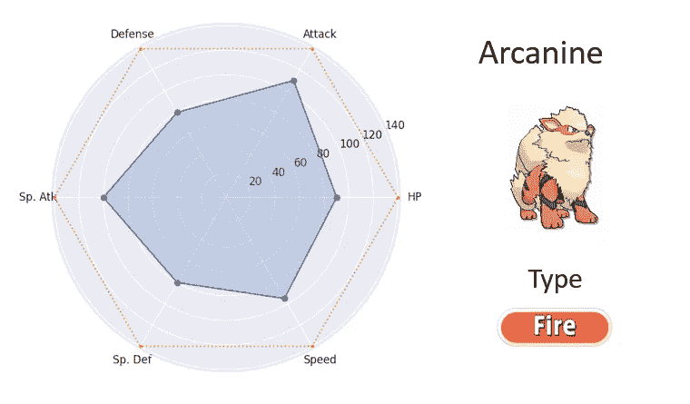**

**奥术——基本属性和类型**

**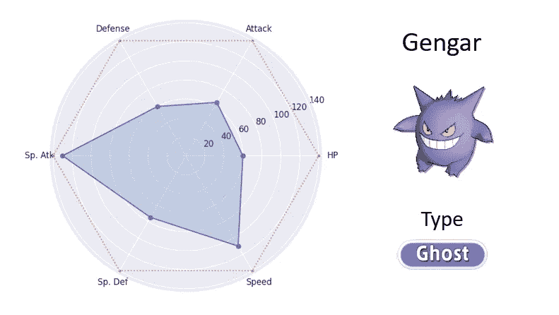**

**耿鬼-基本统计和类型**

**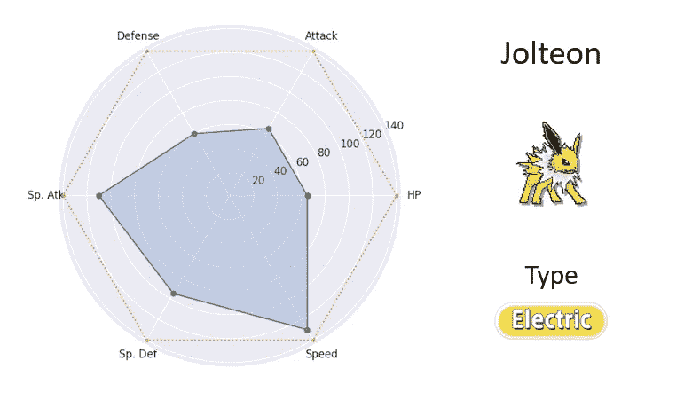**

**雷伊布-基本统计和类型**

**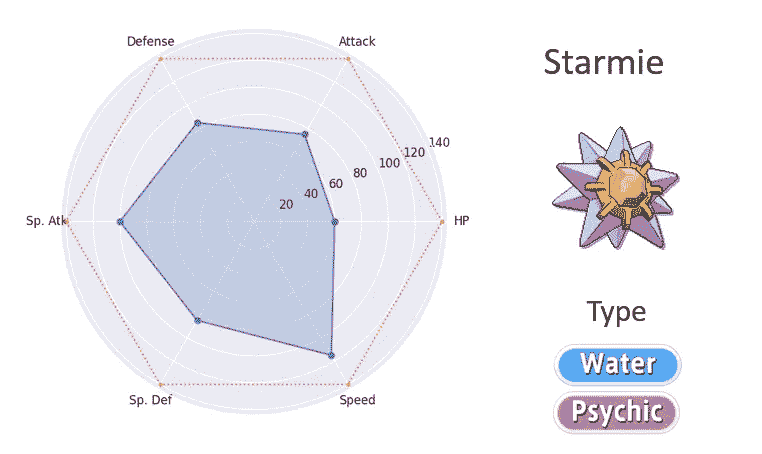**

**宝石海星-基本统计和类型**

**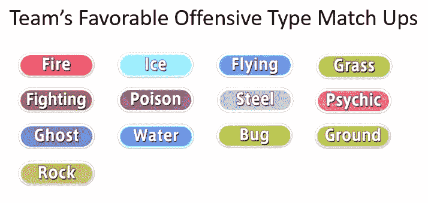**

**该队对 18 种神奇宝贝中的 13 种有有利的进攻配合**

> ****形象徽章**
> [类型徽章](https://bulbahandbook.bulbagarden.net/pokemonsunmoon/guide/about-types-natures)；[神奇宝贝精灵](https://pokemondb.net/sprites)**

**你会在下一次游戏中尝试这支神奇宝贝队伍吗？**

**所有列入这份名单的神奇宝贝都有稳固的**速度基础统计** ( **奥术**最差，数值 **95** )，也有**稳固的进攻基础统计**(物理、特殊甚至两者兼而有之——比如**奥术**)，而且没有重叠类型(除了**宝石海星的**二级类型，它与**胡地的**重叠)，达到了**的标记听起来很有希望，对吧？****

# **后续步骤**

> **预测神奇宝贝战斗赢家的机器学习模型**

**由于 Kaggle 帖子的[最初的挑战是建立一个机器学习模型，该模型能够预测哪只神奇宝贝将赢得战斗，考虑到两个战斗神奇宝贝，这将是下一步！](https://www.kaggle.com/terminus7/pokemon-challenge)**

**我们将使用从这里描述的 ETL 管道中导出的新数据集，以及关于神奇宝贝战斗的所有知识来建模和训练机器学习模型，所有细节将在下一篇文章中全面描述。**

**此外，一旦模型被完全训练，也将有可能**使用数据分析来检查这个神奇宝贝团队的效率**！**

> ****作者注:**对于那边的所有神奇宝贝粉丝来说——重要的是要记住，用于建立这一分析的所有战斗可能都是在游戏战斗中，在一次跑步中记录的，与野生神奇宝贝和 NPC 的战斗(没有关于战斗的起源和来源的信息)。竞技神奇宝贝场景完全不同，不是这里的重点。**