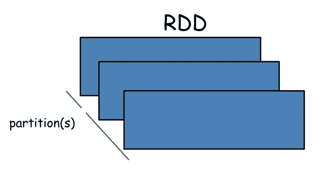
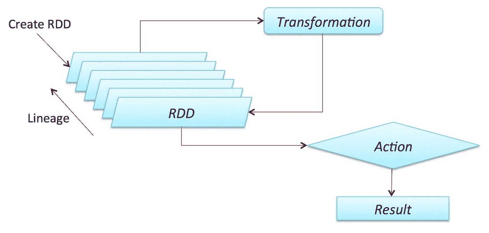
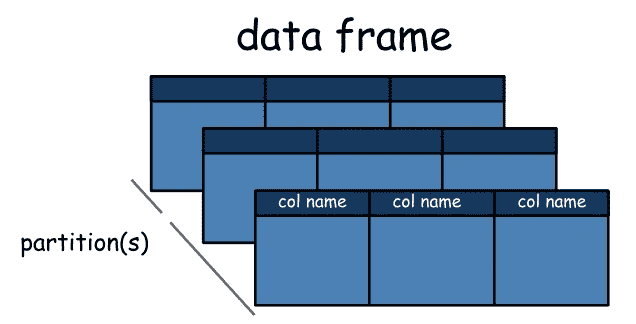
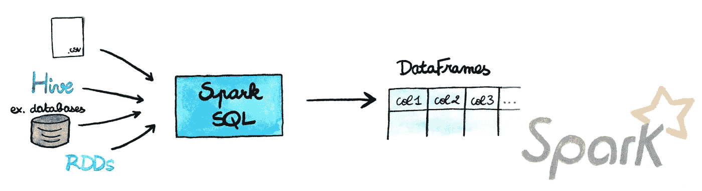
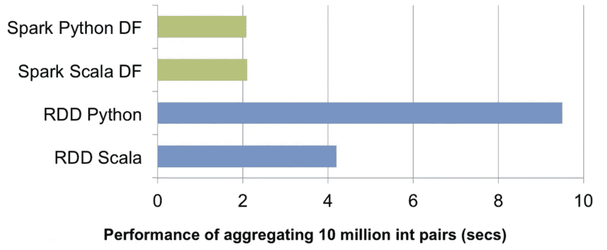
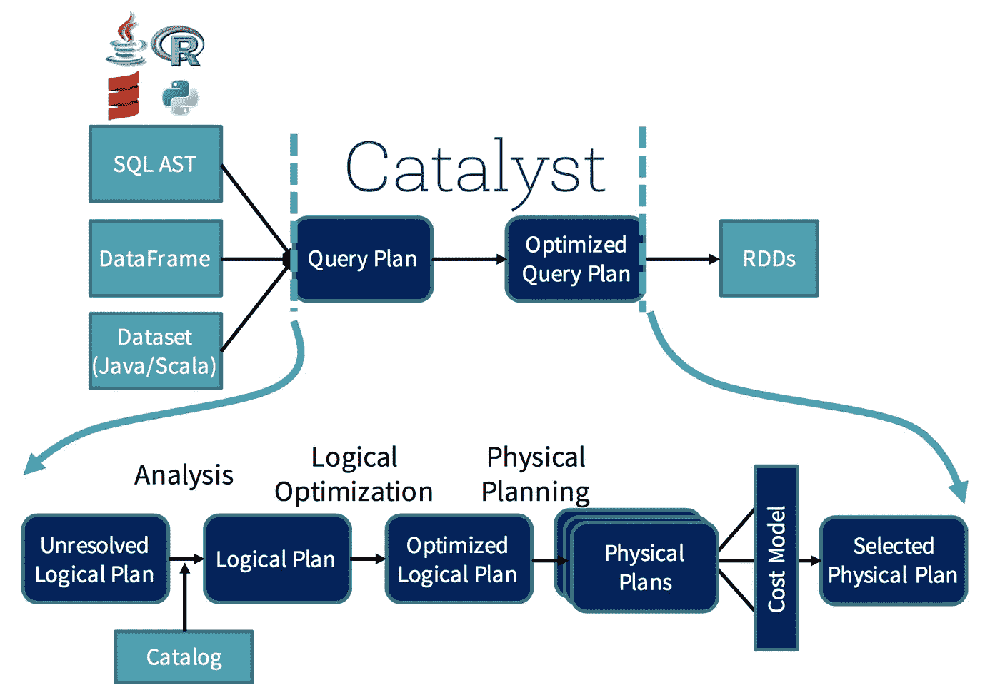
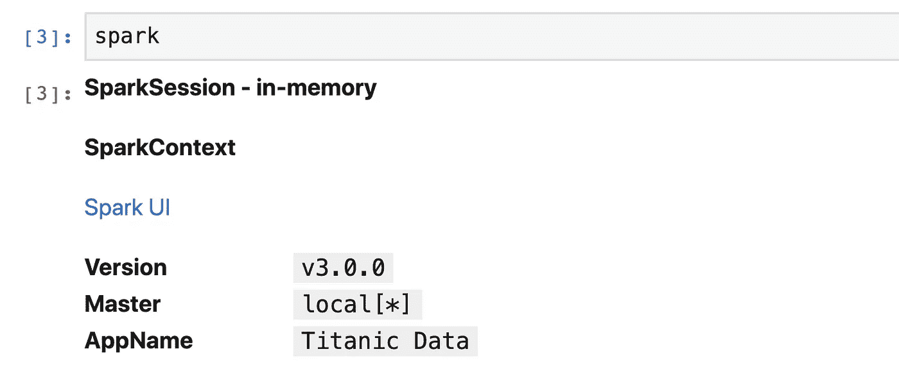
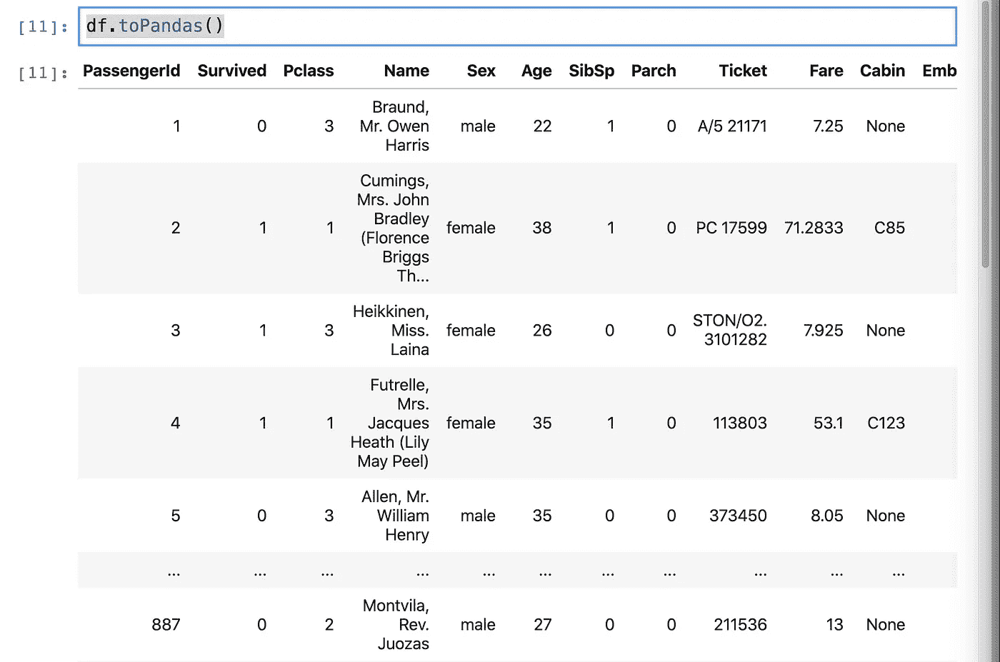
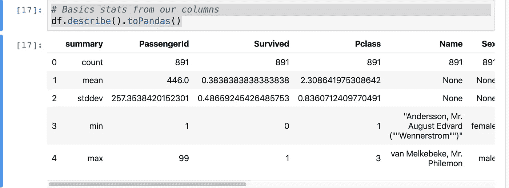

# 你的第一个 Apache Spark ML 模型

> 原文：<https://towardsdatascience.com/your-first-apache-spark-ml-model-d2bb82b599dd?source=collection_archive---------0----------------------->

## 如何用 Apache Spark 和 Python 构建一个基本的机器学习模型？


Héizel Vázquez 插图

我爱阿帕奇火花。这是我用于机器学习和数据科学的首批框架之一。在过去的几年里，它一直在稳步增长，我们已经接近它的第三个版本。我们预期的变化主要是在查询和流程的优化方面，所以 API 不会有太大的变化。这意味着你在这篇文章中学到的东西会在一段时间内起作用(我们不知道会持续多久，因为生活很微妙)。

这篇文章分为三个部分:

*   Apache Spark 的基础知识
*   安装和使用 Apache Spark
*   创建您的第一个 Apache Spark 机器学习模型

前两节中您将看到的许多内容来自我以前写的两篇关于 Apache Spark 的文章:

[](/deep-learning-with-apache-spark-part-1-6d397c16abd) [## 使用 Apache Spark 进行深度学习—第 1 部分

### 第一部分全面讨论了如何使用 Apache Spark 进行分布式深度学习。这一部分:什么是火花…

towardsdatascience.com](/deep-learning-with-apache-spark-part-1-6d397c16abd) [](/how-to-use-pyspark-on-your-computer-9c7180075617) [## 如何在你的电脑上使用 PySpark

### 我发现在您的本地上开始使用 Apache Spark(这里将重点介绍 PySpark)有点困难…

towardsdatascience.com](/how-to-use-pyspark-on-your-computer-9c7180075617) 

但是是时候更新了:)

# Apache Spark 的基础知识


[弗里皮克](https://www.freepik.com/free-vector/background-several-colored-pieces_1174026.htm#page=1&query=blocks&position=10)配合[伊泽尔·巴斯克斯](https://instagram.com/heizelvazquez)

几年前，Apache Spark 被其创建者定义为:

> 大规模数据处理的快速通用引擎。

“**快速”**部分意味着它比以前的方法更快地处理大数据，如经典的 MapReduce。更快的秘密是 Spark 在内存(RAM)上运行，这使得处理速度比在磁盘上快得多。

“**通用”**部分意味着它可以用于多种用途，比如运行分布式 SQL、创建数据管道、将数据摄取到数据库中、运行机器学习算法、处理图形、数据流等等。

现在他们把定义改成了:

> Apache Spark 是一个用于大规模数据处理的统一分析引擎。

我们仍然有通用部分，但现在它的范围更广了，有了单词“ **unified，”**，这是为了解释它可以在数据科学或机器学习工作流中做几乎所有的事情。对于端到端的项目，可以单独使用 Spark 框架。

**“大规模”**部分意味着这是一个可以完美处理大量数据的框架，我们过去称之为“大数据”(有趣的是事物变化的速度)。

# RDD



杰弗里·汤普森的 PySpark 图片。

Apache Spark 的核心抽象和开端是弹性分布式数据集(RDD)。

RDD 是可以并行操作的容错元素集合。您可以在驱动程序中并行化现有集合，或者引用外部存储系统中的数据集来创建它们，例如共享文件系统、HDFS、HBase 或任何提供 Hadoop InputFormat 的数据源。



关于 Spark，有一点非常重要，那就是所有的**转换**都是惰性的，这意味着它们不会马上计算出结果。相反，Spark 会记住应用于某个基本数据集(如文件)的转换。只有当一个**动作**需要将结果返回给驱动程序时，才会计算转换。

默认情况下，每次对变换后的 RDD 执行操作时，都会对其进行重新计算。然而，您也可以使用持久化(或缓存)方法在内存中*持久化*一个 RDD，在这种情况下，Spark 会将元素保留在集群上，以便下次查询时可以更快地访问。还支持在磁盘上持久化 rdd 或跨多个节点复制 rdd。

# 数据框架



杰弗里·汤普森的 PySpark 图片。

从 Spark 2.0.0 开始，数据帧就是一个被组织成命名列的*数据集*。它在概念上相当于关系数据库中的一个表或 R/Python 中的一个数据帧，但是在底层有更丰富的优化。

数据帧可以由各种各样的[源](https://spark.apache.org/docs/latest/sql-programming-guide.html#data-sources)构建，例如:结构化数据文件、Hive 中的表、外部数据库或现有的 rdd。



[https://aspgems . com/blog/big-data/migrando-de-pandas-spark-data frames](https://aspgems.com/blog/big-data/migrando-de-pandas-spark-dataframes)

简而言之，Dataframes API 是 Spark 创造者简化框架中数据处理的方法。它们非常类似于 Pandas 数据帧或 R 数据帧，但有几个优点。首先，它们可以分布在一个集群中，因此可以处理大量数据；其次，它们经过了优化。

这是社区迈出的非常重要的一步。到了 2014 年，用 Spark 搭配 Scala 或者 Java，速度快了很多，整个 Spark 世界都因为性能变成了 Scala。但是有了 DF API，这不再是一个问题，现在您可以在 R、Python、Scala 或 Java 中使用它获得相同的性能。



[数据块](https://databricks.com/blog/2016/07/14/a-tale-of-three-apache-spark-apis-rdds-dataframes-and-datasets.html)

负责这种优化的是催化剂。你可以把它想象成一个向导，它会接受你的查询(哦，是的！，您可以在 Spark 中运行类似 SQL 的查询，在 DF 上运行它们，它们也会被并行化)和您的操作，并创建一个优化的计划来分配计算。



[数据砖块](https://databricks.com/blog/2015/04/13/deep-dive-into-spark-sqls-catalyst-optimizer.html)

过程没那么简单，但是作为程序员的你根本不会注意到。现在它一直在那里帮助你。

在 Spark 3.0 中，我们将获得一种称为“自适应查询执行”(AQE)的东西，它将根据查询执行过程中收集的运行时统计数据来重新优化和调整查询计划。这将对性能产生巨大影响，例如[的例子](https://databricks.com/blog/2020/05/29/adaptive-query-execution-speeding-up-spark-sql-at-runtime.html)假设我们正在运行查询

```
SELECT max(i) FROM table GROUP BY column
```

没有 AQE，Spark 将启动五个任务进行最终聚合:


[https://databricks . com/blog/2020/05/29/adaptive-query-execution-speeding-up-spark-SQL-at-runtime . html](https://databricks.com/blog/2020/05/29/adaptive-query-execution-speeding-up-spark-sql-at-runtime.html)

但是有了 AQE，Spark 将把这三个小分区合并成一个，因此，最终的聚合现在只需要执行三个任务，而不是五个:


[https://databricks . com/blog/2020/05/29/adaptive-query-execution-speeding-up-spark-SQL-at-runtime . html](https://databricks.com/blog/2020/05/29/adaptive-query-execution-speeding-up-spark-sql-at-runtime.html)

在这个新版本中，Spark 将解决一个大问题:基于成本的优化。如果你想了解更多，请查看上面两张图片中的链接。

在接下来的会议中，我们将看到更多关于 Spark 及其机器学习(ML)库的内容。

# 安装和使用 Apache Spark

***备注:***

*   ***“$”符号将表示在 shell 中运行(但不要复制该符号)。***
*   **>>>符号表示 Python 外壳(不要复制符号)。**

我们将在本地安装 PySpark，然后使用 Jupyter 来处理它。使用 Spark 还有更多方法，如果你想了解更多，请查看这篇文章。

## 安装 PySpark


[Freepik](https://www.freepik.com/free-vector/website-setup-illustration-concept_6193236.htm#page=1&query=install&position=12)

PySpark，可以想象，就是 Apache Spark 的 Python API。这是我们使用 Python 与框架交互的方式。安装非常简单。这些是步骤:

*   在计算机上安装 Java 8 或更高版本。
*   安装 Python(我推荐>来自 [Anaconda](https://www.continuum.io/downloads) 的 Python 3.6)
*   安装 PySpark:

```
$ pip3 install pyspark
```

目前的默认版本是 3.0.0，这是实验性的，但是它应该适用于我们的实验。

要测试您的安装，请转到您的终端，然后打开 Python。然后写:

```
>>> import pyspark
```

如果你没有得到一个错误，你就在正确的道路上。要检查 Spark write 的安装版本:

```
pyspark.__version__
```

你应该得到‘3 . 0 . 0’。

*   在 Python 笔记本中测试 Spark:创建一个新的 Jupyter 笔记本，编写和以前一样的内容。**如果出现错误，直接从笔记本上安装 PySpark。下面是**一款笔记本电脑实现这一功能的要点:

# 创建您的第一个 Apache Spark ML 模型


[免费版](https://www.freepik.com/free-vector/programmer-concept-illustration_8611162.htm#page=1&query=programming&position=6)

Spark 的机器学习库叫做 MLlib(机器学习库)。它在很大程度上基于 Scikit-learn 关于管道的想法。在本库中，创建 ML 模型的基本概念是:

*   DataFrame:这个 ML API 使用 Spark SQL 中的 DataFrame 作为 ML 数据集，可以保存各种数据类型。例如，数据帧可以具有存储文本、特征向量、真实标签和预测的不同列。
*   转换器:转换器是一种可以将一个数据帧转换成另一个数据帧的算法。例如，ML 模型是将具有特征的数据帧转换成具有预测的数据帧的转换器。
*   估计器:估计器是一种算法，它可以适合一个数据帧来产生一个转换器。例如，学习算法是在数据帧上训练并产生模型的估计器
*   管道:管道将多个转换器和评估器链接在一起，以指定 ML 工作流
*   参数:所有的转换器和估算器现在共享一个公共的 API 来指定参数。

如果你想知道更多关于 API 和它们如何工作的信息，请查看官方文档[。](https://spark.apache.org/docs/latest/ml-pipeline.html)

对于这个例子，我们将使用一个非常基本的数据集。泰坦尼克号数据集，希望你们都熟悉这个案例和数据。首先，我们必须下载数据，为此我们使用 Kaggle:

[](https://www.kaggle.com/c/titanic/data) [## 泰坦尼克号:机器从灾难中学习

### 从这里开始！预测泰坦尼克号上的生存并熟悉 ML 基础知识

www.kaggle.com](https://www.kaggle.com/c/titanic/data) 

只需下载“train.csv”文件就可以了:)。

我们将根据乘客的特征来预测其是否幸存。

**启动前:确保关闭并停止所有其他 Spark 笔记本。当使用多个 Spark 实例时，Java 有时会报错。**

## 将数据加载到 Spark

为了加载数据，我们使用 Spark DataFrames。它比熊猫稍微复杂一点。不能只做“导入-> read_csv()”。您首先需要启动一个 Spark 会话，来完成该写操作:

```
from pyspark.sql import SparkSessionspark = SparkSession \
    .builder \
    .appName('Titanic Data') \
    .getOrCreate()
```

现在如果你写:

```
spark
```

在您的笔记本上，您应该会看到:



这意味着您在所有内核(即*)上本地使用 Spark，版本为 3.0.0，会话名称为“Titanic Data”。认为“Spark UI”在你使用 Spark 时会很有用，如果你点击它，你会看到:


我没有时间详细解释 UI，但如果你想了解更多，请告诉我:)。

酷！现在我们已经准备好读取数据了。为此，请编写:

```
df = (spark.read
          .format("csv")
          .option('header', 'true')
          .load("train.csv"))
```

就是这样！您已经创建了您的第一个 Spark 数据框架。要查看数据帧的内部，请编写:

```
df.show(5)
```

你会得到一些不漂亮但至少有用的东西:

```
+-----------+--------+------+--------------------+------+---+-----+-----+----------------+-------+-----+--------+
|PassengerId|Survived|Pclass|                Name|   Sex|Age|SibSp|Parch|          Ticket|   Fare|Cabin|Embarked|
+-----------+--------+------+--------------------+------+---+-----+-----+----------------+-------+-----+--------+
|          1|       0|     3|Braund, Mr. Owen ...|  male| 22|    1|    0|       A/5 21171|   7.25| null|       S|
|          2|       1|     1|Cumings, Mrs. Joh...|female| 38|    1|    0|        PC 17599|71.2833|  C85|       C|
|          3|       1|     3|Heikkinen, Miss. ...|female| 26|    0|    0|STON/O2\. 3101282|  7.925| null|       S|
|          4|       1|     1|Futrelle, Mrs. Ja...|female| 35|    1|    0|          113803|   53.1| C123|       S|
|          5|       0|     3|Allen, Mr. Willia...|  male| 35|    0|    0|          373450|   8.05| null|       S|
+-----------+--------+------+--------------------+------+---+-----+-----+----------------+-------+-----+--------+
only showing top 5 rows
```

是的，我知道，没那么漂亮。使用 Python 的一个好处是，你可以很容易地与熊猫互动。为了以更漂亮的格式显示我们的数据，您可以写:

```
df.toPandas()
```

您将获得:



但是小心我的朋友们！！！只有当您处理的数据足够小时，您才能这样做，因为当您执行“toPandas()”时，您将一次获得所有数据，并且数据不会分布在该单元格中。所以它必须适合内存。

## 检查关于您的数据的信息

有一些基本函数可以从数据集中获取更多信息。在下一段代码中，我加入了基本的代码( **- >表示计算的结果**):

```
# How many rows we have
df.count()
-> 891# The names of our columns
df.columns
-> ['PassengerId',
 'Survived',
 'Pclass',
 'Name',
 'Sex',
 'Age',
 'SibSp',
 'Parch',
 'Ticket',
 'Fare',
 'Cabin',
 'Embarked']# Types of our columns
df.dtypes
-> [('PassengerId', 'string'),
 ('Survived', 'string'),
 ('Pclass', 'string'),
 ('Name', 'string'),
 ('Sex', 'string'),
 ('Age', 'string'),
 ('SibSp', 'string'),
 ('Parch', 'string'),
 ('Ticket', 'string'),
 ('Fare', 'string'),
 ('Cabin', 'string'),
 ('Embarked', 'string')]
```

最后是一些关于我们数据的统计数据:

```
# Basics stats from our columns
df.describe().toPandas()
```



## 数据准备和特征工程

我们从上面的数据探索中注意到的一件事是，所有的列都是字符串类型。但这似乎不对。其中一些应该是数字。所以我们打算让他们出演。此外，由于时间关系，我只选择了几个变量进行建模，因此我们不必处理整个数据集:

```
from pyspark.sql.functions import coldataset = df.select(col('Survived').cast('float'),
                         col('Pclass').cast('float'),
                         col('Sex'),
                         col('Age').cast('float'),
                         col('Fare').cast('float'),
                         col('Embarked')
                        )dataset.show()
```

最后，你会得到这个数据集:

```
+--------+------+------+----+-------+--------+
|Survived|Pclass|   Sex| Age|   Fare|Embarked|
+--------+------+------+----+-------+--------+
|     0.0|   3.0|  male|22.0|   7.25|       S|
|     1.0|   1.0|female|38.0|71.2833|       C|
|     1.0|   3.0|female|26.0|  7.925|       S|
|     1.0|   1.0|female|35.0|   53.1|       S|
|     0.0|   3.0|  male|35.0|   8.05|       S|
|     0.0|   3.0|  male|null| 8.4583|       Q|
|     0.0|   1.0|  male|54.0|51.8625|       S|
|     0.0|   3.0|  male| 2.0| 21.075|       S|
|     1.0|   3.0|female|27.0|11.1333|       S|
|     1.0|   2.0|female|14.0|30.0708|       C|
|     1.0|   3.0|female| 4.0|   16.7|       S|
|     1.0|   1.0|female|58.0|  26.55|       S|
|     0.0|   3.0|  male|20.0|   8.05|       S|
|     0.0|   3.0|  male|39.0| 31.275|       S|
|     0.0|   3.0|female|14.0| 7.8542|       S|
|     1.0|   2.0|female|55.0|   16.0|       S|
|     0.0|   3.0|  male| 2.0| 29.125|       Q|
|     1.0|   2.0|  male|null|   13.0|       S|
|     0.0|   3.0|female|31.0|   18.0|       S|
|     1.0|   3.0|female|null|  7.225|       C|
+--------+------+------+----+-------+--------+
```

如果我们运行这个:

```
from pyspark.sql.functions import isnull, when, count, coldataset.select([count(when(isnull(c), c)).alias(c) for c in dataset.columns]).show()
```

我们得到:

```
+--------+------+---+---+----+--------+
|Survived|Pclass|Sex|Age|Fare|Embarked|
+--------+------+---+---+----+--------+
|       0|     0|  0|177|   0|       2|
+--------+------+---+---+----+--------+
```

我们看到在一些列中也有空值，所以我们只消除它们:

```
dataset = dataset.replace('?', None)\
        .dropna(how='any')
```

现在，Spark ML 库只处理数字数据。但我们还是想用《性》和《登船》专栏。为此，我们需要对它们进行编码。为此，让我们使用一个叫做 [StringIndexer](https://spark.apache.org/docs/latest/ml-features#stringindexer) 的东西:

```
from pyspark.ml.feature import StringIndexerdataset = StringIndexer(
    inputCol='Sex', 
    outputCol='Gender', 
    handleInvalid='keep').fit(dataset).transform(dataset)dataset = StringIndexer(
    inputCol='Embarked', 
    outputCol='Boarded', 
    handleInvalid='keep').fit(dataset).transform(dataset)dataset.show()
```

如果你这样做，你会得到:

```
+--------+------+------+----+-------+--------+------+-------+
|Survived|Pclass|   Sex| Age|   Fare|Embarked|Gender|Boarded|
+--------+------+------+----+-------+--------+------+-------+
|     0.0|   3.0|  male|22.0|   7.25|       S|   0.0|    0.0|
|     1.0|   1.0|female|38.0|71.2833|       C|   1.0|    1.0|
|     1.0|   3.0|female|26.0|  7.925|       S|   1.0|    0.0|
|     1.0|   1.0|female|35.0|   53.1|       S|   1.0|    0.0|
|     0.0|   3.0|  male|35.0|   8.05|       S|   0.0|    0.0|
|     0.0|   3.0|  male|null| 8.4583|       Q|   0.0|    2.0|
|     0.0|   1.0|  male|54.0|51.8625|       S|   0.0|    0.0|
|     0.0|   3.0|  male| 2.0| 21.075|       S|   0.0|    0.0|
|     1.0|   3.0|female|27.0|11.1333|       S|   1.0|    0.0|
|     1.0|   2.0|female|14.0|30.0708|       C|   1.0|    1.0|
|     1.0|   3.0|female| 4.0|   16.7|       S|   1.0|    0.0|
|     1.0|   1.0|female|58.0|  26.55|       S|   1.0|    0.0|
|     0.0|   3.0|  male|20.0|   8.05|       S|   0.0|    0.0|
|     0.0|   3.0|  male|39.0| 31.275|       S|   0.0|    0.0|
|     0.0|   3.0|female|14.0| 7.8542|       S|   1.0|    0.0|
|     1.0|   2.0|female|55.0|   16.0|       S|   1.0|    0.0|
|     0.0|   3.0|  male| 2.0| 29.125|       Q|   0.0|    2.0|
|     1.0|   2.0|  male|null|   13.0|       S|   0.0|    0.0|
|     0.0|   3.0|female|31.0|   18.0|       S|   1.0|    0.0|
|     1.0|   3.0|female|null|  7.225|       C|   1.0|    1.0|
+--------+------+------+----+-------+--------+------+-------+
only showing top 20 rows
```

如您所见，我们创建了两个新列“性别”和“登船”，包含与“性别”和“登船”相同的信息，但现在它们是数字。让我们对数据类型做最后一次检查:

```
dataset.dtypes-> [('Survived', 'float'),
 ('Pclass', 'float'),
 ('Sex', 'string'),
 ('Age', 'float'),
 ('Fare', 'float'),
 ('Embarked', 'string'),
 ('Gender', 'double'),
 ('Boarded', 'double')]
```

所以我们想要的所有列都是数字。我们现在必须删除旧列“Sex”和“apolloed ”,因为我们不会使用它们:

```
# Drop unnecessary columns
dataset = dataset.drop('Sex')
dataset = dataset.drop('Embarked')dataset.show()
```

您将获得:

```
+--------+------+----+-------+------+-------+
|Survived|Pclass| Age|   Fare|Gender|Boarded|
+--------+------+----+-------+------+-------+
|     0.0|   3.0|22.0|   7.25|   0.0|    0.0|
|     1.0|   1.0|38.0|71.2833|   1.0|    1.0|
|     1.0|   3.0|26.0|  7.925|   1.0|    0.0|
|     1.0|   1.0|35.0|   53.1|   1.0|    0.0|
|     0.0|   3.0|35.0|   8.05|   0.0|    0.0|
|     0.0|   1.0|54.0|51.8625|   0.0|    0.0|
|     0.0|   3.0| 2.0| 21.075|   0.0|    0.0|
|     1.0|   3.0|27.0|11.1333|   1.0|    0.0|
|     1.0|   2.0|14.0|30.0708|   1.0|    1.0|
|     1.0|   3.0| 4.0|   16.7|   1.0|    0.0|
|     1.0|   1.0|58.0|  26.55|   1.0|    0.0|
|     0.0|   3.0|20.0|   8.05|   0.0|    0.0|
|     0.0|   3.0|39.0| 31.275|   0.0|    0.0|
|     0.0|   3.0|14.0| 7.8542|   1.0|    0.0|
|     1.0|   2.0|55.0|   16.0|   1.0|    0.0|
|     0.0|   3.0| 2.0| 29.125|   0.0|    2.0|
|     0.0|   3.0|31.0|   18.0|   1.0|    0.0|
|     0.0|   2.0|35.0|   26.0|   0.0|    0.0|
|     1.0|   2.0|34.0|   13.0|   0.0|    0.0|
|     1.0|   3.0|15.0| 8.0292|   1.0|    2.0|
+--------+------+----+-------+------+-------+
```

在进入机器学习部分之前，只剩下一步了。Spark 实际上是用一个列来进行预测的，这个列将所有的特性组合成一个类似列表的结构。例如，如果您具有以下功能:

```
+--------+------+----+-------+------+-------+
|Survived|Pclass| Age|   Fare|Gender|Boarded|
+--------+------+----+-------+------+-------+
|     0.0|   3.0|22.0|   7.25|   0.0|    0.0|
+--------+------+----+-------+------+-------+
```

而你要预测“幸存”，就需要把“Pclass”、“年龄”、“票价”、“性别”、“登车”这几列信息组合成一列。我们通常称之为列特性，它应该是这样的:

```
+--------+------+----+-------+------+-------+----------------------+
|Survived|Pclass| Age|   Fare|Gender|Boarded|    features         |
+--------+------+----+-------+------+-------+----------------------+
|     0.0|   3.0|22.0|   7.25|   0.0|    0.0|[3.0, 22.0, 7.25, 0, 0] |
+--------+------+----+-------+------+-------+----------------------+
```

正如您所看到的，新的列功能包含了我们所有功能的相同信息，但是是在一个类似列表的对象中。为了在 Spark 中做到这一点，我们使用了 [VectorAssembler](https://spark.apache.org/docs/latest/ml-features#vectorassembler) :

```
# Assemble all the features with VectorAssemblerrequired_features = ['Pclass',
                    'Age',
                    'Fare',
                    'Gender',
                    'Boarded'
                   ]from pyspark.ml.feature import VectorAssemblerassembler = VectorAssembler(inputCols=required_features, outputCol='features')transformed_data = assembler.transform(dataset)
```

现在，如果我们检查我们的数据，我们有:

```
+--------+------+----+-------+------+-------+--------------------+
|Survived|Pclass| Age|   Fare|Gender|Boarded|            features|
+--------+------+----+-------+------+-------+--------------------+
|     0.0|   3.0|22.0|   7.25|   0.0|    0.0|[3.0,22.0,7.25,0....|
|     1.0|   1.0|38.0|71.2833|   1.0|    1.0|[1.0,38.0,71.2833...|
|     1.0|   3.0|26.0|  7.925|   1.0|    0.0|[3.0,26.0,7.92500...|
|     1.0|   1.0|35.0|   53.1|   1.0|    0.0|[1.0,35.0,53.0999...|
|     0.0|   3.0|35.0|   8.05|   0.0|    0.0|[3.0,35.0,8.05000...|
|     0.0|   1.0|54.0|51.8625|   0.0|    0.0|[1.0,54.0,51.8624...|
|     0.0|   3.0| 2.0| 21.075|   0.0|    0.0|[3.0,2.0,21.07500...|
|     1.0|   3.0|27.0|11.1333|   1.0|    0.0|[3.0,27.0,11.1332...|
|     1.0|   2.0|14.0|30.0708|   1.0|    1.0|[2.0,14.0,30.0708...|
|     1.0|   3.0| 4.0|   16.7|   1.0|    0.0|[3.0,4.0,16.70000...|
|     1.0|   1.0|58.0|  26.55|   1.0|    0.0|[1.0,58.0,26.5499...|
|     0.0|   3.0|20.0|   8.05|   0.0|    0.0|[3.0,20.0,8.05000...|
|     0.0|   3.0|39.0| 31.275|   0.0|    0.0|[3.0,39.0,31.2749...|
|     0.0|   3.0|14.0| 7.8542|   1.0|    0.0|[3.0,14.0,7.85419...|
|     1.0|   2.0|55.0|   16.0|   1.0|    0.0|[2.0,55.0,16.0,1....|
|     0.0|   3.0| 2.0| 29.125|   0.0|    2.0|[3.0,2.0,29.125,0...|
|     0.0|   3.0|31.0|   18.0|   1.0|    0.0|[3.0,31.0,18.0,1....|
|     0.0|   2.0|35.0|   26.0|   0.0|    0.0|[2.0,35.0,26.0,0....|
|     1.0|   2.0|34.0|   13.0|   0.0|    0.0|[2.0,34.0,13.0,0....|
|     1.0|   3.0|15.0| 8.0292|   1.0|    2.0|[3.0,15.0,8.02919...|
+--------+------+----+-------+------+-------+--------------------+
only showing top 20 rows
```

这正是我们想要的。

## 建模

现在是有趣的部分，对吗？不要！哈哈。建模很重要，但是如果没有前面的步骤，这是不可能的。所以在所有的步骤中享受乐趣:)

在建模之前，让我们按照惯例将训练和测试分开:

```
(training_data, test_data) = transformed_data.randomSplit([0.8,0.2])
```

好的。建模。这意味着，在这种情况下，为我们的数据集构建并拟合一个 ML 模型，以预测“幸存”的列和所有其他列。我们将使用一个[随机森林分类器](https://spark.apache.org/docs/latest/ml-classification-regression.html#random-forest-classifier)。这实际上是一个我们必须适应的[估计器](https://spark.apache.org/docs/latest/ml-pipeline.html#estimators)。

这实际上是最简单的部分:

```
from pyspark.ml.classification import RandomForestClassifierrf = RandomForestClassifier(labelCol='Survived', 
                            featuresCol='features',
                            maxDepth=5)
```

现在我们符合这个模型:

```
model = rf.fit(training_data)
```

这将给我们一个叫做[变压器](https://spark.apache.org/docs/latest/ml-pipeline.html#transformers)的东西。最后，我们使用测试数据集预测:

```
predictions = model.transform(test_data)
```

就是这样！你做到了。恭喜:)。你的第一个火花 ML 模型。现在让我们看看我们做得有多好。为此，我们将使用一个称为[准确度](https://en.wikipedia.org/wiki/Accuracy_and_precision)的基本指标:

```
# Evaluate our model
from pyspark.ml.evaluation import MulticlassClassificationEvaluatorevaluator = MulticlassClassificationEvaluator(
    labelCol='Survived', 
    predictionCol='prediction', 
    metricName='accuracy')
```

我们要获得我们所做的准确性:

```
accuracy = evaluator.evaluate(predictions)
print('Test Accuracy = ', accuracy) -> 0.843
```

我们的基本模型给出了 0.843 的精度。一点也不差:)。

应该注意的是，我们必须做更多的事情来实际构建一个数据科学项目和一个好的 ML 模型，比如交叉验证、特征选择，我们还必须测试更多的模型，等等。

我在 GitHub 中创建了一个 repo，包含了本文的所有代码。您可以在这里找到它:

 [## 法维奥巴斯克斯/first_spark_model

### 你的第一个 Apache Spark 模型:)。通过在…上创建帐户，为 FavioVazquez/first_spark_model 开发做出贡献

github.com](https://github.com/FavioVazquez/first_spark_model) 

希望您能从这篇文章中学到一些新东西。我将在这个主题上创造更多，我也将很快与我的公司 [Closter](https://www.linkedin.com/company/closter/) 一起推出关于 Spark、Python 和数据科学的课程。你可以通过以下方式联系我:favio [at] closer [dot] net

下期文章再见:)