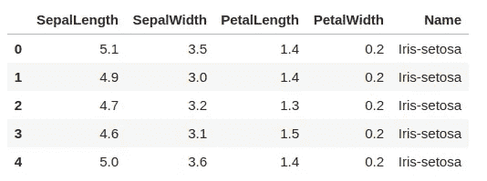
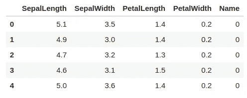
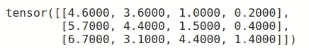
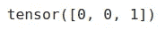
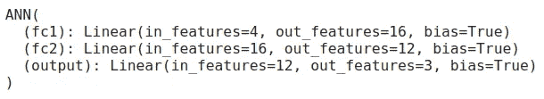
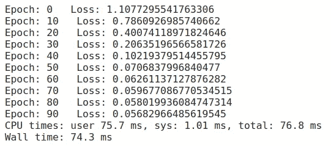
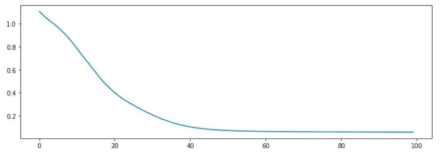
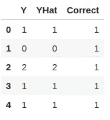

# 你在 PyTorch 的第一个神经网络

> 原文：<https://towardsdatascience.com/your-first-neural-network-in-pytorch-725631ae0fc?source=collection_archive---------6----------------------->

## 让我们把电脑预热一下。

随着深度学习领域日益升温，网络上有太多的高级文章，很容易认为深度学习是只为数学博士保留的高级领域——但让我们证明你错了。


照片由 [Aziz Acharki](https://unsplash.com/@acharki95?utm_source=medium&utm_medium=referral) 在 [Unsplash](https://unsplash.com?utm_source=medium&utm_medium=referral) 上拍摄

深度学习领域，至少是实践部分，从未像现在这样容易起步——因为资源的数量在增长，图书馆也在变得更好。

这篇文章的目标读者是那些知道人工神经网络的基础理论但不知道如何编码的人。相信我，事情会比你想象的简单。

这篇文章的结构如下:

1.  导入和数据集
2.  训练/测试分割
3.  定义神经网络模型
4.  模特培训
5.  模型评估
6.  结论

这看起来很多，但是我保证——如果你安装了必要的库，你最多可以在 10 分钟内读完，如果你决定跟随代码，15 分钟就可以了。

读完这篇文章后，你将对如何在 PyTorch 库中实现一个**人工神经网络**算法来对以前看不见的数据进行预测有一个基本的想法。

请记住，这篇文章并没有涵盖高级的内容，因为这些内容将会出现在后面的文章中。所以事不宜迟，我们开始吧。

# 导入和数据集

对于这个简单的例子，我们将只使用几个库:

*   `Pandas`:用于数据加载和操作
*   `Scikit-learn`:用于列车测试分割
*   `Matplotlib`:用于数据可视化
*   `PyTorch`:用于模型训练

如果您只想复制/粘贴，以下是导入内容:

```
import torch
import torch.nn as nn
import torch.nn.functional as F
import pandas as pd
import matplotlib.pyplot as plt
from sklearn.model_selection import train_test_split
```

至于数据集，**虹膜数据集**，可以在[这个 URL](https://raw.githubusercontent.com/pandas-dev/pandas/master/pandas/tests/data/iris.csv) 上找到。下面介绍如何在熊猫中直接导入:

```
iris = pd.read_csv('[https://raw.githubusercontent.com/pandas-dev/pandas/master/pandas/tests/data/iris.csv](https://raw.githubusercontent.com/pandas-dev/pandas/master/pandas/tests/data/iris.csv')')
iris.head()
```

前几行看起来像这样:



我们现在要做的是将`Name`列中的值更改或重新映射为数字——比如说`0, 1, 2`。下面是如何做到这一点:

```
mappings = {
   'Iris-setosa': 0,
   'Iris-versicolor': 1,
   'Iris-virginica': 2
}iris['Name'] = iris['Name'].apply(lambda x: mappings[x])
```

执行上面的代码会产生以下数据帧:



也就是说我们可以继续了。

# 训练/测试分割

在本节中，我们将使用`Scikit-Learn`库来进行训练/测试分割。之后，我们将把分割数据从`Numpy arrays`转换到`PyTorch tensors`。

让我们看看怎么做。

首先，我们需要将虹膜数据集分为**特征**和**目标** —或者 X 和 y。列`Name`将是目标变量，其他所有内容都将是特征(或预测值)。

我也将使用一个随机的种子，所以你能够复制我的结果。代码如下:

```
X = iris.drop('Name', axis=1).values
y = iris['Name'].valuesX_train, X_test, y_train, y_test = train_test_split(X, y, test_size=0.2, random_state=42)X_train = torch.FloatTensor(X_train)
X_test = torch.FloatTensor(X_test)
y_train = torch.LongTensor(y_train)
y_test = torch.LongTensor(y_test)
```

如果您现在检查从`X_train`开始的前 3 行，您会得到这样的结果:



同样适用于`y_train`:



我们现在已经具备了创建神经网络所需的一切——让我们在下一节开始吧。

# 定义神经网络模型

至于模型的架构，会很简单。让我们看看网络将如何构建:

1.  **全连通层** ( **4** 输入特征(X 中的特征数)， **16** 输出特征(任意))
2.  **全连通层** ( **16** 输入特征(来自上一层的输出特征数)， **12** 输出特征(任意))
3.  **输出层** ( **12** 输入特征(来自前一层的输出特征的数量)， **3** 输出特征(不同类的数量))

差不多就是这样。除此之外，我们将使用 **ReLU** 作为我们的激活函数。让我们看看如何用代码实现这一点:

```
class ANN(nn.Module):
   def __init__(self):
       super().__init__()
       self.fc1 = nn.Linear(in_features=4, out_features=16)
       self.fc2 = nn.Linear(in_features=16, out_features=12)
       self.output = nn.Linear(in_features=12, out_features=3)

 def forward(self, x):
     x = F.relu(self.fc1(x))
     x = F.relu(self.fc2(x))
     x = self.output(x)
     return x
```

PyTorch 使用这种面向对象的方式来声明模型，并且非常直观。在**构造函数**中，您将定义所有的层及其架构，在`forward()`方法中，您将定义一个向前传递。

就这么简单。

现在，让我们创建一个模型实例，并验证其架构是否与我们上面指定的架构相匹配:

```
model = ANN()
model
```



太好了。在我们训练模型之前，我们还需要声明几件事情:

*   **标准**:基本上我们如何衡量损失，我们将使用`CrossEntropyLoss`
*   **优化器**:优化算法，我们将使用学习率为`0.01`的`Adam`

下面是如何用代码实现它:

```
criterion = nn.CrossEntropyLoss()
optimizer = torch.optim.Adam(model.parameters(), lr=0.01)
```

现在是我们期待已久的部分——模特培训！

# 模特培训

这部分也会极其简单。我们将训练模型 100 个纪元，记录时间和损失。每隔 10 个时期，我们将向控制台输出当前状态——指示我们所处的时期以及当前的损失。

代码如下:

```
%%timeepochs = 100
loss_arr = []for i in range(epochs):
   y_hat = model.forward(X_train)
   loss = criterion(y_hat, y_train)
   loss_arr.append(loss)

   if i % 10 == 0:
       print(f'Epoch: {i} Loss: {loss}')

   optimizer.zero_grad()
   loss.backward()
   optimizer.step()
```

如果你想知道最后 3 行在做什么，答案很简单— **反向传播** —因此更新权重和偏差，这样模型就可以真正“学习”。

下面是上面代码的结果:



太快了——请不要习惯这种感觉。

如果简单的数字对你来说毫无意义，这里有一个我们损失的可视化(x 轴上的纪元编号和 y 轴上的损失):



我们已经训练了模型，但是现在呢？我们需要**以某种方式在以前看不见的数据上评估**。在这里多呆一分钟，你就会知道怎么做了。

# 模型评估

在评估过程中，我们希望以某种方式跟踪模型做出的预测。我们需要迭代`X_test`并做出预测，然后将它与实际值进行比较。

这里我们将使用`torch.no_grad()`,因为我们只是在评估——没有必要更新权重和偏差。

总之，代码如下:

```
preds = []with torch.no_grad():
   for val in X_test:
       y_hat = model.forward(val)
       preds.append(y_hat.argmax().item())
```

预测现在存储在`preds`数组中。我们现在可以用以下 3 个属性制作一个熊猫数据帧:

*   `Y`:实际值
*   `YHat`:预测值
*   `Correct`:标志，1 表示`Y`和`YHat`匹配，否则为 0

代码如下:

```
df = pd.DataFrame({'Y': y_test, 'YHat': preds})df['Correct'] = [1 if corr == pred else 0 for corr, pred in zip(df['Y'], df['YHat'])]
```

`df`的前 5 行将如下所示:



这很好，但是实际上如何计算精确度呢？

这很简单——我们只需要对`Correct`列求和，然后除以`df`的长度:

```
df['Correct'].sum() / len(df)**>>> 1.0**
```

我们的模型对以前未见过的数据的准确率是 100%。请记住，这只是因为虹膜数据集非常容易分类，这绝不是说神经网络是该数据集的最佳算法。我会说 NN 对于这种类型的问题来说太过了，但是这是另一个时间的讨论。

# 结论

这就是你所要写的最简单的神经网络，有一个完美干净的数据集，没有丢失的值，最少的层和神经元，承认吧，这很容易。

下一次就不会了——因为更多的先进概念将会被引入。

感谢阅读。再见。

*喜欢这篇文章吗？成为* [*中等会员*](https://medium.com/@radecicdario/membership) *继续无限制学习。如果你使用下面的链接，我会收到你的一部分会员费，不需要你额外付费。*

[](https://medium.com/@radecicdario/membership) [## 通过我的推荐链接加入 Medium-Dario rade ci

### 作为一个媒体会员，你的会员费的一部分会给你阅读的作家，你可以完全接触到每一个故事…

medium.com](https://medium.com/@radecicdario/membership)