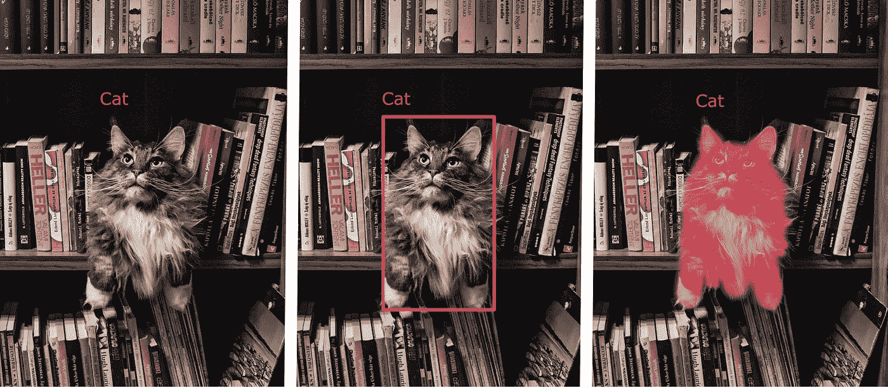
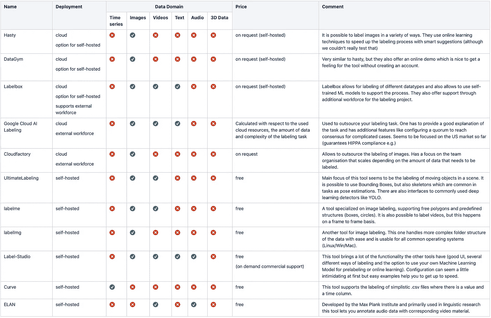

# 你迈向 AI 的第一步——标签数据！

> 原文：<https://towardsdatascience.com/your-first-step-towards-ai-labeled-data-826d114c9bba?source=collection_archive---------58----------------------->

照片由[卡拉·伍兹](https://unsplash.com/@kharaoke?utm_source=unsplash&utm_medium=referral&utm_content=creditCopyText)在 [Unsplash](https://unsplash.com/photos/Kw_zQBAChws?utm_source=unsplash&utm_medium=referral&utm_content=creditCopyText) 上拍摄

成功的机器学习项目需要良好的数据——但在许多项目中，这可能已经是第一个主要障碍。例如，来自照相机的图像数据可能已经可用，但是到目前为止还没有记录计算机可读的数据，这些数据在将来应该会被自动识别。特别是如果你想从 AI 开始，前面的数据准备工作可能会令人不知所措。当然，在您只想从一个已定义领域的概念证明开始第一次尝试的情况下，这尤其令人沮丧。

因此，您需要一个解决方案来快速、轻松地标记您自己的原始数据。我们看了看工具丛林，收集了市场所能提供的和需要注意的东西。让我们来看看在开始贴标签之前，你应该问自己哪些重要的问题，以及你可以使用的工具。

# 谁应该给数据贴标签？

标注是一项非常繁琐的任务——尤其是如果你想为深度学习算法提供足够多的数据。如果你不相信这一点，你应该想象一下，以像素级的精度在数百张图像上画出组件的缺陷是什么样的。不幸的是，一定数量的标记数据是绝对必要的。那么你从哪里得到这些数据呢？基本上，有以下几种情况:

1.  *领域专家对数据的标注:*当涉及到你自己的数据时，作为一名专家你自然最清楚应该如何标注。在开始时，您应该决定什么是存储标签的好格式，并使用合适的工具建立一个工作流，以便可以对数据集尽可能快地完成这项工作。
2.  *由人工智能服务提供商标记:*在适当的指导和解释之后，您的人工智能伙伴当然也能够执行标记。这样做的好处是可以直接传达对基本数据及其类的良好理解。同时，这种方法在大多数情况下成本太高，因为贴标签本身并不复杂。
3.  *第三方贴标:*也可以将工作完全外包。谷歌等云服务提供商也为此提供自己的服务(【https://cloud.google.com/ai-platform/data-labeling/docs】T2)。但是，仅支持某些格式(图像、视频和文本),并且必须制定非常具体的指令才能获得正确的结果。文档建议进行几次测试，直到它工作为止。数据本身当然也必须转移到云中。

在下文中，我们将更多地关注前两种情况，因为根据我们的经验，它们发生得最为频繁。

# 什么样的数据可以被标注？

虽然当考虑带标签的数据和图像中的人工智能对象识别是首先想到的事情，但来自不同应用程序的各种各样的数据类型都可以用标签来丰富。标签本身也可以应用在不同的层次上。例如，您可以标记整个图像，在其中绘制框并标记它们(边界框分割)，甚至分配具有像素精度的类(语义分割)。

不同种类的标记级别(从左至右):标记、边界框、语义分割、安德里亚·苏克罗改编自[的图片 https://www . pexels . com/photo/grey-and-white-long-coated-cat-in-middle-of-book-son-shelf-156321/](https://www.pexels.com/photo/grey-and-white-long-coated-cat-in-middle-of-book-son-shelf-156321/)

除了图像，当然还有其他非常适合处理的数据格式，其中最相关的有:

*   **时间序列**:例如，这包括机器控制系统的记录或生产过程中保存的传感器值。
*   **音频**:来自音频区的数据可用于识别语音或分析麦克风在任何过程中拾取的录音。
*   **Text** :对自然语言处理领域的所有用例都感兴趣，比如聊天机器人或智能文档管理系统。
*   **图像**:通常来自照相机或光学传感器的数据，其应该支持例如生产过程结束时的质量控制。
*   **视频**:视频记录可来自监控摄像头，例如可用于提高机器操作的安全性。
*   **3D 数据**:也可以想象，例如制造模型的部件需要提供标签。

正如我们将在后面看到的，工具在不同程度上支持不同的数据区域。但是，除了功能性要求之外，还有其他一些一般条件需要考虑。

由[谷仓图片](https://unsplash.com/@barnimages?utm_source=unsplash&utm_medium=referral&utm_content=creditCopyText)在 [Unsplash](https://unsplash.com/photos/PHO_ilA8dGg?utm_source=unsplash&utm_medium=referral&utm_content=creditCopyText) 上拍摄

# 一个好的标签工具还有哪些进一步的要求？

如果你正在与一家人工智能服务提供商合作，并且拥有敏感的公司数据，那么还有更进一步的考虑。

*   **许可合规**:当使用外部工具时，如果客户想要自己贴标，必须允许在有限的时间内将其传递给客户。另一方面，如果人工智能服务提供商支持贴标签过程，这种情况也可能发生在客户身上。
*   **数据安全性**:如果可能的话，我们希望避免基于云的解决方案，因为我们经常处理敏感数据，不希望这些数据不必要地出现在标签供应商的服务器上。
*   **舒适性**:该工具还应能被缺乏技术经验的员工直观地操作。这方面也包括时间投入。使用选择的工具总是比“手动”更快。该工具还必须在技术上易于设置，并且可以在尽可能多的环境中使用。
*   **用例覆盖**:最理想的是，一个工具而不是五个工具。这应该是一个程序，支持图像分割，但也可以处理时间序列分类。
*   **成本**:使用的工具不应超出财务和时间框架。在大多数情况下，这种考虑可以反映在免费工具和付费解决方案节省的时间的比较中。

鉴于这些标准，我们准备看看提供的解决方案！

# 有哪些工具？

我们环顾四周，试图了解市场上现有的解决方案。我们研究了商业软件和免费软件，试图理解它们涵盖了哪些用例。商业解决方案大多基于云支持，除了标签之外，还提供额外的功能，如人工智能算法的同步培训或外部劳动力的支持。大多数免费的替代方案通常需要命令行安装，并且不能作为现成的解决方案使用(如果您想自己托管它们)。

我们对不同标签工具的比较概述，图片作者 Andrea Suckro (slashwhy)

该表迄今为止还不完整，而是旨在给出当前解决方案的概述。我们注意到，对于 3D 数据的标记，没有真正规范的解决方案(除了 KNOSSOS，它是一种用于组织数据的专用工具)。因此，对于您的技术 3D 数据，您必须使用自己选择的工具(例如，AutoCAD、Blender 等)进行标注，并将其导出到相应的文件中。

# 最后的想法

所有的开始都是困难的——就像为一个最初的人工智能项目准备带有标签的原始数据一样。然而，我们可以依靠不断增加的支持和工具。对于这个领域的第一步，Label-Studio 最让我们信服，因为它安装迅速，易于使用。如果需要，它还对不同的数据类型和高级工作流提供了非常广泛的支持。我们希望这篇文章可以让你对标签世界有一点了解，并使你能够在你的个人人工智能之旅中迈出下一步。所以不要害羞，让我们开始吧——从收集数据到贴标签！

以下是我们介绍的工具的链接集合:

1.  仓促[https://hasty.ai/solution.html](https://hasty.ai/solution.html)
2.  https://www.datagym.ai/[数据体育馆](https://www.datagym.ai/)
3.  https://labelbox.com/标签盒
4.  谷歌云 AI 标签[https://cloud.google.com/ai-platform/data-labeling/docs](https://cloud.google.com/ai-platform/data-labeling/docs)
5.  云工厂[https://www.cloudfactory.com/data-labeling](https://www.cloudfactory.com/data-labeling)
6.  最终标记[https://github.com/alexandre01/UltimateLabeling](https://github.com/alexandre01/UltimateLabeling)
7.  拉贝尔梅[https://github.com/wkentaro/labelme](https://github.com/wkentaro/labelme)
8.  https://github.com/tzutalin/labelImg
9.  标签工作室[https://github.com/heartexlabs/label-studio](https://github.com/heartexlabs/label-studio)
10.  曲线[https://github.com/baidu/Curve](https://github.com/baidu/Curve)
11.  https://archive.mpi.nl/tla/elan 的锐气