# 线性回归模型指南

> 原文：<https://towardsdatascience.com/your-guide-to-linear-regression-models-df1d847185db?source=collection_archive---------14----------------------->

## 用 Python 解释和编程线性回归模型


照片由[德鲁·比默](https://unsplash.com/@drew_beamer?utm_source=medium&utm_medium=referral)在 [Unsplash](https://unsplash.com?utm_source=medium&utm_medium=referral) 上拍摄

可解释性是机器学习中最大的挑战之一。如果一个模型的决策更容易被人理解，那么这个模型就比另一个模型更具有可解释性。有些模型非常复杂，内部结构如此复杂，以至于几乎不可能理解它们是如何得出最终结果的。这些黑盒似乎打破了原始数据和最终输出之间的关联，因为在这之间发生了几个过程。

但是在机器学习算法的宇宙中，有些模型比其他模型更透明。[决策树](/modelling-classification-trees-3607ad43a123)肯定是其中之一，线性回归模型又是另外一个。它们的简单和直接的方法使它们成为解决不同问题的理想工具。让我们看看怎么做。

您可以使用线性回归模型来分析给定地方的工资如何依赖于经验、教育水平、角色、工作城市等特征。同样，您可以分析房地产价格是否取决于诸如面积、卧室数量或到市中心的距离等因素。

在这篇文章中，我将重点关注线性回归模型，这些模型检查一个**因变量**和一个(简单线性回归)或多个(多元线性回归)**自变量**之间的线性关系。

# 简单线性回归

当输出变量(目标)只有一个输入变量(预测值)时，使用的是最简单的线性回归形式:

*   **输入**或**预测变量**是帮助预测输出变量值的变量。俗称 ***X*** 。
*   **输出**或**目标变量**是我们想要预测的变量。就是俗称的 ***y*** 。

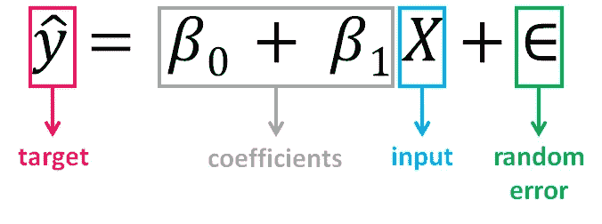

**β0 的值，也叫截距**，表示估计回归线与 ***y*** 轴相交的点，而 **β1** **的值决定了估计回归线的斜率**。**随机误差**描述的是因变量和自变量之间线性关系的随机成分(模型的扰动， ***y*** 中 ***X*** 无法解释的部分)。真正的回归模型通常是未知的(因为我们无法捕捉影响因变量的所有效应)，因此对应于观察数据点的随机误差项的值仍然未知。然而，回归模型可以通过计算观察数据集的模型参数来估计。

回归背后的想法是从样本中估计参数 **β0** 和 **β1** 。如果我们能够确定这两个参数的最佳值，那么我们将有最佳拟合的**线**，我们可以用它来预测*的值，给定 ***X*** 的值。换句话说，我们试图拟合一条线来观察输入和输出变量之间的关系，然后进一步用它来预测看不见的输入的输出。*

*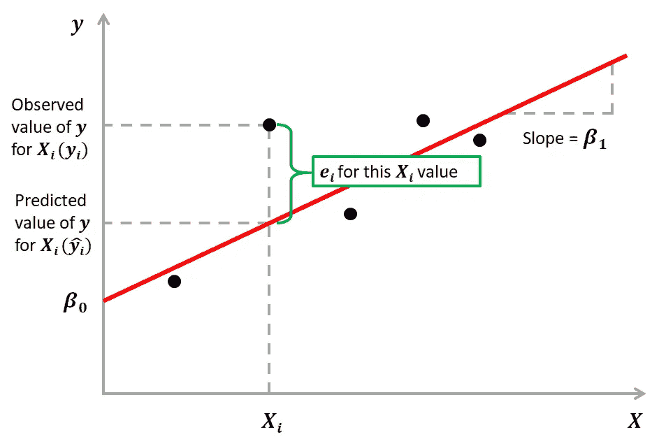*

*我们如何估算 **β0** 和 **β1** ？我们可以使用一种叫做**普通最小二乘法(OLS)** 的方法。其背后的目标是将黑点到红线的距离尽可能地减小到接近零，这是通过最小化实际结果和预测结果之间的平方差来实现的。*

*实际值和预测值之间的差异称为**残差(e)** ，可以是负数，也可以是正数，这取决于模型是否高估或低估了结果。因此，为了计算净误差，将所有残差直接相加会导致项的消除和净效应的减小。为了避免这种情况，我们取这些误差项的平方和，称为 ***残差平方和(RSS)。****

*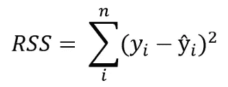*

***普通最小二乘法(OLS)将残差平方和最小化**，其目的是拟合一条回归线，使观测值与预测值(回归线)之间的距离(以二次值测量)最小化。*

# *多元线性回归*

*有两个或两个以上预测值或输入变量时，线性回归的形式。与之前描述的 SLR 模型相似，它包括额外的预测因子:*

*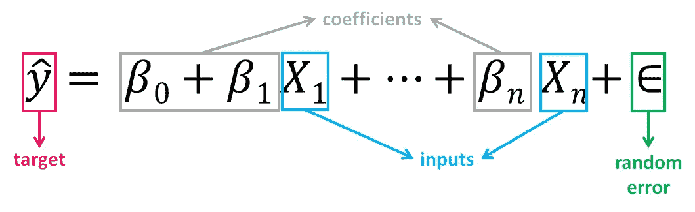*

*请注意，该方程只是简单线性回归方程的扩展，其中每个输入/预测值都有其对应的斜率系数 **(β *)*** 。第一个 **β***

*随着要素数量的增长，我们的模型的复杂性也在增加，并且变得更加难以可视化，甚至难以理解我们的数据。因为与单反相机相比，这些模型中的参数更多，所以在使用它们时需要更加小心。添加更多的术语将从本质上提高数据的拟合度，但新术语可能没有任何实际意义。这是危险的，因为它可能会导致一个模型符合这些数据，但实际上并不意味着任何有用的东西。*

# *一个例子*

*广告数据集包括一种产品在 200 个不同市场的销售额，以及三种不同媒体的广告预算:电视、广播和报纸。我们将根据电视、广播和报纸广告预算(自变量)，使用数据集来预测销售额(因变量)。*

*数学上，我们将尝试求解的公式是:*

*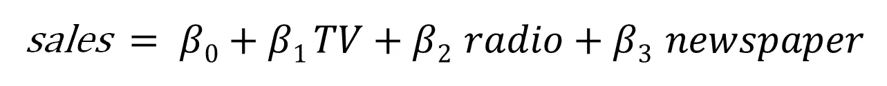*

*找到这些常数的值 **(β)** 就是回归模型通过最小化误差函数和拟合最佳直线或超平面(取决于输入变量的数量)所做的事情。我们编码吧。*

## *加载数据并描述数据集*

*你可以在[这个链接](https://github.com/dlopezyse/Medium)下下载数据集。在加载数据之前，我们将导入必要的库:*

```
*import pandas as pd
import numpy as np
import seaborn as sns
import matplotlib.pyplot as plt
from sklearn.model_selection import train_test_split
from sklearn.linear_model import LinearRegression
from sklearn import metrics
from sklearn.metrics import r2_score
import statsmodels.api as sm*
```

*现在我们加载数据集:*

```
*df = pd.read_csv(“Advertising.csv”)*
```

*让我们了解数据集并对其进行描述:*

```
*df.head()*
```

*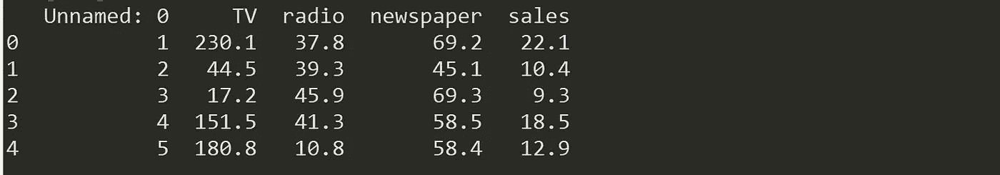*

*我们将删除第一列(“未命名”)，因为我们不需要它:*

```
*df = df.drop([‘Unnamed: 0’], axis=1)
df.info()*
```

*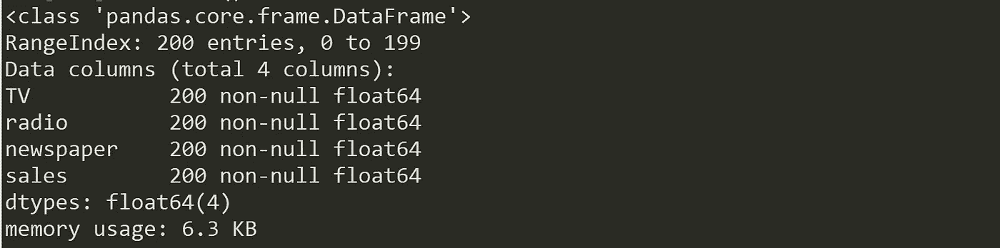*

*我们的数据集现在包含 4 列(包括目标变量“sales”)、200 个寄存器，没有缺失值。让我们想象一下自变量和目标变量之间的关系。*

```
*sns.pairplot(df)*
```

*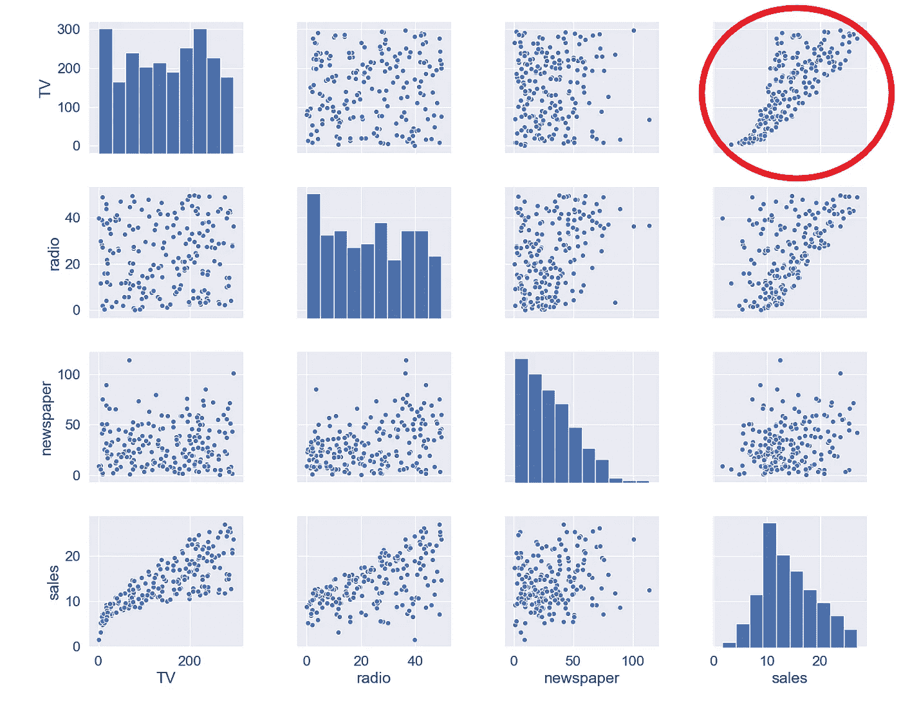*

*电视和销售之间的关系似乎相当紧密，虽然广播和销售之间似乎有某种趋势，但报纸和销售之间的关系似乎并不存在。我们也可以通过相关图进行数字验证:*

```
*mask = np.tril(df.corr())
sns.heatmap(df.corr(), fmt=’.1g’, annot=True, cmap= ‘cool’, mask=mask)*
```

*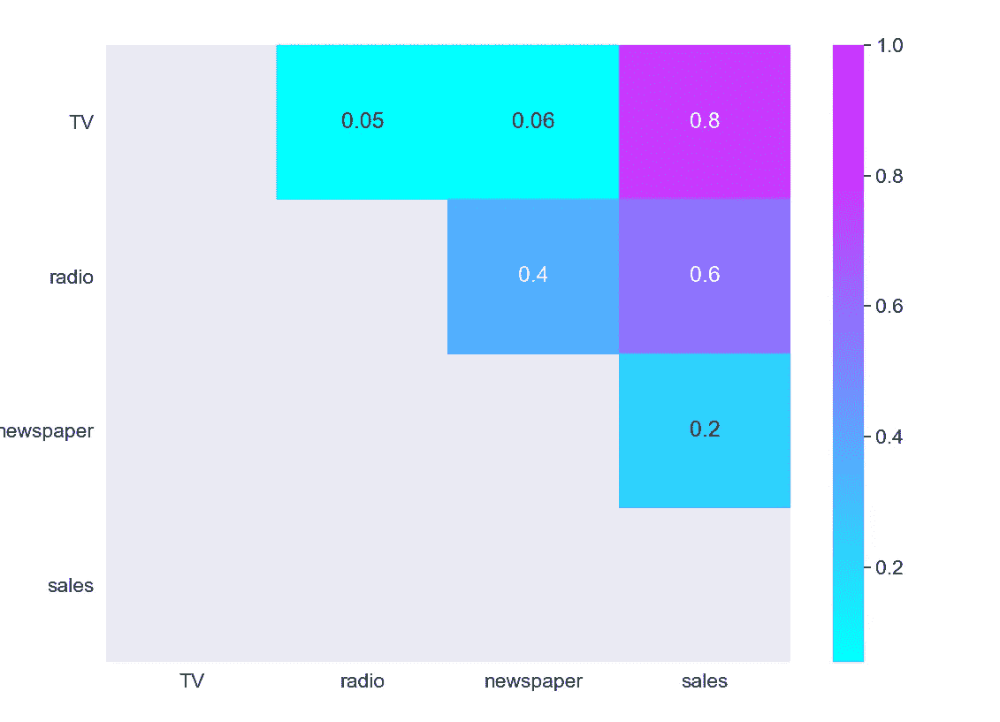*

*正如我们所料，最强的正相关发生在销售和电视之间，而销售和报纸之间的关系接近于 0。*

## *选择特征和目标变量*

*接下来，我们将变量分成两组:因变量(或目标变量“y”)和自变量(或特征变量“X”)*

```
*X = df.drop([‘sales’], axis=1)
y = df[‘sales’]*
```

## *分割数据集*

*要了解模型性能，将数据集分为定型集和测试集是一个好策略。通过将数据集分成两个独立的集合，我们可以使用一个集合进行训练，并使用另一个集合中的未知数据来测试模型性能。*

```
*X_train, X_test, y_train, y_test = train_test_split(X, y, test_size=0.3, random_state=0)*
```

*我们将数据集分成 70%训练和 30%测试。random_state 参数用于初始化内部随机数生成器，它将决定在您的情况下将数据分为训练和测试索引。我设置 random state = 0，这样您就可以使用相同的参数比较多次运行代码的输出。*

```
*print(X_train.shape,y_train.shape,X_test.shape,y_test.shape)*
```

*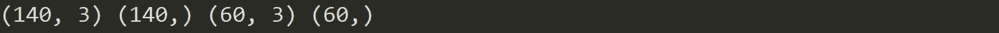*

*通过打印分割集合的形状，我们看到我们创建了:*

*   *2 个各有 140 个寄存器的数据集(占总寄存器的 70%)，一个有 3 个自变量，一个只有目标变量，将用于**训练**和生成线性回归模型。*
*   *2 个数据集，每个包含 60 个寄存器(占总寄存器的 30%)，一个包含 3 个自变量，一个仅包含目标变量，将用于**测试**线性回归模型的性能。*

## *建立模型*

*构建模型非常简单:*

```
*mlr = LinearRegression()*
```

## *火车模型*

*将模型拟合到训练数据代表了建模过程的训练部分。在模型定型后，可以使用预测方法调用来进行预测:*

```
*mlr.fit(X_train, y_train)*
```

*我们来看看模型训练后的输出，看看 **β0** (截距)的值:*

```
*mlr.intercept_*
```

*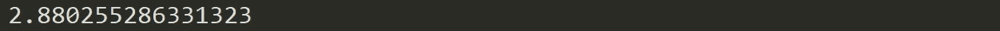*

*我们还可以打印系数的值 **(β)** :*

```
*coeff_df = pd.DataFrame(mlr.coef_, X.columns, columns =[‘Coefficient’])
coeff_df*
```

**

*通过这种方式，我们现在可以根据电视、广播和报纸的不同预算值来估算“销售”值:*

*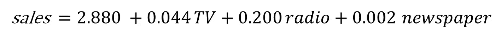*

*例如，如果我们确定电视预算值为 50，广播预算值为 30，报纸预算值为 10，则“销售额”的估计值为:*

```
*example = [50, 30, 10]
output = mlr.intercept_ + sum(example*mlr.coef_)
output*
```

*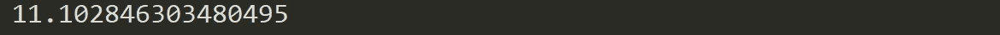*

## *试验模型*

*测试数据集是独立于训练数据集的数据集。该测试数据集是您的模型的未知数据集，它将帮助您更好地了解其归纳能力:*

```
*y_pred = mlr.predict(X_test)*
```

## ***评估绩效***

*模型的质量与其预测与测试数据集的实际值的匹配程度有关:*

```
*print(‘Mean Absolute Error:’, metrics.mean_absolute_error(y_test, y_pred))
print(‘Mean Squared Error:’, metrics.mean_squared_error(y_test, y_pred))
print(‘Root Mean Squared Error:’, np.sqrt(metrics.mean_squared_error(y_test, y_pred)))
print(‘R Squared Score is:’, r2_score(y_test, y_pred))*
```

*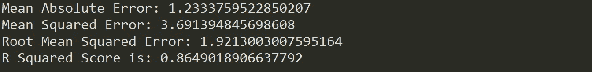*

*在根据测试集验证了我们的模型之后，我们得到了 0.86 的 R，这似乎是一个相当不错的性能分数。但是，尽管较高的 R 表明模型更适合，但高度量并不总是一件好事。我们将在下面看到一些解释和改进回归模型的方法。*

# ***如何解读和改进你的模型？***

*好了，我们创建了模型，现在做什么？让我们看看训练数据的模型统计数据，以获得一些答案:*

```
*X2 = sm.add_constant(X_train)
model_stats = sm.OLS(y_train.values.reshape(-1,1), X2).fit()
model_stats.summary()*
```

*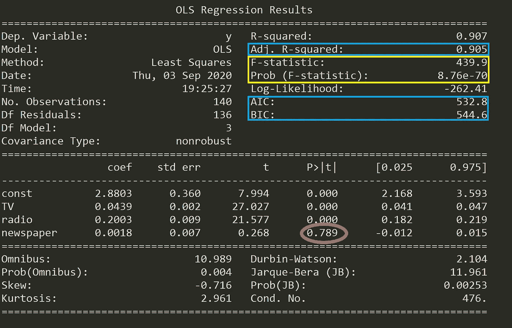*

*下面我们来看看这些数字是什么意思。*

## ***假设检验***

*运行 MLR 模型时，您应该回答的一个基本问题是，[是否至少有一个预测因子对预测输出](/multiple-linear-regression-8cf3bee21d8b)有用。如果自变量和目标之间的关系只是偶然的，并且没有任何预测因素对销售产生实际影响，那该怎么办？*

*我们需要进行假设检验来回答这个问题，并检查我们的假设。这一切都是从形成一个**零假设(H0)** 开始的，该假设声明所有系数都等于零，并且预测值和目标值之间没有关系(这意味着没有独立变量的模型既适合数据，也适合您的模型):*

*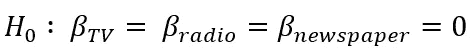*

*多元线性回归。来源:[走向数据科学](/multiple-linear-regression-8cf3bee21d8b)*

*另一方面，我们需要定义一个**替代假设(Ha)** ，该假设声明至少有一个系数不为零，并且预测值和目标值之间存在关系(意味着您的模型比仅截距模型更好地拟合数据):*

*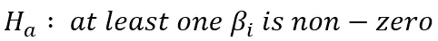*

*多元线性回归。来源:[走向数据科学](/multiple-linear-regression-8cf3bee21d8b)*

*如果我们想要拒绝零假设并对我们的回归模型有信心，我们需要找到强有力的统计证据。为此，我们进行假设检验，为此我们使用了 **F 统计量**。*

> **如果 F-statistic 的值等于或非常接近 1，则结果有利于零假设，我们无法拒绝它。**

*正如我们在上表中看到的(用黄色标记)，F-统计量是 439.9，从而提供了反对零假设(所有系数都是零)的有力证据。接下来，我们还需要在假设零假设为真的情况下，检查 F 统计量(也用黄色标记)出现的**概率，即 8.76e-70，一个极小的低于 1%的数字。这意味着在有效的零假设假设下，F 统计值 439.9 偶然出现的概率远低于 1%。***

*话虽如此，我们可以拒绝零假设，并确信至少有一个预测因子在预测输出时是有用的。*

## *生成模型*

*运行包含许多变量(包括不相关的变量)的线性回归模型会导致不必要的复杂模型。哪些预测因素是重要的？它们对我们的模型都有意义吗？为了找出答案，我们需要执行一个叫做**特征选择**的过程。特征选择的两种主要方法是:*

1.  ***正向选择:**从与因变量相关性最高的预测值开始，一次添加一个预测值。然后，更大的理论重要性的变量被顺序地结合到模型中，直到达到停止规则。*
2.  ***逆向淘汰:**从模型中的所有变量开始，去掉统计意义最小(p 值较大)的变量，直到达到停止规则。*

*虽然这两种方法都可以使用，除非预测值的数量大于样本大小(或事件数量)，否则通常最好使用向后排除法。*

*你可以在[链接](/multiple-linear-regression-8cf3bee21d8b)中找到这些方法的完整示例和实现。*

## ***对比车型***

*每当你在一个模型中加入一个独立变量，R 就会增加，即使这个独立变量微不足道。在我们的模型中，所有预测因素都有助于销售增长吗？如果是的话，他们做的程度一样吗？*

*与 R 相反，**调整后的 R** 是一个仅在自变量显著并影响因变量时增加的度量。因此，如果随着您向模型中添加变量，您的 R 值增加了，但调整后的 R 值减少了，那么您就知道有些特性是没有用的，您应该删除它们。*

*上表中一个有趣的发现是，报纸的 **p 值**超高(0.789，红色标注)。找到每个系数的 p 值将会知道该变量对于预测目标是否具有统计显著性。*

> *根据一般经验，如果给定变量的 p 值小于 0.05，则该变量和目标之间有很强的关系。*

*这种方式，包括变量报纸似乎不适合达到一个稳健的模型，删除它可能会提高模型的性能和泛化能力。*

*除了调整后的 R 分数，您还可以使用其他标准来比较不同的回归模型:*

*   ***赤池信息准则(AIC):** 是一种用于估计模型的似然性以预测/估计未来值的技术。它奖励达到高拟合度分数的模型，如果它们变得过于复杂，则惩罚它们。一个好的模型是所有其他模型中 AIC 最小的模型。*
*   ***贝叶斯信息标准(BIC):** 是模型选择的另一个标准，衡量模型拟合度和复杂性之间的权衡，对过于复杂的模型的惩罚甚至超过 AIC。*

# *假设*

*因为线性回归模型是任何事件的长期序列的近似值，所以它们需要对它们所代表的数据做出一些假设，以便保持适当。大多数统计测试依赖于对分析中使用的变量的某些假设，当这些假设不满足时，结果可能不可信(例如，导致 I 型或 II 型错误)。*

*从输出是输入变量的线性组合的意义上来说，线性回归模型是线性的，并且只适合于对可线性分离的数据进行建模。线性回归模型在各种假设下工作，这些假设必须存在，以便产生正确的估计，而不仅仅依赖于准确性分数:*

*   ***线性**:特征和目标之间的关系必须是线性的。检查线性关系的一种方法是目视检查散点图的线性。如果散点图中显示的关系不是线性的，那么我们需要运行非线性回归或转换数据。*
*   ***同方差**:对于 x 的任何值，残差的方差必须相同。多元线性回归假设残差中的误差量在线性模型的每个点都是相似的。这种情况称为同质性。散点图是检查数据是否同质的好方法，也有几种测试可以从数字上验证假设(如 Goldfeld-Quandt、Breusch-Pagan、White)*

*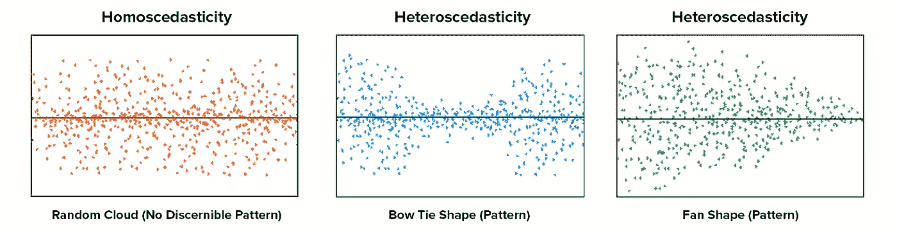*

*线性回归算法的假设。来源:[走向数据科学](/assumptions-of-linear-regression-algorithm-ed9ea32224e1)*

*   ***无多重共线性:**数据不应显示多重共线性，当独立变量(解释变量)彼此高度相关时会出现多重共线性。如果发生这种情况，在计算出造成因变量/目标变量差异的具体变量时就会出现问题。这种假设可以用方差膨胀因子(VIF)法或通过相关矩阵来检验。解决这个问题的替代方法可能是将数据居中(扣除平均分数)，或者进行因子分析并旋转因子以确保线性回归分析中因子的独立性。*
*   ***无自相关**:残差的值应该彼此独立。残差中相关性的存在大大降低了模型的准确性。如果误差项相关，估计的标准误差往往会低估真实的标准误差。为了检验这个假设，你可以使用 Durbin-Watson 统计。*
*   ***残差的正态性**:残差必须是正态分布的。正态性可以用拟合优度检验(如科尔莫戈罗夫-斯米尔诺夫或夏皮罗-维尔克检验)来检查，如果数据不是正态分布，非线性变换(如对数变换)可能会解决这个问题。*

*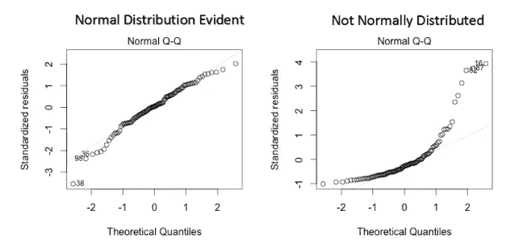*

*线性回归算法的假设。来源:[走向数据科学](/assumptions-of-linear-regression-algorithm-ed9ea32224e1)*

*假设是至关重要的，因为如果假设无效，那么分析过程就会被认为是不可靠的、不可预测的和失控的。无法满足假设可能导致得出无效或没有数据科学支持的结论。*

*你可以在[链接](https://www.kaggle.com/shrutimechlearn/step-by-step-assumptions-linear-regression)中找到对假设的全面测试。*

# *最后的想法*

*虽然 MLR 模型扩展了 SLR 模型的范围，但它们仍然是线性模型，这意味着模型中包含的术语不能显示彼此之间的任何非线性关系，也不能代表任何种类的非线性趋势。预测要素观测范围之外的点时也应小心，因为当您移出观测范围时，变量之间的关系可能会发生变化(由于没有数据，您无法知道这一事实)。*

> *观察到的关系可能是局部线性的，但在数据范围之外可能存在未观察到的非线性关系。*

***线性模型还可以通过包含非线性变量(如多项式)和转换指数函数来模拟曲率**。线性回归方程在 [*参数*](https://statisticsbyjim.com/glossary/parameter/) 中为*线性，意思是你可以将自变量提升一个指数来拟合一条曲线，仍然保持在“线性世界”中。线性回归模型可以包含对数项和反项，以遵循不同类型的曲线，但仍然保持参数的线性。**

**

*当自变量被平方时，模型在参数上仍然是线性的*

*像 [**多项式回归**](/machine-learning-with-python-easy-and-robust-method-to-fit-nonlinear-data-19e8a1ddbd49) 这样的回归可以模拟*非线性关系*，虽然线性方程有一种基本形式，但非线性方程可以采取许多不同的形式。您可能考虑使用 [**非线性回归模型**](/how-to-choose-between-a-linear-or-nonlinear-regression-for-your-dataset-e58a568e2a15) 的原因是，虽然线性回归可以模拟曲线，但它可能无法模拟数据中存在的特定曲线。*

*您还应该知道，OLS 并不是拟合您的线性回归模型的唯一方法，其他优化方法，如 [**梯度下降**](/linear-regression-simplified-ordinary-least-square-vs-gradient-descent-48145de2cf76) 更适合大型数据集。将 OLS 应用于复杂的非线性算法可能不可扩展，梯度下降法在计算上可以更便宜(更快)地找到解决方案。*梯度下降是一种最小化函数的算法*，给定一个由一组参数定义的函数，该算法从一组初始参数值开始，迭代地向一组最小化该函数的参数值移动。这个**迭代最小化**是使用导数实现的，在函数梯度的负方向上采取步骤。*

**

*使用梯度下降的线性回归。来源:[走向数据科学](/linear-regression-using-gradient-descent-97a6c8700931)*

*另一个需要考虑的关键问题是**异常值会对回归线**和相关系数产生巨大影响。为了识别它们，有必要执行[探索性数据分析(EDA)](/the-basics-of-data-prep-7bb5f3af77ac) ，检查数据以检测异常观察，因为它们会以激烈的方式影响我们的分析和统计建模的结果。如果您发现任何异常值，可以对其进行估算(例如，使用平均值/中值/众数)、封顶(替换某些限制之外的值)或替换缺失值并进行预测。*

*最后，线性回归模型的一些[限制是:](https://www.imf.org/external/pubs/ft/fandd/2006/03/basics.htm)*

*   ***省略变量**。需要有一个好的理论模型来建议解释因变量的变量。在简单的双变量回归的情况下，人们必须考虑其他因素来解释因变量，因为可能有其他“未观察到的”变量来解释输出。*
*   ***反向因果关系**。许多理论模型预测双向因果关系——也就是说，因变量可以引起一个或多个解释变量的变化。例如，更高的收入可以让人们在自己的教育上投入更多，这反过来会提高他们的收入。这使得回归估计的方式变得复杂，需要特殊的技术。*
*   ***测量错误**。因子可能测量不正确。例如，天资很难衡量，智商测试也存在众所周知的问题。因此，使用智商的回归可能无法正确控制资质，导致教育和收入等变量之间的不准确或有偏差的相关性。*
*   ***太局限了一个焦点**。回归系数仅提供一个变量的小变化(而非大变化)与另一个变量的变化之间的关系。它将显示教育中的一个小变化是如何影响收入的，但它不会让研究者概括大变化的影响。如果每个人同时接受大学教育，一个刚毕业的大学生不太可能挣得更多，因为大学毕业生的总供给会急剧增加。*

> *对这些话题感兴趣？在 Linkedin[或 Twitter](https://www.linkedin.com/in/lopezyse/) 上关注我*