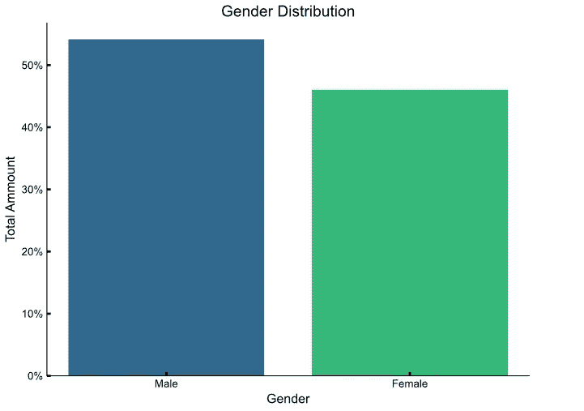
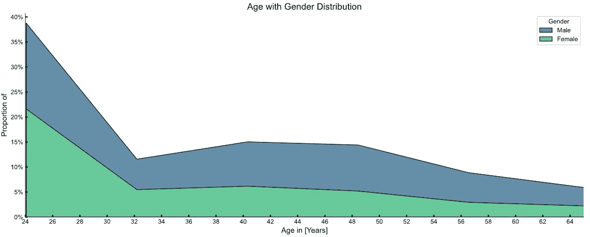
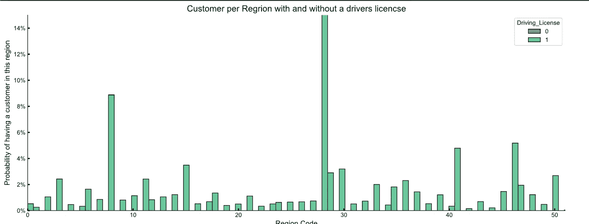
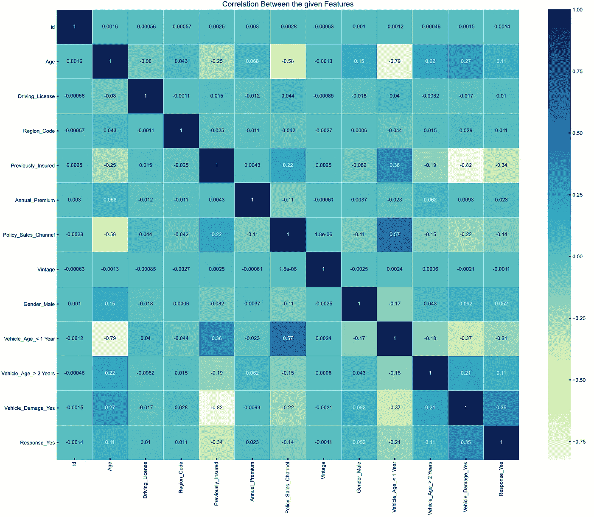
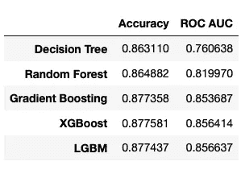

# 你想象中作为数据分析师的第一天

> 原文：<https://towardsdatascience.com/your-imaginary-first-day-as-a-data-analyst-593f45a1e9fa?source=collection_archive---------39----------------------->

## 在你先前在线课程知识的帮助下完成你的第一个项目

你有没有问过自己，作为一名数据分析师，成功的第一天是怎样的？为了获得我的[数据科学纳米学位](https://www.udacity.com/course/data-scientist-nanodegree--nd025)，我将向您展示一个简单的场景。

## **你会学到:**

1.  什么是交叉销售？
2.  如何分析你的客户？
3.  如何使用机器学习进行交叉销售预测？

# 塞纳里奥

我从 [Kaggle](https://www.kaggle.com/) 获得了一个名为[“健康保险”交叉销售预测的数据集🏠 🏥](https://www.kaggle.com/anmolkumar/health-insurance-cross-sell-prediction)。请想象一下，你是一家大型保险公司的数据分析师。作为你的第一份工作，你的老板让你分析一个特定的客户数据集。他给了您一个 customer-info.csv 文件和以下三个问题:

1.  我们公司的典型客户是什么？
2.  什么因素决定了客户是否愿意接受我们的保险？
3.  哪些客户会对我们的营销活动做出回应？

不幸的是，作为一名初露头角的数据科学家，你不知道什么是交叉销售，所以你马上去谷歌一下:

> “交叉销售是向现有客户销售额外产品或服务的行为或实践”——维基百科 2020

现在你知道了。你在一家提供全面健康保障的大型保险公司工作。这家保险公司现在希望扩大其产品组合。因此，你的工作是找出哪些客户可能对汽车保险感兴趣。

# 我们公司的典型客户是什么？

现在您想使用您的 Python 知识来分析数据。为了可视化和分析数据，您使用了 Seaborn 和 Pandas 库。完成后，您定义了两个客户角色。

> **安**24 岁，住在**州**，拥有**【28】**的优秀称号。她有**驾照**，她的**车是两年前的**并且**已经损坏**。到目前为止，她对汽车保险没有兴趣。
> 
> 凯文今年 **28** 岁，也住在**州**，有着优秀的头衔**【28】**。他也有驾驶执照。因为他真的很喜欢汽车，他的**车是几个月前的**，它的**一点损坏都没有**。到目前为止，他对汽车保险没有兴趣。

当你向你的同事展示人物角色时，他们会印象深刻。但是，他们建议您再添加一些图表。否则，老板会怀疑这一切是不是你编造的。你想，这一点问题都没有。毕竟，人物角色不是你想出来的。恰恰相反，数据分析是你假设的人物角色的基础。首先，您创建了一个性别分布图。

性别分布只相差几个百分点。所以，你决定要一男一女。下一步是观察年龄分布。你还确保每个年龄组的男性人数大致相同。因此，你用两种颜色描绘了年龄分布。您可以从图表中看到，大多数客户都在 25 岁到 30 岁出头之间。

所以，你决定选择 24 岁和 28 岁的两个人。所以你选择了 24 岁和 28 岁的两个人。即使你对此没有任何更精确的信息，你也要相信你的直觉。在关于该地区的图表中，您可以看到大多数人来自第 28 州，并且每个人都有驾驶执照。

最后，您决定仔细看看客户的汽车。您已经注意到，大多数客户的车龄在 1 到 2 年之间，甚至不到 1 年。你认为这是重要的信息，当然，你想把它包含在你的人物角色中。

# 客户是否会对我们的交叉销售方法做出反应，这取决于什么？

你的老板对你的分析印象深刻。但是他也有需要批评的地方。你的两个角色都对我们的产品不感兴趣。他想知道是什么因素影响了安和凯文，使他们更有可能从他的公司购买汽车保险。

所以，你回去工作，你决定在反应特征和其他特征之间找到一些关联。

您将从热图中获得的新信息添加到角色中:

> 如果凯文的车受到更严重的损坏，他会改变主意的。这是基于响应标准和车辆损坏标准之间的小相关性(0.35)。你认为向你的老板建议我们可以损坏凯文的车很有趣，但你决定反对。讽刺很可能第一天就没好结果。
> 
> 如果 Ann 年纪大了，她可能会改变主意(相关系数仅为 0.11)。老年人对保险更感兴趣，这意味着我们的营销活动可以专注于长期客户，但我们还没有要求他们购买车辆保险。

# 哪些客户会对我们的营销活动做出回应？

当把你的最终结果展示给你的老板时，他留下了深刻的印象，他现在要求你使用一些奇特的机器学习来完成你的任务。因为您已经准备好了数据，所以这没什么大不了的，因为您知道预处理已经完成了 80%的工作。

然而，在快速研究了 ScitKit-Learn 文档之后，您现在也知道该怎么做了。你的问题是一个二元分类(会或不会响应我们的交叉销售方法)你可以使用一些分类器。你决定采用一些最先进的方法，如 LBM 或 XGBoost。

同时，您希望使用一个旧的但众所周知的模型，这样您就可以展示新的高级分类器的优势。对于评估指标，你又谷歌了一遍。研究表明，一个平衡的分类器(精确度和召回率之间的平衡)会非常好。所以你确保了这一点。

从结果中可以看出，与其他分类器相比，LBM 分类器工作得相当好，并且也是平衡的。您将使用它来预测哪些客户最有可能对我们的营销活动做出回应。

在你把最终结果发给你的老板后，你会感到无比的快乐。你在网上课程中投入的所有工作和努力确保了你能在你的第一个任务和新职位上取得成功！用你最喜欢的[机器学习和统计蔻驰](https://statquest.org/)的话说。

三次爆炸。三次爆炸。作为一名潜在的数据分析师，我们在第一天就站稳了脚跟。明天我们将获得一份真正的工作，这样我们就可以在准确的数据上测试跨行业的数据挖掘标准流程。我们很好奇。

> 你可以在我的 [GitHub 库](https://github.com/bohniti)找到这篇文章的代码💻。感谢阅读！如果你喜欢它，请一定要鼓掌，看看我的[网站](http://www.tbohnstedt.com/)🌎不要犹豫，给我发电子邮件询问[反馈](http://timo.bohnstedt@gmail.com/)📩。