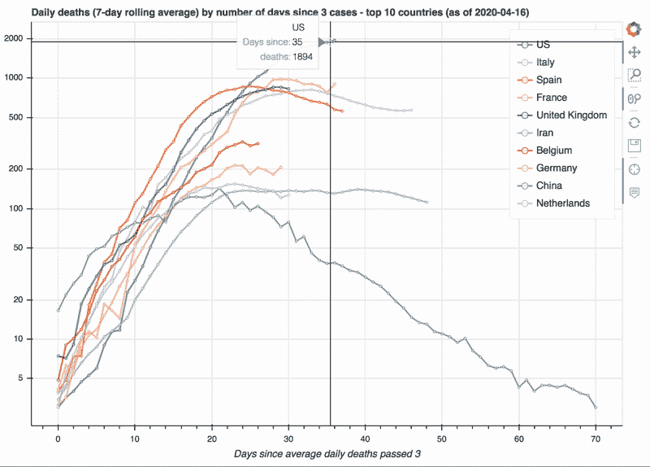
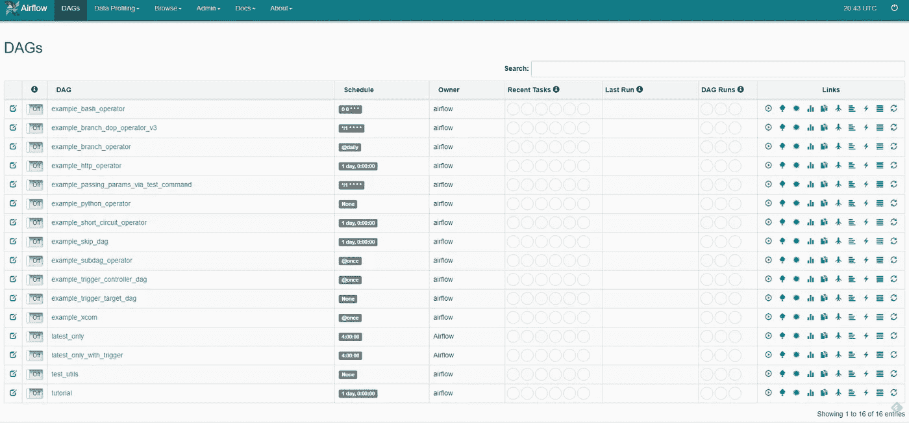
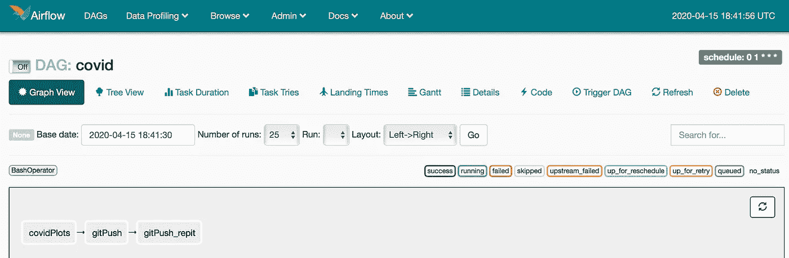

# 您的实时新冠肺炎跟踪与气流和 GitHub 网页

> 原文：<https://towardsdatascience.com/your-live-covid-19-tracker-with-airflow-and-github-pages-658c3e048304?source=collection_archive---------32----------------------->

## 加载数据，使用散景制作出色的可视化效果，将它们托管在 GitHub Pages 网站上，并随着新数据的到来，让气流自动完成这一过程！


在 [Unsplash](https://unsplash.com?utm_source=medium&utm_medium=referral) 上由 [Fabrizio Verrecchia](https://unsplash.com/@fabrizioverrecchia?utm_source=medium&utm_medium=referral) 拍摄的照片

随着新冠肺炎病的爆发，我们——数据科学爱好者——可以使用一系列令人惊叹的数据集来制作我们自己的可视化工具，获得有用的见解，并为有用和智能信息的传播做出贡献。

这些数据通常每天更新，因为新闻中报道了新的病例。因此，想象一下，您加载数据并花大量时间清理它，进行探索性的数据分析，并创建令人印象深刻的可视化；然后你决定保存你的图表并分享它们。到目前为止还不错，但是第二天呢？数据更新后，您是否每天都手动运行脚本？还有，你的朋友怎么能不用问你就能查看图表呢？

幸运的是，有一些工具可以让这项任务变得非常简单。首先， [GitHub Pages](https://pages.github.com) 允许你创建自己的网站，在那里你可以托管你令人惊叹的新情节(并与世界分享它们)。)其次， [Apache Airflow](https://airflow.readthedocs.io/en/latest/index.html) 允许您调度和自动化流程并执行任务。它是基于 Python 的，但是它处理不同种类的任务(比如运行 C++或 Bash 脚本。)

我们开始吧！

## 加载、清理和转换数据

让我们以约翰·霍普金斯大学系统科学与工程中心提供的广泛使用的[CSSE·新冠肺炎数据集](https://github.com/CSSEGISandData/COVID-19/tree/master/csse_covid_19_data)为例，来进行我们的可视化。我们旅程的第一步是加载数据集并(像往常一样)对它们进行一些清理:我们只需更改 *State* 和 *Country* 列名，按国家对州进行分组并对值求和。

这很容易，主要归功于组织良好的原始数据集。

现在我们必须选择我们想要显示的内容。为了这篇文章，我决定在[金融时报](https://www.ft.com/coronavirus-latest?fbclid=IwAR2Pi_sryd7x2ZvOt_y0J0_00N5mDQeYLvBc4DfMr6bpninqV75dcxRtEsA)上复制这张漂亮的图表。该图根据每个国家首次通过 *x* 平均死亡人数的天数显示了每个国家的新冠肺炎死亡人数趋势。为此，我们需要计算相关时间序列的[滚动平均值](https://en.wikipedia.org/wiki/Moving_average)。下面的代码完成了这个任务:

原始数据集提供每天的病例总数，因此我们需要首先通过调用`.diff()`来计算每天的病例数(还要注意，我们将只显示前 10 个国家；)然后，我们计算每列的滚动平均值。通过重置索引并连接滚动的列，我们能够将索引称为从我们第一次计算`n_since`值开始的 *x* 天的数量。当调用`rolling(n_since=3)[1].head()`(死亡)时，您应该会看到这样的内容:

## 散景可视化

熊猫`.plot()`将很快显示图表，但这种类型的情节值得更多的风格。在这些选项中，散景是最简单和最有特色的选择之一。我不打算进一步解释这个库的功能，因为有许多资源，而只是简单地为您提供一个我创建的定制功能(它遵循上面的代码，因此它以滚动数据帧作为输入):

这就是了！



# 托管到 GitHub

现在是时候让世界看到它了。创建一个 Github 网站非常简单，按照[这里](https://pages.github.com)的说明就可以完成。基本上，您需要创建一个名为 structure*username . github . io .*的新公共存储库

然后你提交新的散景图，命名为*index.html*并推它。最后在[*http://<username>. github . io*就能看到了。](http://username.github.io.)你可以在这里找到我的:[https://hectoramirez . github . io/covid/Daily _ deaths _ Europe . html](https://hectoramirez.github.io/covid/Daily_deaths_Europe.html)。

那么，明天 CSSE 数据集更新时会发生什么呢？一种选择是手动运行您的脚本，并将您的情节提交/推送到 GitHub。每天。试着在早上早点做——你的朋友可能想在早餐时检查一下。或者…

# 借助气流实现 it 自动化

如前所述，Apache Airflow 允许您调度和自动化流程——比如在特定时间运行脚本。更准确地说，

> 气流用于创建代码管道，我们可以在其中调度和监控我们的工作流。工作流可以是要像流程图一样执行的任务的集合。

## 设置

有很多学习使用 Airflow 的资源，包括 [Airflow 自己的文档](https://airflow.readthedocs.io/en/latest/index.html)，所以我会引导你走向我们的具体目标。让我们从安装 Airflow 开始，这可以通过 pip 工具轻松完成:

```
$ pip install apache-airflow
```

如果一切都是正确的，通过运行`$ airflow version`,您应该会看到类似这样的内容:

```
____________       _________________    |__( )_________  __/__  /________      ______  /| |_  /__  ___/_  /_ __  /_  __ \_ | /| / /___  ___ |  / _  /   _  __/ _  / / /_/ /_ |/ |/ /_/_/  |_/_/  /_/    /_/    /_/  \____/____/|__/  v1.10.9
```

Airflow 应该已经创建了一个 AIRFLOW_HOME 文件夹，并在其中创建了一个`dags`文件夹(如果没有，自己创建。)在主文件夹中，我们调用

```
$ airflow initdb
```

以便初始化与工作流相关的数据库。完成后，你会发现包含初始设置的`airflow.db`数据库文件和`airflow.cfg`文件。最后，我们呼吁

```
$ airflow webserver
```

启动气流图形用户界面。转到 [https://localhost:8080](https://localhost:8080) ，您应该会看到类似这样的内容:



你现在看到的是一组默认的气流例子(要隐藏它们，去`airflow.cfg`文件并设置`load_examples=False`)。)注意这些被称为 *DAG* s:

> 在 Airflow 中，一个`DAG`——或者一个有向无环图——是你想要运行的所有任务的集合，以一种反映它们的关系和依赖的方式组织。
> 
> DAG 是在 Python 脚本中定义的，它将 DAG 结构(任务及其依赖项)表示为代码。

也就是说，我们需要编写 Python 脚本，其中包含一系列按照指定顺序执行的任务。它们按照时间表运行，使用 [Cron](https://crontab.guru) 的语法。

## 新冠肺炎的例子

回到我们的新冠肺炎追踪器。(这也提供了 DAG 的简单示例；对于更复杂的任务，请参考文档。)

我们需要创建一个 DAG，包含我们想要执行的任务，以保持我们的跟踪器更新:在一个 Python 文件`dags/covid_dag.py`中，我们导入基本模块并定义`default_args`，如下所示:

```
from airflow import DAG
from airflow.operators.bash_operator import BashOperator
from airflow.operators.python_operator import PythonOperator
import datetime as dtdefault_args = {
    'owner': 'airflow',
    'start_date': dt.datetime(2020, 4, 1, 1, 00, 00),
    'retries': 1
}
```

气流操作员允许执行特定类型的任务。例如，我们可以在 DAG 文件中复制/粘贴`bokeh_plot`函数，并让`PythonOperator`调用它。类似地，您可以在外部脚本中拥有该函数，导入它并用相同的操作符调用它。另一个选择是拥有一个包含所有函数的外部 python 脚本，并让一个`BashOperator`为您运行它。这就是我们将要做的。

`start_date`设置工作流程执行的时间。可以是过去的某个日期。`retries`参数告诉 DAG 应该运行多少次，以防执行不成功。

接下来，我们定义 DAG 参数:

```
dag = DAG('covid',
          default_args=default_args,
          schedule_interval='0 1 * * *',
          catchup=False
          )
```

第一个参数是 DAG 的名称。`schedule_interval`告知执行频率—对于我们的案例，每天在**凌晨 1 点**执行。为了避免常见的陷阱，需要注意以下几点:

*   正如您在 GUI 的右上角看到的，Airflow 使用 UTC 时间。
*   设置计划时，将开始日期与计划对齐。*如果计划在世界协调时凌晨 2 点运行，开始日期也应该在世界协调时凌晨 2 点。*

请花些时间阅读这些条目，为你未来的努力节省能量:

*   [https://CWI ki . Apache . org/confluence/display/air flow/Common+陷阱](https://cwiki.apache.org/confluence/display/AIRFLOW/Common+Pitfalls)
*   [https://airflow.apache.org/docs/stable/scheduler.html](https://airflow.apache.org/docs/stable/scheduler.html)

根据`schedule_interval`，从开始日期到当前日期，可能有多次执行。`catchup`告知当我们打开 DAG 时是否应该执行这些执行。

现在，我们将完整的 *load-clean-bokehplot* 代码打包到一个`covid_func.py`脚本中——当运行时，它应该在脚本所在的同一文件夹中输出散景图；但是，由于我们希望将它托管在您的 GitHub 网站中，您可以通过将输出目录设置为

`save(p, ‘YourGithubPageDirectoryPath/index.html’.format(cat))`

如上所述，我们只想运行脚本，所以我们可以调用`BashOperator`来执行任务。它应该是这样的:

```
# replace PathToYourFile for the directory pathcommand_t1 = 'python PathToYourFile/covid_func.py 't1 = BashOperator(
          task_id = 'covidPlots',
          bash_command = command_t1
          dag = dag
)
```

接下来，我们需要提交和推送文件。从终端提交和推送文件需要几个步骤，实际上，多亏了`[GitPython](https://gitpython.readthedocs.io/en/stable/)`，它们也可以用 Python 来完成。因此，我决定写一个提交和推送的小脚本，然后用另一个`BashOperator`调用它:

```
from git import Repo
import os

os.chdir(YourGithubPageDirectoryPath)

PATH_OF_GIT_REPO = YourGithubPageDirectoryPath/.git'COMMIT_MESSAGE = 'Daily update'

def git_push():

    repo = Repo(PATH_OF_GIT_REPO)
    repo.git.add('--all')
    repo.index.commit(COMMIT_MESSAGE)
    origin = repo.remote(name='origin')
    origin.push()

git_push()
```

这要求`git`被正确配置，并且你被允许连接到 GitHub 而不需要在每次访问时提供你的用户名或密码。这是通过 SSH 完成的，详情请查看此[链接](https://help.github.com/en/github/authenticating-to-github/connecting-to-github-with-ssh)。

*侧注:气流提供了一堆不同的* [*运算符*](https://airflow.apache.org/docs/stable/_api/airflow/operators/index.html) *。其中之一就是* `[*GitOperator*](https://airflow-plugins.readthedocs.io/en/latest/plugins/operators/git.html)` *。如果你愿意，你可以自己尝试。*

我们现在准备给你的`covid_dag.py`添加下一个任务:

```
command_t2 = 'python PathToYourFile/git_push.py 't2 = BashOperator(
                  task_id = 'gitPush',
                  bash_command = command_t2,
                  dag = dag
)

t3 = BashOperator(
                 task_id = 'gitPush_repit',
                 bash_command = command_t2,
                 dag = dag)

t1 >> t2 >> t3
```

正如你所看到的，我决定重复这个任务，只是为了确保推的发生——没有危险。

最后，我们用`>>`操作符指定任务的顺序。

你的狗现在准备好了！让我们再次调用`$ airflow initdb`来设置它并打开气流 GUI——您的新 covid DAG 应该在那里。如果您单击它并转到树形视图，您应该能够看到工作流程:



回到主页，打开它！

这个旅程的最后一步是返回命令行并调用

```
$ airflow scheduler
```

你的死刑应该在明天凌晨 1 点执行。

*最后一点，您可以随时点击链接栏中的 Trigger Dag，手动执行它并检查它是否工作正常。如果出现任何问题，您应该能够在日志中跟踪错误。*

# 摘要

在这篇文章中，我们采用了广泛使用的 used 新冠肺炎数据集，并为前 10 个国家(死亡人数较多的国家)的每日死亡人数创建了一个高度互动的散景图。然后我们将它提交到 GitHub 页面。

由于数据每天都在更新，所以绘图也应该如此。为此，我们设置了 Apache Airflow，创建了一个新的 DAG，其中包含每天更新数据所需的任务集，并启动了 Airflow 调度程序。

我又创建了几个图表，都放在我的 GitHub 网站上。你可以在这里查看:[](https://hectoramirez.github.io/covid/COVID19.html)

*****欢迎在评论中留下任何想法或问题！*****

****更新(2021):** 网页不再维护。完整的代码可以在这个[库](https://github.com/hectoramirez/Covid19)中找到。**

## **参考**

**[](/6-reasons-i-love-bokeh-for-data-exploration-with-python-a778a2086a95) [## 我喜欢用 Python 进行数据探索的 6 个理由

### 散景已经存在很多年了，但我只是最近才真正发现它，没多久它就成了我的最爱…

towardsdatascience.com](/6-reasons-i-love-bokeh-for-data-exploration-with-python-a778a2086a95) [](/getting-started-with-apache-airflow-df1aa77d7b1b) [## Apache Airflow 入门

### 在这篇文章中，我将讨论由 Airbnb 开发的工作流管理系统 Apache Airflow。

towardsdatascience.com](/getting-started-with-apache-airflow-df1aa77d7b1b) [](https://medium.com/zenofai/a-beginners-guide-to-airflow-3572ddd14731) [## 气流初学者指南

### Airflow 用于创建简单和复杂的代码管道，我们可以在其中调度和监控我们的工作流。一个…

medium.com](https://medium.com/zenofai/a-beginners-guide-to-airflow-3572ddd14731) [](https://www.ft.com/coronavirus-latest?fbclid=IwAR2Pi_sryd7x2ZvOt_y0J0_00N5mDQeYLvBc4DfMr6bpninqV75dcxRtEsA) [## 冠状病毒追踪:疫情传播的最新数据|免费阅读

### 冠状病毒爆发的人类成本持续上升，全球确诊病例超过 207 万例，而…

www.ft.com](https://www.ft.com/coronavirus-latest?fbclid=IwAR2Pi_sryd7x2ZvOt_y0J0_00N5mDQeYLvBc4DfMr6bpninqV75dcxRtEsA)**