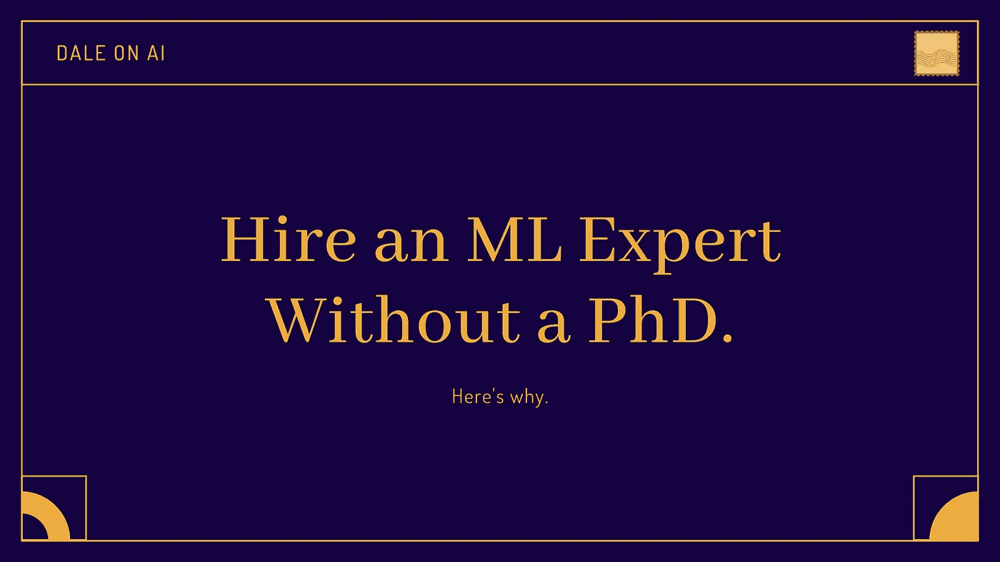

# 你的机器学习工程师不需要博士或硕士学位

> 原文：<https://towardsdatascience.com/your-machine-learning-engineers-dont-need-phds-or-masters-degrees-a06b17babc95?source=collection_archive---------39----------------------->

要求机器学习/人工智能雇员拥有花哨的学位已经过时了。原因如下。

你的机器学习雇员应该有博士学位吗？在 ML 工作需要博士学位吗？

我总是看到博士和硕士学位被列为 ML 职位描述的要求。我为“机器学习工程师”打开的第一个谷歌工作结果要求:

> *数据科学、机器学习、统计学、运筹学或相关领域的博士*
> 
> *相关领域理学硕士，拥有 5 年以上将数据科学技术应用于实际商业问题的经验。*

对于软件工程师来说，拥有博士甚至硕士学位是一个不寻常的要求。我们不指望从事网络、安全、系统架构或应用开发的开发人员会这样。那么是什么让机器学习如此特别呢？

有些人可能会说 ML 非常复杂和数学化，是科学家的领域，而不是软件开发人员的领域(哎哟！).

我不相信。ML 可能很棘手，但密码学、分布式系统、图形学以及计算机科学中的许多其他主题也是如此。然而，我们并不要求开发人员拥有博士学位来从事这些工作。我认为是别的原因:

我们经常忘记机器学习对我们大多数技术人员来说是很新的东西。就在五年前，我的同事们还在谈论深度学习是一个可疑的赌注。工具很难使用。为 ML 设计的结实的硬件很难得到。模型质量与今天相差甚远。

结果我们大部分人在学校都没学过 ML。五年前，我的母校普林斯顿大学只提供大约 3 毫升/人工智能课程。机器学习绝对不是你典型的计算机科学课程的“标准”部分，你可能不用学习太多就能轻松毕业。网上资源匮乏。然后，当人工智能突然成为新的热点时，许多人冲回硕士课程，以填补他们教育中新的相关空白。

在 ML 人才短缺的情况下，难怪如果你*想雇佣一个在这个领域有经验的人，这个人很可能是一个学者。*

*与此同时，工程师们开始在工作中学习 ML。即使在世界上最大的人工智能博士研究人员雇主之一的谷歌，大量从事人工智能产品的工程师也只有有限的技术经验。他们通过在线资源、内部课程(如谷歌的[机器学习速成课程](https://developers.google.com/machine-learning/crash-course))或通过承担小块项目并边做边学来学习。*

*五年对于技术来说是漫长的一年，数据科学领域已经发生了变化。如今，在课堂之外学习机器学习比过去容易得多，我们的工具集也变得更加用户友好(参见 PyTorch、TensorFlow 2.0、Keras)。再加上庞大且不断增长的在线资源生态系统，这位有决心的开发人员无需花费一毛钱，就能给自己提供一个丰厚的 ML 教育。*

*合格的数据科学家/机器学习工程师招聘库也发生了变化。2019 年，数据科学竞赛网站 [Kaggle](https://www.kaggle.com/kaggle-survey-2019) 调查了~4000 名数据科学家。他们发现，虽然 52%的受访者拥有硕士学位，但只有 19%拥有博士学位。与此同时，大多数受访者只有 3-5 年的工作经验，而且年龄偏年轻(25-29 岁)。一大批雄心勃勃、自学成才的数据科学家刚刚进入就业市场。*

*我们理所当然地认为，自学成才的软件工程师可能非常有才华(谷歌的一名招聘人员最近告诉我，她采访了一名高中生)。科技招聘人员很久以前就知道，如果他们只雇佣麻省理工的毕业生，他们根本不会雇佣任何人。因此，现在我们需要在雇佣数据科学家的方式上进行类似的视角转变。*

*这也意味着我们需要开始像评估软件工程师一样评估 ML 工作申请人。我们需要花更多的时间来建立有效的面试，让候选人展示他们的技能，而不是专注于证书，无论他们是如何或在哪里学到的。建立雇佣 ML 工程师的新标准不是一件容易的事情，但是对于雇主来说，回报是值得的。*

**我们来连线一下* [*Twitter*](https://twitter.com/dalequark) *或者*[*insta gram*](http://instagram.com/dale_on_ai)*！**

**原载于 2020 年 8 月 26 日 https://daleonai.com**T21*[。](https://daleonai.com/hire-ml-no-phd)*