# 如果你的 ML 算法表现不好

> 原文：<https://towardsdatascience.com/your-ml-algorithm-is-not-performing-well-613dd2b07fc?source=collection_archive---------29----------------------->


罗布·施莱克希斯在 [Unsplash](https://unsplash.com?utm_source=medium&utm_medium=referral) 上拍摄的照片

## 如何发现问题

我们花了这么多时间开发机器学习算法。但是在部署之后，如果该算法表现不佳，就会变得令人沮丧。问题是，如果算法没有达到预期效果，下一步该怎么办。哪里出了问题？训练数据的数量足够吗？我们使用了正确的功能吗？我们应该继续收集更多的数据吗？我们可以，但是那非常耗时而且昂贵。我们应该增加更多的功能吗？那也会很贵。

> **往哪个方向走？**

如果你的机器学习算法没有达到预期效果，下一步该怎么办？有几个选项:

1.  获取更多的训练数据非常耗时。甚至可能需要几个月才能获得更多的研究数据。
2.  获得更多培训功能。这也可能需要很多时间。但是，如果添加一些多项式功能的作品，这是很酷的。
3.  选择一组较小的训练特征。
4.  增加正则项
5.  减少正则项。

那么，接下来你应该尝试哪一个呢？开始尝试任何事情都不是一个好主意。因为你可能会在一些没有帮助的事情上花费太多时间。你需要首先发现问题，然后采取相应的行动。学习曲线有助于轻松发现问题，从而节省大量时间。

学习曲线对于确定如何提高算法的性能非常有用。确定算法是否存在偏差或欠拟合、方差或过拟合，或者两者兼而有之是很有用的。

## 学习曲线如何工作

学习曲线是成本函数的曲线。同一图中训练数据的成本函数和交叉验证数据的成本函数给出了关于算法的重要见解。提醒一下，下面是成本函数的公式:

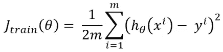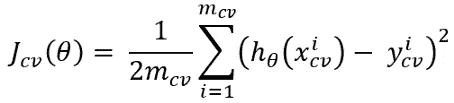

换句话说，它是预测输出的平方减去原始输出除以两倍的训练数据。为了制作学习曲线，我们需要将这些成本函数绘制成训练数据数量(m)的函数。我们将只使用训练数据的一个较小子集来训练数据，而不是使用所有的训练数据。

请看下图:

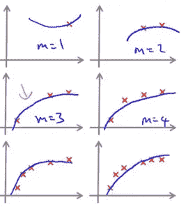

> **这里是概念**

如果我们用太少的数据来训练数据，算法将完全适合训练数据，并且成本函数将返回 0。

上图清楚地显示，当我们只使用一个、两个或三个数据训练数据时，算法可以很好地学习这几个数据，训练成本为零或接近于零。但是这种类型的算法不能在其他数据上很好地执行。

当您尝试用此算法拟合交叉验证数据时，它很可能在交叉验证数据上表现不佳。因此，交叉验证数据的成本函数将返回一个非常高的值。

另一方面，当我们采用越来越多的数据来训练算法时，它将不再完全适合训练数据。所以，培训成本会变得更高。

同时，由于该算法是在大量数据上训练的，它将在交叉验证数据上执行得更好，并且交叉验证数据的成本函数将返回更低的值。以下是如何建立一条学习曲线。

## 开发一个学习算法

我将一步步演示如何绘制学习曲线。为了绘制学习曲线，我们首先需要一个机器学习算法。为了简单起见，我将使用线性回归算法。我们先开发一个线性回归算法。

首先，导入包和数据集。我在这里使用的数据集取自吴恩达在 Coursera 上的机器学习课程。在该数据集中，X 值和 y 值被组织在 Excel 文件中的不同工作表中。

提醒一下，X 是我们将用来开发和训练机器学习算法的功能。y 是我们需要预测的输出特征。

交叉验证数据的 x 和 y 值也组织在同一个 Excel 文件的另外两个工作表中。我在本文末尾提供了数据集的链接。请随意下载数据集并自己练习。

```
%matplotlib inline
import pandas as pd
import numpy as np
import matplotlib.pyplot as plt
file = pd.ExcelFile('dataset.xlsx')
df = pd.read_excel(file, 'Xval', header=None)
df.head()
```

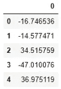

同样，导入定型集的 y 值:

```
y = pd.read_excel(file, 'yval', header=None)
y.head()
```

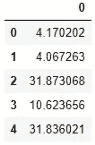

让我们快速开发线性回归算法。

> **定义假设**

线性回归使用非常基本的线性方程进行预测，我们在学校都学过。公式如下:

Y = C + BX

对于机器学习，我们使用不同的术语。

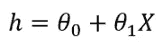

这里，“h”是假设或预测值，θ0 和θ1 是系数，X 是输入特征。

这里，我们已经有了 x。我们必须计算' h '并且它应该与 y 的值匹配。因为我们的目标是能够预测 y 的值。

θ0 和θ1 在开始时被随机初始化。我们将通过迭代不断改进θ0 和θ1 的值。

> 在每次迭代中，我们将使用成本函数和梯度公式来计算成本，以更新θ值

> **成本函数和梯度下降**

成本函数为我们提供了关于预测值与原始输出要素的差异的想法。这里，我们的输出特征是 y，预测输出将是‘h’。因此，成本函数会告诉我们“h”偏离“y”多少。我们希望成本函数值尽可能低。

下面是成本函数的公式:

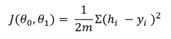

我们将继续运行算法，直到成本函数最小。在每次迭代中，我们使用梯度下降来更新θ值。

为了更新θ值，我们将从先前的θ值中减去梯度下降。当我们把它编码的时候，它会变得更加清晰。

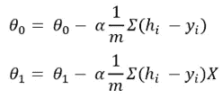

这里，m 是训练数据的数量，α是学习率。

> **开发线性回归算法**

使用上述公式开发假设和成本函数。

```
m = len(df)def hypothesis(theta, X):
    return theta[0] + theta[1]*Xdef cost_calc(theta, X, y):
    return (1/2*m) * np.sum((hypothesis(theta, X) - y)**2)
```

现在，我们将定义梯度下降来优化参数θ0 和θ1。在每次迭代中，我们将更新θ值，并跟踪成本函数和θ值。

最后，它将返回每次迭代中的成本列表 theta 值。代码很简单。请检查这里。

```
def gradient_descent(theta, X, y, epoch, alpha):
    cost = []
    theta_hist = []
    i = 0
    while i < epoch:
        hx = hypothesis(theta, X)
        theta[0] -= alpha*(sum(hx-y)/m)
        theta[1] -= (alpha * np.sum((hx - y) * X))/m
        cost.append(cost_calc(theta, X, y))
        i += 1
    return theta, cost
```

完成了线性回归算法。我们需要一种方法来预测产量。在预测方法中，我们将使用来自梯度下降函数和假设函数的最终θ来进行预测。

```
def predict(theta, X, y, epoch, alpha):
    theta, cost = gradient_descent(theta, X, y, epoch, alpha)
    return hypothesis(theta, X), cost, theta
```

现在，将参数初始化为零，并使用预测函数来预测输出变量。

```
theta = [0,0]
y_predict, cost, theta = predict(theta, df[0], y[0], 1400, 0.001)
```

更新后的θ值为:[10.724868115832654，0.3294833798797125]

现在，将预测输出(h)和原始输出(y)与 df 或 X 绘制在同一个图中。

```
plt.figure()
plt.scatter(df, y)
plt.scatter(df, y_predict)
```

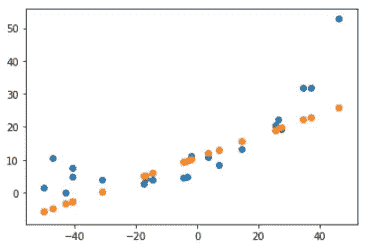

看起来算法运行良好。预测的输出线从中间位置开始。

> 是时候开发学习曲线了！！！

## 画一条学习曲线

现在，我们可以画一条学习曲线。首先，让我们为交叉验证数据集导入 X 和 y 值。正如我前面提到的，我们将它们组织在单独的 Excel 表格中。

```
file = pd.ExcelFile('dataset.xlsx')
cross_val = pd.read_excel(file, 'X', header=None)
cross_val.head()
```

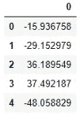

```
cross_y = pd.read_excel(file, 'y', header=None)
cross_y.head()
```

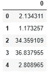

为此，我想稍微修改一下 gradient_descent 函数。

在之前的 gradient_descent 函数中，我们计算了每次迭代的成本。我这样做是因为在传统的机器学习算法开发中，这是一个很好的实践。

但是对于学习曲线，我们不需要每次迭代的成本。因此，为了节省运行时间，我将排除在每个时期计算成本函数。我们将只返回更新的参数。

```
def grad_descent(theta, X, y, epoch, alpha):
    i = 0
    while i < epoch:
        hx = hypothesis(theta, X)
        theta[0] -= alpha*(sum(hx-y)/m)
        theta[1] -= (alpha * np.sum((hx - y) * X))/m
        i += 1
    return theta
```

正如我前面所讨论的，为了开发学习曲线，我们需要用不同的训练数据子集来训练学习算法。

在我们的训练数据集中，我们有 21 个数据。我将只使用一个数据来训练算法，然后使用两个数据，然后使用三个数据，直到 21 个数据。

因此，我们将在训练数据的 21 个子集上训练算法 21 次。我们还将跟踪每个训练数据子集的成本函数。请仔细看看代码，会更清楚。

```
j_tr = []
theta_list = []
for i in range(0, len(df)):
    theta = [0,0]
    theta_list.append(grad_descent(theta, df[0][:i], y[0][:i], 1400, 0.001))
    j_tr.append(cost_calc(theta, df[0][:i], y[0][:i]))
theta_list
```

以下是每个训练数据子集的训练参数:

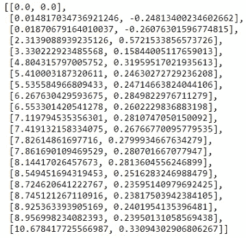

以下是每个培训子集的成本:

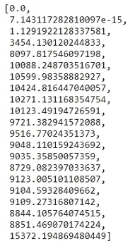

查看每个子集的成本。当训练数据只有 1 个或 2 个时，成本为零或几乎为零。随着我们不断增加训练数据，成本也在增加，这是意料之中的。

现在，对所有训练数据子集使用上述参数来计算交叉验证数据的成本:

```
j_val = []
for i in theta_list:  
    j_val.append(cost_calc(i, cross_val[0], cross_y[0]))
j_val
```

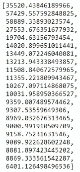

一开始，成本确实很高，因为训练参数来自太少的训练数据。但是随着更多训练数据参数的改善，交叉验证误差持续下降。

让我们在同一个图中绘制训练误差和交叉验证误差:

```
%matplotlib inline
import matplotlib.pyplot as plt
plt.figure()
plt.scatter(range(0, 21), j_tr)
plt.scatter(range(0, 21), j_val)
```

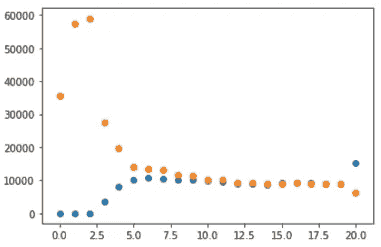

这是我们的学习曲线。

## 从学习曲线中得出决策

上面的学习曲线看起来不错。它正按照我们预期的方式流动。刚开始的时候，训练误差太小，验证误差太高。

慢慢地，他们彼此完全重叠。所以那是完美的！但在现实生活中，这种情况并不经常发生。

大多数机器学习算法第一次并不完美。几乎每时每刻都有一些我们需要解决的问题。在这里我将讨论一些问题。

我们可能会发现我们的学习曲线是这样的:

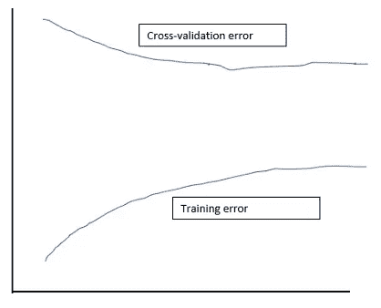

如果训练误差和验证误差之间存在显著的差距，则表明存在高方差问题。这也可以被称为过度拟合问题。

> 获取更多的训练数据或选择更小的特征集，或者两者兼有，可能会解决此问题。

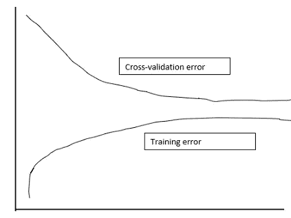

如果一个学习曲线看起来像这样，这意味着在开始的训练误差太小，验证误差太高。慢慢地，训练误差变高，验证误差变低。但是在某一点上它们变得平行。**从图中可以看到，在一个点之后，即使有更多的训练数据交叉验证误差也不会再下降了。**

在这种情况下，获得更多的训练数据并不会改善机器学习算法。

> 这表明学习算法正遭受高偏差问题。在这种情况下，获得更多的培训功能可能会有所帮助。

## 修复学习算法

假设，我们正在实现线性回归。但是算法并没有像预期的那样工作。

> **做什么？**

首先，像我在这里演示的那样画一条学习曲线。

1.  **如果您检测到一个高方差问题**，根据特性的重要性选择一个较小的特性集。如果那有帮助，那将节省一些时间。如果没有，尝试获取更多的训练数据。
2.  **如果您从学习曲线中发现高偏差问题**，您已经知道获得额外功能是一个可能的解决方案。您甚至可以尝试添加一些多项式特征。大量的时间有助于节省大量的时间。
3.  如果你正在实现一个带有正则项λ的算法，如果该算法正遭受高偏差，**尝试减少λ**，如果该算法正遭受高方差问题，**尝试增加λ**。这里有一篇文章详细解释了正则项与偏差和方差的关系:

[](/how-to-improve-a-machine-learning-algorithm-regularization-144a6697c2be) [## 如何改进机器学习算法:正则化

### 本文解释了机器学习算法性能差的原因以及如何改进它。

towardsdatascience.com](/how-to-improve-a-machine-learning-algorithm-regularization-144a6697c2be) 

> **在神经网络的情况下，我们也可能会遇到这种偏差或方差问题。**

对于高偏差或欠拟合问题，我们需要增加神经元的数量或隐藏层的数量。为了解决高方差或过拟合问题，我们应该减少神经元的数量或隐藏层的数量。我们甚至可以使用不同数量的神经元来绘制学习曲线。

非常感谢您阅读这篇文章。我希望这有所帮助。

## 更多阅读:

在这个页面中，你会找到几个非常流行的机器学习算法的教程链接:

[](/k-mean-clustering-algorithm-from-scratch-in-python-and-dimensional-reduction-step-by-step-guide-9ebabe5ca433) [## Python 中从头开始的 k 均值聚类算法:分步指南

### 并学习使用它来降低图像的维数

towardsdatascience.com](/k-mean-clustering-algorithm-from-scratch-in-python-and-dimensional-reduction-step-by-step-guide-9ebabe5ca433) [](/your-everyday-cheatsheet-for-pythons-matplotlib-c03345ca390d) [## Python Matplotlib 的日常备忘单

### 完整的可视化课程

towardsdatascience.com](/your-everyday-cheatsheet-for-pythons-matplotlib-c03345ca390d) [](/multiclass-classification-algorithm-from-scratch-with-a-project-in-python-step-by-step-guide-485a83c79992) [## 使用 Python 从零开始的多类分类算法:分步指南

### 本文介绍两种方法:梯度下降法和优化函数法

towardsdatascience.com](/multiclass-classification-algorithm-from-scratch-with-a-project-in-python-step-by-step-guide-485a83c79992) [](/a-complete-understanding-of-precision-recall-and-f-score-concepts-23dc44defef6) [## 完全理解精确度、召回率和 F 分数的概念

### 机器学习中如何处理倾斜数据集

towardsdatascience.com](/a-complete-understanding-of-precision-recall-and-f-score-concepts-23dc44defef6) [](/a-complete-guide-to-hypothesis-testing-in-python-6c34c855af5c) [## 数据科学家假设检验完全指南，Python 示例

### 用样本研究问题、解决步骤和完整代码清楚地解释

towardsdatascience.com](/a-complete-guide-to-hypothesis-testing-in-python-6c34c855af5c) [](https://medium.com/towards-artificial-intelligence/similar-texts-search-in-python-with-a-few-lines-of-code-an-nlp-project-9ace2861d261) [## 用几行代码在 Python 中搜索相似的文本:一个 NLP 项目

### 使用 Python 中的计数矢量器和最近邻法查找类似的维基百科简介，这是一个简单而有用的…

medium.com](https://medium.com/towards-artificial-intelligence/similar-texts-search-in-python-with-a-few-lines-of-code-an-nlp-project-9ace2861d261)