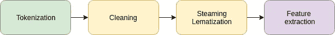
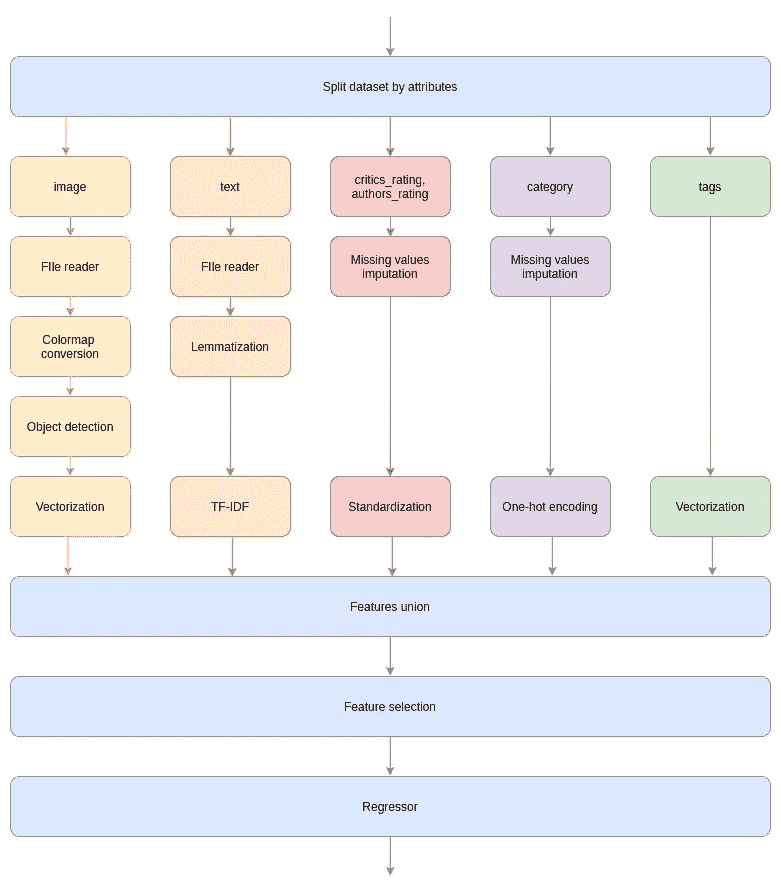

# 你的 ML 代码结构良好…或者是吗？

> 原文：<https://towardsdatascience.com/your-ml-code-is-well-structured-or-is-it-c1ef49aa5ba1?source=collection_archive---------36----------------------->

## 如何为你的机器学习项目构建代码

在 [Unsplash](https://unsplash.com?utm_source=medium&utm_medium=referral) 上由 [Seika I](https://unsplash.com/@seiseisei?utm_source=medium&utm_medium=referral) 拍摄的照片

我是从 Web 开发来到机器学习领域的。当我意识到没有任何明确定义的项目结构原则时，我真的很沮丧。也许更好的说法是**几乎** **不可能**为这个特定领域(机器学习/数据科学)找到项目结构和整个应用模块询问的最佳实践。关于 MVC 的信息更容易找到。现在我已经从事 ML 项目有一段时间了，在这篇文章中，我将尝试总结我在这个主题上的经验和知识。

让我们从基础开始。在大多数情况下，ML 项目由核心模型**和一些包装器**(*GUI、HTTP API、CLI 接口*)组成，最终用户将通过它们来使用它。让我们专注于核心的**模型**部分，把包装留给已经知道该做什么的人: )我们都知道，在大多数情况下，ML 世界中的软件开发过程是由 **CRISP-DM** (数据挖掘的跨行业标准过程)或其来自 IBM **ASUM 的兄弟**(数据挖掘/预测分析的分析解决方案统一方法)决定的。****

****

**CRISP-DM ( [来源](https://www.datasciencecentral.com/profiles/blogs/crisp-dm-a-standard-methodology-to-ensure-a-good-outcome))**

**从这两种方法中，我们可以突出 3 个主要的软件开发阶段:**数据准备、建模和评估**，它们在整个应用程序存在期间循环。不管你是刚开始项目还是添加新功能，你都必须通过这三个阶段。好，现在让我们定义一下什么是核心模型，或者我说的核心模型是什么意思？**

****核心模型**是一种算法，它以明确定义的数据结构对输入执行有限且明确定义的后续数据转换，并作为结果返回具有明确定义的数据结构的输出。我认为这个定义实际上适合所有的 ML 项目。现在让我们来定义这个算法在所有 3 个阶段是如何受到影响的。**

****数据准备**:这里我们必须验证和清理从客户(或其他地方)获得的数据。实际上，我们正在做的是决定算法的输入应该是什么样子。**

****建模**:这里我们必须定义数据转换步骤，这些步骤将在输入数据上执行，在输出上将返回所需结构的数据。重要提示:这里我们不仅创建了我们习惯称之为 ML 的模型(kNN，逻辑回归等。)，还包括数据预处理、特征工程和其他可能的数据转换步骤。事实上，我们习惯称之为“ML 模型”的任何东西都只不过是数据转换器。**

****评估**:这里我们必须使用一些度量来评估算法输出的相关性。**

**Uff，现在我们已经定义好了。那么代码呢？这三个阶段如何影响代码库？**

**当你在做**数据准备**的时候，你应该总是期望数据会及时变化，你当前正在解决的问题可能会被延长。**例子**:你要写一个模型，在显微镜图像上检测两种类型的粒子。您已经准备好了数据，并告诉客户以某种格式将输入发送给模型。在做出最终决定之前，您必须考虑的事情是:*如果客户想要添加一种新型颗粒进行检测，这是否可行？***

**当你在做**建模**的时候，你应该总是期望评估的结果或者生产中的结果可能是不好的，你必须在模型中做出剧烈的改变，而且你必须尽可能快地去做。*改变模型结构需要多长时间？***

**当您创建**评估**代码时，您应该始终预期评估指标、执行评估的数据甚至模型结构可能会改变。*更改这些内容并再次运行评估需要多长时间？***

**所以现在我们看到在开发过程中可能会发生很多问题，我们的主要目标是尽可能快地解决它。那么，我们应该如何编写代码才能轻松做到这一点呢？我们都知道软件开发中主要的代码质量度量是*可靠性*、*可维护性*、*可测试性*、*可移植性*、*可重用性*。但是这些时髦的词语可能意味着任何事情，而不一定是特定领域的。**

**我们已经定义了核心模型，我认为这种模型的最佳技术实现是**管道**。**流水线**是一组串联的数据处理步骤，其中一个步骤的输出是下一个步骤的输入。管道可以由几个管道构成。**

****

**文本预处理管道示例**

**现在，我想说出并描述我为自己定义的主要原则，我认为每个机器学习/数据科学项目都必须遵循这些原则:**

1.  ****管道由明确定义和有序的数据处理步骤组成。**数据有清晰的处理路径，有严格定义的顺序。这部分保证了应用输出的稳定性(*可靠性*)**
2.  ****高层管道结构透明**。任何不熟悉该项目的开发人员都必须能够理解(或者更好地写下一个有序列表)在应用程序管道中执行的所有步骤。这增加了整个应用程序的可维护性，并极大地简化了项目新人的加入。(*可维护性***
3.  ****数据处理步骤原子性**。每一步都有一个明确定义的输入和输出数据结构，其内部状态与其他步骤相隔离。这简化了流水线步骤单元测试。此外，它保证了管道步骤在管道的不同位置或在另一个管道中可重用的可能性。(*可维护性、可测试性、可重用性*)**
4.  ****流水线步骤参数的可访问性**。每个数据处理步骤的任何参数都必须易于访问并可以修改。这对于手动和自动模型参数调整和评估都非常重要。它简化了单元测试的数据处理步骤。并且还提供了其他设置的可重用性，在这些设置中它可能是有用的。(*可维护性***
5.  ****增加和删除流水线步骤的可能性**。如果前一步的输出和下一步的输入具有相同的结构，则可以删除管道的每一步。如果新步骤的输入和输出与它们的输入和输出兼容，则可以在两个步骤之间添加新的数据处理步骤。这加速了对整个数据处理流程建模的过程，并且在将来加速了根据反馈对现有模型的修正。(*维修性*)**

**我认为遵循这 5 条规则将有助于你为你的 ML 项目写出**干净、可测试和可维护的代码**。**

**万一是`sklearn`，可以用它的`Pipeline`实现，真的很牛逼。如果你想有一些变压器，这是不在`sklearn`，只是谷歌如何编写自定义变压器，并将其集成到您的管道，这真的很容易。**

**如果你使用除了`sklearn`之外的东西，你有两个选择:把你的解决方案转换成`sklearn`或者写你自己的管道接口，所有它必须满足的规则都摆在桌面上。不管你是和`textual`、`numeric`、`image`还是`mixed data`一起工作，这些规则都是通用的。**

**为了让语言与行动相匹配，我将展示这些**原则**是如何在实践中发挥作用的。假设我们有一个**帖子数据集**。每个岗位都有一个`image`、`text`、`category`、`tags`、`rating from critics`、`authors rating`、`price`。让我们想象一下`image`和`text`字段包含我们必须从中检索数据的文件名。我们的目标是估计帖子的数量。我想让你明白这个例子*和现实*没有任何联系。我用这个例子向您展示，您可以组合任意数量的具有不同接口和用途的工具，并将它们连接到**管道中，这满足了上述所有规则。**让我们假设，为了简单起见，我们选择了 stack: *pandas* ， *sklearn* ， *spacy* 用于文本属性的 NLP， *OpenCV* 用于图像处理， *YOLO* 用于图像上的对象检测。**

**现在我将向你展示核心模型的一段代码，如果你不理解它的高层结构，那么我之前写的所有东西都不起作用，你可以立即离开这一页；)**

**模型核心代码**

**所以，如果你还在读这篇文章，我想你已经理解了代码。是不是看起来很棒，真的很好维护？首先我要强调的是，当然**并不是所有的变形金刚都存在于 sklearn。但是就像我之前说的，你可以自己做一个。你可以看看我以前的帖子，最后你会发现使用 spacy API 的自定义 sklearn 转换器:****

** [## 文本预处理步骤和通用流水线

### 所有文本预处理步骤的描述和可重用文本预处理管道的创建

towardsdatascience.com](/text-preprocessing-steps-and-universal-pipeline-94233cb6725a) 

管道方案

现在让我们命名所有的步骤。**高级别代表:**

1.  预处理
2.  特征选择
3.  回归模型

**预处理**:根据数据表示类型对不同组的列独立应用不同的预处理步骤，然后将所有转换后的特征合并到一个数据帧中。

**图像数据:**

1.  使用 *OpenCV* 从文件中读取图像
2.  将色彩图从*OpenCV*BGR 转换为 *RGB*
3.  使用 *YOLO* 检测猫、狗和人，并为每张图像返回检测到的对象数组
4.  将输出数组转换为指示器矩阵，其中 1 表示对象在图像上，0 表示对象不在图像上

**文本数据:**

1.  从文件中读取文本
2.  对所有单词进行词汇化
3.  使用 TF-IDF 算法进行矢量化，按单词进行标记化，并使用最大大小为 10000 的单词包

**数字数据:**

1.  使用中位数策略估算缺失值
2.  执行标准化

**分类数据:**

1.  用单词“missing”估算缺失值
2.  执行一键编码

**分类多标签数据:**将数组转换为指示矩阵，其中 1 表示对象在列表中，0 表示对象不在列表中。

现在你可以看到你的模型看起来有多棒了。这段代码满足了上述所有规则。

我希望你喜欢这篇文章，我期待你的反馈！我真的很想开始讨论这个话题，所以不要犹豫写评论或直接给我发电子邮件。

如果您在将您的模型转换为 pipeline 时遇到问题，请写评论或直接给我发电子邮件，我会尽力帮助您。

我的邮箱:maksym.balatsko@blindspot.ai**