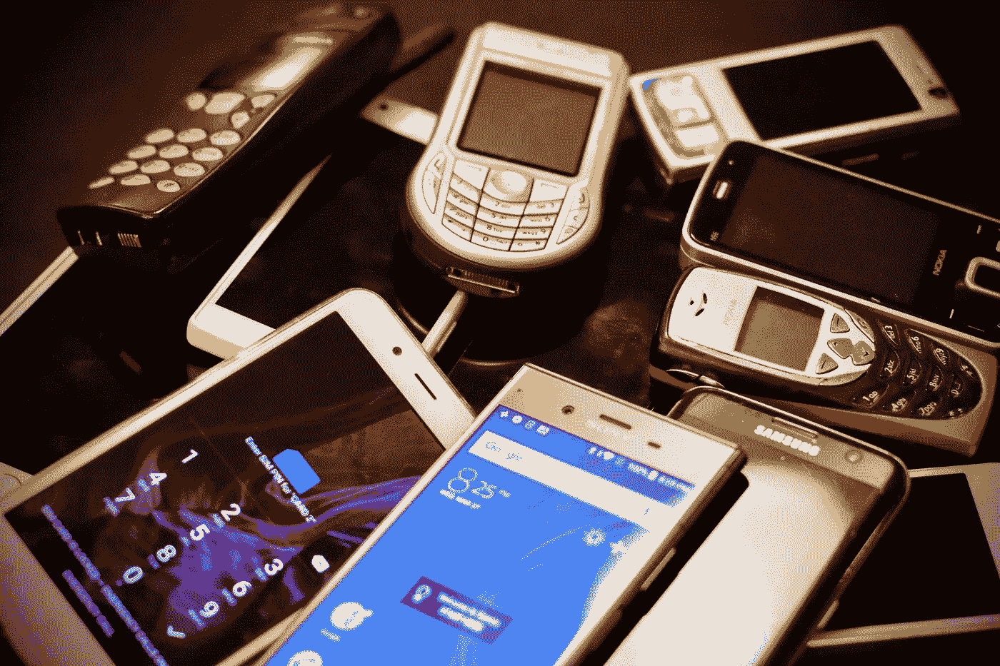
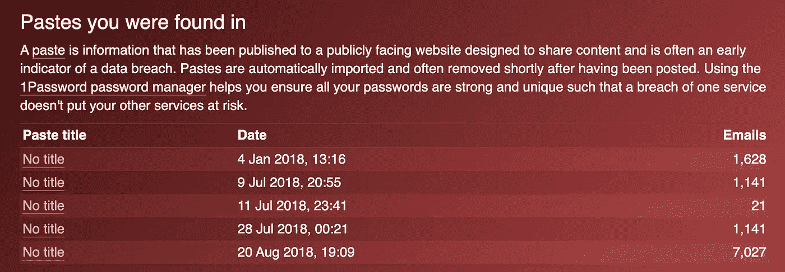
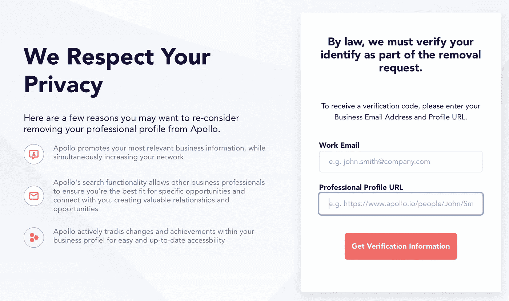
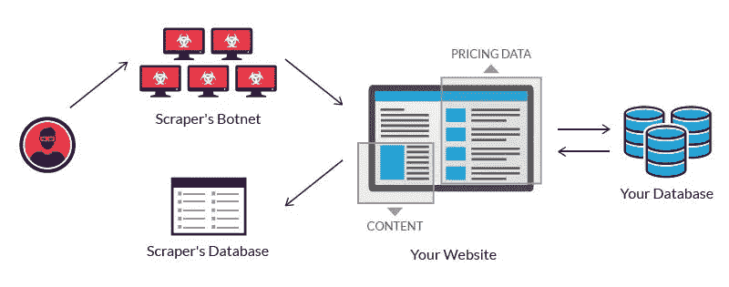
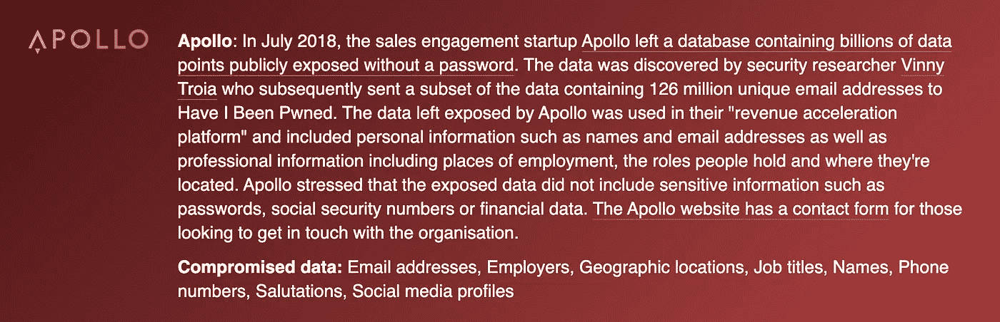

# 你的电话号码让世界知道你是谁:开源情报收集快速指南

> 原文：<https://towardsdatascience.com/your-phone-number-lets-the-world-know-who-you-are-a-quick-guide-on-open-source-intelligence-3009510ee3b4?source=collection_archive---------21----------------------->

你的手机泄露了你的什么信息——照片由 [Unsplash](https://unsplash.com/s/photos/nokia-phone?utm_source=unsplash&utm_medium=referral&utm_content=creditCopyText) 上的[艾里克·索尔海姆](https://unsplash.com/@eirikso?utm_source=unsplash&utm_medium=referral&utm_content=creditCopyText)拍摄

O 你的数据很重要！这是我们的隐私，公司不应该滥用它。不幸的是，这已经不是我们生活的世界了。这篇文章不会是危言耸听*“让我们回到我们的诺基亚 5110”*并关闭我们的账户，但它将是对我们数据的一种洞察，以及像电话号码这样平凡的事情如何能揭示这么多。在网络安全和数据科学中，有一个术语叫做开源情报收集(OSINT)，它被描述为，

> 从公开来源收集的数据，用于情报环境。

在我们所处的疫情，我们的数据再次受到威胁，因为公司试图适应新的工作模式、新的连续性计划以及新的工具，因为他们希望完全采用远程观点。最近，越来越多的销售主管打电话来询问我是否对远程解决方案感兴趣。由于封锁，大多数人都不在办公室，少数人一直在使用手机号码，他们经常这样做是为了避免谷歌人工智能实际上可以根据谷歌搜索结果告诉你哪个公司在打电话(*如果你有安卓系统，苹果的 IOS 也使用类似的功能)*。使用手机号码至少可以让他们回避这个问题，和你搭讪。然而，一个日益增长的趋势是，由于持续的需求和供应链的中断，一些公司措手不及，现在要求员工使用个人手机并报销费用。对于销售主管来说，这实际上存在安全风险。你的手机号码可以透露很多关于你的信息，恶意攻击者可以利用它来获取更多关于你的信息，进行网络钓鱼攻击***(***[***)我写了一个关于如何设置网络钓鱼服务器的指南***](https://medium.com/illumination/deploying-a-gophish-server-on-google-cloud-platform-445eadaf8b31)***)***。

## 那么这在现实生活中是什么样子的呢？

在过去的几年里，我们都会收到一封电子邮件，告诉我们由于不安全的数据库等原因，我们的数据被泄露了，公司很抱歉，他们非常关心我们的数据。通常，这些电子邮件遵循相同的主题，即你的信用卡信息是安全的，但他们可能已经得到了你的电子邮件和电话号码。公司经常淡化这一重要部分，因为你的信用卡信息被认为比电子邮件或电话号码更有价值，对吗？

## 那么我泄露的信息会怎么样呢？📧📱

你可能经常会看到垃圾邮件的增加，但如果你使用 Gmail 或 Hotmail，你实际上永远不会看到这一点，因为他们的垃圾邮件过滤器会发现它。有了你的电话号码，它可能会被卖掉，你会通过短信或电话收到奇怪的网络钓鱼企图，内容是有一次你撞坏了一辆你从未拥有过的汽车。姓名和个人标识符通常不与这些数据保存在一起，或者受到保护(哈希)。然而，它们中的大部分最终会出现在粘贴箱中，这些是来自互联网漏洞的大量“复制和粘贴”数据。像[这样的服务已经通过这些数据让你知道你的电子邮件是否出现在这些数据泄露中。](https://haveibeenpwned.com/)

## 我的信息被泄露过吗？😱

**无时无刻😡！令人沮丧的是，这不是我的错。因此，我查看了一封我用来注册时事通讯的旧电子邮件，随着时间的推移，它已经被泄露了 6 次，从 2012 年开始，直到最近的 2019 年 2 月。**

影响我的一个电子邮件地址的漏洞截图。资料来源:HaveIbeenPwned

## 并非所有违规行为都被披露或易于跟踪

这就是粘贴箱的用武之地，有时黑客不会透露信息的来源，或者这可能是一个大的操作，有人已经把泄露的信息放在一起，然后决定分享它。他们会将信息上传到 Pastebin，通常没有任何指示，其他用户会下载并使用这些信息进行钓鱼攻击、暴力攻击，甚至训练机器学习模型。

值得庆幸的是，你可以在火狐或谷歌上设置提醒，当你的电子邮件被泄露时提醒你

## 从一个电话号码，别人怎么找到你的名字？

正如我们在上面看到的，在 [CafePress](https://www.cafepress.co.uk/) 数据泄露事件中，除了电子邮件地址，密码，用户名和电话号码也被泄露。你能用电话号码做什么？

首先，我们无法像控制电子邮件或其他信息一样控制它。如果有人加了我的电话号码，我永远也不会知道，如果我的电话号码被泄露，O2，Virgin 或 EE 从来没有联系过我说，*“嘿，你的号码被攻破了，注意安全。”*

因此，如果恶意方找到我的号码并将其添加为联系人，我的号码会告诉他们什么？首先，这足以暴露我所有的社交媒体账户。Instagram 会显示你的哪些联系人在平台上，现在大多数社交平台也是如此。同意手机号码是一个单向系统，现在大多数应用程序都要求导入你的联系人列表，因此从这里开始，用户可以添加一个号码，并查看一些热门应用程序，看看该号码是否与某人对应。如果你使用像 WhatsApp 这样的流行信息平台呢？总是检查只有**你的联系人**可以看到你的个人资料照片，将设置为**每个人**意味着即使是偶然发现你号码的陌生人现在也可以看到你的个人资料照片。通常，如果我接到一个未知号码的未接来电，我首先会保存它，然后在 WhatsApp 上查看，以了解是谁打来的。对于目前在疫情期间使用私人电话的销售人员来说，这将很难控制，而且这是对你隐私的不必要的侵犯。

## 但是如果是你的银行告诉别人你的情况呢？🏦

在疫情期间，当企业努力应对远程支持的新需求时，一些企业已经走在了前面。让我们看看 [Monzo](https://monzo.com/) ，一家只支持移动设备的银行，它已经有了支持和远程扩展的基础设施。作为 Monzo 的客户，我喜欢这家银行。但是我有一个问题。

为了让朋友更容易支付和即时支付，Monzo 有一个功能，它列出了所有与 Monzo 联系的人。从那里你可以选择一个联系人并给他们汇款。从 UX 的角度来看，它使生活变得容易，在这个时代，谁有时间写下分类代码和帐号，事实上，这似乎是万无一失的，因为你输入错误信息的可能性很小。但通常，像这样的功能虽然有用，但也可能对恶意攻击者有用。作为一名恶意攻击者，我可以从粘贴箱中找到一个电话号码，将其添加为联系人，检查他们是否有社交媒体，然后打开 Monzo，找出他们的完整政府名称。Monzo 应用程序将用户注册并通过政府 ID 确认的姓名显示给任何拥有该人手机号码的人。此功能可以关闭，但关闭后，您将无法在没有账号和分类代码的情况下汇款。很遗憾，用户经常面临一个决定，是安全还是 UX 便利？

## 好吧，你知道我的名字和号码，你能做什么？

这就是 OSINT 真正发挥作用的地方，一个伟大的查找信息的开源平台是 Google(或任何搜索引擎)，如果攻击者知道你的全名，就不难进行显式搜索来查找关于你的更多信息。作为一个现代互联网用户，你应该知道谷歌上出现了哪些关于你的信息。

一个朋友最近让我自己谷歌一下，看看是否会弹出某个结果。令我惊讶的是，在第二页，它就在那里。正如她所描述的那样，这是一个已经废弃了我所有 LinkedIn 内容和信息的页面，现在正出售给声称拥有我的电话号码和电子邮件信息的公司。为了删除我的信息，我需要通过给他们更多的信息来证明我就是我所说的那个人。

我没有允许他们拥有我的数据，但我们在这里！—阿波罗 AIs 网站截图。

不幸的是，这不是唯一一个提供这类信息的网站。从快速的谷歌搜索中，你可以找到不同的网站提供你的数据，要么是从社交媒体平台购买的，要么是从数据库泄露的，要么是我们从未读过的一些条款和条件。LinkedIn 等公司需要采取更多措施来防范网络垃圾邮件。网络抓取是使用机器人从网站中提取内容和数据的过程。与只复制屏幕上显示的像素的屏幕抓取不同，网络抓取提取潜在的 HTML 代码，以及存储在数据库中的数据。然后，抓取工具可以将整个网站内容复制到其他地方，或者打包出售给寻找线索和数据的公司。

网页抓取的工作原理—来源— [Imperva](https://www.imperva.com/learn/application-security/web-scraping-attack/)

更糟糕的是，在 2018 年，尽管**我从未和他们**有过账户，也不知道他们是谁。阿波罗人工智能不知何故丢失了一个我不用的电子邮件地址。这只是我用于测试系统的一个虚拟收件箱。

阿波罗——如果你正在读这篇文章，请删除我。—来源[已更新](https://haveibeenpwned.com/)

## 我的地址呢？

从你的政府名称来看，如果你在公布的选民名单上，你的名字和地址很容易被找到。由于在英国的信用评分过程，它经常被用来作为一个很好的指标对你的信用评分有你的名字在这个选民名册上。然而，获得这些数据的公司通常会出售这些信息。因此，通过谷歌搜索，人们实际上能够找到你是谁，谁住在你的房子里的信息*(是的，有一个网站列出了居住在某个地址的有资格投票的每个人，以及与该房产相关的以前的名字)*。如果你是一家公司的董事，那么，[公司之家](https://www.gov.uk/government/organisations/companies-house)允许某人搜索你的名字，并获得关于你的更多信息。但是攻击者要寻找的关键信息是你的出生日期。虽然它没有列出具体的日期，但对于攻击者来说，它缩小了你出生的月份和年份。使用任何公共社交媒体资料，如果你曾经发布过“这是我的生日”帖子，他们所要做的就是查看你在那个月的帖子。

## 那么是回 Nokias 吗？

是的，我们可以，但我们也可以在保护数据时采取主动。虽然我们无法控制谁在篡改我们的数据，但我们可以做些事情来保护自己。这可以通过使用安全方法来实现，例如不包含容易获取的信息的强密码。如果你的出生年份可以在公司主页上找到，为什么会出现在你的密码里？如果谷歌搜索可以显示你 5 年前住的地址，为什么你的秘密问题是关于你找到工作后住的第一条路？一个人的垃圾是另一个人的黄金。数据也是如此，对您来说可能不那么重要的东西可能是网络钓鱼企图中缺失的部分。对于公司来说，他们还应该注意，通常在鱼叉式网络钓鱼攻击中，攻击者正在寻找一种方法，而任何系统最脆弱的部分就是使用它的人。

如果你从这篇文章中有所收获，请在网上搜索自己，看看会有什么收获。了解你的数据，给公司发邮件要求他们把它拿下来，在这段无聊的时间里，检查你下载的应用程序的权限。一个数字能说这么多，我们一定要保护他们。

作者[斯蒂芬·查彭达玛](https://www.linkedin.com/in/stephenchapendama/)