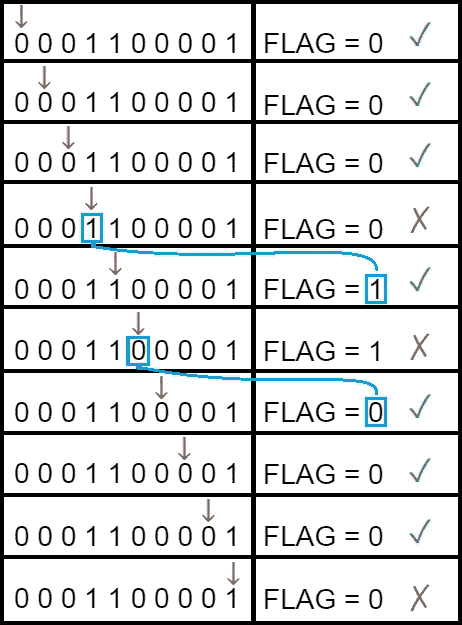

# 你的处理器在你开始使用人工智能之前很久就试图预测未来

> 原文：<https://towardsdatascience.com/your-processor-is-trying-to-predict-the-future-long-before-you-start-with-ai-892beeaf6a48?source=collection_archive---------51----------------------->

## 以一种更原始但没有太大不同的方式


在 [Unsplash](https://unsplash.com/) 上由 [Vladimir Malyutin](https://unsplash.com/@vladimir__film) 拍照

如果你学过计算机体系结构，你可能知道硬件执行某个程序的基本步骤。如果没有，下面简单解释一下这个过程[**【1】**](https://www.elsevier.com/books/computer-organization-and-design-mips-edition/patterson/978-0-12-407726-3):

第一步是将高级代码翻译成汇编语言。编译器负责做到这一点。之后，汇编程序将把汇编语言翻译成二进制指令。因此，如果您的代码在某个高级语言中包含以下语句:

```
A + B
```

编译器将变成:

```
add A,B
```

汇编程序会翻译成这样:

```
000001010011
```

从这一点开始，处理器执行以下步骤:

*   **获取:**从 RAM 中读取指令。
*   **解码:**理解指令的目的(例如 add)并设置允许执行指令的所有标志和寄存器。
*   **执行:**处理指令。指令可以使用也可以不使用算术逻辑单元(ALU)。算术逻辑指令使用 ALU，
    内存指令也可以使用它进行地址计算。
*   **回写:**将获得的结果写入寄存器组。

当处理器运行时，该序列一直重复，并且每个步骤花费一个时钟周期。执行依赖于解码，解码依赖于获取。然而，获取不依赖于解码，解码不依赖于执行，所以一旦某条指令的获取完成，下一条指令就已经可以被获取了。其他的也一样，**那是处理器流水线**(如下图所示)。


科林 M.L 伯内特在[维基共享资源](https://commons.wikimedia.org/wiki/File:Pipeline,_4_stage.svg)上的图片

# 预测从何而来？

要说预测，首先要说条件跳转(或者说条件分支)。条件分支指令是跳转到一个新地址，根据特定条件[【2】](https://patentimages.storage.googleapis.com/83/4c/27/df5557ed2268ab/US6571331.pdf)可能发生也可能不发生。翻译成高级语言，它基本上是一个 if-then-else 子句:

```
if **some condition:**
   do this;
else:
   do this instead;
```

如果满足条件，代码将继续正常执行。如果不满足条件，代码将跳转到 If 块中的所有行，执行 else 块中的所有行。这是条件分支的一个例子。 **For 的**和 **while 的**也是条件分支，因为条件定义了代码是重复还是直接。关于条件分支的要点是:**执行时需要计算条件结果**。

这意味着当条件分支指令在流水线中出现时，处理器将只知道在计算条件结果之后，即在执行阶段之后，是否需要采取分支。因此，处理器不知道下一条指令是否会被执行，或者是否会跳转到另一条指令。这种依赖隐含着一个**管道气泡**[](http://www.eecs.umich.edu/techreports/cse/1997/CSE-TR-337-97.pdf)**。**

****

**图由[二胡郝](https://www.researchgate.net/profile/Erhu_Hao)在 [ResearchGate](https://www.researchgate.net/figure/Pipeline-bubble-a-single-issue-processor-with-four-pipeline-stages_fig1_2744762)**

**一个流水线气泡，如上图所示，是处理器流水线上的一种延迟，目的是为了解决某种依赖(或者危害，在计算机架构语言中)[**【1】**](https://www.elsevier.com/books/computer-organization-and-design-mips-edition/patterson/978-0-12-407726-3)**。**灰色块代表空闲时间。考虑到上图中的第一条指令是条件分支，下一条指令只有在条件分支指令完成其执行步骤后才会被提取，以确保下一条要执行的指令是正确的。所以如果你仔细想想，这在性能上是不可持续的。这就是预测出现的地方。**

# **分支预测**

**如果处理器没有等到条件分支的计算，它有什么选择？嗯，猜测或预测条件结果可能是一个不错的选择…事实也的确如此。预测条件结果而不是阻塞处理器的过程已经使用了几十年，它被称为“分支预测”。**

**它们已经使用了很长时间的事实并不意味着它们是完美的，总是有改进的空间。使用真实处理器的实验表明，减少 50%的预测失误会使处理器的性能提高 13%[**【4】**](https://onlinelibrary.wiley.com/doi/abs/10.1002/cpe.4666)。然而，设计分支预测器(BP)不仅要考虑精度，还要考虑许多其他因素，例如处理器芯片的面积、能耗等。**

## **分支预测是如何工作的？**

**[Harshal Parekh](https://medium.com/u/2a6e065054e5?source=post_page-----892beeaf6a48--------------------------------) 写了一个很好的故事，不仅解释了它是如何工作的，还展示了它在真实情况下的影响。我非常推荐阅读:**

**[](https://medium.com/swlh/branch-prediction-everything-you-need-to-know-da13ce05787e) [## 分支预测—您需要知道的一切。

### 在计算机科学中，谓词是一种体系结构特征，它为条件转移提供了另一种选择

medium.com](https://medium.com/swlh/branch-prediction-everything-you-need-to-know-da13ce05787e) 

像大多数预测模型一样，分支预测通常基于条件分支的过去行为。最简单的分支预测算法可以使用一个标志来定义，该标志指示最后一个分支是否被采用，并且该算法将总是猜测上一次发生的事情也将在下一次发生。因此，标志需要采用初始值( **1** 表示是， **0** 表示否)。如果猜测正确，标志将保持其值。如果没有，标志会改变它的值。下面的情况可以举个例子。

运行某个例程后，给定分支 **b** 得到以下行为:

```
0 0 0 1 1 0 0 0 0 1
```

在前三次迭代中，没有执行分支，在接下来的两次迭代中，执行了分支。接下来的四个也没拍，最后一个拍了。考虑到我们的分支预测器以标记为 **0、**开始，准确度将为 70%。下图用一个红色箭头表示每次迭代，后面是当前标志值和一个表示分支行为预测是否正确的符号。



作者图片

第一次预测失误将发生在第四次迭代时，因为最后一次是 **0** (第四次是 **1)** 。这样，标志现在将其值更改为 **1** 。由于将在下一次迭代中进行分支，所以预测将是正确的，然而，在第六次迭代中，分支不再进行，因此发生另一次未命中预测。现在，标志再次变为 **0** ，并正确预测接下来的三次迭代，然后错过最后一次迭代。最终，我们得到了 7 个正确的预测和 3 个错误的预测。

显然，这不是现在处理器进行分支预测的方式。有一堆其他的技术可以给出更好的结果。你可以在 Sparsh Mittal 写的这篇文章中找到一些答案。

# AI 可以用于分支预测吗？

很容易想知道这种问题是否可以由人工智能算法来解决，答案是**是的，它们可以**。事实上，从很久以前开始。使用这种方法的分支预测器的一个例子是**感知器预测器**，在 Sparsh Mittal [调查](https://www.researchgate.net/publication/324166804_A_Survey_of_Techniques_for_Dynamic_Branch_Prediction)中也有涉及。由于人工智能领域的最新进展，这两个领域的结合可能是英特尔和 AMD 等主要科技公司建筑内的一个热门趋势，我们可以期待更多的到来。

因此，如果你喜欢计算机架构和人工智能，这是你可以利用你所有的知识来改进我们今天拥有的处理器的研究领域。

# 参考

[1]帕特森，大卫 a .，和约翰 l .轩尼诗。[计算机组织与设计:硬件/软件接口](https://www.elsevier.com/books/computer-organization-and-design-mips-edition/patterson/978-0-12-407726-3) (2013)。平装本，摩根·考夫曼出版社。

[2]亨利、格伦和泰瑞·帕克斯。[条件分支指令的静态分支预测机制](https://patentimages.storage.googleapis.com/83/4c/27/df5557ed2268ab/US6571331.pdf) (2003)。美国专利 6571331 号。

[3]张宝勇。分类导向的分支预测器设计 (1997)。密歇根大学博士论文。

[4]米塔尔，斯巴什。[动态分支预测技术综述](https://onlinelibrary.wiley.com/doi/abs/10.1002/cpe.4666) (2019)。并行性和计算:实践和经验。**