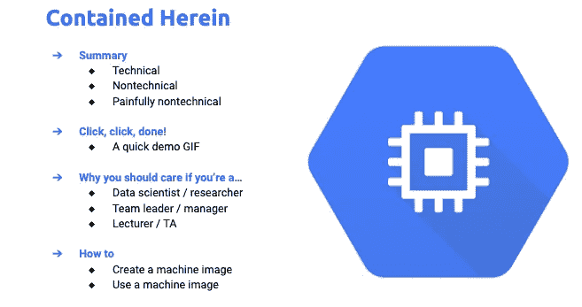
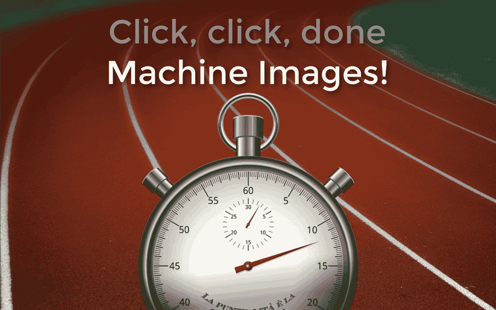
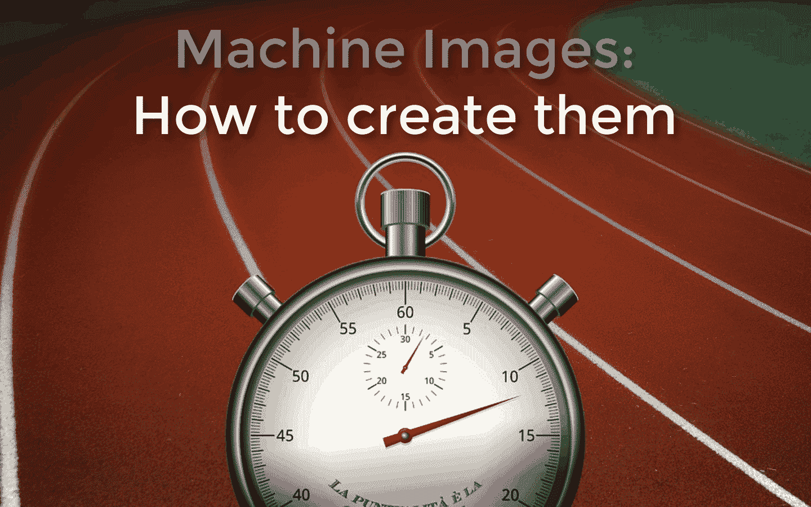
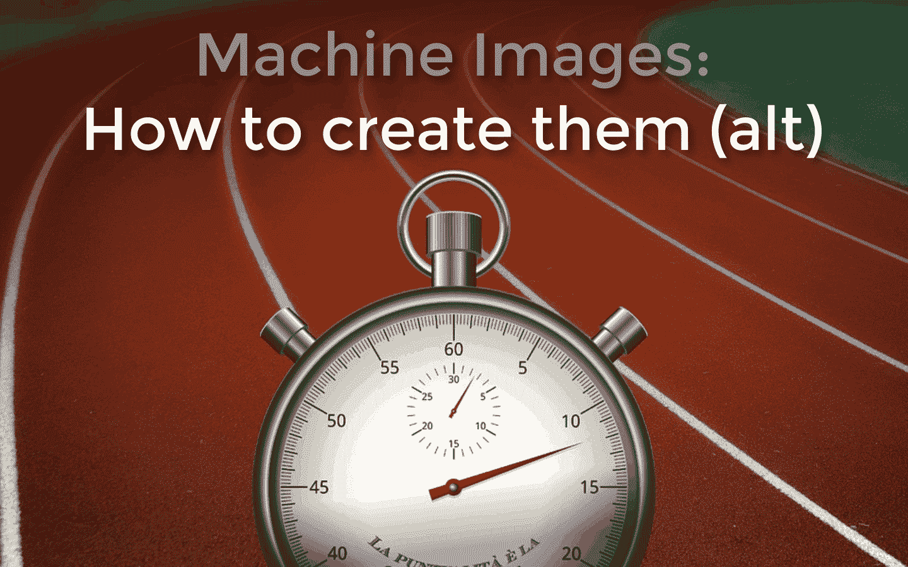
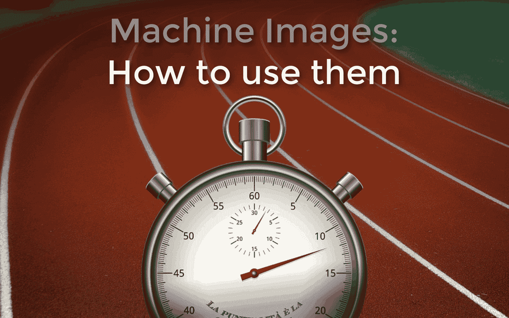

# 您的简化数据科学工作流已经到来！

> 原文：<https://towardsdatascience.com/your-simplified-data-science-workflows-have-arrived-208ce20bad88?source=collection_archive---------15----------------------->

## 数据科学家及其团队领导会喜欢的 Google Cloud 新功能

图片:[来源](https://pixabay.com/photos/athlete-runner-sprint-fast-black-1840437/)。

*嘿，* [*数据科学家*](http://bit.ly/quaesita_datasci) *使用* [*谷歌云*](http://bit.ly/gcloudpstart) *:你怎么还没使用* [*机器图片*](https://bit.ly/cloudmachim) *？因为他们才出生两周，这就是为什么…*

# 摘要

## 技术的

[***Google Cloud 上的机器映像***](https://bit.ly/cloudmachim) 让您轻松创建、备份、恢复和共享您定制的虚拟机。如果将磁盘映像、快照和实例模板结合起来，就可以得到它们。(呃，好吧，生孩子不是这样的。)

> [***虚拟机镜像***](https://bit.ly/cloudmachim) 轻松创建、备份、恢复和共享虚拟机。

哦，如果你预算紧张，你会以一种你永远不会喜欢虚拟机副本的方式喜欢它们。

## 非技术性的

您是否曾经丢失过智能手机，然后使用一键解决方案来恢复您最喜爱的应用程序、联系人等。换一部手机吗？机器镜像就是那样，不过是针对 Google Cloud 上的虚拟机。

## 痛苦的非技术性

想象一下，你从谷歌云租用的虚拟电脑是一个视频游戏中的角色。在机器映像出现之前，这款视频游戏没有保存选项——每次你做了让你后悔的事情，你都必须从头开始玩游戏。现在，保存和加载你辛辛苦苦获得的所有物品和经验值变得超级容易。

# 咔嚓，咔嚓，搞定！

## 演示 GIF

要使用机器映像创建虚拟机:单击机器映像旁边的选项，单击 Create VM(命名您的小 best 是可选的)，然后创建！哒哒，你漂亮的虚拟机的一个简单副本。(右下角是一个方便眼睛的放大图。)

# 为什么你应该关心你是不是一个…

## 数据科学家/研究员

如果你像大多数[数据科学家](http://bit.ly/quaesita_datasci)一样，你无法在内心深处*热爱*虚拟机(VM)设置和其他计算[琐事](http://bit.ly/quaesita_22)。这些事情会占用你处理[数据](http://bit.ly/quaesita_hist)的时间，而这正是你真正感兴趣的部分。当然，你有足够的洞察力想要你自己的特别定制设置——就像你喜欢的那样——所以你能够抑制你第一次抱怨。

几周过去了。你偶尔会安装闪亮的新包，调整设置，运行脚本，然后有一天…嘣！你打破了它。

理想情况下，你应该把时钟倒回到你完美的机器上，就像上周一样，但是…你不记得你点击了什么到达那里。即使你做了，从头开始也要花几个小时(如果你幸运的话)。

悲伤。

> 之前:恢复上周的设置意味着从头开始。
> 
> 之后:咔嚓，咔嚓，搞定。更少的家务时间，更多的数据时间。

机器图像来拯救！机器映像是包含所有信息(机器类型、网络标记、标签等)的单一资源。—需要备份、拷贝、恢复和共享一个实例(虚拟机)。

这意味着您可以保存您喜欢的配置的副本，以便您可以轻松恢复实例的旧版本。听起来很简单。咔嚓，咔嚓，搞定。

**等等，为什么不直接保存虚拟机本身的副本呢？**因为您可能想在保存备份的同时省钱。

> 使用机器映像的成本远低于保存虚拟机的多个副本。

如果您制作了虚拟机的副本，您将获得双倍的计费磁盘空间。如果你创建一个机器映像，你只需要为磁盘内容的差异付费，所以即使你选择了一个华丽的虚拟机，每一个额外的机器映像也只需要你几分钱。

## 团队领导/经理

想象你是一名领导，有新的团队成员要加入。

您已经有了满足团队需求的完美设置，但是它存在于一个讨厌的文档中，该文档详细说明了每个新员工必须运行哪些脚本以及他们需要单击哪些按钮。

让新队友站起来并投入运行需要很长时间。

> 以前:让新队友起床跑步需要很长时间。
> 
> 之后:更快的入职和一支能够跟上前沿的团队。

重复工作对你的业务没有好处，但幸运的是机器映像让我们跳过它。他们允许您定制一次，为您的团队创建一个黄金映像，并与整个团队共享。这让每个人的起跑线都向前移动，加快了你的入职速度。

> “机器映像不仅仅是保存备份。这是加速你整个团队的一种方式。” —阿里·利伯曼，谷歌计算引擎产品经理

作为奖励，你会想不断更新黄金图像，以保持每个人的配置在最前沿。不用再跟踪你的小组的掉队者忘记做哪些更新了。

## 讲师/助教

给你给学生的编码作业打分——也许是在 [TensorFlow](http://bit.ly/quaesita_tf2) 中的图像识别？—如果您不得不处理学生可能搞乱机器设置的所有不同方式的调试，这很快就会变成一场噩梦。(例如，你敢相信他们会想出如何获得 GPU 吗？)

当然，你可以告诉他们在[市场解决方案](https://bit.ly/gcpmarketplace)上获得现成的解决方案——这个主意不错！—但是，如果您渴望定制该解决方案，该怎么办呢？你打算浪费一周的课堂时间来指导你的 100 名学生，让他们在试着按正确的顺序转动正确的旋钮时感到牙疼吗？你会放弃一个定制的起点吗？

有更好的方法。

> 以前:你浪费了宝贵的教学时间来指导学生按正确的顺序按正确的设置按钮。
> 
> 之后:在您完成自己的定制后，您的学生可以立即开始(并停留在)同一页面上。

从您喜欢的任何地方开始(从零开始，从[市场](https://bit.ly/gcpmarketplace)，从以前教授的机器映像开始)并定制到您满意的内容，然后与您的学生分享最终的机器映像。跳过课堂上的讨论，放心，如果他们的代码不工作，那不是因为他们在第一周忘记检查防火墙设置框。

另外，如果你在期中考试前对学生的设置感到后悔，很容易就可以替换。

# **如何**

## 创建机器映像

选项 1 是从计算引擎中的 VM 实例创建一个机器映像，如第一个 GIF 所示。

是的，我给它们取名为“野兽”和“小野兽”不，当你与其他成年人合作进行专业数据科学工作时，这不是你命名事物的方式。似乎演示引出了我最糟糕的习惯！但在我看来，一个 VM *可以*从很小的东西开始，如果需要，你总是可以选择将其扩展到相当大的规模。

选项 2 是直接进入机器映像部分，创建一个新的，在表单中指明 VM 实例源，如下一个 GIF 所示。

这将让你看到我们在上面的 GIF 中看到的相同的表格，以相同的方式进行…

## 使用机器映像

您已经看到了从您的机器映像创建 VM 的一种方法(本文中的第一个 GIF ),但是还有另一种方法:

几乎太容易了，对吧？差不多了。就我们这些数据科学家而言，不管有多容易，任何不涉及玩弄数据的事情[应该总是更容易](http://bit.ly/quaesita_ux)。但是在心灵感应界面出现之前，我很高兴拥有这个界面。

*在谷歌云博客* *了解更多机器图像* [*。*](https://bit.ly/cloudmachim)

# 感谢阅读！人工智能课程怎么样？

如果你在这里玩得开心，并且你正在寻找一个为初学者和专家设计的有趣的应用人工智能课程，这里有一个我为你制作的娱乐课程:

在这里欣赏整个课程播放列表:[bit.ly/machinefriend](http://bit.ly/machinefriend)

# 与凯西·科兹尔科夫联系

让我们做朋友吧！你可以在 [Twitter](https://twitter.com/quaesita) 、 [YouTube](https://www.youtube.com/channel/UCbOX--VOebPe-MMRkatFRxw) 和 [LinkedIn](https://www.linkedin.com/in/kozyrkov/) 上找到我。有兴趣让我在你的活动上发言吗？使用[表格](http://bit.ly/makecassietalk)取得联系。