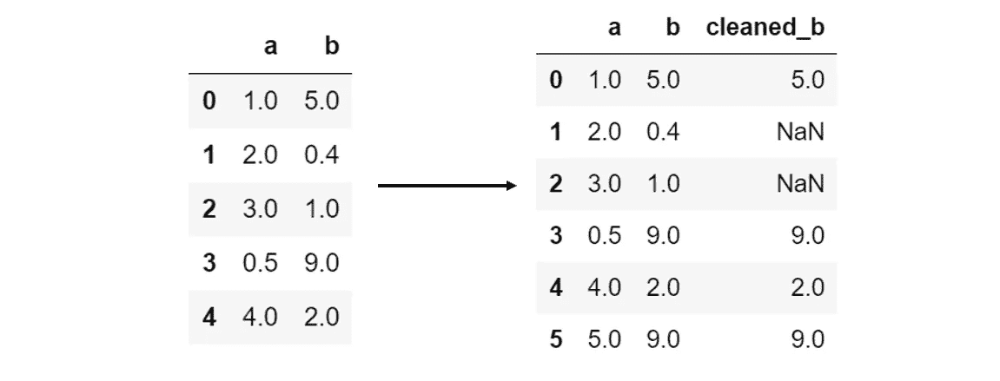
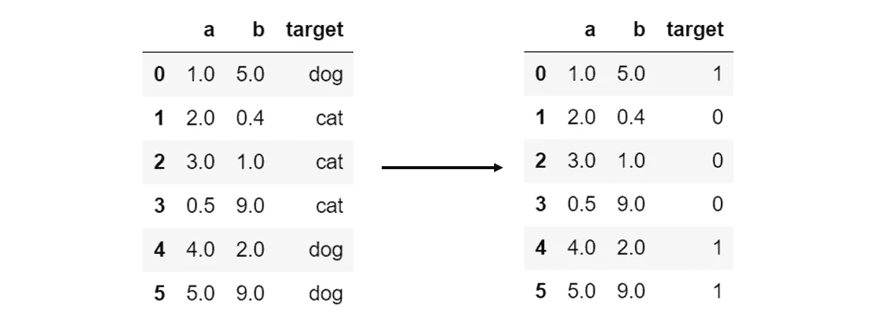
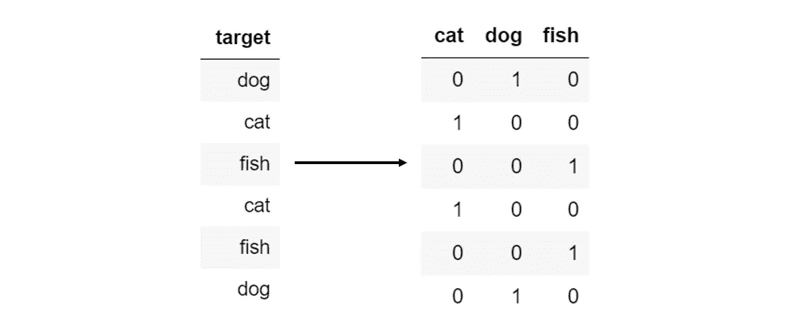
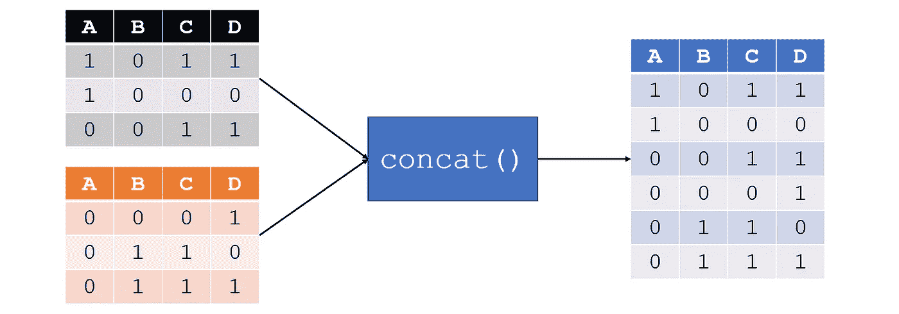
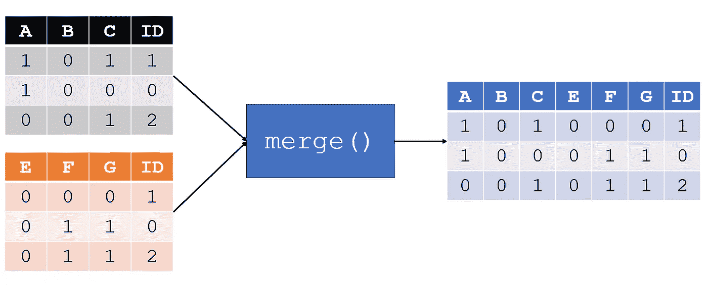
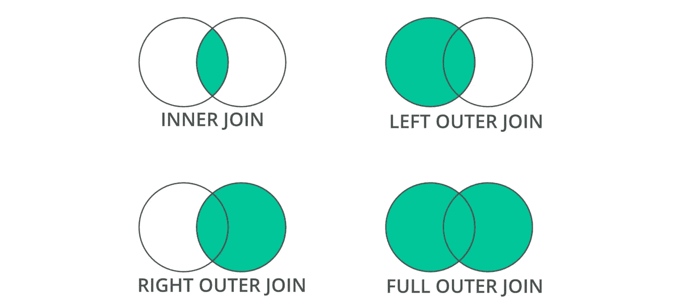

# 您的终极数据操作和清理备忘单

> 原文：<https://towardsdatascience.com/your-ultimate-data-manipulation-cleaning-cheat-sheet-731f3b14a0be?source=collection_archive---------24----------------------->


资料来源:Unsplash。

## 解析日期、输入、异常检测等等

数据科学项目的大部分由数据清理和操作组成。这些数据清理任务中的大多数可以分为六个方面:

*   **输入缺失值。**标准统计常数估算，KNN 估算。
*   **异常值/异常检测。**隔离森林，一类 SVM，局部离群因子离群检测算法。
*   **X 变量清洗方法。**应用自定义函数，删除重复项，替换值。
*   **Y 变量清洗方法。**标签编码，字典映射，一键编码。
*   **连接数据帧**。连接、合并和连接。
*   **解析日期。**自动格式检测字符串到日期时间的转换，日期时间对象到数字。

> 除非另有明确说明，否则图片由作者创作。

# 输入缺失值

缺失值经常困扰着数据，如果它们不太多，它们可以被估算(填充)。

**简单的输入方法**是统计常数测量，如用每列的统计测量值填充`NaN`(缺失值)的平均值或中值。参数`strategy`可以替换为‘均值’，‘中值’，‘最频繁’(模式)，或‘常数’(带参数`fill_value`的手动值)。

```
from sklearn.impute import SimpleImputer
imputer = SimpleImputer(strategy='mean')
data = imputer.fit_transform(data)
```

**KNN 输入**是输入缺失值的最流行和最复杂的方法，其中 KNN 算法在多维空间中寻找与缺失值相似的其他数据点。

```
from sklearn.impute import KNNImputer
imputer = KNNImputer()
data = imputer.fit_transform(data)
```

在使用 KNN 和其他基于距离的算法之前，需要对数据进行[缩放或归一化](https://medium.com/analytics-vidhya/your-ultimate-data-mining-machine-learning-cheat-sheet-9fce3fa16)以消除缩放差异(例如，一列代表孩子数量，另一列代表年薪——这些值不能从表面上看)。使用 KNN 估算遵循以下过程:

1.  缩放/标准化数据。
2.  KNN-用于填充缺失值的估算。
3.  反向缩放/归一化数据。

# 异常值/异常检测

**隔离森林**是返回样本异常分值的算法。该算法通过随机选择一个要素、随机选择一个分割值来创建路径，从而隔离观察值，路径长度表示其正态性。较短的路径代表异常-当随机树的森林共同为特定样本产生较短的路径长度时，它们极有可能是异常。

```
from sklearn.ensemble import IsolationForest
identifier = IsolationForest().fit(X)
identifier.predict(X)
```

异常检测器的预测输出是从-1 到 1 的分数数组，正分数表示异常的可能性较高。

**一类 SVM** 是另一种用于检测异常值的无监督方法，适用于像隔离森林这样的异常检测方法会产生太多差异的高维分布。

```
from sklearn.svm import OneClassSVM
identifier = OneClassSVM().fit(X)
identifier.predict(X)
```

**局部异常值因子**是三种常用异常值标识符中的第三种。每个样本的异常值(局部异常值因子)衡量给定样本相对于其相邻样本的局部密度偏差。基于 K-最近邻，密度显著低于其邻的样本被认为是异常值。

因为这种算法是基于距离的，所以在使用之前需要对数据进行缩放或归一化。该算法可被视为隔离森林的非线性高方差替代方案。

```
from sklearn.neighbors import LocalOutlierFactor
model = LocalOutlierFactor().fit(X)
model.predict(X)
```

对于所有三种异常算法，消除所有异常是数据科学家的选择。确保异常不仅仅是数据集群本身——确保异常的数量不会过多。PCA 可视化可以证实这一点。

# x 变量清洁方法

**对列应用函数**经常需要对其进行清理。在内置函数无法完成清理的情况下，您可能需要编写自己的函数或传入外部内置函数。例如，假设 2 下面的列`b`的所有值都是无效的。然后，要应用的函数可以充当过滤器，为没有通过过滤器的列元素返回`NaN`值:

```
def filter_b(value):
     if value < 2:
          return np.nan
     else:
          return value
```

然后，通过使用熊猫的`.apply()`函数应用过滤器，可以创建一个新的已清理列‘cleaned _ b’:

```
data['cleaned_b'] = data['b'].apply(filter_b)
```



另一个常见的用例是转换数据类型。例如，将字符串列转换成数字列可以通过使用 Python 内置函数`float`的`data[‘target’].apply(float)`来完成。

**删除重复**是数据清理中的常见任务。这可以用`data.drop_duplicates()`来完成，它删除具有完全相同值的行。使用时要小心-当要素数量较少时，重复行可能不是数据收集中的错误。但是，对于大型数据集和大多数连续变量，重复项不是错误的可能性很小。

**数据点采样**在数据集过大(或出于其他目的)且数据点需要随机采样时很常见。这可以用`data.sample(number_of_samples)`来完成。

**重命名列**是通过`.rename`完成的，这里传递的参数是一个字典，其中键是原始列名，值是重命名的值。例如，`data.rename({‘a’:1, ‘b’:3})`会将列`‘a’`重命名为 1，将列`‘b’`重命名为 3。

**替换数据中的值**可以通过`data.replace()`来完成，它接受两个参数`to_replace`和`value`，这两个参数代表数据帧中将被其他值替换的值。这对于下一节输入缺失值很有帮助，可以用`np.nan`替换某些变量，这样输入算法就可以识别它们。

更方便的专门用于数据操作的熊猫函数可以在这里找到:

[](/7-pandas-functions-to-reduce-your-data-manipulation-stress-25981e44cc7d) [## 7 熊猫功能减轻您的数据操作压力

### 熊猫没有白毛是有原因的

towardsdatascience.com](/7-pandas-functions-to-reduce-your-data-manipulation-stress-25981e44cc7d) 

# y 变量清洗方法

**分类 *y* 变量需要标签编码**。例如，如果数据有两个类别“猫”和“狗”，它们需要映射到 0 和 1，因为机器学习算法纯粹基于数学运算。

一种简单的方法是使用`.map()`函数，它采用一个字典，其中键是原始类名，值是它们要被替换的元素。

```
data['target'] = data['target'].map({'cat':0, 'dog':1})
```



然而，如果有太多的类不能用字典手动映射，`sklearn`有一个自动化的方法:

```
from sklearn.preprocessing import LabelEncoder
encoder = LabelEncoder().fit(data['target'])
data['target'] = encoder.transform(data['target'])
```

使用这种标签编码方法的好处是可以使用`encoder.inverse_transform(array)`对数据进行逆转换——也就是从数值到原始类的转换。

**当标签编码对数据进行量化测量时，在具有多个类别的特定场景中，一键编码**优于标签编码。类别“狗”、“猫”和“鱼”之间的标签编码为 0、1 和 2，假设不知何故“鱼”比“狗”大或者“狗”比“猫”小。

在 one-hot 编码中，每个*y*-值是一个向量，其长度为不同类的数量，其中“1”表示向量中的唯一索引，其余值标有“0”。例如，可以将向量`[1, 0, 0]`、【猫】分配给`[0, 1, 0]`、【鱼】分配给`[0, 0, 1]`。

`pandas`有一个内置函数`get_dummies`，它自动接受一个序列或另一个数组形式，并输出一位热码编码数据帧。比如下面这个命令`pd.get_dummies(data[‘target’]`。



# 连接数据框架

**串联**是数据帧的自顶向下连接。例如，`pd.concat([df1, df2])`将产生一个主数据帧，其中`df2`堆叠在`df1`下方。



**合并**是一个从左到右的过程，横向合并两个数据帧，而不是用`concat()`纵向合并。例如，`pd.merge(left_df, right_df, on='ID')`将基于`‘ID’`列合并左数据帧和右数据帧。



**加入**允许更专业的合并。默认情况下，合并是一个*内部连接*，它只适合关键字在两个数据框中的行。其他类型的连接包括*左外部连接*，其中包括左数据帧中的所有关键字，只有当其关键字存在于左数据帧中时，才包括右数据帧中的行。



可在`merge`内的参数`how=”outer”`或`“right”`中概述选择的连接类型:

```
pd.merge(left = left_df, right = right_df, how = 'outer', on = 'id')
```

# 解析日期

日期可能是最难处理的数据对象，但对数据来说也是必不可少的。时间是现实生活中最重要的变量，重要的是不要让处理时间的困难影响到你的数据。

**将字符串转换成日期**是很常见的——数据集几乎从不带有可以方便访问的`datetime`对象。把字符串转换成日期最好的库是`dateutil`，可以自动推断日、月、年的位置，需要用其他库指定。

```
from dateutil import parser
```

`dateutil`可以适应多种日期，其中每个命令都产生相同的结果(`datetime.datetime(2040, 7, 3, 0, 0)`):

*   `parser.parse(‘7/3/40’)`
*   `parser.parse(‘7–3–2040’)`
*   `parser.parse(‘7.3.40’)`
*   `parser.parse(‘July 3rd, 2040’)`
*   `parser.parse(‘July 3 2040’)`
*   `parser.parse(‘2040 July 3’)`
*   `parser.parse(‘3 July 2040’)`

对一个列使用`.apply(parser.parse)`可以将几乎任何形式的字符串转换成一个`datetime`对象，在这里可以提取它的属性。

**将日期转换成数字**很重要，因为虽然时间对于模型来说是必不可少的，但它不能处理日期时间对象。相反，时间可以表示为整数，其中每个日期表示自数据中最早的日期以来经过的天数。在下面的示例中，2016 年 3 月 8 日是数据集中最早的日期(这需要找到并替换)。

```
import datetime
def convert_date_to_num(date):
     return (date - datetime.datetime(5,8,16)).daysdata['number date'] = data['date'].apply(convert_date_to_num)
```

使用`.apply()`将该函数应用于日期列(假设日期列的元素是`datetime`对象)。

# 感谢阅读！

如果你觉得有帮助的话，一定要把这个页面加入书签，以便于参考。如果您喜欢，您可能还会喜欢其他数据科学备忘单:

[](https://medium.com/@andre_ye/your-ultimate-data-science-statistics-mathematics-cheat-sheet-d688a48ad3db) [## 你的终极数据科学统计和数学小抄

### 机器学习指标、统计指标等

medium.com](https://medium.com/@andre_ye/your-ultimate-data-science-statistics-mathematics-cheat-sheet-d688a48ad3db) [](https://medium.com/analytics-vidhya/your-ultimate-data-mining-machine-learning-cheat-sheet-9fce3fa16) [## 您的终极数据挖掘和机器学习备忘单

### 特性重要性、分解、转换等

medium.com](https://medium.com/analytics-vidhya/your-ultimate-data-mining-machine-learning-cheat-sheet-9fce3fa16) [](https://medium.com/analytics-vidhya/your-ultimate-python-visualization-cheat-sheet-663318470db) [## 您的最终 Python 可视化备忘单

### 这个备忘单包含了你最常需要的一个情节的要素，以一种清晰和有组织的方式，用…

medium.com](https://medium.com/analytics-vidhya/your-ultimate-python-visualization-cheat-sheet-663318470db)