# 您的终极数据挖掘和机器学习备忘单

> 原文：<https://towardsdatascience.com/your-ultimate-data-mining-machine-learning-cheat-sheet-9fce3fa16?source=collection_archive---------4----------------------->

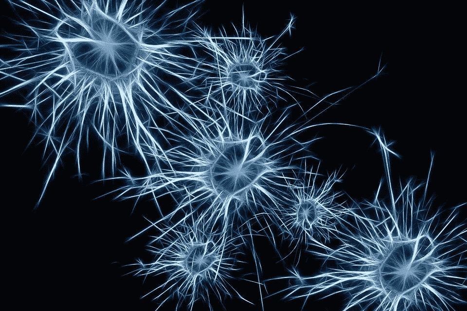

来源: [Pixabay](https://pixabay.com/illustrations/neurons-brain-cells-brain-structure-1773922/) 。

## 特性重要性、分解、转换等

本备忘单将涵盖数据挖掘和机器学习的几个领域:

*   **预测建模。**用于监督学习(预测)的回归和分类算法，用于评估模型性能的度量。
*   **聚类。**将无标签数据分组为聚类的方法:K-Means，选择基于客观度量的聚类数。
*   **降维。**降低数据和属性维数的方法:PCA 和 LDA。
*   **特征重要性。**寻找数据集中最重要特征的方法:排列重要性、SHAP 值、部分相关图。
*   **数据转换。**转换数据以获得更大预测能力、更容易分析或揭示隐藏关系和模式的方法:标准化、规范化、box-cox 转换。

# 预测建模

**训练-测试-分割**是测试一个模型表现如何的重要部分，通过在指定的训练数据上训练它，并在指定的测试数据上测试它。通过这种方式，可以衡量模型归纳新数据的能力。在`sklearn`中，两个列表、熊猫数据帧或 NumPy 数组都在`X`和`y`参数中被接受。

```
from sklearn.model_selection import train_test_split
X_train,X_test,y_train,y_test = train_test_split(X,y,test_size=0.3)
```

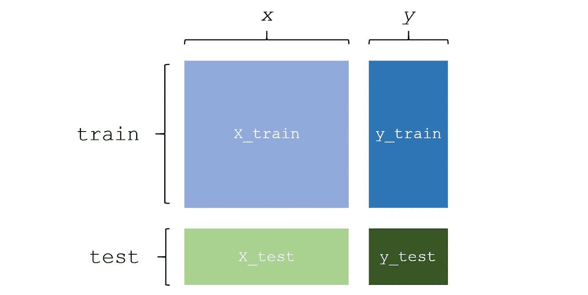

**训练一个标准的监督学习模型**采取导入、创建实例和拟合模型的形式。

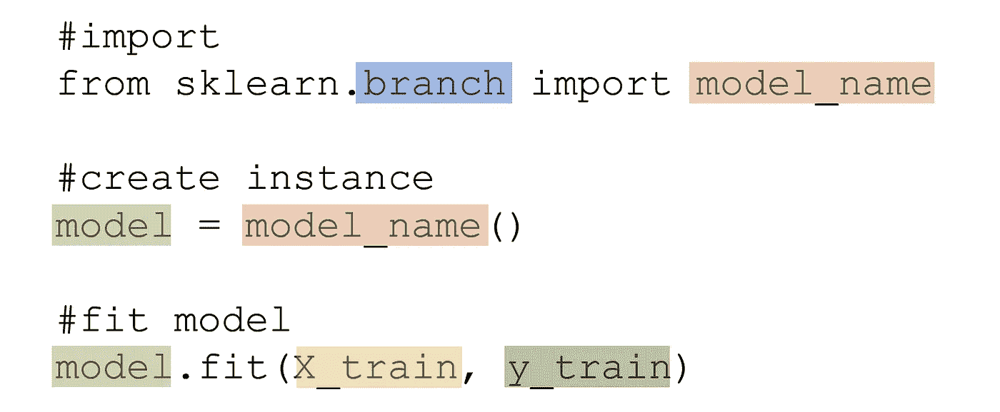

`**sklearn**` **分类器型号**如下所示，分支用蓝色突出显示，型号名称用橙色显示。

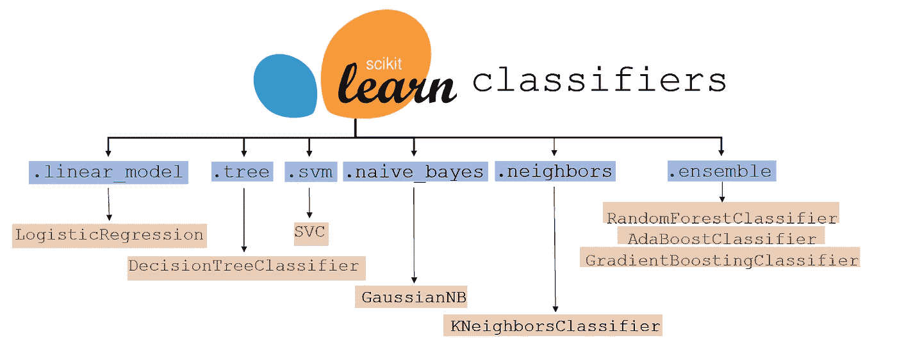

`**sklearn**` **回归器模型**如下所示，分支用蓝色突出显示，模型名称用橙色显示。


**评估模型性能**通过以下形式的列车测试数据完成:

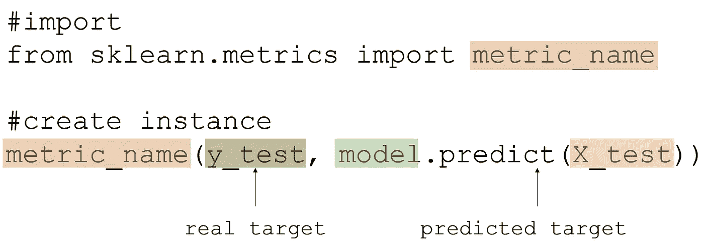

`**sklearn**` **下面列出了分类和回归的指标**，最常用的指标用绿色标出。在某些情况下，许多灰色指标比绿色指标更合适。每一种都有自己的优点和缺点，平衡优先级比较、可解释性和其他因素。

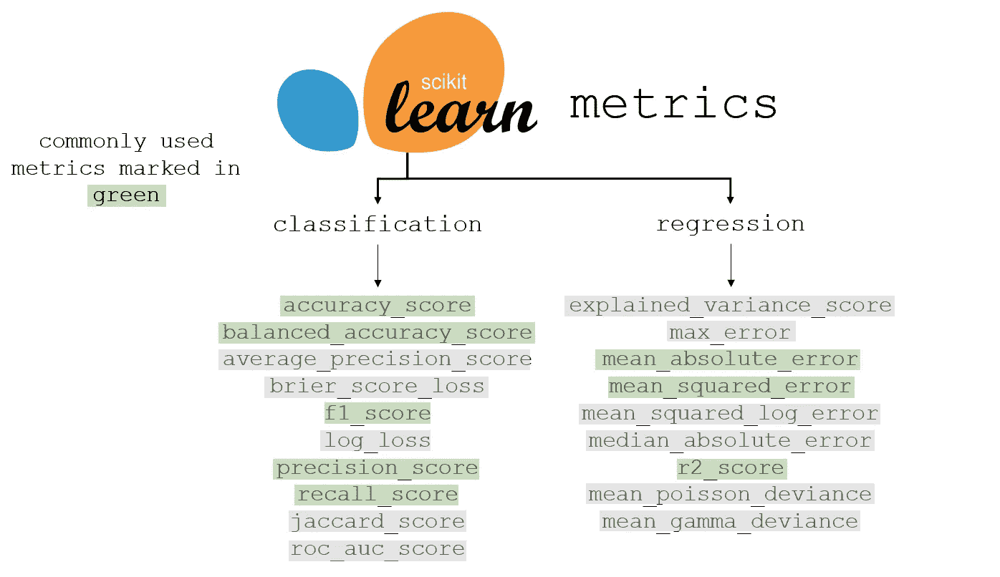

# 使聚集

在聚类之前，需要对数据进行标准化(这方面的信息可以在数据转换一节中找到)。聚类是基于点距离创建聚类的过程。


[来源](https://i.imgur.com/S65Sk9c.jpg)。图片免费分享。

**训练和创建 K-Means 聚类模型**创建一个可以聚类和检索关于聚类数据的信息的模型。

```
from sklearn.cluster import KMeans
model = KMeans(n_clusters = number_of_clusters)
model.fit(X)
```

**访问数据中每个数据点的标签**可以通过:

```
model.labels_
```

类似地，每个数据点的标签可以存储在一列数据中，其中:

```
data['Label'] = model.labels_
```

**访问新数据的簇标签**可通过以下命令完成。`new_data`可以是数组、列表或数据帧的形式。

```
data.predict(new_data)
```

**访问每个聚类的聚类中心**以二维数组的形式返回:

```
data.cluster_centers_
```

为了**找到聚类的最佳数量**，使用剪影得分，这是一个衡量特定数量的聚类与数据拟合程度的指标。对于预定义范围内的每个聚类数，训练 K-Means 聚类算法，并将其轮廓分数保存到列表中(`scores`)。`data`是模型被训练的`x`。

```
from sklearn.metrics import silhouette_scorescores = []
for cluster_num in range(lower_bound, upper_bound):
     model = KMeans(n_clusters=cluster_num)
     model.fit(data)
     score = silhouette_score(data, model.predict(data))
```

分数保存到列表`scores`后，可以用图表显示或通过计算搜索找到最高的分数。

# 降维

降维是用减少的维数表达高维数据的过程，使得每个维数包含最多的信息。降维可用于高维数据的可视化，或通过移除低信息或相关特征来加速机器学习模型。

**主成分分析**或 PCA 是一种流行的方法，通过在特征空间中绘制几个正交(垂直)向量来表示减少的维数，从而减少数据的维数。变量`number`表示缩减后的数据将具有的维数。例如，在可视化的情况下，它将是二维的。

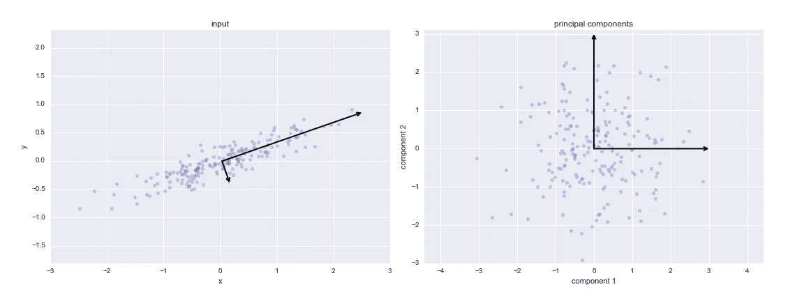

PCA 工作原理的可视化演示。[来源](https://jakevdp.github.io/PythonDataScienceHandbook/figures/05.09-PCA-rotation.png)

**拟合 PCA 模型**:函数`.fit_transform`自动将模型与数据拟合，并将其转换为减少的维数。

```
from sklearn.decomposition import PCAmodel = PCA(n_components=number)
data = model.fit_transform(data)
```

**解释差异率**:调用`model.explained_variance_ratio_`会产生一个列表，列表中的每一项都对应该维度的“解释差异率”，本质上就是该维度所代表的原始数据中的信息百分比。解释的方差比之和是保留在降维数据中的信息的总百分比。

**PCA 特征权重**:在 PCA 中，每个新创建的特征都是以前数据特征的线性组合。这些线性权重可以通过`model.components_`访问，并且是特征重要性的良好指示器(较高的线性权重表示该特征中表示的信息更多)。

**线性判别分析** (LDA，不要和潜在的狄利克雷分配混淆)是另一种降维方法。LDA 和 PCA 的主要区别在于 LDA 是一种监督算法，这意味着它同时考虑了 *x* 和 *y* 。主成分分析只考虑 *x* ，因此是一种无监督算法。

PCA 试图完全基于点与点之间的距离来保持数据的结构(方差),而 LDA 优先考虑类的清晰分离。

```
from sklearn.decomposition import LatentDirichletAllocation
lda = LatentDirichletAllocation(n_components = number)
transformed = lda.fit_transform(X, y)
```

# 特征重要性

特征重要性是找到对目标最重要的特征的过程。通过主成分分析，可以找到包含最多信息的特征，但是特征重要性涉及特征对目标的影响。“重要”特征的变化会对 *y* 变量产生很大影响，而“不重要”特征的变化对 *y* 变量几乎没有影响。

**排列重要性**是评价一个特征有多重要的方法。训练了几个模型，每个模型都缺少一列。由于缺少数据而导致的模型准确性的相应降低表明了该列对模型预测能力的重要性。`eli5`库用于排列重要性。

```
import eli5
from eli5.sklearn import PermutationImportance
model = PermutationImportance(model)
model.fit(X,y)
eli5.show_weights(model, feature_names = X.columns.tolist())
```


在这个排列重要性模型被训练的数据中，列`lat`对目标变量(在这个例子中是房价)具有最大的影响。为了获得最佳预测性能，在决定移除模型中的哪些要素(实际上混淆模型的相关或冗余要素，由负的置换重要性值标记)时，置换重要性是最佳的使用要素。

**SHAP** 是另一种评估功能重要性的方法，借用 21 点中的博弈论原理来估算玩家能贡献多少价值。与排列重要性不同，**SH**apley**A**d active Ex**P**lanation 使用更公式化和基于计算的方法来评估特性重要性。SHAP 需要一个基于树的模型(决策树，随机森林)，并适应回归和分类。

```
import shap
explainer = shap.TreeExplainer(model)
shap_values = explainer.shap_values(X)
shap.summary_plot(shap_values, X, plot_type="bar")
```

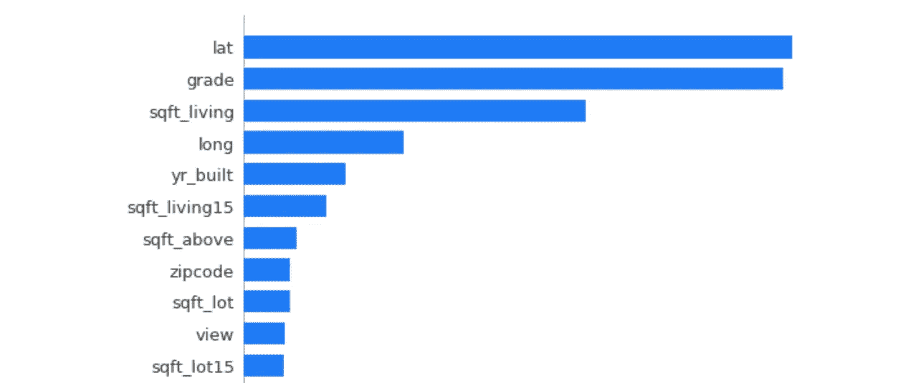

**PD(P)图**或部分相关图是数据挖掘和分析中的主要内容，显示一个特征的某些值如何影响目标变量的变化。所需的导入包括依赖图的`pdpbox`和显示图的`matplotlib`。

```
from pdpbox import pdp, info_plots
import matplotlib.pyplot as plt
```

**隔离的 PDP**:下面的代码显示了部分依赖图，其中`feat_name`是`X`内将被隔离并与目标变量进行比较的特征。第二行代码保存数据，而第三行构建画布来显示绘图。

```
feat_name = 'sqft_living'
pdp_dist = pdp.pdp_isolate(model=model, 
                           dataset=X, 
                           model_features=X.columns,
                           feature=feat_name)
pdp.pdp_plot(pdp_dist, feat_name)
plt.show()
```

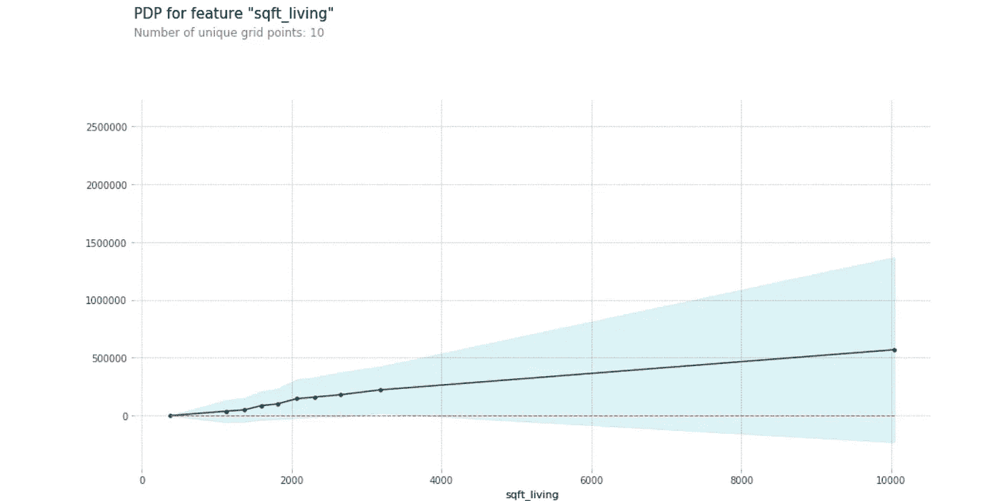

部分相关图显示了某些价值和居住空间平方英尺数的变化对房价的影响。阴影区域代表置信区间。

**等高线 PDP**:部分相关图也可以采用等高线图的形式，比较的不是一个孤立变量，而是两个孤立变量之间的关系。要比较的两个特征存储在变量`compared_features`中。

```
compared_features = ['sqft_living', 'grade']inter = pdp.pdp_interact(model=model, 
                          dataset=X, 
                          model_features=X.columns, 
                          features=compared_features)
pdp.pdp_interact_plot(pdp_interact_out=inter,
                      feature_names=compared_features),
                      plot_type='contour')
plt.show()
```

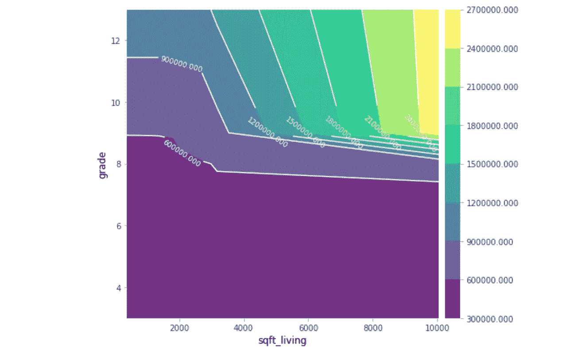

两个特性之间的关系显示了只考虑这两个特性时对应的价格。部分相关图充满了数据分析和发现，但是要注意大的置信区间。

# 数据转换

**标准化或缩放**是“重塑”数据的过程，使其包含相同的信息，但平均值为 0，方差为 1。通过缩放数据，算法的数学本质通常可以更好地处理数据。

```
from sklearn.preprocessing import StandardScaler
scaler = StandardScaler()
scaler.fit(data)
transformed_data = scaler.transform(data)
```

`transformed_data`是标准化的，可用于许多基于距离的算法，如支持向量机和 K-最近邻算法。使用标准化数据的算法的结果需要被“去标准化”,以便它们可以被正确地解释。`.inverse_transform()`可用于执行与标准变换相反的操作。

```
data = scaler.inverse_transform(output_data)
```

标准化数据将数据放在 0 到 1 的范围内，类似于标准化数据，使数据在数学上更容易用于模型。

```
from sklearn.preprocessing import Normalizer
normalize = Normalizer()
transformed_data = normalize.fit_transform(data)
```

虽然规范化不会像标准化那样改变数据的形状，但它限制了数据的边界。是否规范化或标准化数据取决于算法和上下文。

**Box-cox 变换**涉及对数据进行各种幂次变换。Box-cox 变换可以规范化数据，使其更加线性，或者降低复杂性。这些转换不仅涉及到数据的幂，还涉及到分数幂(平方根)和对数。

例如，考虑沿着函数 *g* ( *x* )的数据点。通过应用对数 box-cox 变换，可以容易地用线性回归对数据建模。

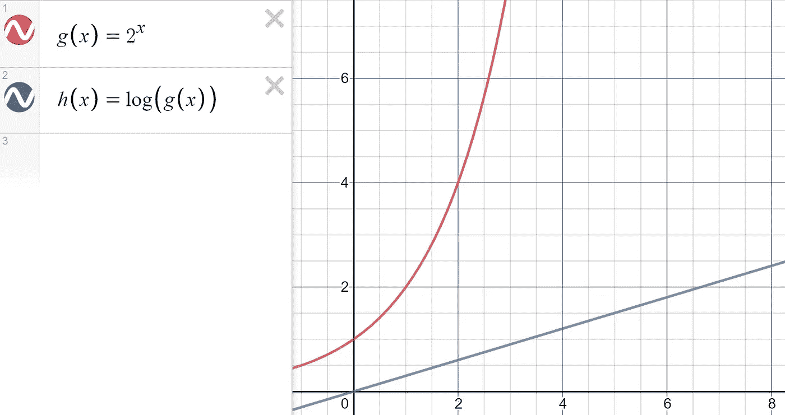

和德斯莫斯一起创造的。

`sklearn`自动确定应用于数据的最佳 box-cox 变换系列，使其更接近正态分布。

```
from sklearn.preprocessing import PowerTransformer
transformer = PowerTransformer(method='box-cox')
transformed_data = transformer.fit_transform(data)
```

由于 box-cox 变换平方根的性质，box-cox 变换的数据必须是严格正的(在 hand 可以处理这一点之前对数据进行归一化)。对于具有负数据点和正数据点的数据，通过类似的方法设置`method = ‘yeo-johnson’`,使数据更接近钟形曲线。

# 感谢阅读！

如果你觉得有帮助的话，一定要把这一页加入书签以便参考。通常，数据挖掘和分析需要可视化——请随意查看另一个可视化备忘单。当您创建可视化和执行机器学习操作时，您可能想看看数据操作和清理备忘单。

[](https://medium.com/@andre_ye/your-ultimate-data-science-statistics-mathematics-cheat-sheet-d688a48ad3db) [## 你的终极数据科学统计和数学小抄

### 机器学习指标、统计指标等

medium.com](https://medium.com/@andre_ye/your-ultimate-data-science-statistics-mathematics-cheat-sheet-d688a48ad3db) [](https://medium.com/analytics-vidhya/your-ultimate-python-visualization-cheat-sheet-663318470db) [## 您的最终 Python 可视化备忘单

### 这个备忘单包含了你最常需要的一个情节的要素，以一种清晰和有组织的方式，用…

medium.com](https://medium.com/analytics-vidhya/your-ultimate-python-visualization-cheat-sheet-663318470db) [](https://medium.com/@andre_ye/your-ultimate-data-manipulation-cleaning-cheat-sheet-731f3b14a0be) [## 您的终极数据操作和清理备忘单

### 解析日期、输入、异常检测等等

medium.com](https://medium.com/@andre_ye/your-ultimate-data-manipulation-cleaning-cheat-sheet-731f3b14a0be)