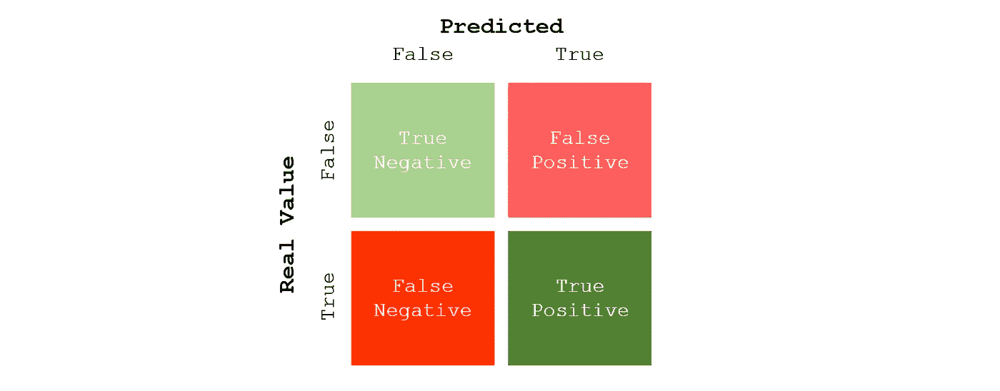
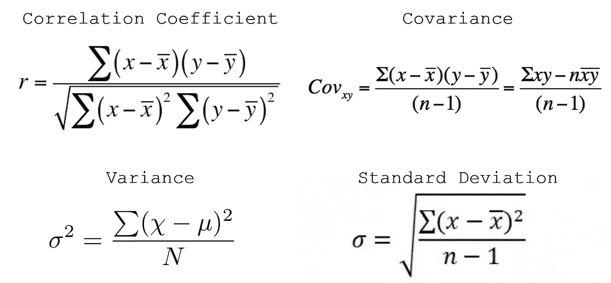

# 你的终极数据科学统计和数学小抄

> 原文：<https://towardsdatascience.com/your-ultimate-data-science-statistics-mathematics-cheat-sheet-d688a48ad3db?source=collection_archive---------19----------------------->


皮沙贝

## 机器学习指标、统计指标等

> 除非另有说明，所有图片均由作者创作。

在数据科学中，对数据的统计学和数学有一个坚实的理解对于正确有效地应用和解释机器学习方法是至关重要的。

*   **分类器指标。**混淆矩阵，灵敏度，召回率，特异性，精确度，F1 得分。它们是什么，何时使用，如何实现。
*   **回归量指标。MAE，MSE，RMSE，MSLE，R .他们是什么，何时使用，如何实现。**
*   **统计指标。**相关系数，协方差，方差，标准差。如何使用和解释它们。
*   **分布类型。**最常见的三种分布，如何识别。

# 分类器度量

分类器指标是用于评估机器学习分类器性能的指标，这些分类器是将每个训练样本归入几个离散类别之一的模型。



**混淆矩阵**是用于表示分类器对标签的预测的矩阵。它包含四个单元格，每个单元格对应于一个预测真或假和一个实际真或假的组合。许多分类器指标都是基于混淆矩阵的，所以在头脑中保存一个混淆矩阵的图像是有帮助的。

**灵敏度/召回率**是被准确预测的阳性数量。这被计算为`TP/(TP+FN)`(注意，假阴性就是阳性)。在正确预测阳性很重要的情况下，如医疗诊断，灵敏度是一个很好的指标。在某些情况下，假阳性可能是危险的，但人们普遍认为假阴性(例如，对患有癌症的人诊断为“没有癌症”)更致命。通过让模型最大限度地提高灵敏度，可以确定正确分类的优先级。

**特异性**是准确预测的阴性数，计算为`TN/(TN+FP)`(注意假阳性其实是阴性)。与敏感性一样，特异性在准确分类阴性比分类阳性更重要的情况下也是一个有用的指标。

**精度**可以被认为是敏感度或回忆的反义词，因为敏感度衡量的是预测为真的实际真实观察值的比例，而精度衡量的是预测真实观察值实际为真的比例。这被测量为`TP/(TP+FP)`。精度和召回一起提供了模型性能的全面视图。


**F1 得分**通过调和平均值结合了精确度和召回率。它的确切公式是`(2 × precision × recall) / (precision + recall)` **。**使用调和平均值是因为它惩罚更多的极值，与平均值相反，平均值是天真的，因为它对所有误差的加权都是一样的。

**检测/准确率**是正确分类的项目数量，计算方法为真阳性和真阴性的总和除以所有四个混淆矩阵象限的总和。这种准确率对积极因素和消极因素的权重是相等的，而不是优先考虑一个因素。

**使用 F1 得分与准确性:**当不犯错更重要时(假阳性和假阴性受到更重的惩罚)，应该使用 F1 得分，而当模型的目标是优化性能时，应该使用准确性。这两个指标都是基于上下文使用的，并且根据数据表现不同。然而，一般来说，对于不平衡的类别(例如，癌症诊断，当阴性远远多于阳性时)，F1 分数更好，而对于更平衡的类别，准确性更好。

**实施指标**遵循以下格式。


在`sklearn`中讨论的指标名称有:

*   混乱矩阵:`confusion_matrix`
*   灵敏度/召回:`recall_score`
*   精度:`precision_score`
*   F1 得分:`f1_score`
*   准确度:`accuracy_score`
*   平衡精度(对于非均匀分布的类):`balanced_accuracy_score`

# 回归指标

回归度量用于度量模型在连续规模上放置训练示例的效果，例如确定房屋的价格。

**平均绝对误差(MAE)** 也许是最常见和最易解释的回归指标。MAE 计算每个数据点的预测 *y* 值和实际 *y* 值之间的差值，然后对每个差值进行平均(差值计算为一个值减去另一个值的绝对值)。

**中值绝对误差**是评估平均误差的另一个指标。虽然它的好处是通过关注中间误差值来降低误差分布，但它也往往会忽略计入平均绝对误差的极高或极低误差。

**均方差(MSE)** 是另一种常用的回归指标，它更多地“惩罚”较高的误差。例如，误差(差值)2 将被加权为 4，而误差 5 将被加权为 25，这意味着 MSE 发现两个误差之间的差值为 21，而 MAE 将差值加权为其表面值-3。MSE 计算每个数据点的预测 *y* 值和实际 *y* 值的平方，然后平均这些平方。

**均方根误差(RMSE)** 用于给出均方差缺乏的可解释性水平。通过对 MSE 求平方根，我们获得了与 MAE 相似的度量，因为它处于相似的尺度，同时仍然在更高的水平上加权更高的误差。

**均方对数误差(MSLE)** 是平均绝对误差的另一种常见变化。由于误差的对数性质，MSLE 只关心百分比差异。这意味着 MSLE 将把小数值(例如，4 和 3)之间的小差异视为大范围内的大差异(例如，1200 和 900)。

**R** 是一个常用的指标(其中 *r* 被称为相关系数),用于衡量回归模型在多大程度上代表了因变量方差的比例，该方差可以由自变量来解释。简而言之，这是一个很好的数据拟合回归模型的指标。

**实施指标**遵循以下格式。


`sklearn`中讨论的指标名称有:

*   平均绝对误差:`mean_absolute_error`
*   中位数绝对误差:`median_absolute_error`
*   均方差:`mean_squared_error`
*   均方根误差:`root_mean_squared_error`
*   均方对数误差:`mean_squared_log_error`
*   R : `r2_score`

# 统计指标



4 .主要数据科学统计方法。

相关性是衡量两个变量共同波动程度的统计指标。正相关意味着两个变量一起波动(一个变量的正变化是另一个变量的正变化)，而负相关意味着两个变量的变化相反(一个变量的正变化是另一个变量的负变化)。相关系数，从+1 到-1，也称为 *R* 。


相关系数可通过 Pandas 数据帧使用`.corr()`功能访问。考虑以下两个序列:

```
seq1 = [0,0.5,0.74,1.5,2.9]
seq2 = [4,4.9,8.2,8.3,12.9]
```

使用构造函数`table = pd.DataFrame({‘a’:seq1,’b’:seq2})`，创建一个包含两个序列的数据帧。调用`table.corr()`会产生一个相关表。


例如，在相关表中，序列 *A* 和 *B* 具有 0.95 的相关性。当序列与其自身比较时，相关表是对称的并且等于 1。

**协方差**类似于相关性，是当变量被线性变换时函数保持其形式的性质的量度。然而，与相关性不同的是，协方差可以是任何数字，而相关性则局限在一个范围内。因此，相关性对于确定两个变量之间关系的强度更有用。因为协方差有单位(与相关性不同)，并且受中心或比例变化的影响，所以它不太广泛地用作独立的统计数据。然而，协方差用于许多统计公式中，是一个需要了解的有用数字。

这可以用 Python 中的`numpy.cov(a,b)[0][1]`来完成，其中`a`和`b`是要比较的序列。

**方差**是随机变量与其均值的方差的期望值的度量。它非正式地测量一组数字偏离均值的程度。可以用`statistics.variance(list)`在统计库(`import statistics`)中测量方差。

**标准偏差**是方差的平方根，是一个关于分布如何展开的更大规模的统计。可以用`statistics.stdev(list)`在统计库中测量标准偏差。

# 分布类型

在处理数据分析和理解使用哪种统计和机器学习方法时，了解您的分布非常重要。


虽然有几种类型的数学专用分布，但其中大多数都适合这三种分布。

**均匀分布**是最简单的分布——它是完全平坦的，或者说是真正随机的。例如，对于 6000 次投掷中的每一次，记录的骰子落在多少个点上(从 1 到 6)将产生平坦分布，每个点数大约有 1000 次投掷。均匀分布具有有用的属性-例如，阅读盟军如何使用均匀分布的统计属性在第二次世界大战中挽救了无数生命。

[](https://medium.com/better-programming/how-data-science-gave-the-allied-forces-an-edge-in-world-war-ii-7fe92a74add5) [## 数据科学如何让盟军在二战中获得优势

### 用计算机模拟德国坦克问题

medium.com](https://medium.com/better-programming/how-data-science-gave-the-allied-forces-an-edge-in-world-war-ii-7fe92a74add5) 

**正态分布**是一种非常常见的类似曲线的分布(该分布的一个名称是“钟形曲线”)。除了在数据科学中的常见用途，它也是宇宙中大多数事物可以用智商或工资来描述的地方。它具有以下特点:

*   68%的数据在平均值的一个标准偏差内。
*   95%的数据在平均值的两个标准偏差之内。
*   99.7%的数据在平均值的三个标准偏差之内。

许多机器学习算法要求数据呈正态分布。例如，逻辑回归要求残差服从正态分布。这可以通过`residplot()`进行可视化和识别。关于该模型和其他统计模型用法的信息和示例可以在[这里](https://medium.com/analytics-vidhya/your-ultimate-python-visualization-cheat-sheet-663318470db)找到。

**泊松分布**可以认为是正态分布的推广；一种离散概率分布，表示在固定的时间或空间间隔内发生的给定数量的事件的概率，如果这些事件以已知的恒定平均速率发生，并且与上次事件后的时间无关。随着λ值的变化，泊松分布将均值向左或向右移动，从而能够创建左偏或右偏的数据。

# 感谢阅读！

如果你觉得这个备忘单很有帮助，请随意投票并为该页面添加书签以便参考。如果您喜欢这个备忘单，您可能会对在其他备忘单中应用您的统计知识感兴趣。如果你想在这个备忘单中看到更多的讨论话题，请在回复中告诉我！

[](https://medium.com/analytics-vidhya/your-ultimate-python-visualization-cheat-sheet-663318470db) [## 您的最终 Python 可视化备忘单

### 这个备忘单包含了你最常需要的一个情节的要素，以一种清晰和有组织的方式，用…

medium.com](https://medium.com/analytics-vidhya/your-ultimate-python-visualization-cheat-sheet-663318470db) [](https://medium.com/analytics-vidhya/your-ultimate-data-manipulation-cleaning-cheat-sheet-731f3b14a0be) [## 您的终极数据操作和清理备忘单

### 解析日期、输入、异常检测等等

medium.com](https://medium.com/analytics-vidhya/your-ultimate-data-manipulation-cleaning-cheat-sheet-731f3b14a0be) [](https://medium.com/analytics-vidhya/your-ultimate-data-mining-machine-learning-cheat-sheet-9fce3fa16) [## 您的终极数据挖掘和机器学习备忘单

### 特性重要性、分解、转换等

medium.com](https://medium.com/analytics-vidhya/your-ultimate-data-mining-machine-learning-cheat-sheet-9fce3fa16)