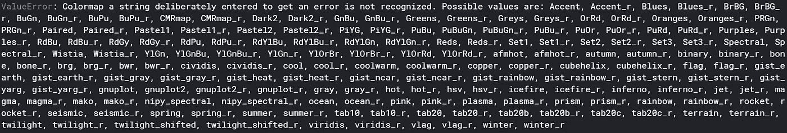
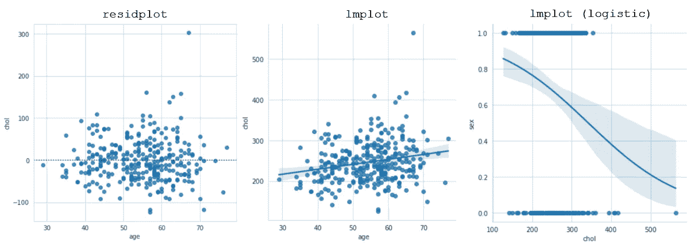

# 您的最终 Python 可视化备忘单

> 原文：<https://towardsdatascience.com/your-ultimate-python-visualization-cheat-sheet-663318470db?source=collection_archive---------9----------------------->


[来源:Pixabay](https://pixabay.com/photos/computer-summary-chart-business-767776/) 免费分享

## 轻松创建美丽的、可定制的情节

这个备忘单包含了你最常需要的一个情节的元素，以一种清晰和有组织的方式，带有代码和例子。在你创建任何情节之前，建议你浏览一下这个备忘单，以便清楚地知道你将如何构建可视化——毕竟，你的情节只有在你的脑海中，观众才会清楚。

> 除非另有明确说明，所有图片均由作者创作。

# 创建可视化的步骤

1.  根据你的图有多少维来准备数据(分布图有一维，箱线图有二维，等等。).
2.  启动图形世界(情节依赖的“世界”)美学，如风格或调色板。
3.  创造情节。
4.  使用标题、标签和附加功能自定义绘图。

# 进口

Python 绘图的两个最流行的库——matplotlib 和 seaborn——应该以它们的公共别名`plt`和`sns`加载，以便快速访问它们的函数和属性，而不需要键入它们的完整冗长的名称。

```
import matplotlib.pyplot as plt
import seaborn as sns
```

# 开创图形世界

**创建图形**是指定图形尺寸所必需的。

```
plt.figure(figsize=(horizontal_length,vertical_length))
```

**Seaborn styles** 可以给图形空间添加网格和样式。seaborn 有四种风格，可以用`.set_style`加载。

```
sns.set_style(name_of_style)
```


**Seaborn contexts** 是内置的预先创建的包，它会影响标签的大小、线条和其他元素，但不会影响整体风格。

```
sns.set_context(name_of_context)
```


所有图都有白色网格样式。这是单独设置的。

**Seaborn 调色板**为图表提供了一组颜色，这可以给你的情节提供你希望你的观众感受到的感觉或背景。

Seaborn 有几十个策划调色板。它们装载着

```
sns.set_palette(name_of_palette)
```


kde 绘图中有四个调色板。

您可以通过故意设置不正确的调色板来访问 seaborn 的许多调色板的所有名称:

```
sns.set_palette('a string deliberately entered to get an error')
```



然后可以用 seaborn 的`palpot`(调色板绘图)查看每个调色板。传递给 seaborn 的`color_palette`构建器的第一项是调色板的名称，第二项是应该显示的颜色数量。在真实剧情中，seaborn 自动确定这个数字，但是你可以在`palpot`中控制它。

```
sns.palplot(sns.color_palette('GnBu', 15))
```


Seaborn 调色板也可以通过传入十六进制代码来手动设置。

```
sns.set_palette(['#ffffff', ...])
```

# 创造情节

seaborn 中的所有绘图都是用`sns.name_of_plot(x, y)`创建的，这取决于绘图的维数。像箱线图这样的一维图只需要一个`x`，而散点图则需要一个`x`和一个`y`。

## 分布图

分布图通常是单变量数据——只有一个维度的数据，并显示数据点沿数字线的集中位置。Seaborn 对二维分布图进行了调整，可以同时显示两个分布图。


*   `distplot`用直方图绘制一维`kdeplot`。
*   `rugplot`用记号代替数据点来显示聚类。
*   仅输入一维数据时的`kdeplot`绘制分布曲线。当给定二维数据时，它将绘制出等值线图。
*   `jointplot`绘制一个散点图，每边都有直方图，以显示其各自的维度。
*   通常用于探索性数据分析(EDA)的`pairplot`绘制数据的各个维度，当变量相对于自身绘制时，显示变量的直方图。该图接收一个`pandas`数据帧。

## 定量和定性变量关系

这些图结合了两种类型的变量——定量变量(如 13、16.54、94.004、连续变量)和定性变量(如红色、蓝色、雄性、离散变量)。


*   `stripplot`水平绘制垂直数据点，以便可以看到相同值的多个数据点。这需要一个定性的`x`和一个定量的`y`。
*   `swarmplot`与`stripplot`相似，水平绘制垂直数据点，但更有条理。这以结构化的方式消除了重叠的数据点。
*   `violinplot`绘制了数量轴两侧的分布，被视为箱线图的有利替代方案。
*   `boxplot`绘制了数据的五个数字摘要——最小值、第一个四分位数(第 25 个百分位数)、中间值、第三个四分位数(第 75 个百分位数)和最大值。不幸的是，它确实有隐藏不规则分布的趋势。
*   通过在箱线图顶部展开，`boxenplot`可以显示尾部和更准确的分布描述。
*   标准`barplot`显示高度与数值相对应的条。`countplot`表示相同的可视化，但只接受一个变量，并显示每个不同值中的项目数。
*   `pointplot`试图找到一个点(用适当的误差线)来恰当地表示那个数组。该图非常适合于比较数字定性变量。

## 数量关系

这些图显示了两个定量变量之间的关系。


*   `scatterplot`描绘了两个相互对立的定量变量。
*   `lineplot`沿着时间变量绘制一个数量变量，时间变量可以是数量变量或日期变量。

## 统计模型

统计模型可视化利用统计模型来可视化数据的性质。在许多统计模型可视化中，有调整可视化性质的参数。



*   `residplot`显示线性回归的残差(每个数据点偏离欧几里德距离的线性回归拟合有多远)。
*   `lmplot`在散点图上显示带有置信区间的线性回归拟合。该图有几个参数(可在长度[中查看，此处为](http://seaborn.pydata.org/generated/seaborn.lmplot.html?highlight=lmplot#seaborn.lmplot))可用于调整图的性质。例如，设置`logistic=True`将假设 *y* 变量是二进制的，并将创建一个逻辑(sigmoid)回归模型。

# 自定义情节

创建地块后对其进行自定义涉及到在地块顶部添加特征以增加可读性或信息。

`**x**` **和** `**y**` **标签**可以用`plt.xlabel(‘X Label’)`和`plt.ylabel(‘Y Label’)`两个命令添加。

**标题标签**可以通过`plt.title(‘Title’)`命令添加。


**刻度旋转**可以加上`plt.xticks(rotation=90)`(以及 y 轴刻度标签的 yticks)，其中 90°可以替换为任何合适的旋转角度。

**轴值范围**可以用`plt.xlim(lower_limit, upper_limit)`和`plt.ylim(lower_limit, upper_limit)`指定。该尺寸显示的所有值都将在指定的限制范围内。这些也可用于为图形设置合适的 *y* 轴基线。

**添加图例**，如果默认没有，可以添加`plt.legend()`。可以添加一个参数`loc`来指示图例应该在哪里。默认情况下，`matplotlib`会找到最佳位置，这样它就不会与数据点重叠。

**显示图**和`plt.show()`一样简单。虽然不是完全必要，但它去掉了 matplotlib 和 seaborn 打印出来的一些文本，并最终确定了情节。

请务必将此页面加入书签，以便于参考！如果你喜欢，你可能还会喜欢终极数据挖掘和机器学习备忘单，在这个领域你可以很好地利用你的可视化技能，以及终极数据操作和清理备忘单-将数据转换为可视化形式所需的技能。

[](https://medium.com/@andre_ye/your-ultimate-data-science-statistics-mathematics-cheat-sheet-d688a48ad3db) [## 你的终极数据科学统计和数学小抄

### 机器学习指标、统计指标等

medium.com](https://medium.com/@andre_ye/your-ultimate-data-science-statistics-mathematics-cheat-sheet-d688a48ad3db) [](https://medium.com/@andre_ye/your-ultimate-data-mining-machine-learning-cheat-sheet-9fce3fa16) [## 您的终极数据挖掘和机器学习备忘单

### 特性重要性、分解、转换等

medium.com](https://medium.com/@andre_ye/your-ultimate-data-mining-machine-learning-cheat-sheet-9fce3fa16) [](https://medium.com/@andre_ye/your-ultimate-data-manipulation-cleaning-cheat-sheet-731f3b14a0be) [## 您的终极数据操作和清理备忘单

### 解析日期、输入、异常检测等等

medium.com](https://medium.com/@andre_ye/your-ultimate-data-manipulation-cleaning-cheat-sheet-731f3b14a0be)