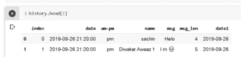
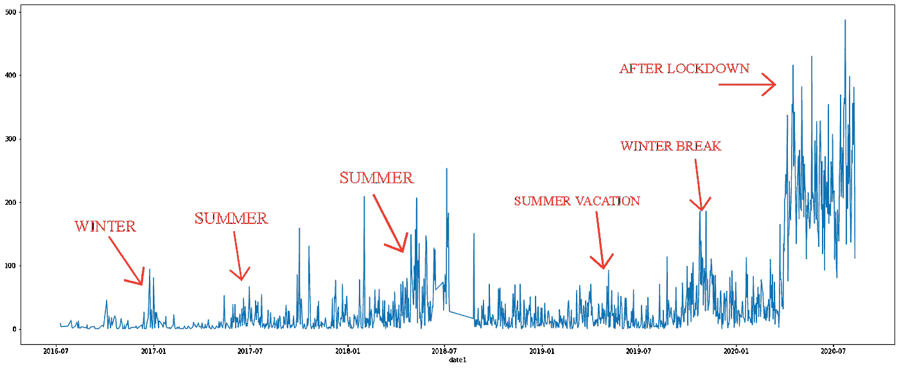
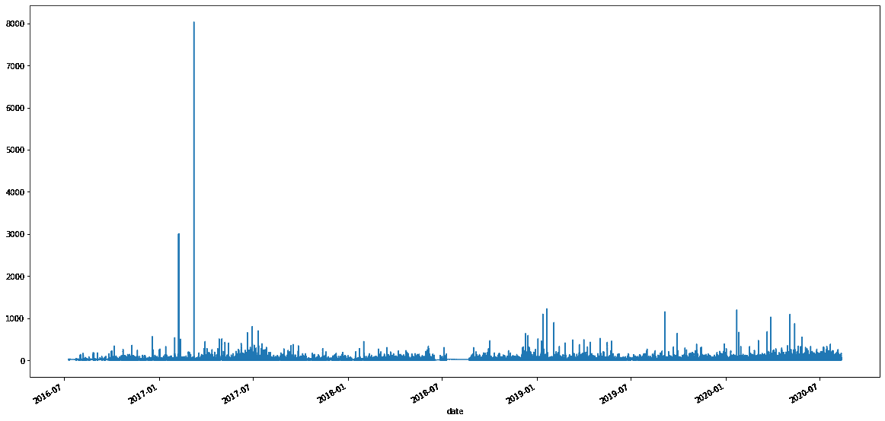
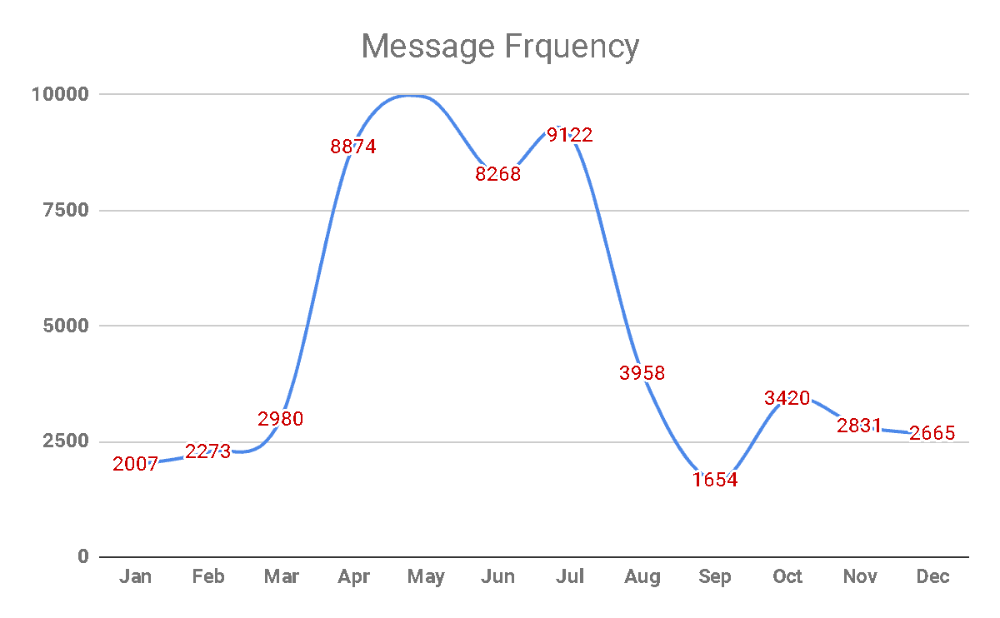
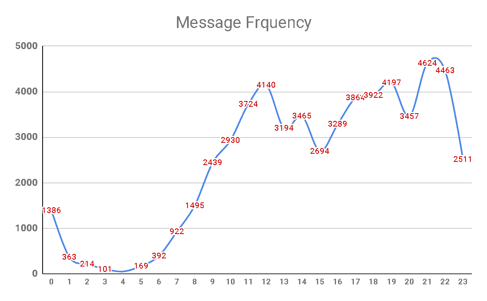
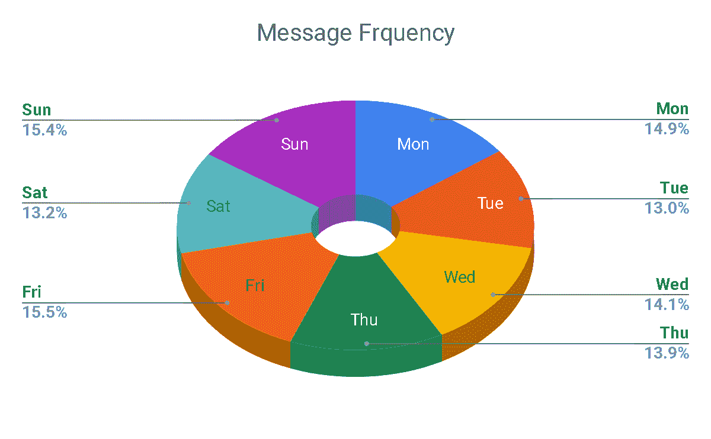
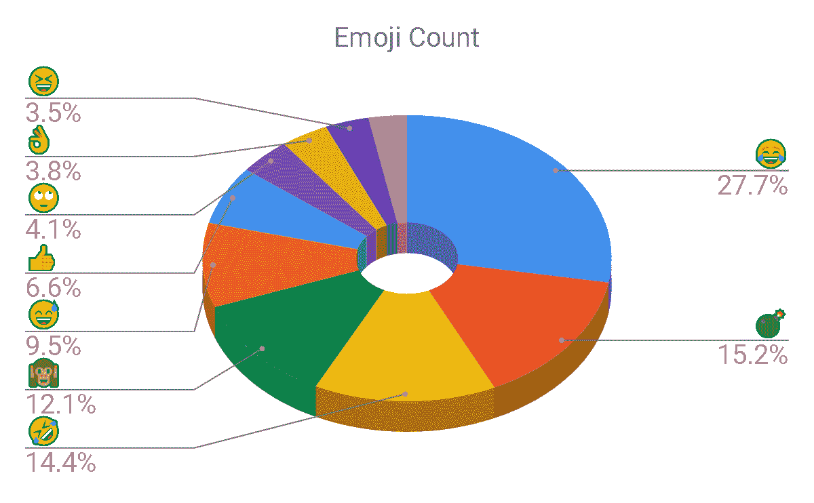

# 你在 WhatsApp 上的聊天记录可以透露很多关于你的信息

> 原文：<https://towardsdatascience.com/your-whatsapp-chats-can-tell-a-lot-about-you-3a7db37789b3?source=collection_archive---------17----------------------->

## 使用 Python 可视化 WhatsApp 聊天


威廉·艾文在 [Unsplash](https://unsplash.com?utm_source=medium&utm_medium=referral) 上的照片

最近，我在寻找一些小而令人兴奋的可视化项目来探索数据可视化领域。然后我在 WhatsApp 上发现了一个功能，可以将你的聊天记录导出到一个文本文件中，这个功能非常方便易用。Whatsapp 声称，2020 年，WhatsApp 每天发送近 650 亿条消息，即每分钟 2900 万条。

2016 年考上大学后开始频繁使用 WhatsApp，于是想到了收集并可视化自己最近四年的聊天记录。我从 WhatsApp 上获得了大约 50 个文本文件，包括与朋友和家人的个人对话，以及一些群聊。

对于对代码不感兴趣的人，您可以欣赏这些图片。对于其他人，我也上传了我的 [**GitHub**](https://github.com/sachink382/Whatsapp_chat_visualization) 资源库**中的全部代码。**

我在这个项目中使用了 **Google Colaboratory** ,以防你使用这个或其他平台，然后相应地改变文件的路径。

*更新—我在 Github 中添加了 WhatsApp 聊天的情感分析代码和话题建模代码。*

## 加载消息

文本文件中的消息格式为—{日期}、{时间}—{作者}:{消息}

*2017 年 9 月 12 日，晚上 10 点 20 分——表格:孙娜兄弟……*

纯文本文件必须以有意义的方式进行转换，才能存储在 Pandas 数据框中。我使用这个函数来获取数据帧。

```
def read(file):
    f = open('/content/drive/Drive/Whatsapp/{}'.format (file) , 'r')
    m=re.findall('(\d+/\d+/\d+,\d+:\d+\d+[\w]+)-(.*?):(.*)',
f.read())
    f.close()
    h = pd.DataFrame(m,columns=['date','am-pm','name','msg'])
    h['date']= pd.to_datetime(h['date'],format="%d/%m/%y, %I:%M%p")
    h['msg_len'] = h['msg'].str.len()
    h['date1'] = h['date'].apply(lambda x: x.date())
    return h
```

我把我所有的对话都保存在一个数据文件夹中，这样我就可以列出、加载它们，并把它们合并到一个数据框架中。

```
files = os.listdir('/content/drive/My Drive/Whatsapp')
lst = []
for file in files:
    history = read(file)
    lst.append(history)
history = pd.concat(lst).reset_index()
```

现在我们的数据帧已经准备好了，看起来像这样。



数据帧的屏幕截图

## 一些统计数据

在过去的四年里，我发了多少条信息？在过去的四年里，我和多少不同的人交谈过？

```
history_clean[history_clean['name']=='sachin']['msg'].count()
history_clean['name'].nunique()
```

就我而言，我发送了超过 58k 条信息，和超过 350 个不同的人交谈。我也检查了我的 AM-PM 信息频率 PM-43820，AM-14185。

## 数据探索


照片由[安德鲁·尼尔](https://unsplash.com/@andrewtneel?utm_source=medium&utm_medium=referral)在 [Unsplash](https://unsplash.com?utm_source=medium&utm_medium=referral) 上拍摄

这是本文最激动人心的部分—数据探索。让我们挖掘出这些数据试图告诉我们的所有迷人的故事。

```
# Create a subset of the dataframe with only messages i've sent
msg_sachin = (history_clean[history_clean['name']=='sachin'])
plt.figure(figsize=(25,8))
msg_sachin.groupby(['date1']).count()['msg'].plot()
```

这段代码将告诉我们这些年来发送的信息数量。



多年来发送的消息(由代码生成)

这个图非常令人印象深刻，因为它可以非常快速地识别出我是在家里度假还是在大学里。冠状病毒对我发短信模式的影响可以很快确定(我猜每个人都在经历同样的情况)。除此之外，几个月(5 月至 7 月和 12 月)的一些峰值可以通过我大学的暑假和寒假来证明。

我也觉得看到这些年来我的信息长度很有趣。

```
plt.figure(figsize=(25,8))
history.groupby(['date'])['msg_len'].mean().plot()
```



历年消息长度(由代码生成)

所以我试着找出那个异常值，我得到了这个-

数组([\ ' Google drive movies https://drive.google.com/drive/u/ 0/mobile/folders/0 b 6 fjkm qkynziltlwzhl 4 ajuwcfu Google drive 上的编程语言收藏— https://drive.google.com/drive/folders/0ByWO0aO1eI_ Mn 1 bed 3 vnruzenku 书籍阅读—https://drive。google.com/drive/folders/0b 09 qtt 10 aqv 1 sgx rvxbwymnis2m 书籍(小说)—https://drive.google.com/drive/folders/0B1v9Iy1jH3FXdlND[Udemy]数字营销课程全集 https://drive.google.com/drive/ folders/0b x2 vez 2n 3 qd 7s GxkejRhQmdKQlk 书籍阅读用……]

在此之后，我绘制了几个月来我的信息频率。



每月消息频率(由代码生成)

看到这种分布，我很惊讶。我想这也暗示了我在夏天经常聊天😂。



每小时消息频率(由代码生成)

下一个情节很有趣，讲述了你睡觉的时间。这是一天中几个小时的消息频率图(0 表示午夜)。这表明我不是一个夜猫子，更喜欢在 11 点或午夜后睡觉。

此外，从早上到中午，消息的数量会增加。这与一个人应该在这些时间多工作或多学习的事实相反😜。



每日消息频率(由代码生成)

接下来，我还绘制了一周中每一天的消息频率。嗯，看起来不管是周日还是周一，我每天聊天的量都差不多。

现在来看这篇文章最有趣的情节。

## 让我们画出表情符号

表情符号的完整代码在我的 GitHub 里。我用 Python 的表情库来画这个。您可以使用以下代码行安装该库

> *pip 安装表情符号—升级*



我在过去 4 年中使用的表情符号(由代码生成)

好吧，先说说我第二常用的表情符号**💣**。我通常在引用电影“Wasseypur 的帮派”中的一些对话时使用它，或者有时没有任何理由。但是我从来没有意识到我对这个表情符号如此着迷**💣**。

此外，我很高兴地看到，显然，我的生活充满了笑声，惊喜和炸弹！

作为本文的延伸，我在我的 Github 中添加了 WhatsApp 聊天的情感分析和话题建模。对 NLP 感兴趣的可以查一次。

## 结论

看起来，这种分析在回答一些问题的同时，也提出了许多可以进一步解决的新问题。

你觉得这些见解有用吗？或者你对我错过的一些有价值的见解有什么建议？请随意在下面添加您的评论。

您也可以在 [Linkedln](https://www.linkedin.com/in/sachin-kumar-iit-kharagpur/) 上添加我