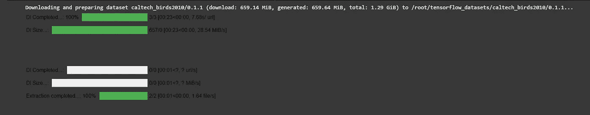
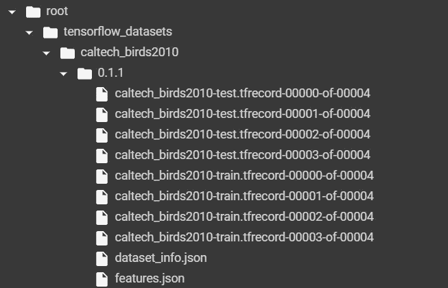
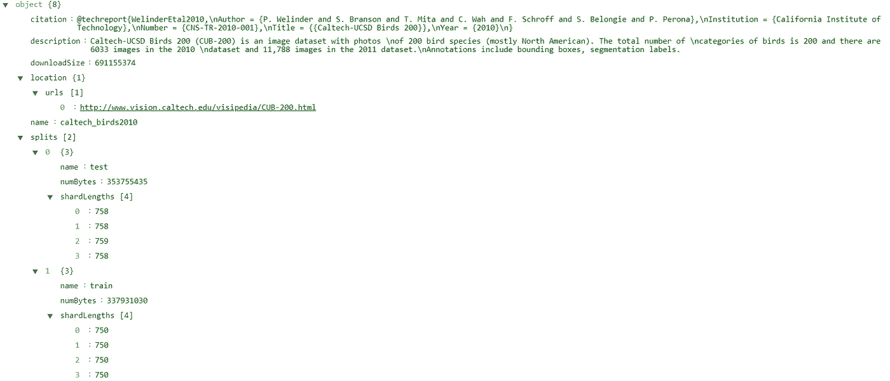
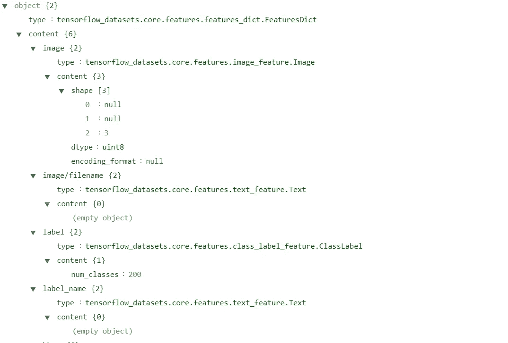

# 创建高效的数据管道

> 原文：<https://towardsdatascience.com/youre-importing-data-wrong-c171f52eea00?source=collection_archive---------14----------------------->

## 为什么您的数据管道可以快速发展

## 使用 TensorFlow 数据集和`tf.data`轻松将原始数据放入模型

来自 [Pexels](https://www.pexels.com/photo/blue-and-yellow-graph-on-stock-market-monitor-159888/?utm_content=attributionCopyText&utm_medium=referral&utm_source=pexels) 的【energepic.com】T2 的照片

## 让我们弄清楚，现有的数据集是不够的

虽然大多数机器学习程序员从 MNIST 或 CIFAR-10 等常见的开源数据集开始，这一切都很好，但要扩展你的视野，解决问题，你需要超越这些，获得自己的数据。虽然收集数据可能太难，也可能不太难，但大多数人发现很难将这些数据用于训练。这主要是因为有大量的中间步骤，如格式转换(通常用于计算机视觉)、标记化(用于 NLP)以及数据扩充、混洗等一般步骤。

为了使这一过程更容易，让我们首先了解准备数据集的过程。

# 数据管道中涉及的步骤

图片来自 [Pixabay](https://pixabay.com/?utm_source=link-attribution&amp;utm_medium=referral&amp;utm_campaign=image&amp;utm_content=1895779)

*   **选择要使用的数据集或原始数据后，从压缩格式中提取数据集。提取的数据的格式在下一步中起着重要的作用。**
*   **将您的数据转换为适合深度学习模型的格式，即转换为数字形式，并应用所需的预处理步骤，如数据扩充、洗牌和批处理。**
*   只需**将**您的数据库加载到工作区，并在您的机器学习模型中用于训练和测试。

这种 **ETL** 方法对于所有数据管道都是通用的，ML 管道也不例外。

使用单独的框架完成这些步骤可能会很乏味，这正是 **TensorFlow 数据集或 TFDS** 和`**tf.data**`模块适合的地方。让我们看看如何！

# 先决条件

## ***知识前提***

*   *熟悉 TensorFlow 或 Keras 框架，*
*   *Python 和安装库的知识。*

## 所需的库

对于代码，你将需要下面的库~

*   `tensorflow`
*   `tensorflow-datasets`

如果你使用自定义数据集，你可能还需要`pandas`和`numpy`。

# 完整的数据管道

## 收集数据

所有数据管道的前一步是收集数据，这可能很难，取决于资源的可用性。幸运的是，TFDS 确实可以帮助我们轻松快速地完成这一步。只需从 TFDS 广泛的数据集集合中选择符合您要求的数据集。注意数据集的名称、版本和分割，因为稍后我们将在**提取**步骤中使用它们。如果您已经找到合适的数据集，请跳到**提取**步骤！

 [## 张量流数据集

### 适用于音频、图像、对象检测、NLP 等广泛应用的大型数据集集合。

www.tensorflow.org](https://www.tensorflow.org/datasets/catalog/overview) 

然而，如果你想使用自定义数据集(由于没有找到一个合适的在线或其他方式)，不要担心！使用`tf.data`导入数据集非常简单！

## 从 NumPy 数组

将您的数据放入两个数组，我将它们分别命名为`features`和`labels`，并使用`tf.data.Dataset.from_tensor_slices`方法将它们转换成片。您也可以为两者制作单独的`tf.data.Dataset`对象，并在`model.fit`功能中分别输入。

## 从 CSV 文件

对于从 CSV 文件导入，只需提供文件路径和基本事实标签值所在列的名称。

## 从文本文件

使用`tf.data.TextLineDataset`可以将任何文本文件转换成数据集，这为文本数据集提供了许多选项。

如果你有任何其他格式，检查下面的链接使用它们作为数据集。

 [## tf.data:构建 TensorFlow 输入管道| TensorFlow 核心

### 通过此链接查找从输入数据创建数据集的多种方法。

www.tensorflow.org](https://www.tensorflow.org/guide/data?hl=en#reading_input_data) 

# ETC 时间！

## 合作笔记本

这里有一个 IPython 笔记本，在快速训练的合作实验室上，所有这些代码都在这里。这是一种我称之为*“动态笔记本”*的笔记本，因为它在执行大量数据集和用例方面具有多功能性。一定要去看看！

 [## TDSTFData.ipynb

### 适用于任何计算机视觉数据集的动态笔记本，现在就来看看吧！

colab.research.google.com](https://colab.research.google.com/drive/14dJXqs3nWXdeUMIwN5xVxfqYKERObWgV?usp=sharing) 

## 提取

对于那些已经从 TFDS 找到合适数据集的人来说，这一步相当简单，只需要几行代码。例如，我将使用加州理工学院 2010 年鸟类数据集对 200 个类别进行图像分类[2]。选择这个数据集是因为这个数据集中的图像大小不一致，而且我想进加州理工大学读本科😁

很简单，不是吗？

运行上述代码后，您将看到类似于上图的输出进度线…

现在，如果您转到输出中显示的目录，在我的例子`/root/tensorflow_datasets/caltech_birds2010/0.1.1`中，您将能够看到 TFRecord 文件，这是一种适用于大型数据集的高效二进制文件格式。此外，如果数据集需要，您可能会看到多个碎片。

`dataset_info.json`文件是一个有趣的文件，因为它包含了大量关于数据集的信息，如引用、描述、分割、URL 等。这对于写研究论文和阅读材料来说很方便。

`features.json`是用张量流术语描述数据集模式的文件。这允许 tfds 对 TFRecord 文件进行编码。

## 改变

这一步通常需要大量的时间和代码。当使用我们已经导入数据集的`tf.data.Dataset`类时就不是这样了！第一步是用`Dataset.map`方法快速地将图像调整到合适的大小，之后是常规的转换，最后是将标签转换成类别。

**助手功能**

*   `def resize(image, label)`将不一致的图像尺寸改变为共同的`(224,224,3)`。

*   `def one_hot(image, label)`将标签转换成分类形式。

**转换**

代码中完成的预处理步骤是~

*   使用`resize`辅助函数调整数据集的大小，
*   通过除以 255 来归一化图像值，
*   打乱数据集，
*   批处理数据集，
*   最后，将标签转换成分类编码或一键编码。

## 创建模型

我创建了一个普通的深度 CNN，这里没有什么太花哨的…注意这里的`input_shape`。我在编译亚当优化器和分类损失。

## 加载模型

我们可以简单地在数据集上运行`model.fit`。注意我们没有为`model.fit`方法的`y`参数输入任何东西，因为`y`已经在数据集中了。我已经在图表上绘制了纪元和精确度，并最终以 h5 格式保存了模型。

# 我们完成了，谢谢你！

您刚刚使用 TensorFlow 数据集和`tf.data`训练了您自己的高效数据管道🎉

随着最先进的模型简化为几行代码，在使这些数据管道更好、更快和更通用方面还有改进的余地。随着我们的模型在速度和能力上的提高，我们需要我们的管道在这两方面都跟上。

尽管本文主要讨论了计算机视觉分类问题，但张量流数据集和 TFDS 的用途远远不止于此。

同样，您可以在 IPython 笔记本中轻松检查所有代码，我强烈建议您这样做。

非常感谢你阅读这篇文章！

参考

[1]金玛，迪耶德里克&巴，吉米。(2014).[亚当:一种随机优化的方法](https://arxiv.org/abs/1412.6980)。学习表征国际会议。

[2]韦林德 p，布兰森 s，塔米 t，华 c，施罗夫 f，贝隆吉 s，佩罗娜 p .[**加州理工** -UCSD **Birds** 200"](http://www.vision.caltech.edu/visipedia/CUB-200.html) 。加州理工学院。CNS-TR-**2010**–001。