# 你在策划错误的事情

> 原文：<https://towardsdatascience.com/youre-plotting-the-wrong-things-3914402a3653?source=collection_archive---------14----------------------->

## 更聪明的 EDA 的技巧

快，告诉我，X1 能很好地预测 Y 吗？

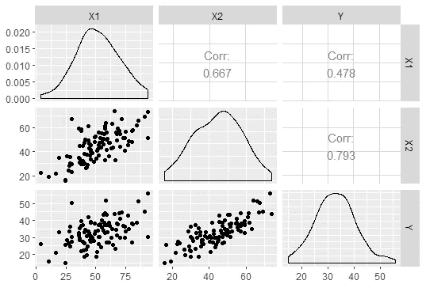

正确答案是“不知道。看情况。”如果你很肯定地回答了是/否，那么我很抱歉地说，你对统计学有一个致命的误解。X1 和 Y 之间的相关性没有告诉我们任何关于预测能力的信息。

除了检测数据质量问题之外，绘制变量之间的关系图没有什么价值。如果有什么不同的话，它会导致人们得出不必要的错误结论。然而，这是探索性数据分析中的一个常见步骤(为什么？？？).

本文将解释为什么应该跳过这一步，以及您可以做些什么。

# 因果机制

" X1 是预测 Y 的好方法吗？"含蓄地问“如果我们加上 X1，模型会试图适应随机噪声吗？”答案是否会随着其他变量的变化而变化还不太明显。Pairs plots 天真地看待两个变量，好像其他变量都不存在。

事实证明，答案取决于(通常未知的)数据生成过程，可以使用因果图来表示。下面是一个有三列的数据集的一些可能的因果图，其中 X → Y 表示“X 引起 Y”:

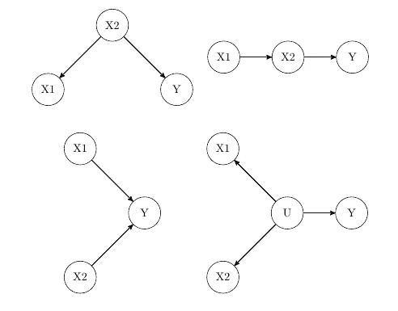

u 是未观察到的变量。还有许多其他可能的图表，但我们将用这四个作为例子。如果你想更多地了解这些图表是如何工作的，请跳到[我上一篇关于因果关系的文章](/beyond-a-b-testing-primer-on-causal-inference-d8e462d90a0b)的后三分之一。

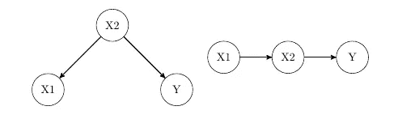

X1 作为**的预测器*只有在 X2 不在的时候*** 才有用

上面的两个因果图表明，当我们有 X2 时，X1 作为预测因子是没有用的。从 X1 到 Y 的唯一路径只有通过 X2；一旦我们知道了 X2，X1 就变成了纯噪声。然而，如果我们没有 X2，那么 X1 是一个很好的预测！

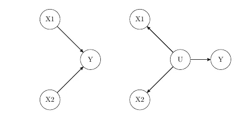

X1 作为预测值总是有用的

上面这两个因果图表明，不管 X2 如何，X1 总是一个有用的预测因子，因为从 X1 到 Y 的信息流不经过 X2。

在所有这些图的**中，X1 与 Y 相关！这种相关性没有告诉我们 X1 作为预测因子的有用性。**

多重共线性检查从因果角度看也很愚蠢；最后一张图使 X1 和 X2 相关，但两者都是有用的预测指标！

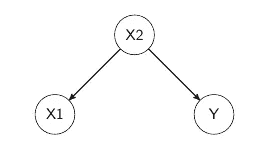

没有 X2，X1 是一个很好的预测因子，尽管没有因果关系

此外，请记住预测和因果推断是不同的任务。看这张图表。如果我们的目标是预测，那么在没有 X2 的情况下，X1 应该用来预测 Y。如果我们的目标是因果推理，那么 X1 应该**而不是**在没有 X2 的情况下使用。本文主要关注预测模型。

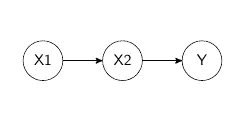

我使用上面的图表生成了数据。看看如果我回归 Y~X1 会发生什么:

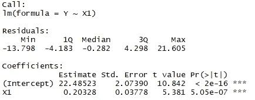

这表明 X1 是一个很好的预测因子。但是请记住，数据生成过程表明，当我们有 X2 时，X1 是无用的。在控制 X2 之后，查看 X1 中包含多少信息:

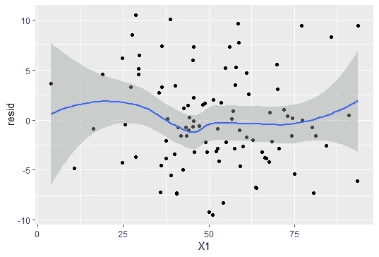

我们通过回归 Y~X2 并绘制相对于 X1 的残差来得到这个图，通常称为“增加变量图”或“部分回归图”。几乎没有留下任何信息。X1 变成纯噪声。

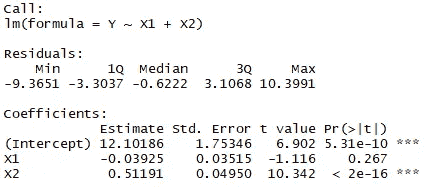

然而，这并不**而不是**意味着 X1 对 y 没有影响。X1 确实有因果关系，但它完全由 X2 介导。

回归输出取决于很多因素。有可能 X1 最终成为重要的一个，或者两者都是。在这种情况下，如果我们观察 X2 的部分回归图(在控制 X1 之后):

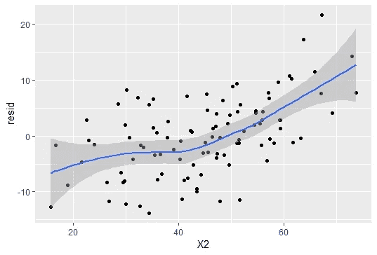

我们应该看到信息的痕迹，表明 X2 属于这个模型。

除了最简单的问题，我们很少知道“真正的”因果图。与其猜测哪些变量应该或不应该出现在回归模型中，不如保留所有的预测值，并把它们扔进[套索](https://en.wikipedia.org/wiki/Lasso_(statistics))的嘴里？我们有通过正则化自动选择变量的算法。在本例中，LASSO 将系数 0 指定给 X1:

介绍性回归课程讲授使用 AIC/BIC/F/Adj. R 的前向/后向选择，以及基于 VIF 移除预测因子。好吧，当你走出考场的时候，把这些都忘掉吧，因为它们在实践中毫无用处。您[无法在这些系数](https://www.stat.cmu.edu/~cshalizi/mreg/15/lectures/26/lecture-26.pdf)上计算有效的 p 值，并且系数的幅度会太大(过拟合)。相反，或者咨询领域专家来构建一个[因果 DAG](https://ftp.cs.ucla.edu/pub/stat_ser/r332.pdf) 或者使用交叉验证正则化。

# 掩饰

新数据集！现在告诉我，X1 能很好地预测 Y 吗？

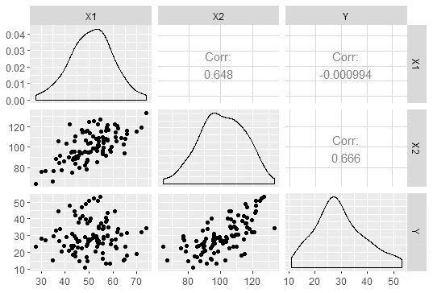

如果你回答“我不知道”，很好！X1 和 Y 是不相关的，但是一旦我们控制了 X2，X1 就成为 Y 的一个很好的预测因子:

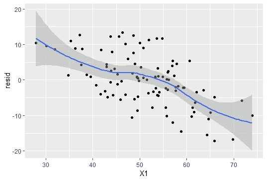

这一次，因果结构就是所谓的倒叉:

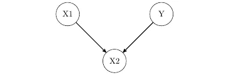

如果我们不知道 X2，X1 和 Y 确实是独立的:

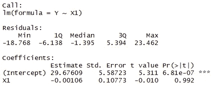

但是一旦我们知道了 X2，X1 给了我们关于 Y 的信息:

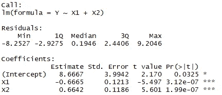

再次请参考[我之前的文章](/beyond-a-b-testing-primer-on-causal-inference-d8e462d90a0b)更详细的解释。这篇文章的目的只是为了表明，将变量彼此对立起来是荒谬的。

需要明确的是，X1 对 Y 没有任何因果关系。但是，它是 Y 的一个很好的预测因子，如果目标是纯预测能力，则应该包括在模型中。

虽然第一个例子相对来说是良性的，但是当分析师因为没有相关性而从不尝试将 X1 放入模型时，这个例子可能是灾难性的。或者，同样糟糕的是，他们做了相关性测试，得出 X1 和 Y 完全不相关的结论:

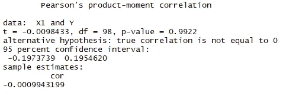

**永远不要*永远不要*** 使用相关性或曲线手动选择回归变量。要么咨询领域专家来绘制因果 DAG，要么让它正规化——LASSO 可以比你我做得更好。

# 转换

从这两个例子中，应该很清楚**残差是信息的使者**。

新数据集！X1 是 Y 的好预测吗？

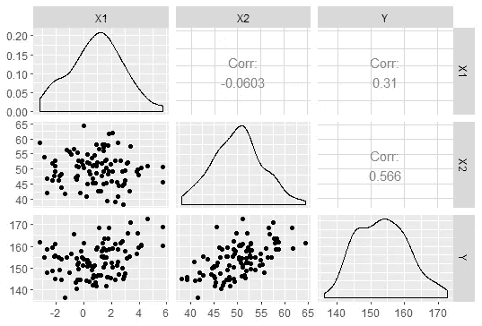

正确的答案是，“我不知道。”

正如我们到目前为止所了解的，这种类型的视觉化几乎是没有意义的。那么我们应该用什么呢？当然是残差 vs 变量！这里我们回归 Y~X1+X2，并检查每个预测值的残差:

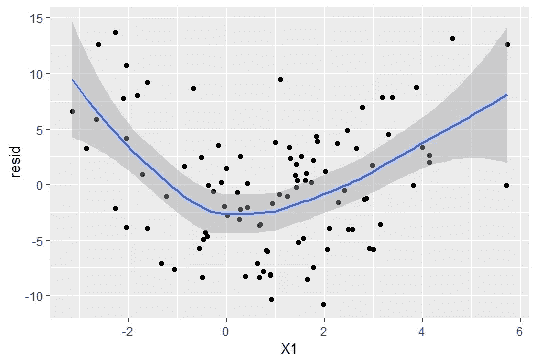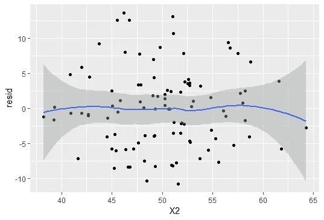

我们看到我们需要将 X1 特征工程到我们的回归模型中。这在变量与变量图中几乎看不到，但一旦我们检查残差，就会一目了然。

要获得关于 Y 的信息，您需要根据残差回归拟合值。在这种情况下，只能看到来自省略的 X1 的弱信号:

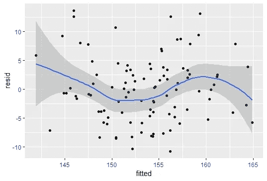

你从 pairs 图中看到的任何必要的变换也可以通过残差图看到，但是反过来就不正确了。**你可以通过将所有变量放入一个回归中，并检查单个变量的残差来进行 EDA。**

# 最后

希望你已经知道传统的**对图/关联热图对于分析数据几乎没有意义**。相反，依靠**残差**和拟合系数来查看因变量和自变量之间的关系。

有些人可能会反对“但是我们需要检查变量的分布！”实际上，**不**，除了检查数据质量问题，我们真的不关心，例如，丢失的数据是否编码为 9999？数据被正确审查了吗？是否存在数据泄露？(尽管最后一项出现在好得令人难以置信的评估指标中。)

回归对任何变量的分布绝对没有假设或限制。假设是在**残差**上，甚至常态部分往往都无关紧要。

我最讨厌的一件事是，人们抱怨他们的预测值不是正态分布的，log/Box-Cox 变换不能使预测值成为高斯分布。然后他们开始抱怨统计因为不切实际的假设而不切实际，而他们抱怨的假设根本不存在。绝对触发。

反正 **EDA 对变量不好，EDA 对残差好**。