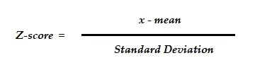
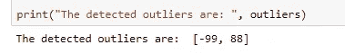

# 异常检测的 z 分数

> 原文：<https://towardsdatascience.com/z-score-for-anomaly-detection-d98b0006f510?source=collection_archive---------5----------------------->


内森·希维利在 [Unsplash](https://unsplash.com?utm_source=medium&utm_medium=referral) 上拍摄的照片

## 小块数据科学

大多数时候，我会写一些关于数据科学主题的较长的文章，但最近我一直在考虑围绕特定的概念、算法和应用程序写一些小文章。这是我在这个方向上的第一次尝试，希望人们会喜欢这些作品。

在今天的“小话题”中，我写的是在**异常检测**背景下的 Z 分数。

异常检测是一个识别需要检查的意外数据、事件或行为的过程。这是数据科学中一个成熟的领域，有大量算法可以根据数据类型和业务环境来检测数据集中的异常。Z-score 可能是最简单的算法，可以快速筛选候选人进行进一步检查，以确定他们是否可疑。

**什么是 Z 分数**

简单地说，Z 得分是一种统计度量，它告诉你一个数据点离数据集的其余部分有多远。用一个更专业的术语来说，Z-score 表示一个给定的观察值距离平均值有多少标准偏差。

例如，Z 值为 2.5 意味着数据点距离平均值有 2.5 个标准偏差。由于它远离中心，因此被标记为异常值/异常值。

**它是如何工作的？**

z 得分是一种参数测量方法，它采用两个参数—平均值和标准差。

一旦计算出这两个参数，就很容易找到数据点的 Z 值。



注意，平均值和标准偏差是针对整个数据集计算的，而 *x* 代表每一个数据点。这意味着，每个数据点都有自己的 z 值，而均值/标准差在任何地方都保持不变。

**示例**

下面是 Z-score 的 python 实现，带有几个样本数据点。我会在每一行代码中添加注释来解释发生了什么。

```
# import numpy
import numpy as np# random data points to calculate z-score
data = [5, 5, 5, -99, 5, 5, 5, 5, 5, 5, 88, 5, 5, 5]# calculate mean
mean = np.mean(data) # calculate standard deviation
sd = np.std(data)# determine a threhold
threshold = 2# create empty list to store outliers
outliers = []# detect outlier
for i in data: 
    z = (i-mean)/sd # calculate z-score
    if abs(z) > threshold:  # identify outliers
        outliers.append(i) # add to the empty list# print outliers    
print("The detected outliers are: ", outliers)
```



**注意事项和结论**

如果你研究这些数据，你会注意到一些事情:

*   有 14 个数据点，Z-score 正确检测到 2 个异常值[-99 和 88]。然而，如果您从列表中删除五个数据点，它只检测到一个异常值[-99]。这意味着您需要有一定数量的数据大小，Z-score 才能工作。
*   在大型生产数据集中，如果数据呈正态分布(也称为。高斯分布)。
*   我使用了一个任意的阈值 2，超过这个阈值，所有的数据点都被标记为异常值。经验法则是使用 2、2.5、3 或 3.5 作为阈值。
*   最后，Z-score 对极值很敏感，因为均值本身对极值很敏感。

希望这有用，请随时通过 [Twitter](https://twitter.com/DataEnthus) 联系。