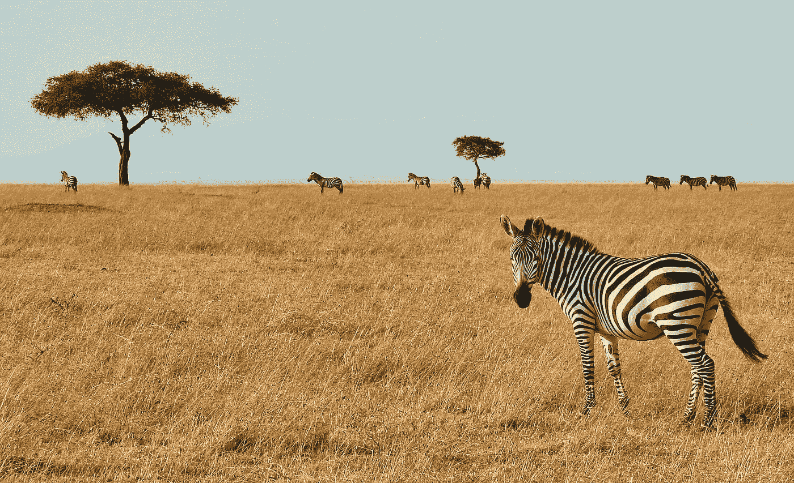
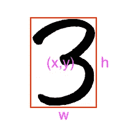
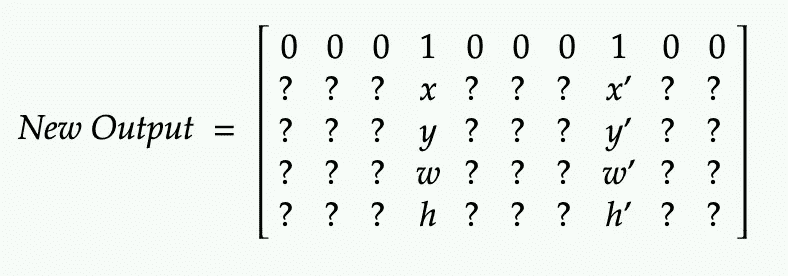
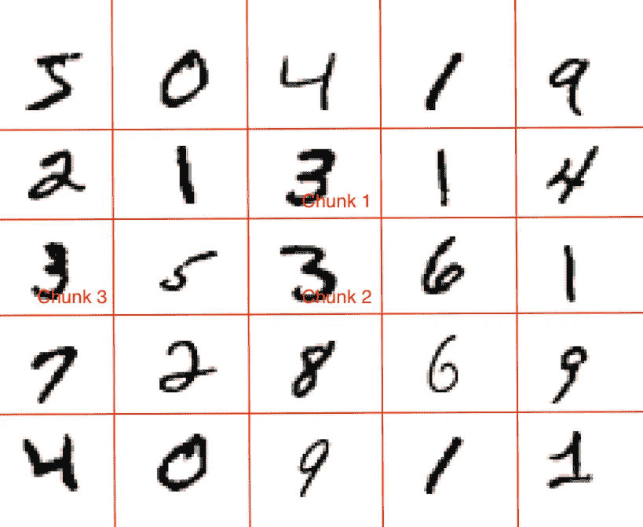
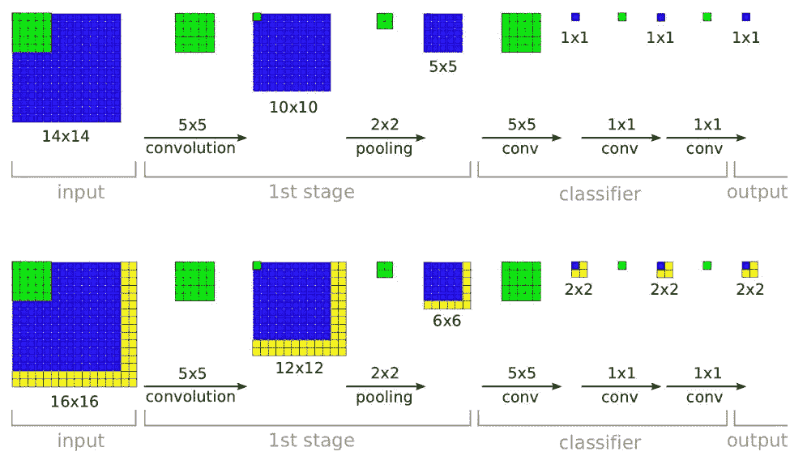

# 斑马探测器——您的第三个端到端 CNN

> 原文：<https://towardsdatascience.com/zebra-detector-your-third-end-to-end-cnn-in-5-minutes-3ffea91d5566?source=collection_archive---------60----------------------->

罗恩·多芬在 [Unsplash](https://unsplash.com?utm_source=medium&utm_medium=referral) 上的照片

> 第三 CNN？

这是我在自己动手 CNN 模型系列的第三篇文章。像往常一样，格式将保持不变。我给你一个 Colab 文件(非常好用)，你必须在没有任何条件的情况下运行它，然后才能继续。原因是，一旦你自己运行它，你会变得更加重视这个问题，你会得到更深刻的见解。

你可以在这里查看我以前的文章:

*   [手写数字分类器](/handwritten-digit-classifier-your-first-end-to-end-cnn-in-5-minutes-5be3d9c6c4c0)
*   [猫 vs 狗分类器](/cats-vs-dogs-your-second-end-to-end-cnn-classifier-in-5-minutes-9adfbde08a09)

所以，事不宜迟，让我把 Colab [文件](https://colab.research.google.com/drive/1WYWDYEBLGx4rAGq3z4TQ8DHUpZ5EoVBj?usp=sharing)交给你🚀。这不是我的作品，而是从各地抄袭来的。我在这里做的唯一一件事是确保它在 Colab 设置中运行良好(令人惊讶的是，这很难做到)。但是，尽管如此，它现在工作得很好，唷！

请随意上传您的图像并检测它们！现在，这个文件看起来可能有点吓人，但实际上并不是这样。像往常一样，我们先从理论开始，稍后将讨论实现细节。此外，根据我以前的文章，我会尽量保持简短和甜蜜。

# 分类 Vs 定位 Vs 检测

首先，我们所说的检测实际上指的是什么？

*   *分类——在图像中找到主要项目并标记它。*
*   *定位——找到图像中的主要项目，标记它，并找到它的位置。*
*   *检测—检测图像中的所有项目，找到它们的位置，并标记它们。*

[来源](https://theaisummer.com/assets/img/posts/Localization_and_Object_Detection/cv_tasks.jpg)

# 目标检测

对象检测看起来很复杂，但实际上并不复杂。它只是建立在我们已经了解的 CNN 的基础上。因此，我们早期的细胞神经网络有一些缺点，由于它不适合对象检测。让我们试着找出这些问题，你自己会建议一些调整来克服它们。在这个过程中，我们将理解令人生畏的*物体探测器背后的直觉。*

> 请记住一件事——我们的目标不仅仅是对图像进行分类，还要找到它的位置。事实上，图像中的所有项目都应该被检测、标记和定位。

# 缺点 1 —输出层

一些快速的问题！

*   *我们在* [*手写数字分类器*](https://medium.com/r?url=https%3A%2F%2Ftowardsdatascience.com%2Fhandwritten-digit-classifier-your-first-end-to-end-cnn-in-5-minutes-5be3d9c6c4c0) *中有多少个输出节点？*
*   *我们应该如何在输出中输出被检测项目的位置？*

想想吧！这不是火箭科学！！🤔
好了，回答时间！！

之前我们有 10 个输出节点。原因是，只有 10 个标签是可能的(0–9)。现在，如果我们除了标签还想要位置，我们应该怎么做？

想象一个假想的多边形(*中心:(x，y)，宽度:w，高度:h* )可以包围那个数字。现在，我们只需要输出矩形和万岁的坐标，我们也将有本地化信息。仅此而已！因此，如果你会看到，我们刚刚在输出层添加了一些信息，以获得位置信息。

作者图片

***上一次输出:****【0，0，0，1，0，0，0，0，0】* ***新输出:****【0，0，0，0，1，0，0，* ***x，y，h，w***

*因此，这里前面的输出表示我们的输出数组的一位热编码，因此只有 3 是 1，其他的输出是 0。物体探测器会再增加 4 个坐标来让我们知道它的位置。瞧啊。所有其他反向传播将一如既往地工作(因为只多了 4 个输出)。*

# *缺点 2-多重检测的输出层*

*现在，当一幅图像只有一次检测时，我们之前所做的工作是有效的。当一个图像可以有多个检测时，我们该怎么办？！*

*想想吧！？我们只需要一种方法来解决如何在输出中发送所有检测的多个坐标。*

*   ****上一次输出:****【0，0，0，1，0，0，0，0，0，0】**
*   *你在上面看到了什么？一个有 10 个元素的数组？还是大小为 10 的[1*1]矩阵？你想想，个位数不过是个[1*1]矩阵，对吧？*
*   *我们能不能用这种新的可视化方式来添加我们的位置信息？*

*是的，你认为它是正确的，如果我们有一个[10 * 5]矩阵，我们可以很容易地使用它来容纳所有类别的位置信息。*

> **有趣的事实！实际上是[5*10]矩阵还是[1*1*5*10]矩阵？坚持这个想法。**

**

*作者图片*

# *缺点# 3-多个相同检测的输出层*

*上面的方法可以，但是如果一个图像中有两个 3 呢？我们的输出层将再次失败。有人可能会说，我们把上面的矩阵更新为[9*10]吧，多容纳一个 3。但是，它没有尽头。一个图像可以有 100 个相同的标签。我们需要想点别的！*

> *如果找不到答案，那就改问题！*

*好吧，这个问题什么时候来？当你有一个巨大的图像，里面有很多物体，对吗？让我们把图像分成更小的块来彻底解决这个问题。*

*因此，对于每个图像块，将有一个[5*10]矩阵。比方说，我们创建了一幅图像的 *N* 个块，因此我们在输出中将有[ *N* *5*10]个矩阵。*

**

*作者图片*

> *有趣的事实——你刚刚学会了 YOLO(你只看一次)！！🚀*

# *缺点 4——CNN 将如何处理这些信息？*

*仔细想想，这里没什么新鲜的。输入图像是一样的，检测数字的内核也是一样的。因此，一切都将以完全相同的方式工作。*

*这里唯一不同的是输入图像的**大小。**比原来的层能处理的大一点。因此，由于尺寸较大，它将有大量的输出。*

*所以，早些时候 CNN 产生了 10 个输出。这一个将产生更多，因为我们有一个更大的图像，但卷积层的数量保持不变。这就是我们有意要做的。因为现在输出信息增加了(也包括仓位)。*

**

*[来源](https://www.oreilly.com/library/view/python-advanced-guide/9781789957211/assets/3fd9cc43-c9e1-433e-a065-fc44c6475b8d.png)*

# *缺点 5——一个项目分成多个块*

*新的解决方案会带来一系列新的问题。当我们将一幅图像分成多个更小的块时，一幅图像可能存在于多个块中。在这种情况下，一个项目可能会被检测两次。如何解决这个问题？*

*当有 100 个学生想成为班上的第一名时，你通常如何解决这个问题？你要求他们证明他们的可信度。哪个分数最高，谁就是冠军。一模一样。检测到最高概率和最佳定位位置的任何一个组块都应该得到该项目。简单！*

*是的，在检测之后，将会有一层来宣布该物品在战斗块中的获胜者。在 YOLO，有一个概念叫做并上交集，用于检测战斗块的可信度。如果你愿意，你可以在网上了解更多。*

> *顺便说一句，你刚刚学习了非最大抑制🚀*

# *缺点 6——一个块中有多个项目*

*如果一个 chunk 需要检测多个类怎么办？我们来了解一下什么时候能发生这种情况？理想情况下，由于块的尺寸较小，这种情况不应该发生。但是，如果我们在一个图像中有重叠的项目呢？这种情况很有可能发生，对吗？*

*但是，多田！我们已经在我们的*缺点#3* 中解决了。我们的每个块已经能够检测所有的类。很酷很强大，对吧？！*

# *履行*

*Colab 文件应该运行得很好。这可能有点令人望而生畏，但是当您阅读代码时，您会意识到这只是:*

*   **创建一个巨大的多层 CNN**
*   **从预先训练好的模型中加载砝码**
*   **在样本图像上测试它(在我的例子中是斑马)**
*   **然后剩下的代码只是创建一个框来帮助你可视化本地化输出**

*我强烈建议上传不同的图片，然后玩玩。还有，所有的实现逻辑都是受[这个](https://github.com/arshren/YOLOV3/blob/master/YOLO%20Step%20by%20Step.ipynb)和[这个](/object-detection-using-yolov3-using-keras-80bf35e61ce1)的启发。*

*这就是物体探测器的全部内容。我只是有意提到了 YOLO。其他技术将覆盖某一层。*